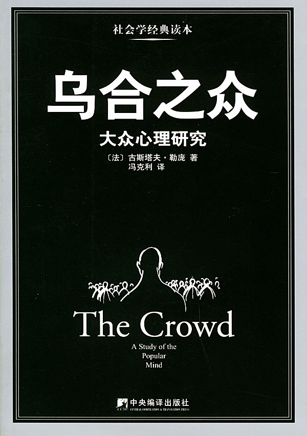
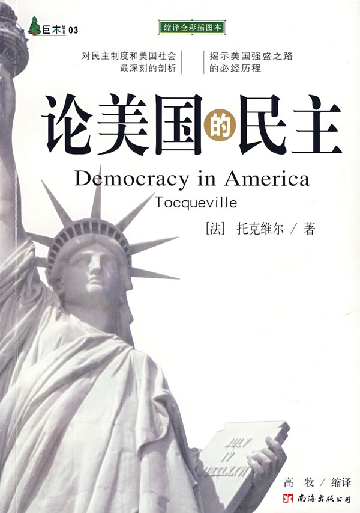
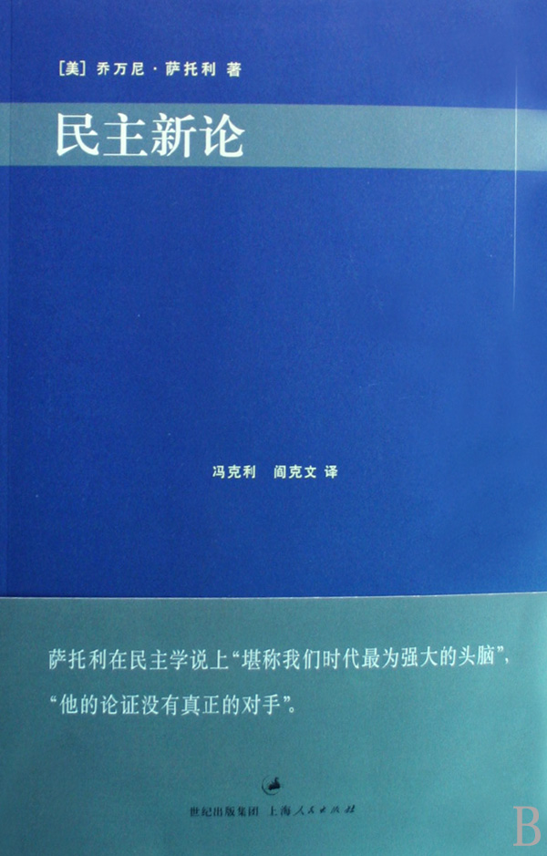
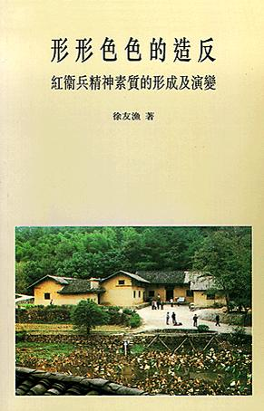

# 本期主题：民主的背面

### 

### 

# 本期主题

## 民主的背面

### 荐书人 / 谷卿（暨南大学）

** ** 伟大的易卜生曾在《人民公敌》中借斯多芒克医生说出这样一段话：“在咱们这儿，真理和自由最大的敌人就是那结实的多数派，不是别人，正是那挂着自由幌子的该死的结实的多数派！想禁止我说真话的，正是这个多数派。多数派从来没有公理，从来没有！这也是想自由的人必须揭穿的一句社会上的谎话。” 确然如此，在可见的历史上，我们曾多次看到由于掌握政权的个人或集团对于群体的盲目行为不加以正确的导引甚至鼓励而导致他们癫狂失性，从而以极其纯粹的暴力对他们久怀愤恨与敌意的文化及其象征物进行大肆的毁灭性的破坏，这种破坏几乎都是极为直接的、粗暴的、血淋淋的，没有半点理论和情面好讲，但这种破坏行为的不可理解的“普遍性”往往因为蒙上了正义和道德的外衣而使得其罪行难昭。“无数的历史证明，群众和群氓在某些特定场合，这一字之差的界限有时并不存在。”其实，群氓最终也将会被由自己聚变所产生的不可抗拒的力量撕裂、扯碎而难以自止。而且这股漩涡一旦形成，则会源源不断地吸引着漩涡周围蠢蠢欲动的观望人群而造成更大的破坏。即便这些可怕的破坏性行为遭到了制止，但它们对人们自由心灵的冲击程度是极为巨大的，需要几代人的时间来愈合。而这一切恶果的肇因，就是对那些对话的对象显得极为隐蔽的群体的行动权利不加节制，甚至抱有着一种看似高尚的同情悲悯之心——这种悲悯之心是完全不能等同于政治教化或社会教育及其功能的。借用奥斯卡·王尔德的一句话：“这个世界上有三类暴君，一类摧残肉体，一类钳制精神，一类肉体精神一并迫害。第一类是帝王，第二类是教皇，第三类叫做人民。” 其实极权的对立面并非民主，而是自由，只有保证所有少数派和异议分子的权利自由，极权才有可能被杜绝。我们呼唤、拥护、肯定民主，但不会将之视为救世的唯一良药——任何极致化的意识形态与政治形式都会排斥对话与制衡，民主也会如此。 

### 推荐书籍（点击书目可下载）：

** **

[**1、****《****乌合之众****》**** **](http://ishare.iask.sina.com.cn/f/13624423.html)

** **

[**2、****《论美国的民主》**](http://ishare.iask.sina.com.cn/f/9550198.html)

** **

[**3、****《民主新论》**](http://ishare.iask.sina.com.cn/f/7241203.html)

** **

[**4、****《形形色色的造反》**](http://ishare.iask.sina.com.cn/f/13624422.html)

****

**5、****《高贵的宿命****》**

** **

**《乌合之众》**

###  

### 

从世界范围来看，几乎所有优秀的思想家都是保守主义者，古斯塔夫·勒庞也是如此。《乌合之众》是我大学期间读的第二本书（第一本是格尔茨《文化的解释》），也是我大学期间读到最好的书，勒庞在他生活的那个时代，就通过敏锐的观察与深刻的分析预告了群体创造历史的时代的到来，而二十世纪的每一次流血与冲突也恰恰确证了群体思维和集体主义的强大反动力量。只可惜，能够认识到“民主能够严重地毁灭自由”如勒庞者，实在少之又少。值得一提的是，冯克利为此书写的译后记《民主直通独裁的心理机制》也是一篇极好的阅读导言。 

### 

**《论美国的民主》**

### 

### 

托克维尔虽然因为平等能够鼓吹不服从而称赞它，但是他也不得不承认平等所能产生的两种倾向：一种倾向是使人们径自独立，并且可能使人们立即陷入无政府状态；另一种倾向是使人们沿着一条漫长的、隐而不现的、但确实存在的道路走上被奴役的状态。或许有人要拿“道德”来诘难等级的提倡者，但他们当然不会知道，道德是一种这样的荣誉：它意味着生活的高贵、优美，以及对于普遍精神的超越——这本身就是一种等级的体现。读过此书的人应该很多，但人们往往纠缠于民主形式的讨论，反而忘记了托克维尔的担忧：“以人民主权的名义并由人民进行的革命，是不可能使一个民族获得自由的。” **《民主新论》**

### 

### 

茨威格有本书叫做《异端的权利》，写的是卡斯特里奥追求宗教宽容、反对加尔文独裁的史事，由于此书影响深远，“异端的权利”一词也往往被人们提起。乔·萨托利的《民主新论》正是要向人们说明：民主制度最为关键的特征并不是它保护多数人的利益，而要看它是否在有效地保护着社会中的少数。作为一个信奉古典自由主义的保守主义政治学家，，萨托利将自由主义民主视为真正的民主，也缘于此，《民主新论》堪为同论题专著中最为突出的一本，他能够细致阐述不同的与民主相关的问题，同时又能看到民主的弊端。读萨托利的书，感觉他在以一个视角非常高越的视角进行评说，看似轻描淡写，但句句能够打中问题的要害。“民主以民权作为起点，在这个起点上，它为了产生民利不需要爱民。相反，爱民仅是一种可能性。”正是如此，民主的受益者往往不是“民”。 

### 

**《形形色色的造反》**

** ** “文革”以来，在思想意识的领域最令反思者痛心的事实就是作为个体的人丧失其独立思维的动力、丢弃理性精神这一现实并未得到较大程度的改观。盖帽子、下断言、泼脏水、抡拳头在很多场合依然在代替严肃认真的思考与讨论，人们常常还是按照自己的初始臆断或者就直接依照其他人的观点看法来作无意义的重复性声明——这种依赖包括摄于他人的权威、煽动性、影响力，也包括自身由于头脑一时发热而导致的无意识。“文革学”的建构，往往陷溺于路线斗争之说而不能超拔，对于群众运动与社会冲突鲜有关注，徐友渔此书则为“文革”研究提供了一条新径，从“文革前的教育”、“红卫兵的区别和派别”、“造反的原因”、“幻灭和觉醒”及“后果”等各个方面分析了红卫兵精神素质的形成及其演变过程，对于群众运动的社会根源与群体心理状况作了详细的研究和表述。 **《高贵的宿命》**

** **

我的朋友中，徐晋如是唯一一个旗帜鲜明地批判民主者。他的思想集中体现在此书诸如《民主驳议》、《自由的狂欢还是民主的闹剧》和《论无知的道德与暴虐》等重要篇目中，他对于局部群体和整体社会的理想状态的追索在其中表露无遗。我相信，即便是徐晋如的反对者甚至仇视者们也不得不承认，他是一个极有立场、极为严肃的思想者。他的文字既饱含着他的个人经验，又有民国学人的使命感型的自负，同时还能看出西方一些思想家对于社会、人生和宇宙的情感迷恋。有人说他“狂狷”，说他“极端”，但我觉得，他的这种明显的性格特征和文字特征，实际上是对于貌似平静和谐的人事、世事的行为性讥诮的必要。 

### 

（编辑：徐毅磊）
