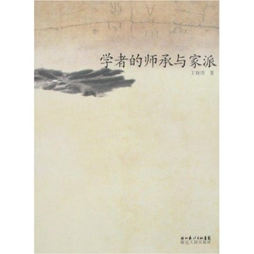
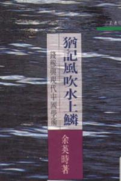
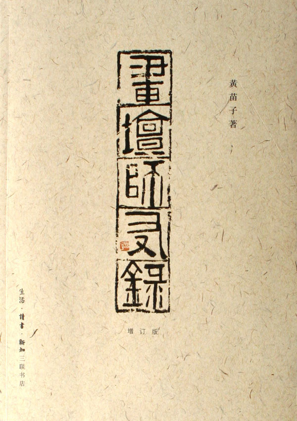
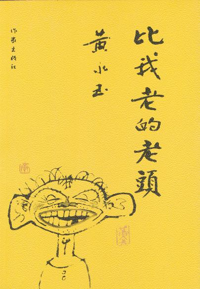
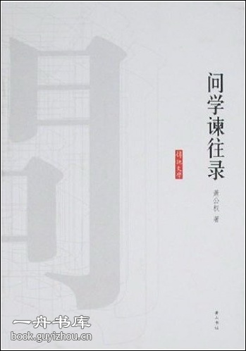
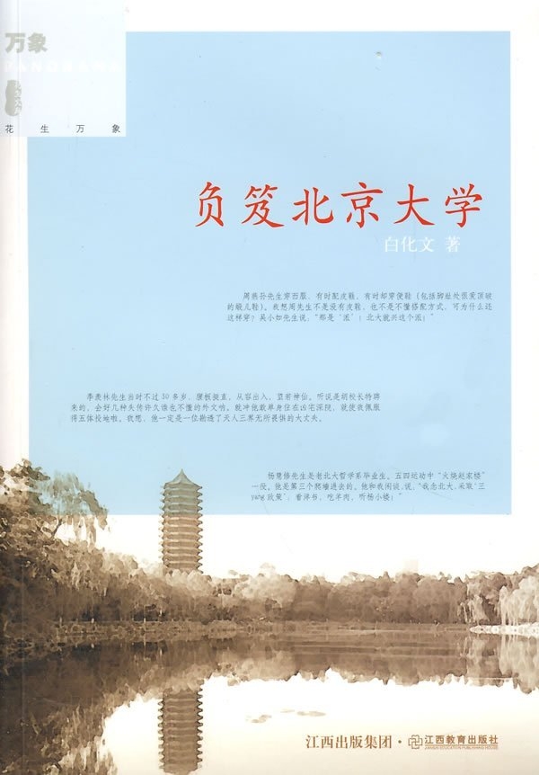

# 本期主题：求学路，师生谊

### 

### 

# 本期主题

### 

# 求学路，师生谊

### 

## 荐书人 / 谷卿（暨南大学）

### 

### 

我们一路做学生走过来，关于老师的话题实在太多了。中学时我因常学老师讲话而被班主任叫到办公室谈话并请家长辅助教育无数次，然积习不改，至今每有同学聚会，聊到高兴处，也仍免不了再来几个经典段子。我总觉得，老师若不能成为学生的谈资，一定是失败透顶的，好老师必然是会给学生留下一些这样或那样难以忘怀的印象的。 我在暨大听的第一堂研究生专业课是徐国荣教授的散文史，徐公讲课极有趣，坐在靠椅上，双目向天，微含笑意，讲到高兴处轻轻晃动，呷一口茶，看起来极为享受的样子。至今我全忘记这第一堂课讲的什么内容，只知他提到一本名为《师门问学录》的书，是徐公同门、马来西亚籍学生余历雄在南京大学师从周勋初教授攻读博士学位时，以问答的形式记录的求学笔记，他自言“最初的两三次我只是乐闻遐思，耳到而手未到。事后回想稍觉印象模糊，便赶紧追记一二，以备日后参考。此后，我都即席笔录‘师门嘉话’纲要，返寓后核查材料，详加整理，或补充备阅书目，或聊作自注，不避繁琐。日复如此，竟以为常。”全书分为六个部分，每个学期一章，书后附录作者的博士论文提要、答辩资料四位学者关于周勋初教授讲学的记录和评论。此书很有特色，后来我在广州古籍书店买得一本，记当年事细大不捐，可见勤劬用心之甚。 去年在珠海借看藏书家何家干先生的《读史阅世六十年》（香港商务印书馆），觉得挺有意思。该书作者何炳棣1938年毕业于清华，六年后考取清华第六届留美公费生，赴美国哥伦比亚大学攻读西洋史；1952年获哥伦比亚大学英国史博士学位。回国后当选为中央研究院院士，并于1979年被选为美国艺文及科学院院士，学界阅历不可谓不丰富。何自言因读杨振宁的《读书教学四十年》后而发愿写撰这部回忆录，主旨是将“本人一生，在国内、在海外，每一阶段的学思历程都原原本本、坦诚无忌、不卑不亢地忆述出来。”其“国内篇”最能与现代学术思想史相印证，“海外篇”则向读者详细介绍了当时欧美的学术概况与教学特点。胡文辉的《现代学林点将录》点何为地猖星毛头星孔明，盖因《读史阅世六十年》“披露学界秘辛甚多，尤多引师友对他的恭维以自重”耳。文人习气，大可一哂。 又不久前刚刚读了周汝昌《我与胡适先生》。当年，身为北大校长的胡适与青年周汝昌素未谋面，即能青眼有加，慨然借出海内孤本《甲戌本石头记》，与周书信往来不断，鼓励、支持周的红学研究。周自言：“我平生所遇仁厚长者也不少，但是能如此宽厚而又体恤一名青年的事例，实在想不出还有它例了。”而周也能贯彻胡适的考据方法，将其自叙传的红楼观发扬到极致，成为当代《红楼梦》研究的集大成者。《我与胡适先生》除回忆与胡适交往旧事外，附叙与顾随、俞平伯、陶心如、张伯驹、周策纵、潘重规等人的交谊，亦颇有史料价值。 最后做一下说明，此次荐书略改旧习，所列书目均非上文提及者，亦不作荐语，请诸公各自体味眼下、回忆当年。 

### 

### 

### 推荐书籍（点击书目可下载）：

** **

[**1、****《学者的师承与家派》**](http://ishare.iask.sina.com.cn/f/13738505.html)

### 

### 

### 

[**2、****《犹记风吹水上鳞》**](http://ishare.iask.sina.com.cn/f/7839191.html)

### 

**3、****《画坛师友录》**

### 

[**4、****《比我老的老头》**](http://ishare.iask.sina.com.cn/f/10567078.html)

### 

### 

[**5、****《问学谏往录》**](http://ishare.iask.sina.com.cn/f/7341654.html)

### 

[**6****、《负笈北京大学》**](http://ishare.iask.sina.com.cn/f/14140468.html)

### 

### 

（编辑：徐毅磊）

### 

### 
