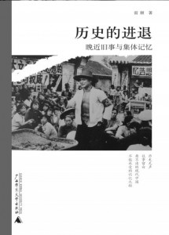
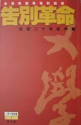
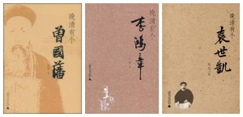
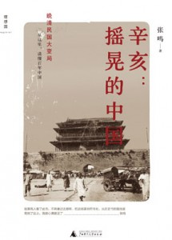
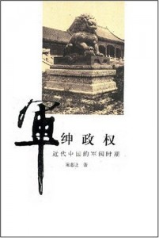
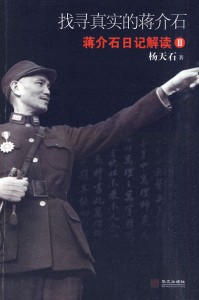

# 本期主题：百年变局的历史风云

### 

### 

# 

# 本期主题

### 

## 百年变局的历史风云

### 荐书人 / 谷卿（暨南大学）

今年是辛亥革命一百周年，历史提供给我们一个反思的机会，百年来的风雨沧桑、历史激荡，昭示着二十世纪之不平凡在中国大地上的表现。走过这一百年，“革命”的话语始终回响在耳边。我们真的从那一刻开始，迎来了更新更好的制度和生活了吗？

在特定的历史语境中，“革命”常常被赋予一些行为与规则以天然的正义性，任何事情一旦借助革命名义以行，势必无人能够阻挡。张鸣说：“革命是个帽子，戴上这顶帽子，做什么都特别地理直气壮。”牺牲当下和局部以寻求将来和整体，是“革命”的一贯思维。我们走到今天，很大程度上是受进化论的影响，我们相信制度的演进是历史的必然，大到社会风习，小到道德人心，都处于一个不断进步发展的变化之中。可是，作为结束帝制，带来新的政治制度、政权组织形式的辛亥革命，本身是一场没有准备好、没有进行到底的革命运动。在这一基础上，人们自主选择式地丢弃了很多其实非常适合中国的东西，但是，“结实的大多数”最终选择了快步向前，一百年来，我们一直急急忙忙地赶着走，却根本不顾道路与方向，来回折腾得筋疲力尽，回头一看，离起点其实没多远。

从可见的历史上来看，一次次的“革命”带来的不一定是历史的进步、制度的改善，有时往往反不如前，革命的暴力思维和行为模式往往延续到政权改变之后，非常时期的非常组织形式和管理模式更会影响到革命成功之后的和平时期。我们发现，处在每个历史大变局中的有识之士都是反对革命的——毕竟以暴易暴换来的只能是更暴烈的暴。正如乔·萨托利在《民主新论》中所说的那样：“就革命本身而言，它从事破坏的功劳只在于它为重建提供了前提，如果在革命之前不存在重建的潜力，新的积极建设（即重建）也不会随革命而至。革命之后存在之事，在革命前也必然存在。”，“为了终止专制，就需要一个最后的、更大的专制者。”

革命呵，多少罪恶假汝罪名以行！

**推荐书籍（点击书目可下载）：******

[**1、****《历史的进退》**](http://ishare.iask.sina.com.cn/f/7840449.html)

** **

[**2****、《告别革命》**](http://u.115.com/file/f8f86fe10a)

** **

**[3](http://ishare.iask.sina.com.cn/f/6995094.html)****[、《晚清三部曲》 （1）](http://ishare.iask.sina.com.cn/f/6995094.html)[（2）](http://ishare.iask.sina.com.cn/f/8279941.html)[（3）](http://ishare.iask.sina.com.cn/f/6995139.html)**

** **

[**4****、《辛亥：摇晃的中国》**](http://ishare.iask.sina.com.cn/f/13419145.html)

** **

[**5****、《军绅政权》**](http://ishare.iask.sina.com.cn/f/7703319.html)

** **

[**6****、《找寻真实的蒋介石》**](http://ishare.iask.sina.com.cn/f/6892812.html)

**《历史的进退》**

### 

** **

### 

去年11月，雷颐先生来暨大讲学，本来讲座通知上预告的题目是“制度滞后与清王朝的覆亡”，后来临时改成了“共和国发展模式选择的波折（1949—1978）”，具体原因不知为何。其实，只要读过雷颐的《历史的进退》，就会猜到“制度滞后与清王朝的覆亡”这个讲题大约会讲些什么。从某个角度来看，革命往往是由当局引发的，他们总是一次又一次错过和放弃了自我修复和改善的机会，而到了时机全失、无法操控之时，才被动地改变。但清廷总是“在下一阶段才开始做上一阶段该做的事”，而且“拒不付息”，于是最后不得不为之付出沉重的代价，终致破产。此书的后两辑“不是故事”和“公共空间”，系由作者以一个历史学者的角度为晚近历史填补的记忆空白，亦可一读。

**《告别革命》**

### 

** **

这是李泽厚与刘再复的对话集，1996年在香港天地图书公司出版，1999年台北麦田出版社也印行台湾版，今年又要新出第六版。《告别革命》探讨的是这样一个问题：到底什么是历史发展的动力与历史的主要内容。人类历史发展的动力与主流是阶级斗争——暴力革命，还是生产力——生产工具的改革？“历史总是提供革命与改革两种选择的可能性，不是一种可能性。而中国一百年来，从辛亥革命开始总是选择暴力革命的办法，并把它视为唯一合理的办法。”有时候，这些设计意识形态的问题是不被允许讨论的，所以，《告别革命》一直未被允许在大陆出版。从出版史和学术史的角度来看，《告别革命》不仅是世纪之交销量最多、影响最大的一本“禁书”，更是一个争议最为激烈的重要“学案”。

**《晚清有个曾国藩》、《晚清有个李鸿章》、《晚清有个袁世凯》**

### 

### 

“晚清三部曲”的作者赵焰说，“以晚清的历史来看，在曾国藩、李鸿章、袁世凯身上，似乎都充分体现了命运的双重性：当他们为这个时代实现某种愿望时，他们耀武扬威，不可一世；而当他们被这个时代剥夺使命，无情抛弃的时候，他们会变得沮丧孱弱，弱不禁风。”可以说，进入历史人物的内心世界是书写历史人物和那个时代的唯一路径，曾国藩、李鸿章和袁世凯作为晚清以来最重要、最能影响时局的人物，他们的形象总是呈现出多元的，而其内心世界也很难走入。尽管从学术角度，赵焰的很多观点值得商榷，但他力求还原他所认定的历史真相，这是值得我们肯定的。

**《辛亥：摇晃的中国》**

### 

** **

### 

张鸣在《历史的坏脾气》前言里说，街上买书的小贩给买主介绍张鸣时，说就是那个写小故事的张鸣呀。张鸣的文章从篇幅来看的确很“小”，比如这本《辛亥：摇晃的中国》，每一幕（即每一章）系由很多小文章组成的一个专题，零零碎碎的片段让我们能够多角度多层面地审视辛亥、审视民国，张鸣似乎告诉我们，历史的进程往往被一些微小的变量、不成熟的思维方式、极端的行为偶然地改变；有时候，一些看似宏大的事件却在很说不出口的境况下一莫名其妙的方式发生、完成。如果没有耐心一一读完这些小故事，那我还是推荐大家稍微花点时间速度一下前言和尾声，张鸣的思考也全在其中。

**《军绅政权》**

### 

** **

### 

中国社会历来由社会精英维系，绅就是一股重要的社会力量。如果满清政府后来不是因为一系列的事情寒透了汉族士绅的心，恐怕也不至于在百年前的零星枪炮声中速朽。晚清民国之际的军阀混战，虽然可比魏晋南北朝、五代十国辽宋夏金元的乱世，但也出现了很多现在难以想象的好时光——虽然都十分短暂。对于这个有着无限可能的大时代而言，陈志让不仅是个研究者，也是个亲历者，他的记录与感受自然有其独到之好。用宪政学者王人博的话说：“在这样一个狭小的空间里，能把一个苦难民族的经脉把捏的如此清楚明白，想必不是大家而不能为。”

**《找寻真实的蒋介石》**

### 

** **

### 

在近一百年的激变中，有四个人物最值得我们关注：孙、蒋、毛、邓。他们四人几乎均等地将二十世纪划分为四个二十五年——每个人影响中国四分之一个世纪。这其中，我们对蒋介石似乎最难形成一种较为统一的认识，或者说，对于蒋的不同认识往往趋于两极。随着美国胡佛研究院有计划、安排地将其收藏的蒋介石日记对外开放，更引起了一阵重新理解、评价蒋介石之风。这其中以社科院长期关注中国文化史和中华民国史的的杨天石先生的研究成果最佳，他的这本《找寻真实的蒋介石》就是一个绝好的解读文本。记得杨天石先生做客凤凰的时候，主持人曾请他用三句话概括蒋介石，他说：蒋介石是现代史上一个重要的人物，第一句；蒋介石是现代史上一个非常复杂的人物，第二句；最后一句，蒋介石是现代史上一个既有大功又有大过的人物。杨先生自己解嘲：我也知道自己说了等于没说！

### 

### 

（责编：徐毅磊）

### 

### 
