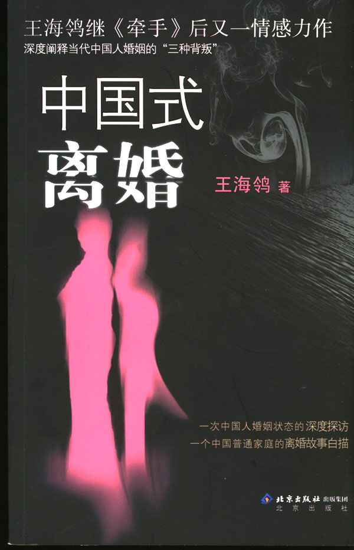
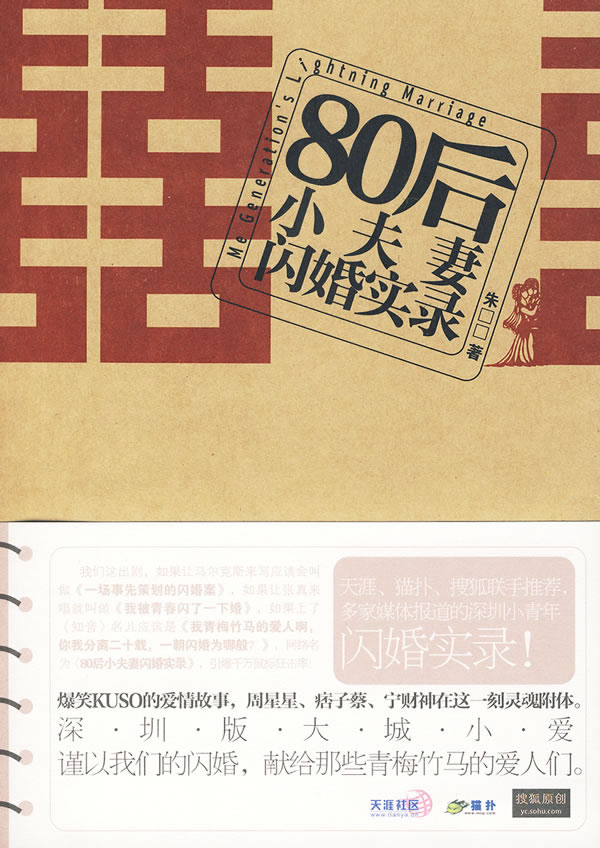
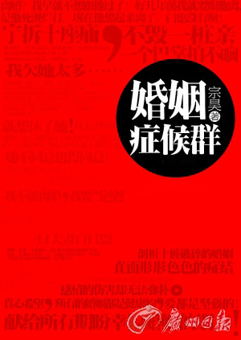
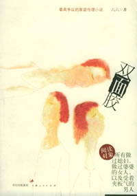
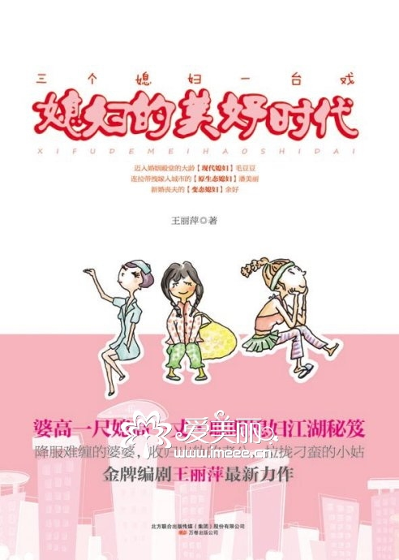

# 本期主题：直面生活中的一地鸡毛

### 

### 

# 本期主题：直面生活中的一地鸡毛

### 

## 荐书人 / 谷卿（暨南大学）

### 

### 

近年来，在以市场化方式运作出版的图书中，职场理财、心理励志和爱情婚姻这三类题材逐渐形成鼎足之势，它们以女性读者为主要消费对象，从都市女性的打拼、奋斗之路和爱情历程出发，描绘出新时期中国城市和社会的全新形象。这些图书往往在叙述故事的同时，也通过向读者传授一系列所谓“职场生存秘诀”、“爱情秘方”的方式，播售出一种全新的价值观和人生观，这种价值观和人生观以现实生活中的点滴为依据，结合不同阶层的生活状态和特色，能够及时地给予现代都市女性以生活、工作上的参考和借鉴，而更重要的是，她们阅读这类图书，在消费的过程中还获得了一种潜在的支持、快慰和温暖、希望，从这一层意义上来说，这使得市场类图书的阅读成为真正的“悦读”。

随着新时期女性受教育程度的普遍提高、经济的独立、思想意识的自觉、社会地位的提升，她们开始更大程度上地自我关注、自我修饰、自我记录和自我表达，不论是爱情、工作、婚姻、家庭、社交，都呈现出与以往迥异的状态，尤其是改革开放特别是20世纪80年代以后出生的这一代女性青年，她们对生活有自己的看法和追求，但正由于其是第一代独生子女，处在各个层面都在剧变的社会转型时期，所以她们的选择和走向需要我们更多的关注，她们的生活质量甚至直接决定着中国新一代家庭的幸福程度。 婚姻的背后是家庭，家庭的背后是社会，说到底，婚姻题材小说表现的其实是代表一个社会的某个家庭的生活状态，这个状态又和作为它背景的社会无时无刻不发生着千丝万缕的联系。伴随着中国总体经济的快速增长，呈现在成长中的“80后”面前的是越来越广阔的天地，“八十年代的新一辈”可谓是梦想最多的一代。可是当他们走上社会，面对着一时难以认清和理解的现实，预设的蓝图不得不断地遭到修改，他们逐渐成为“蜗居”的“蚁族”。在这样的大前提和大环境下，年轻一代的婚姻势必因为饱含生活的困顿而失去色彩。而从目前的图书市场来看，已经出版的婚恋小说大多能够尖锐地反映一些实际存在的问题，它们从问题入手，尝试着较为直接地描绘和阐述现代都市男女对婚姻的迷茫，虽然提出的问题现实而尖锐，但却实实在在地点击到了我们的痛处。 从言情小说的式微到婚恋家庭小说的勃兴，既体现了图书市场从浪漫主义到现实主义的关注点的转移，也表达了出版界和社会各界对女性生存状态的关切和对当代婚姻家庭中凸显的各式各样的问题的担忧和焦虑。“婚姻就像一座围城，城外的人想进去，城内的人却想出来”，如何让这样漫长的婚姻生活过得更有滋味、更有情趣，实在是一个值得不论在城里还是城外的人都要长期探索的实际问题。 

### 

#### 推荐书籍（点击书目可下载）：

### 

**[《中国式离婚》](http://ishare.iask.sina.com.cn/f/5496992.html )**

### 

### ** **

**[《80后小夫妻闪婚实录》](http://ishare.iask.sina.com.cn/f/6762439.html)**

### ** **

**[《婚姻症候群》](http://ishare.iask.sina.com.cn/f/8446121.html)**

### ** **

**[《双面胶》](http://ishare.iask.sina.com.cn/f/6800488.html)**

### ** **

**[《媳妇的美好时代》](http://ishare.iask.sina.com.cn/f/9533789.html )**

### ** **

**[《婆婆来了》](http://ishare.iask.sina.com.cn/f/9474348.html)** 

### 

### 

### 

（采编：徐毅磊 责编：徐毅磊）

### 

### 
