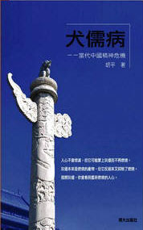

# 本期主题：言论自由与精神危机

ibeidou.org ibeidou.org

# 本期主题：言论自由与精神危机

ibeidou.org

## 荐书人 / 尹犬儒（南广学院）

ibeidou.org ibeidou.org

#### 推荐书籍（点击书目可下载）：

**1、[《论言论自由》](http://ishare.iask.sina.com.cn/f/9515285.html)**

**2、[《犬儒病－－当代中国精神危机》](http://ishare.iask.sina.com.cn/f/7853838.html)**

ibeidou.org [**《论言论自由》**](http://ishare.iask.sina.com.cn/f/9515285.html) 言论自由（Freedom of Speech），在百度百科里是这样解释的：按照自己的意愿自由地发表言论以及与听取他人陈述意见的权利。它通常被理解为包含了充分的表述的自由，包括了创作及发布电影、照片、歌曲、舞蹈及其它各种形式的富有表现力的资讯。《中华人民共和国宪法》第二章、公民的基本权利和义务 第三十五条、中华人民共和国公民有言论、出版、集会、结社、游行、示威的自由。 是的，我们当然需要言论的自由，因为这是宪法赋予我们的权利。从理论上来说，除了被剥夺了政治权利的人，其他公民都应当有使用它的权利。胡平认为它是公民各项政治权利的第一条，他说：“一个人失去了表达自己愿望和意见的权利，势必成为奴隶和工具。有了言论权利不等于有了一切，但是丧失言论权利必然导致失去一切。” 那么，究竟为什么言论自由有如此高的重要性，因为这关乎到话语权的问题。韩少功在《马桥词典》中向我们展开了一副关于农村话语权的画卷。 ibeidou.org

马桥人似乎具有一切执政者的洞明，早就看穿了这一点，因此把权力归结为话份，归结为说。

我们可以看一看，在马桥，哪些人有话份？ 

1.一般来说，女人没有话份。男人说话的时候，她们习惯于不插嘴，只是在一旁奶娃崽或者纳鞋底。干部从不要求她们参加村民大会。 

2.年轻人没有话份。他们从小就听熟了“大人说话娃崽听”一类古训，总是优先让老人们说。对老人们的说法，即便反感也多是背地里咕咕哝哝，不可大逆不道地当面顶嘴。 

3.贫困户没有话份。财大才会气粗，家贫自然气短，穷人一般都觉得自己不够体面，不愿去人多的地方露脸，自然失去了很多向别人说话的机会。马桥还有习俗：凡欠了债的人，哪怕只欠了半升包谷，也不得在村里的红白喜事中担任司仪、主祭、伴娘之类的重要角色，免得给主家带来晦气。各家火塘边最靠近茶柜的位置，是最显眼的位置，叫主位，债主之外的任何客人不得随便就座，否则就有辱主之意。这些规矩都保证了人们的话语权向手握债权的富人们那里集中。

ibeidou.org 但实际上，话语权不仅被性别、年龄、财富等因素综合决定，而且是与政治因素挂钩的。政治因素不仅仅是由党委书记、党支部书记组成的，在人民民主的社会主义国家，热心群众的力量不容忽视。也许在你身边，有这么一个人，他（她）既不是班长，也不是主任，但在学校或是单位，他走到哪里都热闹，有事大家都会征求他的意见，即使领导也要礼让三分。这是一种出于对话语权的尊重，这份尊重，是长年累月积累起来的，柴静、韩寒、艾未未，这些新中国的公民正在用自身实际来行动着。 胡平的《论言论自由》包含着对言论自由在法律上的思考，哪些人对法律有影响，怎么才能使那些人不能随意解释法律，怎么用法律来保护人权，一切的一切，根源都在言论，而假如人们连得到自由的欲望都没有，反而觉得自己处在令人心醉神迷的天堂，那这就不仅仅是他们自己的悲哀，而是对整个时代为他们的权利作出不断努力的热心群众的亵渎。 ibeidou.org

**[《犬儒病－－当代中国精神危机》](http://ishare.iask.sina.com.cn/f/7853838.html)**

ibeidou.org

ibeidou.org 犬儒主义，在百度百科里是这样解释的：犬儒主义学派是古希腊四大学派之一（犬儒主义学派，斯多亚学派，伊壁鸠鲁学派，新柏拉图学派）一般认为是苏格拉底的弟子安提斯泰尼创立的，另一人物第欧根尼（公元前404－公元前323）则因为住在木桶里的怪异行为而成为更有名的犬儒主义者。当时奉行这一主义的哲学家或思想家，他们的举止言谈行为方式甚至生活态度与狗的某些特征很相似，他们旁若无人、放浪形骸、不知廉耻，却忠诚可靠、感觉灵敏、敌我分明、敢咬敢斗。于是人们就称这些人为“犬儒”，意思是“像狗一样的人”。 ◆ 当今中国最流行的是什么主义？答；犬儒主义。欧文.豪指出极权主义有三个阶段：（一）乌托邦，令人心醉神迷的天堂理想，它诱发了狂热，而狂热则导致了（二）大规模的恐怖和人间地狱；然后，狂热与恐怖被耗尽，于是，（三）人们变得玩世不恭，"看透一切"，政治冷感即犬儒主义。我以为极权主义有四个阶段，在狂热与恐怖之后常常还有过反抗，在反抗失败之后才会堕入犬儒。极权统治靠人们的狂热而建立，靠人们的冷漠而维持。当极权统治正由于人们的反抗而摇摇欲坠之际，人们却由于沮丧而停止了反抗。这就是一个理论上不该存在的政权在实际上还能存在的原因。这就是今日中国的现状。 ◆ 多了世故的圆滑，少了正义的冲动，一个人就成了犬儒。 ◆ 肯思考的人才会变成犬儒，变成犬儒后你就可以不再思考。 ◆ 犬儒的口头禅：“什么都是假的，只有钱是真的。” “教皇有几个师？” “真理值多少钱？” “自由能当饭吃吗？” ◆ 当强权在欺侮弱小时，犬儒的态度是：“都不是好东西，我谁也不帮。"” ◆ 犬儒不分善恶，但他不一定是不知善恶。犬儒是知善而不善善，知恶而不恶恶。 ◆ 犬儒不进行积极的抗争，犬儒只是消极的嘲讽，但权势是不在乎嘲讽的，"笑骂由人笑骂，好官我自为之。" ◆ 从愤世嫉俗到玩世不恭，中间只有不显眼的一小步。 ◆ 犬儒病：气血亏虚，中年后易得此病。 ◆ 年轻人变成犬儒实在是最可悲之事，他们还不曾追求，就已然放弃；他们还没有长成，就已经衰老；他们还什么都不知道呢，就什么都不相信了。 ◆ 犬儒不只是失望，犬儒是放弃希望，并转而嘲笑希望。 ◆ 专制的目的是把人变成犬儒，而犬儒却以为只有他们才看透了专制。 ◆ 极端主义看上去是犬儒主义的死对头，其实不然。在每一个极端主义的内心深处，无不隐藏着深刻的犬儒主义。 ◆ 给别人奋斗泼冷水的人，往往不是从不奋斗的人，而是那些自己曾经奋斗过、但没有成功、然后放弃了奋斗的人。 ◆ 犬儒主义是循环论证的自我实现的悲观主义：犬儒主义不相信理想可以实现，所以他不去为理想而努力，所以理想就不会实现，所以他就更不相信，所以就更不努力，所以就更不相信，所以……所以…… ◆ 世故意味着发达的头脑和萎缩的良心。用40岁得心态来活20岁，或许这就是我们这一代人的最悲哀之处 ibeidou.org ibeidou.org

（采编：尹航 责编：徐毅磊）

ibeidou.org ibeidou.org
