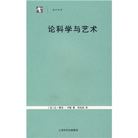

# 本期主题：评卢梭《论科学与艺术》

### 

### 

# 本期主题：评卢梭《论科学与艺术》

###  ——科学与艺术实为代罪羔羊也

** **

## 荐书人 / 李恒（复旦大学）

### 

### 

**卢梭的论证思路 ** 首先，卢梭将科学与艺术归为知识的范畴，再证明知识会使人们形成先入之见，这种先入之见是人们“自由情操”的枷锁。因为当人们需要创作的时候会走不出现有的知识框架。而且受现有知识影响的人不止创作者本人，而创作者为了博得他人的赞同便会根据他人的评判来更改自己的创作，因而，为了迎合他人，创作者只能循着“一种邪恶而虚伪的一致性”，背弃自己的那些可能在死后数百年后产生巨大影响的创新思路。于是现有的知识扼杀了自由。 其次，卢梭认为科学与艺术都源自于恶，如“天文学来自迷信的占星术, 几何学来自于贪婪和吝惜, 物理学来自于虚荣的好奇心”，因而科学与艺术都是不道德的。更有甚者，科学与艺术会在社会的发展中成为“善”的标准，如此一来，知识绑架了“善”，于是人类自然的德行便变质了。 最后，卢梭还认为科学与艺术会转移社会、国家应该有的发展方向。科学与艺术既不是粮食也不是国防实力，它们都是无用的“闲逸”。当一个国家或社会对于科学与艺术的追求过盛的时候，其绝对实力便会伴随着民众的道德情操一起变弱，于是这个社会或者国家便很容易被外族征服。 综合以上几点，卢梭得出的结论便是：科学与艺术的进步与道德是背反的。 

### 

**卢梭的错误** 卢梭说自从有了科学与艺术之后人民就永远不能循着自己的天性。但是不论科学与艺术的起因为何，它们最初的诞生都是循着人们天性的结果。卢梭认为科学与艺术抹杀了人的自由天性，但是否定科学与艺术本身，其实就是否定人的天性。人类有着这般的天性，使得真正的科学与艺术只能产生于真正的自由之中。 卢梭和荣格一样，都认为科学与艺术产生于闲逸与人性的恶。在此笔者不去过多地考量这种假设是否合理，但至少因为其本源的“恶”而否定其之后的所有发展是站不住脚的。历史告诉我们科学能够大大地促进生产力的发展并且造福于人类。所谓“黑夜给了我黑色的眼睛，我却用它寻找光明”。另外，卢梭在论述中还提到了“甚至于道德本身，都诞生于人类的骄傲”。如果同样诞生于恶的道德是有效的，那为什么科学与艺术便是不可取的？ 卢梭强调科学与艺术是“无用的”，在这里，“用”的概念似乎也被卢梭局限了。卢梭用以举例的诸多例子都是流行科学与艺术的大国被蛮夷的无科学与艺术的小国打败。在此卢梭显然假设了对于人而言安全需求是其最高的追求。对于自然状态下的人而言这种假设是正确的，但是当人通过契约建立城邦以后，人便会自然地追求更高层次的需求。因此对于科学与艺术的追求是符合人类天性的，且不容压抑的。最终的是否“有用”应当取决于作为科学与艺术的追求者这一主体的体验，旁人的评述都是无效的。 卢梭对艺术、科学的定义有问题。卢梭认为艺术是供人愉悦的，并且是靠着奢华供养的。其实不然，供人愉悦的“艺术”实则并非真正的艺术，至多称之为工艺。而真正的艺术是真理的原始发生，依照海德格尔的说法是“开启大地”的。在这个意义上讲真正的艺术具有绝对的自由。同时艺术是真理的发生，而道德包含于真理，因而真正的艺术是为道德的发生。同样地，科学作为真理在认识论上的延拓，科学本身在不被歪曲利用的情况下也是不会背离道德的。 另有一悖论值得分析。卢梭在《论科学与艺术》一文中所宣扬的“知识带来不自由与不道德”的理论本身也是知识，如此按照卢梭的理论，他自己的这篇文章也便是无效的了。 

### 

**卢梭的批判的积极意义** 卢梭对于科学与艺术的批判最根本的应当要落到“不自由”之上。在现代性汹涌袭来之时，人的独立性被空前地强调。但是人的独立性必须是真正的独立不受他物甚至不受历史的影响。而人的“伪独立”很可能是在现代性下不少人可能犯下的错误。卢梭正是基于对科学与艺术的批判尖锐地指出了这一点。 卢梭提出知识和理性可能成为善的标准。从实践中看，这种可能性是广泛存在的。卢梭的批判提醒我们需要时刻警醒，用人类原初的道德标准评判他物，避免道德标准被即成的知识所绑架。 

### 

**卢梭写作的根本目的** 卢梭的论文主要建立在对现代性中“伪独立、伪自由”的批判之上，同时他还警醒世人道德标准不应被即成知识所绑架。 但是可以试想当科学与艺术发展到能够歪曲德行的时候，此时的科学与艺术难道自身没有变质吗？答案是肯定的。此时的科学与艺术已经不再是纯粹的科学与艺术了，它逐渐转换为一种对价值观的垄断，这是一种强权！ 卢梭把他这更深刻的写作目的放在在了全文的末尾处，他说：“然而，只要权力是一回事，而知识与智慧又是另一回事，学者们便很少会想到什么伟大的事物，君主们则更少会做出什么美好的事情来。”。从这句话可以看出，卢梭本质上不反知识也不反智，其实也就是并不反科学与艺术。卢梭真正反对的是可能的从科学与艺术上衍生出来的有悖于原初的科学与艺术的权力。 结合卢梭之后的著作《论人与人之间不平等的起因和基础》、《社会契约论》等中便能发现卢梭根本反对的其实是私有制以及其带来的不公平，即社会分层、权力垄断。《论科学与艺术》整篇文章的行文并没有很多地提及权力，但在全文末尾，在前后语句并不是很连贯的情况下卢梭提出了他对权力的批判。可见卢梭急于在文末纠正全文论证上的偏差，托出其写作的根本目的，即为对于权力的批判。而全文大力批判的科学与艺术可能只是权力的“代罪羔羊”而已。 

### 

####  推荐书籍（点击书目可下载）：

**[《论科学与艺术》](http://ishare.iask.sina.com.cn/f/11382194.html)**

****

### 

### 

（采编：徐毅磊 责编：徐毅磊）

### 

### 
