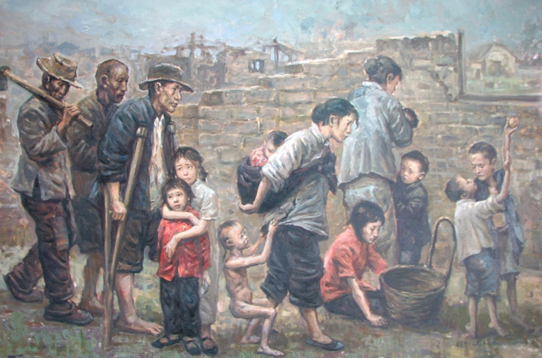
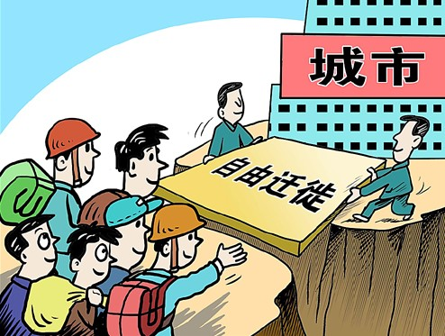

# 第一百零八期--新流民时代——户籍制度改革和流民的逆袭

#“<七星说法>第一百零八期:新流民时代——户籍制度改革和流民的逆袭"

户籍制度是一项基本的国家行政制度，在中国由来已久，在这一人口管理制度的运作下，国家依法收集、确认、登记公民出生、死亡、亲属关系、法定地址等公民人口基本信息，以保障公民在就业、教育、社会福利等方面的权益。是统治者们控制人口流动、管理社会的利器。

户籍表明了自然人在本地生活的合法性。长期以来，中华人民共和国人口管理方针的制定与实施均建基于此项制度。

改革开放之后，大批的农民离开乡村到城市打工，同时，很多来自中小城市或者农村的大学毕业生背井离乡来到大城市求职谋生，这部分社会群体（在论述户籍问题时，本文将这两种人群归类为同一群体）很难在自己工作的区域中落户——将户口从家乡迁至工作地。在户籍制度森严的中国，在一个地区生活却没有这个地区的户口，就意味着在该地区永久居留的合法性得不到政府的承认和支持，因而也无法享受到当地居民所享有的政治、经济、文化权利，法律上始终处于一种“客居”的状态，传统中国文化里有另一个概念相似的名词——“流民”。

流民一词，早在《史记》中就有记载：“元封四年中，并东流民二百万口，无名数者四十万。”，古代中国的人口流动程度非常微弱，流民的缘起大多是由于饥荒或者是战乱，人们为了求生而客居他乡，现代中国，温饱已经不是流亡的借口，多数人为了追求更好的物质条件、为了实现野心和抱负而甘愿成为新时代的流民——在远离家乡的城市进行着没有户籍的奋斗和漂泊。这一类流民数量庞大，主要分布在经济发达的“大城市”中，已成为比较普遍的社会现象，本文将此命名为“新流民时代”。

###一、户口到底是有多重要?

曾经看过一档国内求职节目，节目中一位各方面都颇为优秀的清华硕士开出用人单位为其解决北京户口的条件，此语一出，原本对这位人才垂涎的在场大老板们纷纷被泼了冷水，一名在国内小有名气的企业HR极力出言劝说：“我留学回国至今十几年，事业做得一直都不错，但是到现在都没有拿到北京户口，不要让户口这个东西阻碍你的职业选择”。但依旧无法说服这位执念户口的可贵人才。

莫言在拿到诺奖时曾说到想用奖金在北京买套房子，著名房地产发展商潘石屹在微博上对其调侃“想买房，有北京户口吗？”

跟外国友人介绍户口这个东西的时候，我通常会讲it’s china-style, 与计划生育政策、信访制度一样，是独具中国特色的事物。老外们总是无法理解为何公民需要经过政府的层层关卡拿到一个硬皮小本本后，才能获得在本国一个地区合法居住、工作甚至于结婚生子这种本应“生而即有”的权利。

显然，国内森严的户籍制度是新流民时代形成的一个基础性前提。户口与社会福利、就业、婚姻、入学等等权益牢牢挂钩，隐藏在户籍背后的是一个庞大的附加值体系，没有当地户口是非常不便利、缺乏安全感与归属感的，比如，在北京，购置房产非京籍需出具纳税5年证明或社保证明且不得申请保障性住房；购置车辆同样要持连续满5年纳税证明或社保证明以获得参与购车摇号的资格；北京司法局规定拥有北京户口才可以申请北京市律师执业证。前不久曾有媒体披露，北京户口在市场上报价30万，但户口之难求，有价无市。在北京上海等一线城市，一个外地籍毕业生想要申报当地户口，需要跨过相当高的准入门槛。没有户口，绝大多数流民们的逆袭举步维艰。户口堪称每个流民迫切想要解决的心病。

###二、中国式种姓制度？

以户口为资格坐标的国家政策导向，使得如今的整个社会结构等级分明，有户口的上海人、北京人、广东人比只有外地户口的北上广流民们要享受更多的法律和政策上的权利，而在“外地人”中，“金融民工”、“IT民工”等高知流民貌似要比“搬砖民工”更容易获得社会资源（虽然二者在国家政策中没有本质区别）。有言论称，中国大陆的户籍制度媲美印度种姓制度。

经过以上的文字论述，相信户籍制度在流民逆袭中的决定性地位已经被清晰勾勒。新流民时代里，获得“大城市”户口是流民逆袭进程中必要的步骤。本文开篇的例子中，那位清华研究生在求职时开出户口价码的古怪行径，在当今的社会背景下，也就十分容易被理解。

对于发达城市而言，户籍制度的一大作用是筛选外来人才。以2013年非上海生源应届高校毕业生落户评分标准为例，学历高者、在校成绩出色者、就读名校者、英语和计算机能力强者的基本分数比其他人要高，全国性的学术、文体竞赛，科技创新，自主创业的成就等是很大的加分项，也就是说，外地毕业生中，基本只有品学兼优、多方面发展的少数人才，才能够顺利落户上海，获得永久居住的资格。

现代法制的经典论调中经常会提到，人人生而平等，我国宪法中亦有规定，“中华人民共和国公民在法律面前一律平等” ，但基于法律而产生的户籍制度所造成的公民之间法律上的不平等却是一个无法回避的事实，为何同样在同一个城市生活工作，流民们必须做到非常努力、非常优秀才能够获得“本地人”生而就有的当地户口、享受到当地居民独有的政治、经济、文化权利？因此，户籍政策所赖以产生的法律基础——法规和政策本身就是与宪法精神所违背的。

由户籍制度引出的另一个关键话题是公民的自由迁徙权，在1954年宪法中，尚有“中华人民共和国公民有居住和迁徙自由” 的规定，1958年自由迁徙权从中国的宪法中消失。这使得政府严格限制公民的跨区域（包括城乡之间、城市之间）迁徙没有了宪法的限制，户籍制度在我国的实行变得理直气壮。公权力能够对公民的自由权进行直接又顺利的剥夺，直接原因是政府的无限权力与虚弱的权力问责制度 ，而这一问题的根源，根据西方社会契约理论，则是因为政权建立初期公民与政府没有经历磋商“议价”就由一个政党直接接管了社会的统治，换言之，我国的政权建立过程并非民主的过程。

平等、公平、自由是现代人权的重要部分，户籍制度所牵涉到的不仅仅是社会问题，更是人权问题。户籍制度一日不改革，国家的宪政化进程也就无从谈起。

###三、是否可以指望通过立法实现户籍制度改革

“流民”现象出现之后，随着国内市场化和民主化的相对提高，由户籍制度所引发的社会矛盾日益显著，户籍制度改革成为当下中国的一个被激烈讨论又迫在眉睫的事情。从法律角度探讨户籍制度改革和流民逆袭问题的解决方法，就是出台统一的《户籍法》，打破地区间户籍准入条件的差异和限制，在法律上对公民平等的居住权和迁徙自由权予以肯定，实行西方国家“户随人走”的户籍管理模式。这也是当下主流户籍制度改革建议的内容，但也是最形式化的户改措施。

在这里，我们也许还需要探讨一个话题，为何流民们情愿做“二等公民”也要继续留在大城市中逆袭挣扎？原因相当简单，就是由于国家政策对于这类地区的偏斜，国家资源向这类地区的过多投放，比如说，北京即是国家的政治中心，又是经济文化中心，又如上海，作为全国金融中心城市，每年的地区经济产值全国居首，“大城市”的优越程度远非一般中小城市可望其项背。

在很多专家学者的观点中，如果现阶段取消户籍限制，允许公民自由迁徙，则会给城市特别是大中型城市带来很大的压力，公共设施、医疗、就业、教育等配套设施难以跟上人口的增长幅度，城市尤其是经济发达城市内会因此出现很多的社会问题——即学者们经常说的“大城市病”。

但“大城市病”的病根又是什么呢？上文中已经提到过，国家政策的偏斜导致地区间资源的不平衡，而户籍制度背后的公民福利绑定又使得这种不平衡性加剧，获得资源多的地方更加具有吸引力，在市场调节可以在一定程度内发挥作用的环境中，人口向资源密集地区的单向流动是必然趋势。

户籍制度从毛时代起，在国内施行近六十年，所引发的社会矛盾和问题积久成痼，这就像是对病人下了一剂错药导致病情恶化，继续用错药病情则加剧恶化，停用错药则会引发死亡的两难处境。

十八届三中全会《全面深化改革若干重大问题的决定》中对于户籍制度的方针态度是这样的：创新人口管理，加快户籍制度改革，全面放开建制镇和小城市落户限制，有序放开中等城市落户限制，合理确定大城市落户条件，严格控制特大城市人口规模。

如此看来，中共也是反对大城市户籍开放的，至少在十八届三中全会召开后的五年内，逆袭的流民们想要在大城市扎根的难度终究会被加大。

大城市流民们可以在多大程度上指望政府在短期可以进行户籍制度改革，并在这场户改中加速自己逆袭进程？根据本篇的论述，这种希望是微乎其微的。法律上的问题也许可以用法律修正案和司法解释来解决，但户籍制度存在的问题盘根错节，远不是短期内修法立法可以解决的。新流民时代中，流民们的逆袭梦、落户梦将会是中国梦的长期组成部分。

 
了解更多：
    2014年1月，北京市出台规定，居住证制度将替代现行的暂住证，居住证将附加公共服务，随着使用者在京生活、工作的时间越长，公共服务也将随之“升级”。居住证制度在新流民时代会起到作用呢？我们还需进一步的观察。
    
	《看东方》 北京用居住证控制城市规模_新浪视频
[http://video.sina.com.cn/p/news/v/2014-01-18/084463404355.html]
	
    “暂住”改“居住”不能只变名字_新浪新闻
[http://news.sina.com.cn/o/2014-01-23/024429322031.shtml]

(编辑 马特 胡逸娴)
