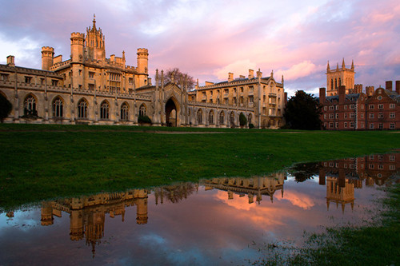
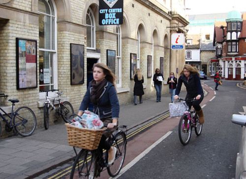

# 世界的尺寸是Pi的整数倍

前段时间收到公司杂志的约稿，让我也聊聊国外的留学生活，鉴于很多员工都有海外留学经历，我就不一一赘述，只谈谈剑桥数学系的那些事儿。

至于为什么我会读一个数学的博士，真是说来话长。本科时我是学工科的，后来想转成金融类，却苦于没有相关背景。后来乐观地以为自己的数学基础很好，于是想走金融数学这条路，于是就去伦敦政经读了一个金融数学的硕士，再于是就莫名其妙地成了剑桥数学系苦苦修炼的一名博士僧……。。。

说起剑桥大学的数学系，不得不说这是一个神奇的地方。三百年来，这里走出了一代又一代伟大的数学家，牛顿，拉马努金（天才的印度数学家），霍金（剑桥大学的数学系包括，纯数，应用数学和理论物理三个分支，霍金应该算是我们数学系的），怀尔斯（费马大定理的证明者）。如果全世界的数学系做个排名的话，剑桥数学系无疑是前三，我之所以这么说是因为普林斯顿的数学系貌似更牛一些。当然，大牛丛中也难免混入个别滥竽充数的家伙，比如像我这样的IQ卡余额不足急需充值的学弱。

数学家是一种奇妙的存在

如果说物理学家可以用对撞机搞出黑洞，化学家可以用各种烈性炸药搞出恐怖活动，生物学家可以用病毒搞出生化危机，那么绿色环保无公害，只有自虐成瘾的数学家无疑是这个星球上最有安全感的科学家了，因为他们冥思苦想，早出晚归，世界也没有任何灾难发生。

剑桥数学家的生活是十分恬淡的，那些在外界让人顶礼膜拜的大师们，在数学系也只是一个个普通的存在。比如霍金教授，他在数学系只是一个普通的残疾人，在这里没有他的观众，没有众多的造访者，我曾经无数次地从他身边经过，让出通道，向他投去同情的目光。在剑桥数学系，没有人在乎你是开着什么车，穿着什么名牌，光从他们的座驾和衣着，你无法辨别他们的身份和学术水平。如果一定要给一个判断标准，那么我只能说头发少的比头发多的更牛。如果你看到一个目不斜视，长发飘飘的数学家走过，那么你基本可以断定这是一枚小本科生，而且他头发的味道可以告诉你这两天他都吃了什么。如果你看到一个面带诡异笑容，不停和身边人寒暄的光头数学家，那么很有可能这是一位德高望重的教授。，我的博士生导师就是这样的一位，因为他真的很牛，牛得连眉毛都快没了。回国之后，有一位友人说起，我是她见过的头发最多的数学博士，对于这种评论，我只能回复，呵呵。

说起数学家们的一天，每天早上大家都会准时骑着各式各样的自行车赶到系里，我每天要从住处骑行两英里大约15分钟到系里，我导师就显得更凶残一些，他家离数学系6英里，约十公里，天天骑自行车上下班，而且风雨无阻。话说导师可是57年生人，他都这样绿色环保，我们自然也不能落后，所以骑自行车成了我的习惯，一直保留到了现在。至于饮食，无疑可乐和香蕉是数学家们的最爱，因为他们可以迅速地补充糖分，保持大脑的高速运转。不过那些大脑转速不足的，糖分都会跑到肚子上，所以数学系的胖子也比较多。而我早上不喜欢喝可乐，一杯速溶咖啡和一个牛角包就是我的全部早餐。

数学家们是另类的，特殊的，也是高傲的，所以不要轻易尝试走入数学家的世界。在剑桥数学系有个真实的故事，一日一位生物学教授来数学系听讲座，其间与一位数学教授攀谈，生物教授说数学真是最重要的学科，如果把整个人类知识结构比喻成金字塔，那么生物化学这类学科无疑金字塔的底座，而数学无疑是金字塔的塔尖，其赞美之词，溢于言表。而这位数学教授冷冷说了一句话：“我觉得我们不在同一个金字塔……。。。”没错，很多时候教授们是平易近人的，不过一旦他们开启了学霸模式开始暴走，你就无所适从了，这一点真是又可爱又可恨……。。。

我所学到的数学

我在剑桥数学系呆了四年半，由于本科不是数学专业的，博士期间大部分时间都在各种恶补，感谢导师和同学的帮助，让我对数学有了新的理解。

我们国内时常诟病说，外国人数学如何如何差，中国人数学如何如何好，其实这些都是误区。我们所谓的数学是狭义的数字概念，而说外国人数学差的主要论据是他们算账时不能心算只能用计算器。可现实情况远不是这样，为什么我们出不了几位数学大师，其本质原因在我们对数学的认识，在我们中国人眼中，数学是与算术划等号的，说白了，是一种“术”，是方式方法，是手段。而数学的定义不仅限于此，数学其实是“学”，是一种思考问题的理念，是一种解构问题的哲学。为什么我国每年参加国际数学奥林匹克可以狂拿金牌，可这些天才们后来却鲜有作为，究其根本还是国内数学教育的误区和错位。相比之下，那些外国人虽然当年只拿到银牌，但通过他们对数学的理解和努力，都成了有名的数学家（其中一个代表是剑桥的数学教授Ben Green）。
	
与国内数学教育不同，国外数学教育有三个环节值得我们注意。

首先，对基本概念的强调。无论学什么，对基本概念的理解和把握是最重要的，这种理念保证了数学家们严谨的逻辑和思维，避免产生结论的误用。相比之下，国内的数学学习更在乎结论，更多的时候都是死记硬背，不知道定理的假设条件和使用环境，这在数学学习中是十分危险的。

其次，怀疑的精神。在剑桥数学系的课堂上，学生如果有不懂的地方可以随便打断老师，质疑老师，老师也十分鼓励学生提出各种各样的想法。而国内的教育往往是学生噤若寒蝉，只有忙着抄笔记的时间。这种现象究其本质还是数学老师们的自信和水平不足导致的。

第三，学习是融会贯通的过程。我想很多在国内接受本科教育的人都有这样的感受，学了微积分，但是不知道不动点定理如何用，学了线性代数，但是不知道矩阵有什么用，学了概率统计，不知道各种检验怎么用，他们之间又是什么关系。其实数学是一个整体，如果老师们能站在更高的层面对数学的不同领域做一些梳理，就会打消很多学生的疑问，便于学生的理解。

此外，数学中经常提到的是存在性和唯一性。如果说外国人偏爱存在性，那么中国人在意更多的是唯一性。中国人对唯一性的执着更多来自于根深蒂固地对权威的尊重和认可，认为找到一个解就可以把问题解决，这恰恰忽略了其他的可能性。而外国人的思维更多地执着于寻找不同的方法去解决问题，并且从中挑选最优的那个，究其本质，还是对权威的怀疑态度。

我想我在剑桥数学系学到的最重要的还是交流。很多时候，我们中国人的习惯是自己做出来很多好的成果不愿与别人分享，因为这是自己的成果。而我这几年学到的是，如果你有新的想法就更应该和别人分享，因为在和别人的思想交流中，你可以汲取更多更客观的评价和定位，甚至更好的想法。所以，我会的东西我会毫不犹豫地拿出来和大家分享，请大家也不吝赐教。

2013年5月11日对我来说是个重要的日子，我终于博士毕业了。想想别人23岁就拿到博士，我到了32岁才拿到，不禁怅然。不过为了这一天，我也付出了异于常人的努力和艰辛。每天早出晚归，早上九点到办公室，晚上十一二点才回家，没有节假日，没有太多的娱乐生活，严重透支着IQ卡的余额，当别的数学家憋出思想时，我憋出的却是一堆空咖啡瓶子和白发，姑且把这些称作关于数学的行为艺术吧。

感谢我的导师，感谢剑桥数学系，他们教会了我用数学和自行车去丈量这个世界，让我知道，世界的尺寸原来是Pi的整数倍。

（采编：张蔚涵；责编：刘铮）