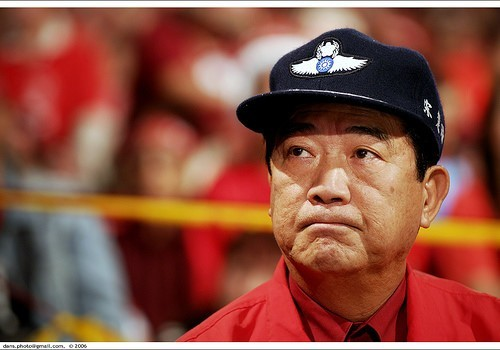
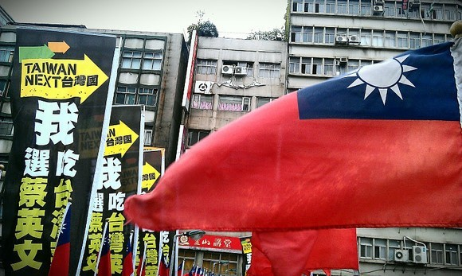
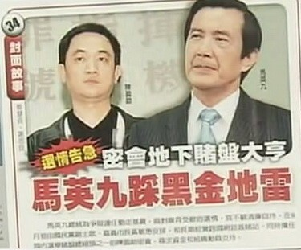
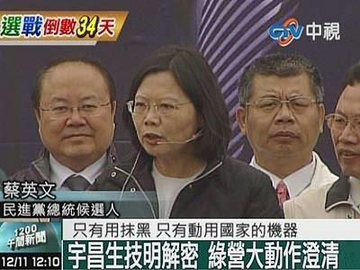
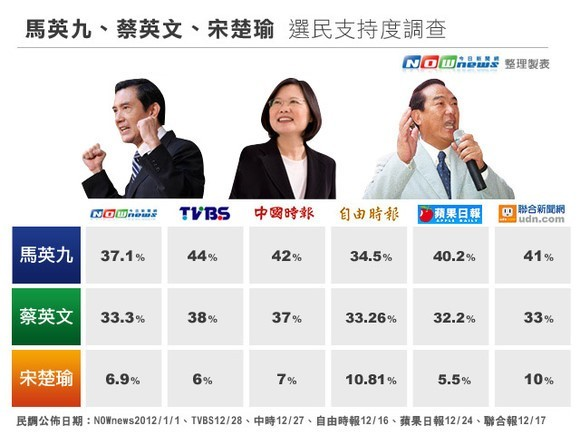
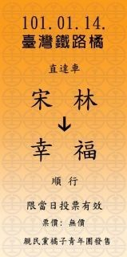

# “1月14日，最重要的事”

** **

#### 1

“大陆女生好凶哦。”他摇头。

他叫阿宗，在逢甲夜市开一家卤味摊。之前他在深圳的台商工厂工作7年，金融危机，工厂倒闭。他跟一个老师傅学了卤味的手艺，跟同伴在夜市附近开了一家卤味摊。新开张，满50就送蔬菜。

“他娶了大陆的老婆，哦不是不是，是娶过，被打哎~”他同伴一边煮菜一边揶揄他。

“娶过……三年，呵呵。”他一边点数客人的菜品，一边把大块的豆皮、贡丸剪碎。这几日台湾极冷，据说阳明山还下了雪，台中下了一整天的雨，到傍晚依然不停。

他忽然抬头问我，

“如果蔡英文当选总统，你们大陆真的会派兵打过来吗？”

“我不是将军，我也不知道啊。”我知道这里面多有说笑，“那，你是会选蔡英文喽？”

“我，不一定喽。蓝绿都差不多，都好不到哪里去。”

“可是这次还有宋楚瑜啊。”

我一直感到很奇怪，当他们说起选举，所谈到的还是蓝绿。亲民党相比蓝绿确实式微，可是宋楚瑜顶着压力联署44万人参选，电视辩论会站出第三个身影，总不至于到提都不被提起的地步。

“宋楚瑜……宋楚瑜他不会中的啦。”

“为什么不会中？”

“民调那么低。”

“你去投票民调不就变高了吗？”

“……他不会中的啦。”

一旦意识到争论可能无休无止，有很多话就自动转为沉默了。先前等候的客人一个一个拿了餐盒离开。到我。

“加辣吗？”

“要。”

“我也觉得宋楚瑜不错，他做省长的时候确实很多人支持他，如果他那时候参选也一定会很多人支持他。可是过去太久啦，当时得到他好处的人，都投靠到国民党那里去了，国民党资产那么多，民进党支持者也很多……”

国民党我有耳闻，最初的“党即国家”为它积累下了庞大的党产，国家统合主义让党组织遍及社会各个角落，有桩脚、黑帮、地方派系的支持，黑帮花钱买选票，用国家行政力量打击竞争对手，这都是国民党。

“民进党的支持者为什么会很多？”

这时他同伴插了一句话，“我会选蔡英文”，然后又转过头去煮菜。

“喏，他们梦寐以求的台独嘛。”阿宗耸耸肩，跟我扮鬼脸用模仿喊口号的语气小声说，“台，独！台，独！呵呵呵。”

“谢谢你。”他收了硬币。

“谢谢你。”

“政治，就是这样。哪边大，就往哪边跑。”

#### 2

“你有关注大选吗？”

“哦，你说大选……”

谈话的年轻人叫A-Lan，二十几岁，是商圈里一家理发店的店长。店面在逢甲正对的第一个路口，是夜市街道的交汇，平日顾客来往繁忙，在台湾第一次剪头发是在他这里，后来每次来都要等很久。

“选谁不都是一样，一筐烂橘子里要你挑出一个不那么烂的来，你说有什么好看。”

那时第三场辩论刚刚结束，政见陈述、社会人士提问、候选人交互诘问，大陆的媒体都拿出整块的版面和专题做报道。他不看。 在他看来，候选人说的都是鬼扯。

“什么政策都是说给你看的。从前那些政策都是啊，有哪一个好好执行了吗？我们这里的劳动时数早就超过法令限制了，劳工委员会他知道啊。他有怎样吗？没有啊。老板还不是照样要我们干活。一到选举的时候才跳出来，定出来的法令又是屁。”

“选来选去，都是老样子，年轻人早就失望了。”

他说的是蓝绿，不管是报章媒体还是电视辩论，蓝绿给人的感觉就是在抹黑扯皮。刚来就是苏嘉全的农舍案，又扯出苏嘉全老婆逛夜店开派对，然后绿打蓝的政治献金，什么无厘头的电磁波攻击，梦想家的2.5亿，后来又是蔡英文生技案不当牟利……

刚开始还想把事实找出来，可是这种事情一件接一件，每一件都是要花费精力的。电视媒体都有政党偏向，你要从他们的报道里分清楚事实和伪饰；每一件又都牵涉到法律、法令、事件的历程和演变，你要去翻出法规、读条令，才知道究竟谁说的是对的。等你紧追猛跑得出一个结论来，判断究竟是谁对谁错，早就被甩在层层爆料的后面。而当你慢慢发现两边都在穷尽手段攻击对方的时候，每一件事的是非黑白，谁抹黑谁，谁对谁错，又真的重要吗？

是，没错。几次轮替下来都是烂样子，哪一个都好不到哪里去。不去费心关注也是理性的，选出来又没多大差别。店里每天流水几十万，春节剪头发涨到一千都忙不过来，蓝绿掐架早就看倦了，拿出时间来不如挣钱。

可是这次不一样啊，这次不只蓝绿，这次有橘色啊，有宋楚瑜啊。你看宋的魄力，又多有风度。马英九交互诘问从来不看宋楚瑜一眼，国民党骂人家叛徒内奸；蔡英文倒是有礼貌，每次都顾及问宋主席一句。宋不领谁的情，也不惧谁的面子，对的就说好，不对的就批评，不偏不倚，不卑不亢。宋是有底气的，做省长时候的业绩，老师们说起来都交口称赞。所以这次不只蓝和绿，有宋楚瑜，有橘色啊。

“宋楚瑜是不错啦，我也觉得宋楚瑜蛮好，可是……”

他之后的话我都想不起他说过些什么。总之绕来绕去，模模糊糊，总不愿明白说出自己的观点。

最后。

“最后，你总要投票的吧。你会去投票吧？”

“会的啦。最后，看下民调喽，哪个高就投个哪个好喽。”

#### 3

“总统票请投3！政党票请投9！选票要投给真正有能力的人！请支持宋楚瑜先生！”

2012年台湾选举为史上首次总统与立委“二合一”选举，选民一共有3张选票，分別是一票选总统、一票选区域立委、一票选政党。除去选总统的那一票之外，选人的那张票用来选自己所属选区的分区立委，选党的那张票则是选自己所喜欢的政党；而（选党的）这张票是不分区的，也就是全台一起统计，用来決定34席不分区立委该由哪个党来指派。

在街头呼吁的是一个年轻的母亲，背着装满纸质材料的大包向街上的行人散发，我拿到一个亲民党的春节红包封皮，一张幸福车票。

这里的台北总下雨，天气湿冷，她领着小孩在捷運站的街口助选，路上行人都不愿意停留，只有没见过世面的大陆货才觉得新奇。我返回去说，请再给我几份好吗，我带回去拿给同学看。她很意外，愣了一下，然后赶忙拿出几个红包封皮，又塞给我一份政策手册。

“这是宋主席的竞选政策，他是真正为台湾好的人，请和我们一起支持他！我们都没有报酬，都是自愿来帮助他的，要投票给真正有能力的人！”

她一时找不到车票，旁边的小孩子凑过来，举起手里的一把车票说：“在我这里呀！”

我本想回去拿给系里的同学看，可是票拿在手里，却想不到可以拿给的人。

身后她还在向路人呼喊，“选票要投给真正有能力的人！请支持宋楚瑜先生！”

#### 4

“假如说，我投他的票，但他又不会当选，我这一票不就没用了吗？就作废掉了啊。所以要投给有希望当选的人啊，这样我的选票才有用啊。” 听起来是没错。如果说每个人投票都抱有希望，说要去影响未来的走向；那么我这一票当然去投给有可能成为未来的那一方，这样我的选择才真正有了影响。如果明知一方一定不会是未来，那投出的票不就没有任何作用吗？

这是我在这里第一次听到台湾同学间对选举的讨论。身边的台湾同学每周雷打不动地看《我可能不会爱你》，但不去看辩论和政见发表；他们热爱李大仁，痛恨程又青，在FB上探讨怎样是十全十美的好男人，但很少去讨论政治和选举的事情。这是第一次。也可能跟课程有关，课的名字叫全球化与区域治理。老师在课上照顾大陆的学生，会不时提起些选举的事情。课程结束，老师请修课的同学一起吃饭，对面的台湾同学开始说起宋楚瑜。

他叫環瑜，支持宋楚瑜。

“我没有要说服他们，没有要他们去投宋楚瑜的票，我只是表达我的观点和看法，告诉他们我是这样想的，他们接不接受无所谓。”

“你讲了还不是要人家接受，还不是希望人家听了你的话认为宋楚瑜好也去投他。”

“如果我说的有道理，如果他确实好，为什么不去投？哎，干，你不会要做废票党吧。”

“也可能啊，说不定，也许会投，也许不会啊。最后可能还是会投的啦。”

呛他的是好友長軒，斜靠在沙发上，对環瑜的每一句话泼冷水。他热爱羽毛球，读过LXB的书，还有很多其他的没听过名字的书。他一直在重复这样一个观点：如果你投的人根本不会当选，那你的投票有用吗？

“有用？为什么要有用？你就是要表达你的观点，你的立场和看法，支持谁就投给谁。你看，台湾的年轻人在投票之前就已经没有自己的梦想了。他们没有梦。这就是我们的年轻人。”

“表达你的观点，好啊，你可以去FB上PO说我支持宋楚瑜，全世界都看的见你啊，你不是就表达了你的观点表达了你的支持吗？你投了票，不当选，谁知道那是你投的。有什么用。”

那个下午就缠绕在这样的争论中，但是还好，汉堡薯条可乐炸鸡沙拉红茶，大家都是有说有笑。

“可是有的家里，一家人政见不一样，支持的人不同，吵起来几个星期不说话。”

家庭的因素。这些身边的同学大部分都是第一次投票，早上听一个同学说起，她老爸要她赶回台南去投票。台南，想起来就是绿色。刚来时候跟同导师的同学聊起过她们对国民党的看法，说：“我爸经历过国民党的白色恐怖，看到邻居深夜被抓走，所以他绝对绝对不会投国民党的票。”

“那你们呢，你们怎么决定去投谁？”

“还早啊，到时候看下喽。呵呵，来来来，胡椒饭来了。”

那时距离选举还有三个月。这三个月里，她们忙着修课、做案子、写论文、计划书口试、期末报告、约会、圣诞、出国旅行、跨年、远距离恋爱……

七十六万八千六百三十三人，这就是台湾2012年的首投族，他们手里握有决定未来的七十六万八千六百三十三张选票。

#### 5

“一月十四日，最重要的事。”

 

（采编：楼杭丹；责编：麦静）

 
