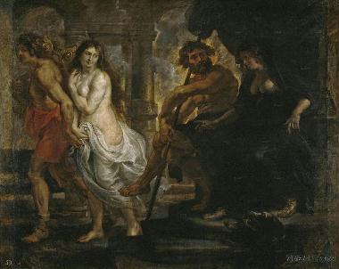

# “不要回头看！”

希腊传说中，善弹竖琴的俄耳甫斯下到冥府，想要讨还他的亡妻欧律狄刻。他悲戚的琴声感动了冥河的艄公、驯服了三头犬刻耳柏洛斯、最后甚至使冥王为之流泪。冥王答应把欧律狄刻还给他，但临别时却加上一句警告：“只是，我要警告你，在走出地狱之门前，你切不可回头望她，否则她将再次落入深渊，永生不复，你更不能对她泄露神谕。走吧，不要辜负了神的悲悯！”

“不要回头看”，这真是又一句悖谬的神谕。看来冥王终究是铁石心肠，他假意同意了俄耳甫斯的请求，实际上却给了他一个无法兑现的许诺。俄耳甫斯如何能不回头看呢？在重返地表的旅程中不许回头，这真是困难重重。爱妻心切的他怎么能按捺住回望爱人的冲动？而且，沿着石阶爬了那么久，却不知道身后的任何情况（据说，鬼魂的声音活人是听不见的），他怎么能不怀疑：欧律狄刻是否正跟着他？当怀疑许久得不到解答，绝望将深深笼罩他。俄耳甫斯将自问：“这是否是一场盲目的征程？我做的一切有什么意义？”最后，凡人终于无法承受一句话的重压，俄耳甫斯终于回头望去——妻子确实在后面，然而死亡的长臂却将她拉回地府，他终于永远失去了欧律狄刻。

是不是可以考虑一下俄耳甫斯神话的现实形式？在许多情境下，我们都反复收到类似“不许回头看！”的告诫，仿佛这是一种成功的必要条件，有些好东西一旦在没成型的时候被看到，就会消失的无影无踪。前天，我妈给了我一瓶正在发酵的酸奶，告诉我：“不要打开看啊。”是的，只有在发酵完成后，我们才能得到美味的酸奶，假若我们迫不及待，酸奶就会因污染而变质。胶片在摄影中好像也有类似的过程：在拍照完照片后，我们不能立刻把胶片拿出来看，而只能按捺住好奇的心情，等到洗出照片才能知道自己是否拍出一张杰作。然而，上面的两种情况并不具备俄耳甫斯重返地表时遭遇的悖谬感。制作酸奶和洗照片都是我们熟知的过程，而且它们只是些小事，并没有那种关于自己目标能否实现的深刻怀疑以及由此带来的焦虑和绝望。“不要打开酸奶瓶” “不要在曝光前看胶卷”都远无法传达“不要回头看”的丰富意涵。

如果我说，人生本身就像一场俄耳甫斯神话，这会成立么？人生的意义、价值以及一切让我们感到宝贵的东西就像美丽的欧律狄刻，我们感到失却了它。这时有人许诺我们，假如照他说的做，那美好的就会跟随我们直到尽头，我们将最终得到救赎。这个救世主会告诉我们，救赎只有一个条件：要信他；假若不信，救赎就不能完成；甚至怀疑也会动摇这种信仰；更糟的是，一旦你不敬神，你会陷入万劫不复的境地。这似乎是俄耳甫斯神话的最充实形式。

我们会发现，许多宗教，至少这些宗教的普及形式，都会做出这种承诺：拯救就在最后的阳光中；然而在很多情况下，它却对我们说：“不要回头看！不要怀疑你们的信仰！”回头看，意味着对自己行为以及对它的信仰基础或意义的反思。我毫不怀疑有思想的信仰者能对自己的信仰做出反思，然而这些反思者，以及剩下的大多没有进行反思的人，他们难道不会面对一种俄耳甫斯式的悖谬么？

不管在庙宇中或神像旁，每当有人对神灵的能力有疑惑时，总有人会说：“心诚则灵。”这真是一种玄妙的说法。我不想讨论“心诚则灵”的心理学解释，只考虑这句话本身带来的悖论。倘若，我诚心相信神能满足自己的愿望则神就真的会满足我，那么这确实是一种很好的情况。可为什么要相信这个神而不是别的神呢？假若神一直没有满足我的心愿，我该认为是我心不诚还是神不灵？或许一种体验而不是理性会说服我相信神，那么对这种体验的反思、对它的分析和解剖也就变得极其危险，认为这样“回头一看”，信仰的力量可能就会消失。

再来看看亚伯拉罕的故事。亚伯拉罕被人欣赏的地方就是他对上帝坚定的信仰。耶和华为考察亚伯拉罕的信仰，命令他把爱子以撒作为牺牲献给自己，亚伯拉罕虽然于心不忍，但仍然决定听从神的命令，于是他经受住了考验。我想问的是，亚伯拉罕难道没有考虑过自己行为的意义么？倘若他从自己的经验中稍稍跳出进行反思，他会发现自己竟然要杀死自己的儿子啊，而这一切是为了一个他不能把握的神秘力量。他难道不会想，如果上帝不存在，或者他误解了上帝的意思，那么他不就是天底下最愚蠢的人么？最终，上帝也没有真得让他献祭儿子，这是因为他的信仰足够坚定。也许亚伯拉罕确实反思过，他看到自己的信仰确实是坚实的，然而这个故事却没有鼓励这种反思，它实际上只是在表达一个意思：只要你信仰了，你不需要回头看。

假若把论域稍稍扩充到宗教外，也经常会发现同样的告诫。生活中，真正的反思是危险的，因为它会让通常的实在感消失，让我们平常追求的东西显得毫无意义。这样讲来，我们背后的意义确实会像欧律狄刻一样，我们一旦想去回头看她，她就隐去在深深的黑暗里，让我们自己也陷入虚无。所以有人说：“激怒一个人的最简单方法是，对他提出的意义基础不断地追问。”哲学确实吸引着每个人无尽的好奇心，我们身后的意义问题也是疑惑的源泉，它的重压有时会令我们绝望。然而“回望”——对哲学问题的探索却可能带来严重后果，以至于没有多少人愿意这样做，沉湎于平凡的行动中也许真的是一种更好的选择。

让我们稍稍变换一下神话的情节：如果俄耳甫斯正确地遵守了冥王的告诫，直到返回地面之后，当他期待着妻子的时候，却发现自己身后真的什么都没有，这会是如何滑稽的情景啊？

我们总知道无数关于“得道”“成仙”“得了真意”“功德圆满”之类的故事。这似乎是我们的证明世界存在希望的论据——毕竟有人得到过最终的救赎。我毫不怀疑有些人真得能体验到那种“和宇宙融为一体”的感觉，然而，大多数人都没有得到过这种体验，于是滥竽充数和不着边际的神话夸张就产生了。有多少人真得知道“禅定”的境界是什么？有多少人像德尔菲女祭司一样“和神对话”？有多少人真正进行过“现象学的观看”？柏拉图讲的“学习者悖论”就在这时发生：如果我体会到一些模糊的东西，我怎么判断它就是所谓真意？然而在实际中，悖论却不会发生：人们很容易认为自己把握到了真正的知识，而别人也原意如此相信，甚至还有许多人会故意装作高深的样子骗人。众人总是这样合演出一场“皇帝的新装”，却没有一个小孩站出来说：“请回头看看吧！”

继续改造这则神话：俄耳甫斯一直没有回头，确实带着身后的同伴来到了阳光下。可他发现，那位跟随者不是美丽的欧律狄刻，而是来自塔尔塔洛斯的恶魔。这就不只是滑稽而是可怕了。不幸的是，这种可怕的事情却经常在我们的世界里发生。

这实在有太多例子。爱邻人的基督徒发起了十字军东征；笃信上帝的西班牙侵略者拿《圣经》做掳走印加皇帝的幌子；相信自己高贵血统的日耳曼人发动了面对世界的战争；“人肉炸弹”相信自己在天堂会享用七个处女……倘若他们都能想一想自己不知疲倦的行为究竟是为了什么，究竟支撑着自己完成这一切的那背后的意义是什么，那多少灾难都不会发生！不，“不要回头看！”是一句最恶毒的诅咒，它已经渗透到了人性中。彻底的反思对个人而言是危险的、是困难的、是不明智的；而它对于民族而言几乎是结构性的不可能的。

人们不是忍不住回头看，而是不想回头看、害怕回头看。我们好像应该修改一下前面对俄耳甫斯行为的评价：这不是软弱而是勇敢。当他沿着漫长的石阶向上前行时，渴望、怀疑、绝望困扰了他：他渴望的是美好的东西，他怀疑的是美好的东西不存在，他绝望的是自己很可能功亏一篑。可俄耳甫斯发现倘若遵循冥王的告诫，自己的处境将更是愚蠢的与任命运摆布的。权衡再三，他终于勇敢地回头看去——他可能看见虚空，可能看见恶魔，可能冥王的诅咒并未生效，也可能自己的妻子就此消失。但不管怎么样，这样的赌注是值得的，他将是一个明智和勇敢的人。

实际上，一经反思就消失的东西也不会是真理。无论如何，不管是对有信仰者还是无神论者，“不要回头看！”这句严厉的警告也早该被抛弃掉了。

（采编：陈肃 责编：佛冉）
