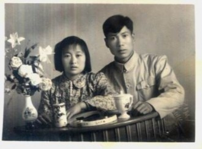

# “平民”的爱情

“平民”，这个词的确有些腐朽等级观念的意味，但在现在这个物质对人群划分得几近严苛的社会来说，我不解释了，大家明白我指的是哪一类人群。

称呼他们为平民，源于我们的脑海里对这类人有一个基本共识的剪影：你知道他们就是生活在你儿时住的那种五、六层民宅的邻居；你知道他们家的排油烟机总是在傍晚时分鼓出炊烟；你知道一年中会有一些日子，家里的女人会去为全家人添置些东西，老公的棉毛裤、儿子的拼装玩具、老人们的补品什么的，她们站在商场扶梯上，流露出使命感似的光荣；你知道他们的生活并不拮据，只是他们不会在奢侈品店里流连，他们很珍惜每个用辛苦钱换来的物品；你知道他们不会因为自己的平凡而过于卑微，平民也在为自己的幸福奋斗甚至挣扎，平民也会为世间的不平愤懑，为自己人生的艰难流下辛酸泪。

已经很久，我们这群人沉湎在高高构织的精致的梦幻中，向往社会精英的圈子，专注于有品质的事物。我们没能在一面镜子里看看自己，正思考着没有人间烟火味的命题，喜欢发表些貌似振聋发聩的评议，拗出孤芳自赏的寂寞姿态，喧哗而孤单。一条丑陋庸俗的虫，为了跻身名贵的行列，缚茧、化蝶，这期间的痛苦多么令人感动，那些忍耐中的坚强多么值得颂扬。所以蝶与虫最大的差别就是翅膀，翅膀让它能飞，飞得远些，就会看到更多风景，就会有更多人赞叹它的成功史，就会不枉此生。

“你们这些年轻人，最爱犯的错误就是喜欢苦难，喜欢那些自己预想以为会感天动地的苦难。”

所以她的爱从来不满足，所以她的爱不胜凌寒。

这一天，她路过煎饼摊。吃惯了欧陆早餐的人，遗忘了鸡蛋煎饼的乐趣在于它被摊制的过程。

偶然的机会，让她决定花三块钱，权当看一出民艺表演。那个摊蛋饼的女人摊每个蛋饼的时候都格外卖力，会把身子弯的很低，低到让她能用像一个高级手工匠一样的视线去检阅自己的作品，但是摊蛋饼的女人哪懂艺术呢，也许她只想着多卖出一个，乡间自盖的房舍就多加了片瓦，或许她根本什么都没想呢。

煎饼好了，那女人的丈夫早在一旁准备好了塑料袋迎接妻子的成品。

你想不到哪种现代化的机械能如此默契地配合，永远不能，一切自然得如同抛物线般圆滑，承接的力道均匀、自信、如此坦然。递出蛋饼之后，丈夫继续忙活起来，提前做好几个紫米饭团，等客人多起来的时候就有所应对。

他的妻子没有帮忙，毫不客气地闲着，不会为了恩爱，而做作的帮忙。

她以前听人说有对卖炒河粉的小贩夫妇，某天丈夫帮妻子围了围松掉的围裙，妻子害羞地笑了。一时间这个细节流传开去，感动了很多单身丽人。可那时她就觉得在故事传播的时候，这种平民的日常的幸福变了味儿。

直到今天她偶然看到了这个女人的空闲，任由丈夫做着饭团，才正符合一对为柴米油盐辛劳的夫妇应有的常态。唯一出卖了这种看似淡然如水的无味常态而写满爱意的，是妻子的眼睛，平民的眼睛不会说谎也不需说谎。

她的眼睛就痴痴地看着丈夫，看了不知多少次的脸孔，只有妻子的眼睛，才能在每次的凝视中依然情深。很快又有人来买蛋饼，她并没有因为不能再端详丈夫而恍惚，依旧如手工匠一般专注地做她的蛋饼，又不再理丈夫，只是因为，她知道他就在旁边，会在她做好蛋饼的时候，准备好袋子，她不用看就知道，这种默契让四目相对显得那么啰嗦那么幼稚。

所以她的力道，均匀、自信而坦然。

那些动辄要感天动地的人自然不会去体味如水般无味的平民生活。平民的爱情，如他们每日的饭食，无法提供多么稀缺的食材，无法调制出多么高级有层次感的风味，仅仅是填饱肚子，让他们感到踏实，感到安稳。

当然有人行将就木之时仍然有轰轰烈烈的人生，包括爱情，平民之恩情，也不见得就比名仕显贵们高深的爱恋珍贵，毕竟，平凡，就是他们的样子，他们的爱情也是如此，不必被树立为什么典型，非要治愈了谁。因为无论是否被关注，这样的平民之爱就是会在一蔬一饭中涓涓流出，也不为了淋润那些在钢筋森林里焦渴寂寞的精英们，爱情的流露，本来就是因为它太过充盈，自然地滋溢而出。

如果我再碰到那对摊蛋饼的夫妇，我会毫不犹豫地打扰那位妻子的凝视，买个蛋饼，因为他们需要挣这份钱，可是在爱情上，他们已经太富有。

（采编：陈肃，责编：佛冉）
