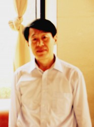
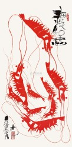

# “我最仰慕的就是中国的儒家文化” ——专访韩国青云大学教授崔昌源

导语：2013年6月27日至30日，韩国总统朴槿惠对中国进行为期4天的访问。我们有理由相信，这次访问之后，中韩两国在未来会有更多地的交流与合作。值此新篇章开启之际，北斗网记者专访韩国青云大学中国学系教授崔昌源先生，以期为读者呈现一个真实的韩国，共同探求中韩两国的历史、现在与未来。 

人物简介：

崔昌源，雅字普元。1958年6月出生在韩国首都首尔，毕业于国立台湾大学，获博士学位。现任韩国青云大学中国学系教授及国际交流院副院长，韩国莲门学会会长、韩国中国语文学研究会副会长。

**记者（以下简称记）：在中国游历这么多年，您对中国哪个地方最感兴趣？**

崔昌源教授（以下简称崔）：最敬慕的还是中国的儒家文化。尤其是唐朝“三教合一”后一直到宋明时期形成的的理学。我十分欣赏王阳明。理学在韩国具有十分重要的地位，它“人伦和谐”的概念在韩国的社会中有很大的影响。

**记：具体有什么影响？能举几个例子说明吗？**

崔：“人伦和谐”思想在韩国最明显的体现便是“敬”的思维。这种敬不仅是人与人之间，在人与团体之间同样如此。我个人认为，儒家文化很少探讨团体与团体的关系，这是中国儒家文化的一个缺失。而在韩国对儒家文化本土化的改造中，便加入了这个因素。“敬”在韩国人日常交往中起到一个前提的作用，比较典型的例子比如说三星集团。“敬”是他们很重要的企业文化：企业充分尊敬自己的员工，而员工对自己的同事乃至企业也都充满敬意。这一文化因素对三星如今的成功起了很关键的作用。

**记：对您刚才说的儒家文化缺乏团体与团体之间的探讨我并不完全认同。其实这种探讨在中国历史中还是有的。您看中国几乎每一个朝代的文官都会出现同乡、同年等名义的联合，形成一个个政治团体，而这些团体之间的相互倾轧给朝廷的行政工作带来很大的麻烦。比如北宋时王安石的变法派与司马光的保守派的斗争。**

崔：我认为这就是团体与团体之间的“敬”缺失造成的问题。在韩国历史上也出现过这样的情况：在1392年[朝鲜王朝](http://zh.wikipedia.org/wiki/朝鲜王朝)时期李氏朝廷上就有文官集团相互倾轧的情况，而在100年之后，韩国一名大臣便开始对这种现象反思，并提出这种斗争实在无意义，富强才是国家之根本目标。但在当时这种思想并没有得到重视，于是这糟糕的局面最终导致1592年日本成功侵占了朝鲜半岛。直到1593年，名将[李舜臣](http://zh.wikipedia.org/wiki/李舜臣_(朝鲜))领导的朝鲜海军在海上有效地摧毁日本军舰，掐断了后方供给。明朝也派出大规模与朝鲜一道共同击退了入侵的日本军。从这个教训中我们就可以看出“敬”的思想在哪一个时代都是应该得到重视的。

**记：其实您刚才说的“敬”不可避免的涉及到韩国人的信仰，您觉得韩国人的信仰是什么？**

崔：韩国人的信仰便是儒家文化，只不过每个人从这个文化中汲取的东西不同，所以信仰具体也会有一些小差别。比如我就一直坚信“施之以礼，还之以礼”的信念，你看我最近在中国搞自己画作的义卖活动，所得的钱用于资助中国在韩留学生。一些人也在置疑我这个行为没有必要，他们认为这些留学生完全可以自力更生。但是我认为我现在给他们提供了帮助，他们以后一定不会忘记我的帮助，在我需要时同样会来帮我，所以我的这些作为其实最后的受益者应该是我本人。

这样的观念在韩国人中间还是很普遍的，比较典型的就是大多数韩国人每年清明节都会选择回乡祭祖，并举行很大的祭祀活动，这便是他们在礼上的付出。但是祭祀活动最终是通过对逝者的悼念让逝者的亲人、家族更为紧密的联系在一起，团结的宗族也会使宗族中每一个人收益，你看，这便是“还之以礼”。

**记：说到清明节的祭祖活动，如今中国清明、中秋乃至春节这些传统节日在当下社会都面临着文化内涵丢失的情况，很多年轻人把节日当成假日来过。您对这一现象有什么看法？**

崔：我觉得这种问题最根本的解决方法在于“讲道理”。如果他们的长辈或是师长能把这些节日的丰富内涵告诉这些年轻人，把我们庆祝这些节日的原因、作用讲给他们，这种现象就会得到很大程度上的改善。所以说解决这一问题的关键因素在于长辈带领晚辈去“慎终追远”。

**记：这些年轻人对传统节日一个不热衷很重要的一个原因在于他们工作忙，比起过“无趣”的节日，他们觉得还不如省去回家的麻烦，在城市中工作挣钱。其实这也是一个不可避免的规律，就各国发展历史看来，国家经济崛起过程中人们大多会重视物质利益层面，文化势必会遭遇一定程度上的式微，韩国是否出现过这样的情况？**

崔：对，这种情况确实在韩国出现过，但是我们国家借着“汉城奥运会”这个机会开始了自己的文化“复兴”活动。在承办汉城奥运会后，韩国人一直在思考该向世界展示自己的哪些东西？许多人都说是“汉江奇迹”的经济成果，但是进行进一步思考后，我们觉得经济成果并不能展现我们最具特色的一面，我们韩国人最骄傲的东西还是我们自己的文化。于是韩国人便开始重新研究自己国家的文化，通过这些年在文化上的努力，我们成功的把韩国文化推向了世界。我认为每一次国际盛会良好的契机，通过这个机会，大家可以一起坐下来探讨问题，最后一起享受探讨的成果。我想这也是为什么世界上许多国家都争办奥运会、世博会、世界杯这些国际盛会的原因。

**记：刚才您提到了韩国文化的国际传播，这些年中国在推动自己的文化走向世界时也遇到了一些问题，例如我们的文化传播的符号并不为外国人理解。您看北京奥运会的开幕式，中国人看过后大呼精彩，但是许多外国人觉得除了表演的人多，什么都没看明白。您觉得这样的问题该如何解决？**

崔：我举个例子说吧。最早韩剧传入中国时，造成的轰动效果韩国人自己都不敢相信，不明白为什么能造成那样的轰动。后来许多韩国学者研究这个问题后认为中国人之所以喜欢韩剧根本原因在于中韩同根同源的儒家文化。你看那些韩剧里的家长里短，透露出的不都是儒家家族的观念吗？所以我们都认为韩剧在中国的成功的根本原因在于引起了中国观众的共鸣。即使世界上有不同的地理、历史和文化环境，不同的民俗文化，但是我们的文化里一定有一些能够让大家都产生共鸣的元素，找准这些元素，有的放矢的去传播文化，一定会起到不错的效果。

**记：我认为中国之所以无法很成功地向世界传播文化的原因也在于中国人并不是十分清楚自己的文化是什么。因为经历了新文化运动对儒家文化的批判以及文化大革命的摧残后，作为中国文化主脉的儒家文化并没有得到很好的继承，而对西方文化的“邯郸学步”造成了现在中国人对自己的文化到底是什么始终没有一个透彻的认识。**

崔：首先我要说中国的西学东渐并没有错，重要的是我们在学习西方文化时，不应该第三者的角度审视我们的文化，而应该是立足于自己的文化，思考如何在保持自己文化特色的基础上对两种文化进行有效的融合。在学习西方文化的过程中，吸收、调和这个中间环节一定不能少。

第二，我认为中国文化一直在生生不息地传承，只不过一些内涵没有拿出来罢了。举例来说，我们学校的一些中国留学生在来到韩国之前，如果他们的母亲生病了，他们中很多人可能并不会一直在母亲谁边陪着自己母亲，他们觉得有自己的父亲照顾母亲就够了，所以这个时候他们还会约上同学一起去玩儿。但是他们在韩国学习几年之后回到中国，如果再遇上母亲生病的情况，他们便会一直陪伴着自己的母亲。这种“孝”的因素并不是韩国教给他们的，而是他们受儒家思想浸染的血脉中本身就有这样的意识，韩国的环境只不过推动他们将“孝”的因素具体表现出来了罢了。所以我认为现在儒家文化在中国人身上虽然伦理上并没有很明显，但是在行为上还是会表现出来的。

**记：那您认为如何将我们没有拿出来的东西给挖掘出来？**

崔：我觉得最重要的还是儒家思想的现代化。有意识的把儒家传统的东西与现代社会的背景结合起来，对儒家文化进行改造，便是最成功的“挖掘”。举个例子来说吧，我最近在关注中国三聚氰胺奶粉、毒馒头、瘦肉精这些食品安全问题，我认为这个问题出现的根本原因在于这些生产厂家的道德缺失。如果我们把传统的儒家文化与现代社会追逐利益的意识能结合起来，将”仁、德”这些儒家思想运用到现在的市场中，这样的问题便会迎刃而解。

崔教授作品：《海虾》

** **

**记：在传统文化的继承上现在社会上也有一些声音说中华文化其实被台湾更好的继承了，而在大陆要差很多，据您这些年的游历来看，是这样吗？**

崔：我认为这种说法不对。台湾的儒家文化与大陆的儒家文化是有一些不同，但是其原因在于儒家思想的本地化。其实这就和中韩的儒家文化一样，区别是有，但不涉及一个高低之分，而是各地有各地的特色。比如我们韩国就特别注重礼节性的东西，而中国人外在是比较随和的，大家见面都会很随意的打招呼，但你真正去研究这两个人的时，发现两人关系中并非随意，而是由很多道教的因素在里面。

**记：道教因素？**

崔：对，比如说在吃饭的时候，中国人喜欢在一个圆桌上，看起来每个人是平等的，但是它的座位也有上座和下座之分，人的地位高低还是会通过隐形的方式体现出来，这很有意思。中韩儒家文化的不同还体现在饭桌上中国人其乐融融，大家都自由的发言。但是在韩国，往往只有主人一个人发言，下面的人交流也仅限于两个人之间。所以我觉得无论是中韩还是中国大陆与台湾的儒家文化，都是本土化造成的一些不同，并不存在什么高下之分。

（记者：李卓；代理责编：李卓）
