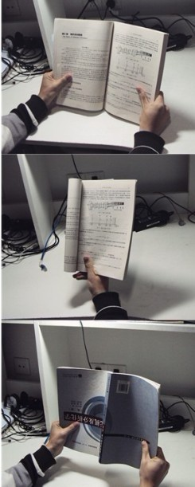
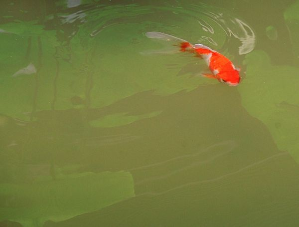
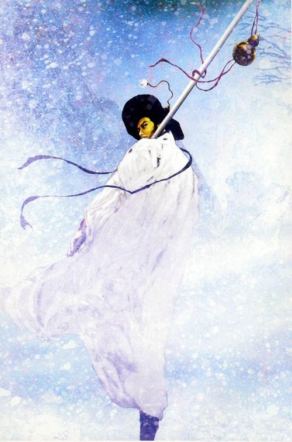

# “然后呢？”关于爱的四种结局 （一）：山寺桃花

** **

许久不曾写些什么。一是因为忙，二是因为忙得尽是些琐碎凡庸，所以自然而然的变得简陋粗俗。

粗俗的心智需要读“粗俗”的书。

这些天床头只有一本书，《古版忠义水浒传》。

跌跌爬爬看完了八十六集的新版水浒传电视剧，在某个深夜里，揉着发红的眼睛，对着黑洞洞的电视屏幕上“全剧终”三个字满心凄凉。这老旧故事的开始和终结早就知道的清清楚楚，又不耐烦看那有宋一朝的言情戏，在卿卿我我的桥段拼命的敲着遥控器快进，常常嘲笑那些不合时宜的对白。但最终依旧是感动的，会流泪辛酸，会义愤填膺，会热血沸腾。

赵宋，常被比作中国的文艺复兴，前后绵延三百余年，相比汉唐，富贵繁盛不足，士子气息浓厚，想起来总是苍白羸弱的。曾经在火车上读过一本纯学术的论文集，写的是宋代幽怨的诗画史，《宋代诗画中的政治隐情/Poetry and Painting in Song China: The Subtitle Art of Dissent》，是作者姜斐德从普林斯顿毕业时的博士论文，我对于这作者一无所知，大约是美国宋画研究界的新秀一枚。我读这论文，说起来是为了杀时间。举目四望，车厢里尽是小报周刊，中产阶级小布尔乔亚的心灵鸡汤《读者》，最高级的不过是推销成功学的励志畅销书，独独我高举着这么一本集子，挡着对面旅客惊讶艳羡的目光，俯仰睥睨，自我感觉良好。

实在我读了三遍都没读懂。放开不读又不忍心，这么高深的一个主题，好歹也花费了我两三个小时。 缪哲先生相救，在他的《祸枣集》里提出了这本论文，我没本事，只能消化人家细细咀嚼之后反刍给我的信息。每每至此境地，我就要感慨，文学青年是一种具有奉献精神的生物。毅然决然的成为小白鼠被拿来做实验，去读缪哲说的那种人人都希望自己读过但是人人都不愿意去读的书，艰深繁难的学术著作其实并不算最糟，我最惨痛的经历大约是读《英儿》，读了六遍，说话分不清主谓语，老想杀人。我觉得作者是个神经病，合上书时突然觉得不对，顾城可不就是个神经病。那感觉仿佛吃一碟实验用的饲料，反刍几次，再拉出来供科学研究，丝毫不在意会留下什么后遗症。

可就是这反刍之文，我也要读了两遍才算通顺，其实这本书提供的信息量并不大，只是观点很别致。总的来说，这本书描述了自王安石变法之后的元祐更化以及此后近百余年的党争，并提出了一个关于“影子语”的概念，即宋朝文人将作诗的“影子语”的策略也用于作画。具体来说，择取诗的字眼或韵脚，或用作画题，或写诗跋，仿佛密码一般。在这本书中，“潇湘”这一题材举出的例子最多，“潇湘”演变为一种文学的程式，“被后来的迁客逐臣，表达忠不获省与去国怀乡之悲”。缪哲在求学时主修艺术史，从这诗画中挖掘历史的线索自然是他的老本行。

潇湘一词，最早见于《山海经·中山经》的“澧沅之风交潇湘之浦”，似乎永远被认为是有关美的意象，与水有关，而具体的涵义反而不甚明了。也许是因为其中难以掩盖的萧索之意，也许是因为五行不合，也许是因为曹雪芹笔下那个令我厌恶的潇湘仙子，我总是不大中意这个词。可这词却很匹配北宋的气质，值得玩味。从宋画到密码学再到政治隐情，又背熟了一段饭局上备用的高级谈资，起码能撑三顿午饭。此时我这厢马伯庸所说的“下里巴症候群”复发，对面的乘客又非常体贴的到站下车，赶紧把美国佬吃饱了撑的论文集丢到一边，期期艾艾的山水画儿见鬼去，大宋朝最最有趣的必须是那八百里水泊梁山。

四大名著里面，最爱的是《水浒传》。正因为此，从小就被嘲笑是气质粗鲁愚钝。其它三本，讲述的都是入世的过程，唯独忠义水浒，描绘的是一个出世的故事。《西游记》最可笑。说的是一群曾经的无政府主义者千里跋涉寻找真理，最终摇身一变从被压迫者变成了压迫者。胡适先生非常喜欢考究《西游记》，将它的前世今生都翻腾了一遍，最终却给了“瞎嚼蛆”三个字的评价。《三国演义》写的热闹，东汉末年群雄割据，乱哄哄的一台戏，说的是帝王将相的奋斗史。《红楼梦》里有个沸油介鼎盛的巨富豪族，姹紫嫣红的皮囊下藏污纳垢，一朝没落惹人扼腕叹息，无论是高颚还是刘心武，都“好一似食尽鸟投林，落了片白茫茫大地真干净！”《水浒传》不一样，它是一个成年人的童话，一个八百里水泊上的乌托邦国度里关于梦想和现实的悲剧。

这样看来这个故事似乎应该很早就被遗弃了，但是过了七百年，它依旧血肉饱满，让我这幼稚而粗鄙的人死心塌地的爱着。

整个故事在一种非理性的叙事风格上飞速的推进着，虽是抛头撒血神彩飞扬，但字里行间充斥的都是一抹关于宿命论的悲情气氛。它提出了一个大同梦想，所有的不真实都用一句因为是命中注定星宿相合来解释，似乎这故事就圆满了。水泊梁山上不存在尔虞我诈机械倾轧，有的只是纯净的信任，纯净的欣赏，纯净的相亲相爱。每一句哥哥兄弟的呼喝，每一次劫法场，每一句“招安？招个鸟安！”，都能在我的心中卷起一场飓风。我尝试去理解我心中这种激情的来源，从前我可以把它归结为对于挑战权威，无政府状态和世外桃花源的向往，对于未成年人来说，这实在是再平常不过了。可是现在，我越来越觉得，吸引我的并不是这雄性荷尔蒙翻涌的一百零八将聚义，而是高潮之后的梦想迅速崩坏的过程。

一个充满了普世价值和说教意味的故事，常常有一个恶劣的男人莫名其妙的出现在一个伟大的女人的青春之中。男人自私，虚荣，薄情，寡恩，女人呢，含辛茹苦。这个时候打出字幕，“二十年后”，当年的风流负心汉如今都已垂垂老矣，在老之将至的时候突然回想起旧时恩客和从未谋面的儿女。男人忏悔，男人痛哭流涕。而那个在出生之前就被抛弃的孩子，会在暴怒和激烈的内心挣扎之后接受这个远道而来的父亲，完成“灵魂的救赎”而得以成长。

另一个版本中则会有两个历史悠久且互为死敌的世家。世家的子弟一定会相遇，而且一定会不顾积累了数百年的血海深仇而惺惺相惜。他们苦苦的挣扎着，求生求死，希望得到宽容和谅解。最终干戈化为玉帛，又一次“灵魂的救赎”。

其实这些都是屁。当年抛弃妻子携小姑娘私奔，如今无家可归冻毙街头，这是多浪漫的事啊。一条道儿走到黑，不要忏悔，不要想着回归家庭，不要用一句“人之将死，其言也善”打发看客。相逢一笑泯恩仇是最恶俗的结局，呸呸呸。离开的人都不会再回来，而仇恨的人永远互相仇恨。 抛开《水浒传》黑沉沉的政治色彩，直视其中一个个活生生的个体，多少刻骨铭心的聚义和钟情，都演变成了不过三言两语就各奔东西的下场。这些个体必须做出选择，没有暧昧，没有模棱两可，没有对于旧时光的留恋。 左右不过这么几条路。

你可以被招安，单纯的试图用个人的力量震撼一个你曾经与之对立的体制，在逻辑上就已经坍塌。独松关，德清，润州，清溪，乌龙岭，你的兄弟们为了你自相矛盾的梦想去厮杀，尸骨不全，草草的葬在战场上。他们不能懂你的梦想，可是他们都为你死了，而你将独自抱着你“替天行道”的杏黄大旗腐朽。你可以归隐山林田野，去过你在经历这场梦之前就一直在过的平静生活，你满心疑惑，“他妈的老子上了一趟梁山怎么又回来种玉米了？”“他妈的老子都上过梁山了怎么种玉米还要交税？”在某一个夜里，你吃了腊肉，米酒很浑，你微醺，回想起这荒诞的一切哈哈大笑，你的身后可能是一个冰凉的炕，也可能是李师师温软的身体，可无论如何你都因这疑惑而寂寞，你喝光壶里的残酒，翻身睡去。你可以继续去自找麻烦到处厮杀，混江龙李俊诈病辞官，带着一票兄弟扬帆出海，去建立另一个水泊梁山，当上了暹罗国主。陈真像个神经病似的，踢翻了虹口道场之后大声问，“还有哪里日本人最多？东三省？好，我们就去东三省！”英雄的电影可以一而再再而三的拍出续集来，死去的人可以复活，消灭了一个坏人又会冒出新的一个，一直到英雄杀不动了，看官们乏了，英雄还是要归隐，“他妈的老子还是得种玉米。”

童话的结局总是被掩盖起来，人们不忍心再问，“然后呢？”扳着手指数来数去，大约鲁提辖的结局最让我满意。他不要封妻荫子，也不要住持名山，“都不要！要多也无用。只得个囫囵尸首，便是强了。”他听见钱塘江的潮信，“既然死乃唤做圆寂，洒家今已必当圆寂。烦与俺烧桶汤来。”沐浴更衣，在龛子里坐着，粗纸臭墨划着他的偈语，“今日方知我是我”，就此坐化西去。我幼时很爱鲁智深这个人物，看到此处不禁大悲，嗟叹连连，他竟然就这么去了？他竟然就这么无声无息的去了？现在再看，爱慕之心更甚，看到结局，竟又大喜。

他必定不是因为厌烦或是绝望才想到死，“烦与俺烧桶汤来。”他欢天喜地的要去死，他六根不净，诵不通法，却心已成灰，死就是死，连“圆寂”这词都不消多说，就这么去了，留下这一帮污浊的凡夫供着他的浑铁禅杖哭天戗地。这才是上上等的人物！这才是上上等的浪漫！

农历八月十八，是钱塘江大潮最汹涌澎湃的日子。数以万计的游客涌向海宁。翘首等待着从杭州湾翻涌而来的万马千军。

山寺月中寻桂子，郡亭枕上看潮头。何日重重游？

“我要去看钱江大潮”，这个念头在八月十七的夜里突然冒出来，接着便愈发强烈而不可遏制，伴随蔡琴的《不了情》，于凌晨时分在空荡荡的马路上开着车子扭来扭去。忘不了忘不了，忘不了你的错，忘不了你的好。

在晨曦中静静看着远处鱼肚白的天映出一片绯红，两三只蜜蜂跳着八字舞，而苍蝇则飞的要更快些，围绕着地上两三只腐烂的葡萄旋转个不停。我蹲在马路牙子上抽着烟，等着街边脏兮兮的小铺子里炸出来的第一锅油条。相约看潮的姑娘，离开南京已经二十年了，并不常常见到，但因为意气相投，永远都是亲近的。她的眼睛很亮。在黑暗中随着烟头的微光忽明忽灭。迟夏的天气苦闷，高速公路的路面湿嗒嗒的，继而是日的影像被蒸腾的暑气笼罩，红日跳跃着在路的尽头升起，我追着日出，一路嚎叫着难听的调子，自已为是夸父，向浙江飞奔。一路飞驰到了海宁盐官镇，在人山人海中穿梭。最终是在淫靡的雨中踮着脚看到了最负盛名的一线潮，很短暂，很壮观。

白水浩瀚。我突然想到了宁戚拍着牛角高声唱给管仲的那句话。

浩浩白水，鯈鯈之鱼。

每年到了杭州，先到白堤去骑单车，那儿有武松墓。再到涌金门那里和金牛拍一张照片，然后在南山路上磨蹭掉一整个下午。涌金门依着金牛湖，占着旧杭城偏西的方位，是自南向北的第二座古城门。五代时吴越文穆王钱元瓘开凿涌金池，引西湖水入城，便有了这处水寨。如今还有一座石碑镇在那里，隶书“古涌金门”。涌金门前有一座高高大大的浪里白条张顺的铜像，我常陪着那铜像，在他脚边静静的坐几个小时，胡乱说一些张顺哥哥英武之累的废话，吃西湖天地打包的冰淇淋，有时也喝一点酒。我说我的废话，想我的旧时豪杰，喝我的淡酒，铜张顺不搭理我，铜张顺一直举着他的鱼叉。晴雨寒暑交替而过，当年那水寨上固若金汤的涌金门变成了西湖边上浅浅的一洼池水。心中感慨，莫可名状。

我总是想着，我会不会是来错了年代。

从前爱读些矫情的书，觉得自己勘清了世事，这世间的纷扰说白了都是丑恶无聊的。人心一定狭隘，欢乐一定短暂，爱了半辈子，有情人终成黄土。不喜欢《神雕侠侣》，尤其不喜欢让很多很多人击节赞叹的一个桥段。说的是杨过十六年后以神雕侠的名义扬名天下的时候，来襄阳城给郭二小姐过生日。我不喜欢，因为觉得这男人无趣，费尽心思天花乱坠不过是为了说，你们看，我神雕侠便是那当年你们人人看轻的坏小子杨过。可是现在长大了再看，又觉得好。好男子立于天地间，酬恩报怨，何其痛快。你若看轻我，我便搅翻一个江湖给你看；你若爱我，我便性命相报。

后来襄阳大战的时候，我记得耶律齐有一句台词。

“性命都是他给的，真所谓水里水里去，火里火里去。他要到那里，便跟到那里，何必多言！”

听过故事无数，我能记得的台词并不多，这句却是一见倾心的。到了今日再看梁山好汉聚义，心中想的仍然是这一句。

总听说卡拉姆津有一本中篇小说，叫做《诺夫哥罗德征服记》。看了无数的介绍，至今无缘见到原文。据传这小说有卡拉姆津一贯清丽懦弱的风格，借底层贵族的口叙说对这世道的不满，主旨却仍是维护君主的统治。这小说当然不能算是感伤主义文学的代表作，但是他低沉的叙事节奏格调不凡。到今天才突然发现，小时候不能理解的卡拉姆津对专制主义优越性的辩护，其实就是公明哥哥念念不忘的招安大事。而我那妩媚的军师哥哥，便是黄昏中摇着羽毛扇的海涅的化身。

感伤主义，待洒家看看这厮是什么来头。（笑）

暂且忘却故事的下半段吧！暂且忘却吴用深夜猛醒泪若雨下，暂且忘却蓼儿洼那无处可投的冤魂，暂且忘却四散于江湖之中老去的末路英雄，只要记住的是醇酒和鲜血灌溉出来的兄弟情谊，便永远是快乐的。

夜来昏睡。梦中忽有暮雾霭渺渺冥冥，石阶上坐着一个胖大和尚，虬髯怒咤，只觉的十分面熟。忽然看见他坦露的胸膛上一色儿不断头墨青的花绣，恍然间便是延安府那大名鼎鼎的鲁提辖。

不知为何，我突然想和大和尚对一对偈语。

走上前去周周正正问了一个四方万福，说，“大师，倒惑心亦尔，谓从已身出。和解？”

大和尚瞪着圆圆的眼睛，看了我一眼，说了声呸，啐了我一脸大唾沫星子。

此时转醒，已是天明。

（采编：孙梦予；责编：应鹏华）

 
