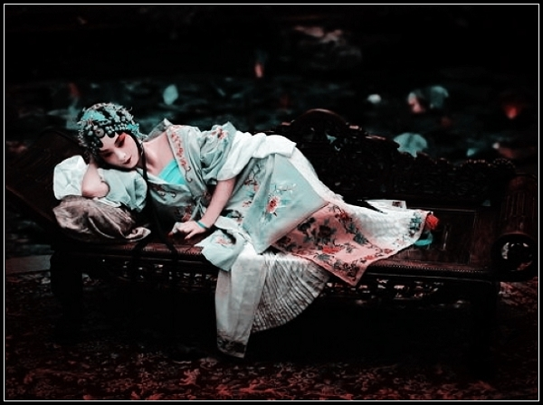

# “然后呢？”关于爱的四种结局 （二）：终是乱煞年光遍

**时年方十一，夜里拥被枯坐，幼小的心灵竟感觉到十分惆怅。今日重听，泪洒江河。**  

# 终是乱煞年光遍

## 文/朱小福（Imperial College London）

 

南京的夏天最难捉摸，突然无端就阴了天，滞重的云散漫在城市上方。空气里是说不清道不明的一股铁锈般腥甜且湿漉漉的味道，在胸腔里氤氲良久，挥之不去。黑云压城城欲摧，虽然没有身处雁门关外，也没有甲光向日的冲天豪气，但是总是喜欢加上李贺的这么一句旁白来烘托气氛。

看的是《游园惊梦》。

倒并不是那一段让白先勇念念不忘了大半辈子的末世狂欢曲，却是杨凡镜头里三十年代的苏州，又是一个紫醉年代的梦。宫泽理惠和王祖贤，加上浙江昆剧院的唱腔，真是如泣如诉美不胜收。有一段树林中的缠绵，情欲蒸腾，配上了《寻梦》里的《懒画眉》，这是最好的一折戏，几乎是清唱，古琴的伴奏若有若无，那呜呜咽咽的水墨腔，千回百转，欲说还休。

“最撩人春色是今年，少甚么低就高来粉画垣，元来春心无处不飞悬，是睡茶蘑抓信裙衩线，恰便是花似人心好处牵。”

听完了这一段，心中却只是一阵酸。从来钟意的电影，总是逃不过“禁锢”这一种如影随形的气氛。主人公总是在各种各样的囚笼里苦苦挣扎，抗不过命运，抗不过时光的洪流，抗不过这该死的世界。

这些年坊间常见许多情色流泻的电影，大多打着探寻人性本质的文艺旗号卖肉，有时还是古装卖肉，大约是嫌古人被穿越的还不够闹心。角色的选择五花八门，有各种各样的款式搭配任君选择。警察与小偷，老师与幼童，美少年与年老色衰的熟妇，性冷淡的中年大叔与失足少女，这少女多半还会被影评人说成是救赎原罪的天使。电影本身似乎从头到尾都在高潮，可就是戳不到看官的G点。

我需要的是一种更加真实的感官刺激，一种纯粹的美。这种美必须经得住时光的考验，那倒影似的枫叶，透明的池塘和缓慢的推进的滤光镜头，在角色的衣衫褪去之前，已经把看客吸进了情欲的漩涡里。美少年只是这个故事的引子。处在大变革时代的宅院人家，理所当然的没落了，而伴随着这种没落，许多被禁锢了太久的情感蠢蠢欲动。从前只能靠鸦片来排遣的满腹情思，如今探出了头，女人和女人，男人和女人，纠缠起来没完没了。

两个女人在一个没落的富贵人家相遇，一个是嫁入豪门的旧时名妓，一个是男装打扮的进步青年，两个人眉来眼去，风光无限，其实都是又失意又无聊。荣兰做了一个新派的巾帼英雄似的人物，一心报国，每天忙忙碌碌做着自认为积极的事业，其实只想掩住心中四散蔓延的颓废。其实我们不都是这样么？ 后来，男欢女爱没了下文，“原来姹紫嫣红开遍，似这般都付与断井颓垣”，欲望说穿了也就这么回事。转眼许多年过去，风流俱为尘土，煌煌百年繁华，一朝坠地，化作满目星火残余。最终那一折《懒画眉》又唱起来的时候，人们恍然大悟，只有寂寞的人互相依存的情感才最珍贵也最久长，良辰美景奈何天。

汤传楹在《闲杂笔话》里有一段话，“天下不堪回首之境有五：哀逝过旧游处，悯乱说太平事，垂老忆新婚时，华发向陌头长别，觉来觅梦中奇遇。然以情之最痛者言之，不若遗老吊故国山河，商妇话当年车马，尤为悲悯可怜。”

我上小学的时候，有一天下午，也是莫名的阴天。在家里看电视剧，演员绝傻，剧情绝傻，大约是一群怪物乱打一气，欺佛戾世，无法无天，我那时也是个绝傻孩子，看的津津有味。

剧集本身虽差，主题曲可以作为千古名曲流传，叫作《相思》，里面有这么一句词，“最肯忘却古人诗，最不屑一顾是相思。春又来见红豆开，竟不见有情人去采，烟花拥着风流真情不再。”

时年方十一，夜里拥被枯坐，幼小的心灵竟感觉到十分惆怅。今日重听，泪洒江河。

 

（采编：孙梦予；责编：应鹏华）

 
