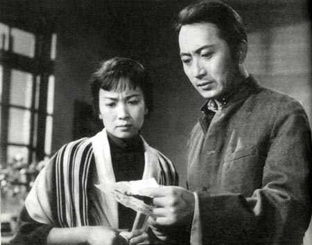
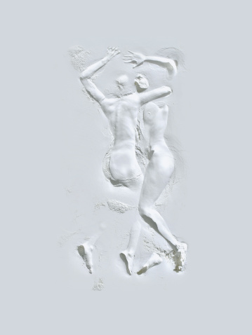

# “然后呢？”关于爱的四种结局 （四）：早春二月

** **

有一天，大约是三月放春假前不久，我在海德公园里散步。iPod自动跳出来一支特别明快特别欢乐的曲子，是电影《早春二月》的插曲，依稀记得是电影里陶岚带着学生们出去郊游的时候唱过的一首歌。

“云儿飘，星儿耀耀。海，早息了风潮。声儿静，夜儿悄悄。”饰演陶岚的是谢芳，那时的谢芳真的是美丽极了。

柔石的《二月》我读了好几遍，特别喜欢鲁迅在《二月》的小引里面写的一段话。

“浊浪在拍岸，站在山冈上者和飞沫不相干，弄潮儿则于涛头且不在意，惟有衣履尚整，徘徊海滨的人，一溅水花，便觉得有所沾湿，狼狈起来。”

“他仅是外来的一粒石子。所以轧了几下。发几声响。便被挤到女佛山——上海去了。他幸而还坚硬。没有变成润泽齿轮的油。”

《早春二月》作为新中国解放后“十七年”时期非常著名的一部作品，却决不带有一丝一毫的“十七年”风格。在文革运动开始前，阴重的政治仿佛厚厚的云团，裹胁人们的思想和言行。而谢铁骊却毫不在意的把自己的小资产阶级趣味大白于天下，把一个旖旎温绿的江南小镇和委婉温柔的二十年代旧中国审美拍成一部药性猛烈的大毒草。

大毒草有舒缓的旋律，江定仙的《徘徊曲》，李叔同的《送别》，黎锦晖的《月明之夜》。十九世纪的西欧浪漫主义冷静而略显惆怅的音符，围绕着一段压抑的三角关系，和一个深沉懦弱的知识分子，被死气沉沉而交头接耳的旧社会和广阔的充满变革的更大的世界交替拉扯着，苦苦挣扎，无法抽身。革命者们则坐在大银幕前面欣赏这个故事，抽着大前门，回味他们年轻时在某个小镇上的某一段无疾而终的罗曼史。不，并不是无疾而终，他们最终都投入了革命的洪流之中，接受革命的伴侣和革命的婚姻，为了一种更广大的属于全人类的幸福而奋斗，而不仅仅为了一个可怜寡妇和一段若有似无的情愫就无助伤怀。

看完了电影，革命者们要开研讨会，批评大毒草。影片宣传资产阶级人道主义，抹煞阶级斗争，反对无产阶级革命，是夏衍“离经叛道”论的标本，这虚构的美是必然无法和革命的风暴相抗衡的。大毒草要拉出来游街示众，在57个城市作为反面典型放映，接受无产阶级人民群众的批判。感谢这批判，我的父辈们才有机会在漫天的红本语录和大字报的缝隙中接受这“大毒草”细腻忧郁的美的感染。

大学里面的电影赏析课谈到谢铁骊导演的这部《早春二月》的时候，都会强调影片以现实主义的手法，成功地塑造了1926年前后中国具有人道主义精神的小资产阶级知识分子的形象，反映了他们的苦闷与彷徨。但影片结尾处含蓄地暗示主人公去寻找新的理想和道路。提高了原作的思想境界。

一段长长的镜头，定格在陶岚身上。陶岚在飞快地奔跑着，身后是一片密密麻麻的篱笆，之后篱笆突然消失，取而代之的是一片豁然开朗的天空，她挣脱了篱笆的束缚，在阳光下远去。这决不是含蓄的暗示，它比柔石的原著小说结尾要强有力的多，也明亮的多。

问题是我现在发现，其实这部电影对我来说，重要的部分并不止于此，真正困扰我的正是电影结束之后，主人公去寻找的那份理想。 理想被用来书写一个传奇故事的起因和经过，而结果是必须被隐藏起来的。

萧涧秋和陶岚离开芙蓉镇，“噗嗵”一声跳进时代的洪流，去寻找新的生活新的理想。之后发现，就算来到上海也不过是养家糊口以求温饱，成为方鸿渐。爱情呢？爱情就是更不值得一提的东西了，自由而平等的爱，需要自由而平等的世界，需要孙悟空来革命，而革命者孙悟空必将在奔涌的人潮中放弃最初的爱。萧涧秋就像至尊宝，要救紫霞就要打败牛魔王，要打败牛魔王就要变成孙悟空，要变成孙悟空就要戴上紧箍咒，要戴上紧箍咒就要了无爱欲老老实实地去取经。后来至尊宝挖开了自己的心，看见了紫霞留在那里的一滴眼泪。谁为什么爱谁，谁为什么不爱谁，这是很难解的问题。紫霞一直固执的认为，她的意中人是个盖世英雄，有一天他会踩着七色的云彩来娶她。她只猜中了开头，还是那样。故事的下半段，你我都不知道，没有人知道。

命运就是如此，无论有多少观众鸣不平。到最后，牺牲了什么，得到了什么，也只有自己知道。我总是能把萧涧秋和《白马啸西风》里的李文秀联想到一起。《白马啸西风》是一部无论情节还是立意都趋于平庸的中篇，可是我总要喋喋不休逢人便夸它的好，个中原因我自己也不得知。

这个让人唏嘘的故事，说穿了便觉其中无奈。萧涧秋和李文秀，他们都是失意的外来者，最初不过想要求一席栖身之地。而他们有了温饱之后还不满足，他们想要爱，无论是男女情爱还是更广泛的情感上的认同感和归属感，他们的这种贪婪最终毁掉了一个世外桃源原有的平静，本应相伴老去的人因为他们这些外来者而改变了生活轨迹，或死或伤，不能幸免。主人公带着满腔愈发深沉的苦痛，继续漂泊。兜兜转转在人海里轮回了五百年，自以为堪透世情大彻大悟，其实只不过是回到了原点。

李文秀说过，“你心里真正喜欢的，偏偏得不到，别人硬要给你的，就算好得不得了，你不喜欢，终究是不喜欢。”

“白马带著她一步步的回到中原，白马已经老了，只能慢慢的走，但终是能回到中原的。江南有杨柳，桃花，有燕子，金鱼。汉人中有的是英俊勇武的少年，倜傥潇洒的少年，但这个美丽的姑娘就像古高昌国人那样固执，那都是很好很好的，可是我偏不喜欢。”

萧涧秋在外游荡了好多年，无法振作，来到水乡小镇以求安慰，他本想救人，想不到自己也陷入了更深的泥沼中，关于爱情和理想的命题都是无解，他只好再次离去。

这就是鲁迅和许多受其影响左翼文联作家常用的“归乡”模式，离去——归来——再离去。

我没能战胜命运，命运也没能战胜我。 陈世骧早就写过，“无人不冤，有情皆孽。”

我读过的最叫我感动的爱情故事，只有一个短短的段落。照样是一个外来者，和一个本不应该与他相遇的人。

“在码头卖口香糖的时候，有个混血水兵，漂亮极了，才十八、九岁，天天买我的口香糖。去越南打仗的前一晚，他问我I love you中文怎讲，我教他，他就对我说：我——爱——你。”

“如果有天他回来，一定，要他再讲一次。”

第一次在访谈节目中听到这段话，卖口香糖的女孩子已经老了，还依然漂亮。当时我心中的震悚之情，竟然要催我流出眼泪。这只有开头，还来不及有结尾就已经结束的故事，才美丽，才叫人念念不忘。

我想大约在这世上最大的错误，就是做个有情人。本不该去爱，本不该振作，本不该去试图救赎。萧涧秋这样的青年，他读了书，想要爱情，想要理想，却又惜身，怕被潮水卷到万劫不复的境地，这实实在在是错的，他必然会痛苦，他必须抛却自己的心，做一个麻木而快乐的人。 有的时候回头看一看，一个二十多岁的人开始感慨人生，其实是一件特别可笑的事。

这早春二月不期而至的莫名感慨，就放在这里罢了。

吟罢低眉无写处，月光如水照缁衣。

（本连载完）

（采编：孙梦予；责编：应鹏华）

 
