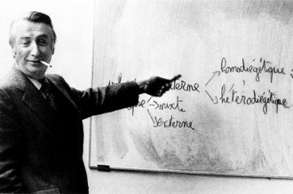

# “诗与哲学之争”背景下的文学理论

**一**

一个幽灵，一个文学理论的幽灵，徘徊在全球文学研究者的头顶。它好似莎士比亚笔下的鬼魂，阴恻恻地教导后人应当做什么[[1]](http://blog.renren.com/NewEntry.do#_ftn1)；又好似海中精灵普罗透斯，“颠来倒去，变化多端”[[2]](http://blog.renren.com/NewEntry.do#_ftn2)，没有定型；它是预言者，也是总结者，最终又是“实践”本身；它是上帝死后的替代品，却又是在上帝之前就已存在的远古神话。就当前的情况来看，长达半个世纪的文学理论风潮给我们留下了丰富的遗产，但也留下了更多的问题。要解答这些问题，有必要将“文学理论”这一概念和事件整个置于西方思想的历史脉络之中考察，这条脉络，就是从《理想国》（或译《王制》）和《伊翁》延续至今的的“诗与哲学之争”。苏格拉底时期就“古已有之”的这场战争在二十世纪后半叶随着文学理论的突然兴盛获得了新的语境。

没有比“文学理论”一词更能表现诗与哲学之争的张力了。文学理论既非文学，也不是哲学，而是两者的互动。从字面上说，“文学”毫无疑问是柏拉图所贬斥的诗的领域，而“理论”作为哲学家所过的最高生活方式[[3]](http://blog.renren.com/NewEntry.do#_ftn3)，与“文学”放在一起，则昭示着将哲学手段运用于诗性话题。这似乎是哲学对文学的胜利，或者用阿瑟·丹托的话说，“哲学对艺术的权力剥夺”[[4]](http://blog.renren.com/NewEntry.do#_ftn4)。然而事实上“文学理论”并没能让正统的哲学家满意，相反，它们更多受到文学研究者的普遍欢迎。无数精于辩证法和文本阐释的文学批评家正用各种各样的方式向全世界的文学爱好者解释为什么“文学理论”可以成为一个新的学术领域，甚至是一个建立在文本阐释之上的“公共领域”。这些学者大多受过语言学和哲学的训练，他们的完美主义驱使他们反对一切既定的研究与阐释模式，并提出种种爆炸性方法以实现库恩所称的“范式转型”[[5]](http://blog.renren.com/NewEntry.do#_ftn5)。在激进理论家看来，“诠释只有走向极端才有趣。……‘过度诠释’……能促使我们去反思产生这些问题的文化的运行机制。”[[6]](http://blog.renren.com/NewEntry.do#_ftn6)

但是，这种做法在严肃的哲学家和文学研究者看来是冒犯性的。保守看法通常认为，绝大多数的“文学理论”本质上是“打着红旗反红旗”，是文学理论家用奇思妙想对严肃世界计划的全面反对。可以从很多方面指责激进文学理论家在哲学思辨上的不诚实：有时，他们自己宣扬全新的策略以阐释他人文本，却在平时要求他人对自己的文本采用一般的解读方法[[7]](http://blog.renren.com/NewEntry.do#_ftn7)；有时他们用惊世骇俗的方式提出口号，然而在花哨行文背后的实质意见却平凡无奇[[8]](http://blog.renren.com/NewEntry.do#_ftn8)；有时他们甚至否定语言逻辑本身，却不得不遭遇“述行矛盾”（Performative Contradiction）[[9]](http://blog.renren.com/NewEntry.do#_ftn9)……尽管激进理论家将某些现代的“哲学方法论”发挥到了极致，但我们依然看到，在他们的论述中存在着被正统哲学理念一直排斥的诗性精神：反对理性，宣扬审美体验的魔幻魅力，表达大胆张狂的先锋反抗意识，鼓励民众“自发思考”，重新审视各种惯例和习语，在细枝末节处发现新问题。这些主张有时并不是为了解决什么重大问题，而仅仅是因为“有趣”或“新颖”。

这样的见解或许会面临来自马克·爱德蒙森的异议。他曾想论证：“近来的文学批评在某些概念及实际进展的怂恿下，以哲学的态度来对待诗人。”而他所给出的最有力证明就是强调文学研究的职业化本身将会带来进一步的哲学化，因为：“我们可以教聪明的学生学德·曼，却几乎不可能教任何人像伍尔芙那样感受事物……批评的核心部分是难以传授的……在把批评转化为学术的时候，哲学的原动力自然得到额外的能量。”[[10]](http://blog.renren.com/NewEntry.do#_ftn10)爱德蒙森强调的其实是文学所要求的诗性精神，认为在无法完全穷尽文本中蕴藏的复杂情感时人们才会“退而求其次”，求助于哲学。然而我认为爱德蒙森将哲学的门槛设定得过于低了。事实上很难让文学院的学生接受数理逻辑并带领他们阅读亚里士多德最枯燥的《形而上学》和《物理学》；但要让他们理解米勒、巴特勒乃至詹姆逊的主要看法并不困难。虽然在某种程度上有所交叉，文学研究毕竟不同于严格意义上的哲学，而诗性的描述和归纳也不同于对概念的分析与反思：“具有思想和概念是一回事，知道符合这些思想和概念的表象、直观、情绪又是一回事。”[[11]](http://blog.renren.com/NewEntry.do#_ftn11)爱德蒙森看到天才文学家难以被哲学化地解读，但按同样的逻辑，用文学理论与批评的方式显然也不能穷尽最伟大的哲学思想。特里·伊格尔顿的任何文学批评著作都不能取代马克思《资本论》的地位，而德·曼也只不过为尼采补充了几个诗歌脚注。当然，从维柯开始这种显而易见的区别被逐渐淡化了：“逻辑学、伦理学、经济学和政治学，全是诗性的。”[[12]](http://blog.renren.com/NewEntry.do#_ftn12) 这种看法正是当代文学理论的一个先设。

通过分析当代文学理论最重要的两大理论来源——早期形式主义和后现代解构主义——的核心观点，我们可以观察到诗性精神是如何悄然形成一种足以与哲学分庭抗礼的新神话的。由于披着“形式分析”或“内部研究”的外衣，这些神话具有某种哲学、科学的外观，但它们事实上却只能宣称文学的本质是某种独立于真实世界法则的神秘“结构”[[13]](http://blog.renren.com/NewEntry.do#_ftn13)。我将证明，形式主义-解构主义的诗学乍看之下是利用哲学手段处理文学问题，然而其真正想说的是：只有在传统意义上的哲学止步之处，文学的精灵才会开始焕发光彩。

**二**

“一种障碍重重的、扭曲的言语”——这是什克洛夫斯基对“诗歌语言”的评价；与之对举的“散文语言”则是“节约、易懂、正确的语言”[[14]](http://blog.renren.com/NewEntry.do#_ftn14)。这种看法旨在推论出文学作品作为语言造物区别于其他语言造物的“文学性”。与之既相似而又有所不同的是瑞恰兹与“符号语言”相对立的“情感语言”说，这种观点强调文学言语中情感、态度的功能；值得注意的是，他最终提到：“抛弃知识和符号性真理之后，诗歌也许会回归其伟大地位。”[[15]](http://blog.renren.com/NewEntry.do#_ftn15)。布拉格学派的穆卡洛夫斯基则在《标准语言与诗歌语言》一文中，提出诗歌语言的作用在于“前推”，在于对标准语言公式化的有意违反；这种“前推”具有一种结构性的统一，是标准语言的规范和传统“审美原则”之间的张力互补[[16]](http://blog.renren.com/NewEntry.do#_ftn16)。尽管立场更为缓和，穆卡洛夫斯基语境下的这种“审美原则”与“文学性”或是“情感语言”的诉求一样，所要求的依然是某种相对于日常话语的自律性，它旨在为诗人制定一套异于一般语言规则的规则，而这种诗歌规则也会反过来对一般语言的规则产生互动影响。

在这三位具有巨大影响力的学者那里，纯粹明晰的语言世界中必然有着一处无法被现有理性法则照亮的“黑洞”，这个“黑洞”就是“文学语言”或称“诗歌语言”。最终他们采取了一种隐蔽而极端的策略：通过对日常言语的“扭曲”和“前推”，我们才能迫使这个未知的文学世界自我呈现。这是在“做减法”：把日常的、理性的成分通过各种方式悬置起来之后，剩下的似乎理所当然就该是属于“文学”的成分了。但我们可以进一步追问的是：疯言疯语、醉话或是梦话也是“障碍重重的、扭曲的言语”，也是一种情感的、态度的语言，甚至有时也符合某种审美惯例（譬如，在梦中唱起歌来），然而这些非理性的、扭曲的、引人注目的话语并不等于文学话语。

受到康德以降的自律美学的影响，语言学家制造了“诗歌语言”的概念，使其与标准的、科学的语言构成对立，试图在语言学体系之中为文学语言开辟一块自主的领地[[17]](http://blog.renren.com/NewEntry.do#_ftn17)。然而，如学者普拉特所揭示的：“越是对文学在语言学上的自律抱有强烈的信念，人们也就越不需要对文学语言进行语言学的证明，进而也就越不需要‘非诗的’或是‘标准语言’的范畴。”[[18]](http://blog.renren.com/NewEntry.do#_ftn18)形式主义者们“做减法”的区分方式充其量让我们承认文学语言的确有不同于日常的话语的地方，但若要深究，我们根本无法从中获得更多的结论。诗歌的神秘内容依然未能在形式主义语言学看似明晰的外壳之下自我绽开。形式主义语言学家试图给予“诗歌语言”一种独立的、甚至是反哺日常话语的地位，这看似好像回答了“诗人到底有什么专业知识”[[19]](http://blog.renren.com/NewEntry.do#_ftn19)的疑问，但这种被给予的“知识”其实并非文学所独有。他们的语言学方法其实并没起太大作用，最终被用来确定文学独立地位的依然是美学、心理学与“灵感”。比如穆卡洛夫斯基最终就坦言，“应该由诗人按照自己的创作直觉来使用这些方式，除了自己的灵感以外没有任何其他限制，公众舆论则会做出最后裁决。”[[20]](http://blog.renren.com/NewEntry.do#_ftn20)这就像面对苏格拉底“诗人有何技艺”的诘问，最终伊翁不得不承认只有“灵感”、“神智不清醒”才是诗人行动的源头一样[[21]](http://blog.renren.com/NewEntry.do#_ftn21)。

这种困窘在艾伦·退特的《作为知识的文学》（这个题目蕴涵着强烈的与柏拉图论战的色彩）中体现得淋漓尽致。在这篇文章中，退特反对哲学和科学理性对诗歌的入侵并试图给出诗歌所独有的“知识”。然而，按胡塞尔的说法，苏格拉底追求知识的方法要求“彻底澄清”，把“仅是主观以为美的和善的东西，与在已完成的澄清中显露出来的美和善本身，通过标准化的方法进行对比”[[22]](http://blog.renren.com/NewEntry.do#_ftn22)。而退特想要通过诗学内部研究去探寻的“知识”根本不是苏格拉底意义上的知识，而只是一般经验意义上的知识。这种知识不能让诗人区别于其他人，诗歌语言区别于日常语言。比如，博尔赫斯和鲁迅的作品中的确分别有着“博尔赫斯的潘帕斯高原”和“鲁迅的大禹”这样的知识，但这些知识并不能等同于地理学家与历史学家关于潘帕斯高原和大禹的经过严肃考证的知识。这两种知识本质上不一样，其认识途径也不一样。退特始终没有能够在后者的层面上证明文学也具备同等严肃的知识，事实上他也无法论证。于是，退特只能走到这一步：“诗的‘兴趣’价值是一种认识价值。在诗里面我们得到的是关于一个完整的客体的知识，这便足够了。”而他想说的其实是接下来这句：“假如理性探讨是文艺批评的唯一方式，那我们必须记住，我们使用那种方式的办法一定会极大地影响我们对诗的体会。”[[23]](http://blog.renren.com/NewEntry.do#_ftn23)“理性”与“对诗的体会”就此被对立起来了。“诗歌”是非理性、非逻辑的，这才是退特的真正看法，然而我们发现他相对于《伊翁》并未迈出更远的步伐。

不难看出，“新批评”其实是在为“诗人”这一特殊群体寻求一种本体论上的合法性，只是这种合法性经受不起来自哲学的穷穷追问。在火药味十足的《诗人对谁负责》一文中，退特反对政治意识形态的钳制，激烈地抨击社会对诗人和诗歌研究者们的压力，并强调“诗人的责任本来很简单，那就是反映人类经验的真实，而不是说明人类的经验应该是什么……诗人对谁负责呢？他对他的良心负责……”[[24]](http://blog.renren.com/NewEntry.do#_ftn24)而我们可以追问：诗人所反映的是什么“真实”？他与其他人所反映的真实、与哲学家所反映的真实有何不同？诗人的“良心”究竟是什么？这种“良心”与其他人、与哲学家的良心又有何不同？退特没能够、也无法回答这些问题，进而也不能说明诗人和诗歌精神的独特性何在。

人们还可以从理论语言的模糊性上来质疑一向标榜“科学”的“新批评”。比如克林斯·布鲁克斯会写下这样的句子：“诗并不以逻辑性结论结束。诗的结尾通过各种方式——命题、隐喻、象征——解决各种张力。诗的整体性是通过戏剧过程而非逻辑的过程得以实现的，它代表各种力量之间的平衡，而非某种格式。”[[25]](http://blog.renren.com/NewEntry.do#_ftn25)与退特一样，布鲁克斯把“逻辑性”事先排除掉了，那么他接下来的关于诗之内部逻辑结构的论述就很可疑。可以看见，“张力”、“力量”这类含混不清的隐喻被大量使用于论证诗歌的内在机制，但是它并不像物理学上的“力”那样直观，相反，其所表达的东西只是情感层面上的波动振荡，其真实的内容依然需要进一步澄清。但是“力”本身已经是一个不可还原的概念了。使用这样的隐喻，难道不是把问题引向神秘吗？在语言的模糊性上漫步，这样的批评离真正的理论思维尚有距离。布鲁克斯毕生试图证明他的批评方式是“科学”的，尽管他和退特同样有着高尚的追求，但我们必须承认他并没有能够自圆其说。

形式主义理论家看似科学的做法背后残留着违背语言日常用法[[26]](http://blog.renren.com/NewEntry.do#_ftn26)、进而清除意识形态内容乃至“一切语义负载”[[27]](http://blog.renren.com/NewEntry.do#_ftn27)的神秘主义洁癖。他们就像处心积虑的伊阿古一样，通过一种表面上抽象、科学的定义与区分来表达对哲学和理性的假意投诚，其真实目的是站在诗学自律的立场上回应来自哲学的诘难。在他们那里，神秘的诗歌精神假装成明晰的哲学精神，进而反对哲学精神。这种做法之后集中体现在“新批评”的文学研究观中：一方面，“新批评”利用来自心理学、符号学、语言学的专业知识来作为自己的旁证；另一方面，诗人和批评家们又强调自身必然存在着某种不可被理性所完全解剖的机制、经验或“知识”，与之同时出现的当然就是“态度”、“灵感”、“力量”、“真实”或者“良心”等等模棱两可、含混不清的词汇，这没能向我们揭示任何实质性的东西。很显然这里的一切结论都是“做减法”得来的：将一切成熟的、理性的、节制的、日常的成分排除在外，剩下的就被先验规定为天真的、自然的、激情的、超越的成分，而诗人则宣称这些成分全都属于自己。这在哲学家看来构成不了任何论证。柏拉图的诅咒在诗人身上烙下了悖论的印记：渴望在理性的层面获得证明，就首先得抛弃自身的非理性成分，在内容上自证；然而，正是这些非理性成分决定了诗人之为诗人，无论披上什么样的合法性外衣，这些成分本身必定无法得到理性的证成。

**三**

试图假装成哲学来自我保护的自律诗学在逻辑层面破产了，而试图在实践层面给出新的尝试的则是符号学-解构主义的文学理论。与“新批评”站在人文主义立场上唱高调的风格不同，在符号学的理论前提之下，传统的个人因素被抽空了。六十年代的法国人更多地通过能指与所指的拆解-重组来解放文本，进而实质上解放读者。如乔纳森·卡勒所声称的：“过去把小说视为摹仿，现在我们把小说看成一种结构，它运用不同的架构世界的模式，使读者明白自己是怎样理解世界的。”[[28]](http://blog.renren.com/NewEntry.do#_ftn28)相比之下，传统的阅读旨在获得一种心灵上的感动，结构-解构主义之后的现代阅读则“强调对符号本身的注意”[[29]](http://blog.renren.com/NewEntry.do#_ftn29)，进而尽可能地寻找字里行间的话语-权力游戏。可怕的是，许多人一度错误地将这种新鲜的智力游戏等同于真正的哲学方法。但是，最纯粹意义上的哲学并不建基在这种游戏品位之上，而是一种建立在热爱智慧基础上的关于价值的严肃追求，它不是什么“科学方法”，而是崇尚理性、沉思与节制的生活方式[[30]](http://blog.renren.com/NewEntry.do#_ftn30)。

在文学理论的语境中，解构主义与早期形式主义可以达成共谋的地方多于分歧之处，因为它们都来自“诗”的阵营。这种共谋尤其体现在解构主义三大宣言的神话旨趣之中。这三大宣言就是德里达在1966年宣读的《人文科学语言中的结构、符号与游戏》，巴特在1968年发表的《作者之死》和福柯在1969年发表的《作者是什么》。在这三个文本里，诗与哲学的争执通过不同的角度呈现出来。这三位作者所共同谋求的，正是文学对哲学的全面反攻。

在宣言的开篇，德里达亟不可待地摆出立场：“科学与哲学所根置的都是日常语言的土壤，认识正是从这土壤的深处将它们采集起来最终以某种隐喻性变位将它们带向自身。”这个“日常语言”的概念来自东欧还是美国并不重要，重要的是，德里达在这里强调的是哲学文本而非文学文本内部的“文学性”：“形而上学的历史就如西方历史一样，大概就是这些隐喻及换喻的历史。”在这个文本中我只想追问：为什么德里达选择列维-斯特劳斯作为攻击的靶子？仅仅是因为列维-斯特劳斯是学术权威吗？事实上我们不难发现德里达所需要的其实是人类学和“神话”的隐喻语境。他将“神话”一词反讽地运用，以解构列维-斯特劳斯的论说中心。如果说在列维-斯特劳斯那里存在着某种不自觉的中心建构，那么在德里达的文本里，这种建构则是处心积虑的。德里达的“中心”不再是作为科学的人类学而是“神话”：“与认识论话语相反，关于神话的结构式话语，即神话-逻辑话语应当本身就是神话形态的。它应当具备它所谈论对象的那种形式。……只要理论素与神话素或神话诗素的关系问题没有被明确地提出来……”[[31]](http://blog.renren.com/NewEntry.do#_ftn31)这正与开篇关于“日常语言”的讨论相呼应：德里达狙击“逻各斯中心主义”，质疑“日常语言”内在的麻痹性，正是为了通过还原隐喻和神话，把认识带回某种他所渴望的真实[[32]](http://blog.renren.com/NewEntry.do#_ftn32)。如果我们承认穆卡洛夫斯基与退特是在为诗辩护，那么我们没有理由不承认这里的德里达也是一个苏格拉底的反对者。

与德里达源于神话时代的破坏欲相似，巴特在《作者之死》的开端便强调写作行动的分裂和自我孤立。“写作是对任何声音、任何起因的破坏。”谁的声音呢？是作者的，是在《创世纪》开篇发言的上帝的，也是理性与逻各斯的。相比起哲学家德里达的微言大义，巴特的报章随笔更为直率热辣，用最为直接且具煽动力的方式鼓舞大众接受“自动写作”，这使人想起诵诗的伊翁。他在一些地方说出模仿柏拉图的话：“生活从来就只是抄袭书本，而书本本身也仅仅是一种符号织物、是一种迷茫而又无限远隔的模仿。”[[33]](http://blog.renren.com/NewEntry.do#_ftn33)我们不难注意到这种反讽话语的内部爆炸力。“抄袭”、“模仿”这样的词被巴特赋予了一种现代知识分子在与传统概念的战斗中获胜的洋洋自得。相对于德里达的隐喻挖掘工作，巴特的姿态更为激进：他要彻底取缔“声音”的主人——一切具有言说-逻各斯权力的 “作者”。胜利者只能是“书写者”和“读者”——古代的广场诵诗人，或者是现代随笔作者和报刊消费者。

****

** **

单纯从行文上看，福柯的激烈程度要远远少于以上两位同道。但他清晰的论述所掀起的革命破坏力却远远超过前两者。在《作者是什么》一文中，他从诸多方面讨论了我们时代作者主体的隐没，认为作为专名的“作者”是受某种时空所决定的“效果”和“特征”，是一种具有诸如建立规则、生产范例、营造差异等功能的话语实践。福柯坦言：“必须取消主体(及其替代)的创造作用，把它作为一种复杂多变的话语作用来分析。”这看似比巴特的宣告要温和许多，但却实质上瓦解了一切关于言说者的形而上学。然而我们忍不住要追问：“分析”的行动者是谁呢？谁有权对宏大名称下的权威进行挑战呢？在我看来，把作者降格为“功能”，这样的做法其实保证了另一种隐蔽主体的在场，这种主体就是利用这种“功能”的“读者”。话语实践对文本虚空的填补，阐释者对“作者功能”的自由使用，在福柯看来是为了让阐释者重新解读哲学家：“重新考察弗洛伊德或马克思的著作，我们对精神分析或马克思主义的理解就能得到修正。”[[34]](http://blog.renren.com/NewEntry.do#_ftn34)不得不说这是“伊翁”们的最大福音，因为这彻底无视了苏格拉底的疑问：诵诗人本身到底有什么独特知识。如果非要回答，福柯及其朋友一定会说：任何人、任何阐释者都具有独特的知识，这些知识能够填补总体的社会知识，让真理更“真”。所以，任何人都能够重新阐释马克思，就像任何得意洋洋的诵诗人都可以扮演雅典将官[[35]](http://blog.renren.com/NewEntry.do#_ftn35)一样。

用伊格尔顿的话说，德里达其实是想要拓展一个“更加深广的历史——语言的历史、无意识的历史、种种社会制度和习俗的历史”[[36]](http://blog.renren.com/NewEntry.do#_ftn36)，这种目标不难让人们联想到浪漫主义的泛神多元论。柏林看到，是浪漫主义“打破了迄今为止人类以各种方式奉行的那个单一模式，即永恒的爱智慧”[[37]](http://blog.renren.com/NewEntry.do#_ftn37)。解构主义者们不过是沿着尼采、海德格尔的路标，重新召回了浪漫主义的幽灵（一个简单的例子就是，“耶鲁学派”的文学教授大多研究浪漫主义文学出身）。在他们那里，诗和哲学天然地是“诸诗”、“诸哲学”，与之相关的价值判断也就多种多样，用浪漫派立法者施莱格尔的话说就是“人们有多少哲学和诗，就有多少道德”[[38]](http://blog.renren.com/NewEntry.do#_ftn38)。这种多元精神对传统哲学进行了最为彻底的刻意误读和改动，呼吁理论学习者搁置对“真理”、“确定性”、“作者意图”、“终极价值”等问题的探索。哲学家朱克特于是有此总结：“尼采、海德格尔、伽达默尔和德里达会争辩说诗能构成善（constitutes as good），即使不是更好的传达‘真理’的工具，也是本质上与哲学一样的，这是因为他们都忘记了柏拉图的苏格拉底在《申辩篇》中用以反驳政治家、诗人、手艺人的最重要理由，即只有哲学是真正值得过的人类生活形式。”[[39]](http://blog.renren.com/NewEntry.do#_ftn39)尼采传人们在解放的维度上走得非常远，以至于最终把古典的哲学精神与后现代的文学精神在地位与权力维度上彻底抹平了。

随着解构主义和其他后现代主义思潮的盛行，文学和哲学各自封闭的学术规则受到了极大的挑战。强调超结构的差异性，意味着扬弃封闭的传统研究范式，寻找现实与文学世界之间的同构关系[[40]](http://blog.renren.com/NewEntry.do#_ftn40)。这样的“文本政治”（textual politics）批评将真实性奠定在“文本间”的网络体系之中，奠定在文学行动的社会功能之中。而像库恩规定的那样，“只有改变了游戏的规则，才能提供另一种选择”[[41]](http://blog.renren.com/NewEntry.do#_ftn41)，相对于早期形式主义者的“做减法”，解构主义者的行动可以称得上是在“做加法”：不再限定什么是诗歌或文学，而是整个改变提问与应答的方式，转而拷问起哲学乃至于一切关于实在世界的话语来。哲学不外乎是“隐喻”与“换喻”，是文学或神话的一种；我们关于实际生活的知识与我们关于文本世界的知识并没有什么不同，高贵的“哲学”与美丽的“诗”没有区别——这种颠覆性观点为越来越多的人所接受，成为今天的时尚。然而，“解构”一词的发明者海德格尔曾说：“要是哲学变成了一种时尚，那就或者
