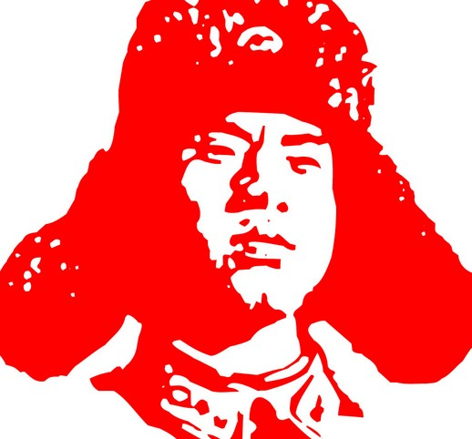
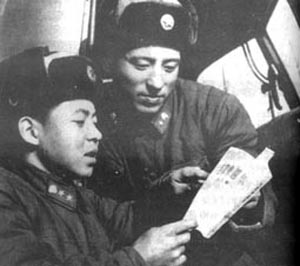

# “雷锋”的倒掉和公德话语重建

** **

从雷锋事迹真实性被质疑开始，“雷锋”的这个符号开始倒掉了。曾经圣洁高尚的雷锋，一个中国式英雄，如今也成为了被众网友调侃的对象。而且雷锋也是被捧得越高，摔得越惨。

今天上海还下着持续了不知道多久的小雨，我骑车经过学校侧门外的一个路口时，看见很多学生穿着统一的红马甲，冒着小雨举着牌子在喊着口号，走近了才听到，喊的是：“新风尚，过马路请等绿灯。”这个路口因为位于学校两个校区之间，所以有大量的学生经过，平时不看红绿灯乱穿马路的很多，今天因为这群一看就是学生会或者团委组织的傻逼呵呵的大一大二的志愿者在扯着嗓子喊，路口的秩序井然了很多。等我进了图书馆，瞥到电梯里贴了个小贴纸，上面画了个很可爱的小孩戴着雷锋帽，旁边写着：“新‘锋’尚，不占座。”“锋”尚，原来这是一系列的学雷锋活动啊。

可是这与我们原先理解的学雷锋的主旨有所不同，这些学雷锋的活动，着力点已经不是扶老奶奶过马路和捡大粪这样的奉献精神。不闯红灯，不在图书馆占座，涉及的是基本的社会公德。学习雷锋，要求怎么越来越低了啊。

雷锋符号的倒掉，背后是官方打造的道德话语体系的破产。在官方创造了雷锋这个符号和雷锋精神这套道德话语体系以后，它的内涵就不断在变化。基本上宣讲者不断地重新解读，是与雷锋精神的原旨越来越远的。到了现在，雷锋精神的“高尚度”已经开始跟社会公认的基本道德相当了。而遵守基本公德，不需要跟雷锋学。在没有大粪可以捡的今天，“学雷锋”已经没有意义了。雷锋成了官方手里的烂牌，因为实在没有别的好牌，只好不断地打。

官方的道德话语体系，也是意识形态体系的一部分。改革开放以后，在社会主义原旨意识形态体系自身不断调整的情况下，道德话语也配合调整。但在意识形态体系本身都已经是泥菩萨过河的情况下，道德话语体系想求自保也已经很难了。我们可以看到官方最近的努力，比如八荣八耻的提出，已经基本不起任何教化的作用。而在构建和谐社会的大方针下，企图再将“以和为贵”的儒家传统道德思想资源空降当下，也已经无处着陆。传统结构之皮不存，传统礼俗之毛焉附？

雷锋已经被黑出翔来，官方道德话语体系也已倒塌。本来一个社会的成熟道德话语体系，就不该由政府来打造，而是由社会内生，社会成员通过社会化的途径认知这些话语，内化这些准则。可讲到这里，真正的问题被引出来了，我们真的在遭遇道德危机了，不靠党，不靠政府，又没有传统礼教或者全民宗教的道德资源继承，与我们社会相适应的道德话语从哪里来，道德危机何解？道德危机何来，道德危机何解，都是说来话长的大问题，在此尽善解答，力有不逮。这里我想提出一两点线索，也许可以帮助我们找到些思路。

道德话语体系，也就是价值观体系，毕竟是道德行为规范的体现。我们现在还是有一个基本的道德行为规范框架的，只是这个框架一直在秀下限。而这个道德体系相应的有效话语体系，是一个官方话语、传统话语和外来话语的混合体。当然，有人会期望，我们完全学了西方那一套，说得好听点就是让普世价值的光芒照亮中国。可是现如今这种话语上的不相融，体现的就是行为规则上的不相融。普世是人人期盼的美好结果，但我不相信天堂里会有中国人的位置。中国人在慢慢从枷锁中解放出来走向自由时，同时也在慢慢释放着乡土性和边缘性的社会性格所具有的恶习。

我们想要找的是一种内生的过程，这更要求我们从本地和日常生活中去发现。比如我就发现了一个。你们认识上海人吗？抛去成见，我不得不承认，上海人是中国最有市民性和最具公德修为的人群。有次和两个上海朋友（石三和小和尚）在某地（为了避免地域黑的嫌疑）火车站等出租车，本来还隐隐约约有个队，可是后来又来了一批乘客，都插到队前去，气得一个排在我们前面很久的小姑娘破口大骂：“你们有没有素质！”可是这些插队的没一个鸟她。我和他们两个谈笑说：这要是在上海，出来两个上海阿姨，“乡下人排队都不会排”这么一骂，保准没人敢插队了。在上海，我们这些硬盘每天都过得战战兢兢，生怕哪里秩序没遵守好被骂外地人拎不清。“上海人”，就意味着一种行为方式，一种道德，在谴责不道德行为时，说他们是“外地人”比说他们没素质、不学雷锋、不“克己复礼”都有用。“上海人”和“外地人”这一套话语体系，有很大的偏见的成分在，可事实上确实在某种程度上扮演了上海城市里的道德话语体系。而关键是，这套话语体系是自发生成的。官方从来没有将某日设为“学上海人日”，但是上海人都内化了这些规则，外地人都学得很快，并且都共同认同这套话语体系。

“上海人”的形成，不是一个短时间的过程，而且这个过程中有很多因素是上海特有的，不适合全国人学习。我们不能据此概括出具有上海的某种特质就有了形成“上海人”的充分条件。而全国人都爱嘲笑上海人，除了上海人确实有些自以为是以外，这其实还是传统对现代化的反动。这只是给我们一种启示就是，在你关注的那些传统叙事方式之外，社会在暗地里生长，也许拨开表面的才能看到内里的实质。这还给我们的启示就是，不管道德危机何解，请“雷锋”不要再来帮倒忙了。

 

（采编：麦静；责编：麦静）

 
