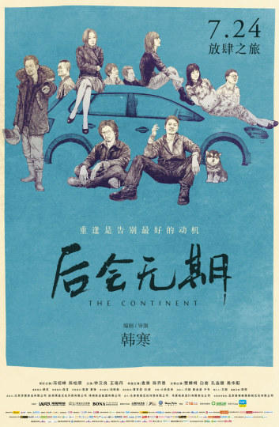

# 《后会无期》：让作家来教教中国导演做人

###片子怎么样?### 

《后会无期》这部片子，从前期宣传来看，内容是比较神秘的，一首朴树演唱的《平凡之路》MV点击量反而比本片的任何一版预告片都要多，而配以歌曲的MV画面，则只是简单的远景行车，以及偶尔点缀于其中的歌词，没有丝毫对影片剧情的透露。

这种情况下，我对片子的质量是持担心态度的。因为根据《小苹果》留下的教训，当一部片的主题曲MV点击量超过它任何一版预告片的时候，大概也就是观众该开始担心影片质量的时候了。而“被自己的朋友认为是影评人”也是一件比较尴尬的事情，因为这样会让你负起一个“院线侦察兵”的责任——成了社会现象的电影，大家会希望从你这里得到他们信任的看法，即使这些电影并不是你原初想要看的。

因此，为了告诉其他人该不该在这部电影上花钱，我便首先在这部电影上花了钱。

韩寒的书我是一部也没有读过的，这也给了我一个从纯电影角度去评价这部电影的能力。当影院散场时，我觉得我看完了一部华语片中很难，甚至无法被归为“烂片”的电影——相信我，在如今的华语片市场里，这个评价非常高。

整部片采用标准的公路片套路，两位主人公在公路旅行中遇到各式形形色色的人与事，最终二人完成了对待世界和自我态度的转变。许多观众因为观影计划比较延后，一再提醒朋友“不要剧透”，但实际上《后》——和许多公路片一样——正是属于那种“不怕剧透”的电影。观影过后的人也很难三言两语将情节概括清楚，究其原因，还是因为本片没有如同诸多国产主流院线电影一样，以大情节（主人公与外界的冲突）充斥全片，而是以细水长流的小情节（主人公与内心观念的冲突）来完成主角一步步的蜕变。其情怀，显然不像剧情一样是可以用三言两语概括完毕的。整部电影在确保技术水平的同时，把故事和情感也做到了一个很高的水平：情节不低俗，情感不虚假，一个讨论梦想的故事可以慢慢变成拷问梦想的故事，一颗卫星可以变成承载主人公理念的情感高潮。整部片的移情效果并没有被时不时的插科打诨消解。整个片子除了开头的“阳光沙滩”和“油布盖人”两个笑点略显低级以外，其余的笑点都稳居平均线以上，道具元素也时时处处服务于叙事。抱着看看“它比小时代好多少”心态进电影院的观众会慢慢忘记初衷，而开始注意“它究竟有多好”。整个故事不至于让人拍案叫绝，但确实能细细回味。

当然，缺点也是有的，公路片特有的松散形式很容易让看惯了一段式叙事的观众摸不着头脑——用小学生的话描述就是“总结不出中心思想”；经过精雕细琢的“经典台词”在其脱口而出时仿佛略与周围环境格格不入；客串而来的贾樟柯，除了展现自己不敢恭维的台词功底以外，似乎也没有什么特别的用处。

本片在我看来，是属于瑕不掩瑜一类的电影，但对于那些阅毕电影并给予差评的人，我当然也不会劈头盖脸进行审美批判——在我的经验中，让别人给差评改口是几乎不可能发生的事情——只能做我所做的，从制作和叙事技法上证明本片的价值。我对《后会无期》的评价是：类型片中的成熟电影，商业化中的良心电影，作家导演的模范电影。和全片最终完成的实际效果相比，不管是朴树的《平凡之路》还是贾樟柯、白客客串这些营销噱头，也全都会在其硬质量前黯然失色。

###良心该在哪?###

郭敬明决定拍电影比韩寒要早，而且凭借自己的一套营销手法赚得盆满钵满。因此当韩寒声称自己打算拍《后会无期》时，批判他的最简单理由就变成了“你竟然（跟他妈的郭敬明一样）跟风圈钱？”进而“韩寒=郭敬明”、“后会无期=小时代”这种偏见就伴随着乱拳打死老师傅的快感占据了网民的舆论的一席之地，即使彼时电影还没有上映。这种先把人推上道德制高点再一脚踹下取而代之的想法，是非常不健康，同时也是非常广泛流传的现象。

良心，在电影产业，是一个虚无缥缈的词。因为它不会干扰到大多数电影人心目中电影产业最重要的一环：钱——甚至留着它在特定场合还会干扰到赚钱。钱是电影产业最重要的元素之一，这我并不反对，甚至还要用我说过一万遍的话再为这种理念摇旗呐喊一遍：电影不同于六大传统艺术，是一种需要高技术、，高投资创作并且有着回本需求的新兴艺术，历史上试图将电影的商业属性从其艺术属性剥离的电影运动全都无一例外地失败了。因此，靠大部分娱乐片的资本积累去满足小部分非娱乐片的艺术探索，再以艺术探索的结果反哺娱乐片，使其具有更高端、更深刻的娱乐价值，是目前公认的电影产业发展唯一健康之路。

那么难道可以说电影的娱乐性（a.k.a.“商业性”）和电影的艺术性说到底是相辅相成的，不存在任何矛盾？这话从写出（可能是）流传最广的《小时代》批判文章的作者口中说出来，怕是重重地打了脸吧？

事实上，二者还真的存在一个矛盾。

如果说“赚钱的电影就是好电影”或进而得出“赚钱是电影价值的唯一衡量标准”，那么全世界停止所有电影艺术创作，开始在电影院大放A片显然是最好的。同样的道理，商人在电影作品上通过粗制滥造，降低故事和技术的精致程度来牟利事实上被证明是电影的艺术性和商业性现存的唯一矛盾，因为这种行为实际上消解了二者互助最根本的目的：娱乐性艺术性的双重进步。解决这个矛盾最大程度上依赖的是优胜劣汰的市场，即能将审美反映在票房——尤其是对续集的不友善——上的观众，有了懂得“用钱投票”的观众，市场才能优胜劣汰，而不是反其道而行之。

郭显然是算准了国内这种观众是九牛一毛，所以才敢以一部大部分方面都不及格的电影圈钱。认真看电影的观众不会喜欢他，认真做电影的业内人士更不会喜欢他。

我之前的文章里批判过《小时代》、《西游降魔篇》音效处理不及格，得到了部分懂行人士的认同和更多盲目观众“哪有人会在意这个”的反击。经过之后的调查和验证，我发现了一个规律：一部影视作品，甚至学生作品，如果有制作上的疏漏，则一般都是从音效处理上开始的。因为花大工夫把音效做得好常常也不会提升观众对一部电影的评价，粗制滥造观众也难以辨别——比如你花50万元去制作一部电影的音效，在一帮不在乎电影音效的观众中，票房反馈几乎为零。但同样50万元去雇佣网络水军进行病毒营销，在一帮易轻信的观众中就能获得可观的回报。想要搞懂中国市场， “为什么中国电影普遍不注重音效制作”是不可绕过的一环。

但音效上粗制滥造的状况在《后会无期》里并没有出现。

《后》请了国内顶尖的声林音效有限公司来负责音效制作。全片的音效在我听来是不存在问题的 （但我并不会因为它做到了及格而夸奖它），值得夸奖的地方是它在及格之外所做的很多尝试——宾馆戏里的面包机，温水煮青蛙戏中的锅盖等音效，都无缝地与戏中人的主观情感联系了起来，共同参与气氛塑造。而台球厅戏里的游戏机，和厕所戏中的马桶水箱，更是主动参与了音效的独立叙事，整体效果可圈可点，在音效疲软的中国电影中，则更是鹤立鸡群。

良心是虚无缥缈的，因为在无法优胜劣汰的大市场里，它无法给其持有者带来经济收入。但正因为这样，那些仍以优胜劣汰标准要求自己的作者，才配被称为业界的良心。

而这也是我起这个文章题目的原因：业内许多导演选择忽略的元素，被一个作家捡了起来；业内许多导演讲不好的故事，一个作家讲出了情与趣；业内许多导演如鱼得水的市场缺陷，一个作家选择了用优质的作品去抵制。

因此业内许多导演，怕是真的要跟这个作家学学做事，甚至做人。

(采编：朱燚；责编：刘铮；)