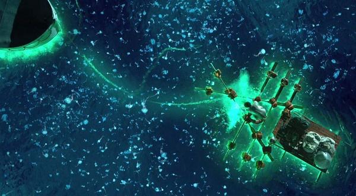

# 《少年派的奇幻漂流》的哲学解读： 一部人与人类信仰的奇遇记

看完电影的第一时间，我突然想起了精神分析中那个著名的心理测验：有一个年轻人去旅行，他带了五个动物，分别是：狮子、猴子、马、牛、羊。在他途经沙漠时，不幸被沙尘暴吹走了所有的粮食，此时他急需要杀死动物来获取食物，那他杀动物的先后顺序是什么？在这一测试中狮子代表了爱情，猴子代表孩子，马代表事业，牛代表父母，羊代表配偶。

李安的这部电影的主题当然不只是寓意深刻的精神分析，也不仅仅是通过那美轮美奂的3D效果而显示出的人与自然的神奇交响乐。所以，如果Pi的第二个版本的故事没出现，这部电影只能称之为精致，却格局不大，充其量是海洋版《荒岛求生》、人虎版《泰坦尼克号》、印度版的《鲁滨孙漂流记》，而在Pi讲述完第二个版本的故事后，电影情节急转直下，人物故事豁然明朗，草蛇灰线全部浮出水面，好比观众品了甘醇的酒，潜伏的酒劲此刻终于上脑，大家直呼后劲十足畅快过瘾。这部电影的叙述风格和艺术效果在我眼里像极了美国作家福克纳的短篇小说《纪念爱米丽的一朵玫瑰花》：直到最后一刻你才从作者精心构造的迷宫里走了出来，真相恍然大悟，你却意犹未尽。

没错，Pi的第一个版本的故事是Pi自己虚构出来的，而第二个版本才是真实发生的一切，而正是这两个版本的冲突与一致，使得《少年派的奇幻漂流》充满了复杂深刻的哲学解读。这里面出现的哲学元素有：理性、欲望、宗教、克尔凯郭尔宗教的人、弗洛伊德的自我本我、科学、人的本质……

如果，从第一个版本的故事层面解读这部电影，这又是李安讲的一个关于孤独的情感故事。大多数人都感觉李安的故事细致缠绵，缓缓而来，但却容易忽视他所有的故事都有一个极为相似的背景：孤独；《断背山》里两个粗鲁又细腻的牛仔在贫苦质朴的断背山牧场里放牧，远离人类文明，日子孤苦无聊，现实社会的历史经济背景早已湮没在断背山的暮色与山峦中，一切于是就那么自然的发生，两人相爱；《色戒》里菜鸟间谍王佳芝本欲刺杀汉奸易先生，却对易先生因性生情，最后刺杀失败，身份暴漏，丢了性命。尽管影片是抗日的大背景，但王佳芝由于被易先生金屋藏娇，自己的对自己间谍身份越来越感到模糊，抗日背景渐渐被抽去，女刺客在孤独的极端环境下爱上了自己的行动目标。

《少年派的奇幻漂流》里在不太平的太平洋上，一人一虎孤苦相依，敌对却又共存。

三个故事的大背景都极为重要，但在极端的小故事背景下却显得微不足道，人性的复杂在极端的小背景下被无限放大激化。于是，有且只有李安能够细细琢磨打磨这份关于这份孤独的故事，当然，这一切和李安的经历不无关系。李安当年蛰伏多年，在家做饭带孩子，他曾忍受着事业的默默无声，忍受着亲朋的不理解——一个男人竟靠女人养。这份孤独带给李安莫大的痛苦和压力，却在另一层面不自觉地带给他孤独的甜蜜来，一份在孤独中开出的花儿。终日混迹于熙熙攘攘的人，是没有功力拍出一部精致的深刻的关于孤独的电影来的。同样，情感粗犷的观众有的仅仅被这份故事轻微地搔了一把痒，而另外一些或曾排斥或曾享受过孤独的人却敏感地感同身受，唏嘘不已。

好了，我们言归正传，多种哲学角度拆解下这部电影的象征意义吧：

少年的Pi信奉多种宗教，他的父亲曾一语道破：什么都信等于什么都不信。此时的Pi貌似是宗教信徒，但严格意义上讲，他不是宗教信徒。他不过是看似虔诚却又一无所知循规蹈矩的人。在哲学家克尔凯郭尔眼里，这些人说到底不过是遵循着教规和仪式的伦理阶段的人，而宗教阶段的人，都是体验着人生的莫大痛苦，当痛苦到生活对他毫无意义，上帝就会降临。真正宗教的人，是“信仰骑士”，惟有信仰才能在荒诞偶然的存在中，仰天大呼：“啊，请赐予我力量吧！”。在Pi遭遇了海上的一系列磨难后，他从理性的人变成非理性的个体，他的内心生活痛苦神秘，终于，当生活对他而言什么都不是的时候，另外一个意思上的神终于出现，Pi最终获救并成为一个真正意义上宗教的人。电影里少年的Pi吃饭时会祷告，中年Pi吃饭还在祈祷，这份祈祷和信仰却经历了否定之否定的一次升华。

在电影中，猩猩代表着着：Pi的母亲 （有个镜头专门给猩猩乳房一个特写，猩猩是母的）；斑马代表着：船上吃肉汁拌饭的水手；豺狗代表着：凶狠的厨子；老虎代表着：Pi的欲望、人性的恶、无理性无道德的本我；食人岛代表着：宗教的看似完美的彼岸世界。

在影片里这个宗教的彼岸世界特指的是印度教。食人岛是印度神毗湿奴的化身，在印度神话中，世界早期只有一望无际的大海，毗湿奴肚脐中长出了莲花，莲花孕育了梵天，梵天创造出世界。片中的小岛是浮在海面上的孤岛，而小岛的形状是躺在大海上的毗湿奴。Pi童年时，Pi的父亲带他与哥哥一起参加看宗教祭祀活动，父亲曾指着毗湿奴语重心长地对Pi讲：“有些东西看似繁华绚丽，实则是虚幻。”另外，Pi少年时曾跟踪他暗恋的那个跳印度宗教舞蹈的女孩，被心上人逮到后，仓皇之中Pi为了掩饰尴尬，询问女孩舞蹈中莲花的手势，以及莲花怎么在森林里，Pi举家移民加拿大和女孩告别时，女孩送了Pi一根手绳，而Pi在上了食人岛后就将手绳系在一棵大树上。于是，我们抽丝剥茧，食人岛的象征涵义逐渐清晰：

当Pi和老虎在大海上将死不活时，他们遇见了这个救命般的充满生机和绿意的小岛。小岛看似完美无瑕，有无数份满足老虎的口粮——狐獴、食用类植物、淡水天池。Pi欣喜若狂地以为自己找到了人间乐土，于是将女朋友送的手绳绑在树上，决定在此安顿。晚上，意想不到的事情发生，狐獴上树老虎上船，天池的水夜间泛酸腐蚀鱼类，而Pi打开一株像极了女朋友嘴里森林里的莲花时，莲花却包裹着一颗人类的牙齿。真相大白：小岛白天是天堂，夜间是食人地狱。宗教所谓的极乐世界根本不存在，绮丽的梦终归是虚幻，于是Pi带着老虎再次起航。（食人岛上的狐獴我感觉像是在象征着古往今来无数前仆后继的，受苦受难却麻木的印度教信徒，狐獴很多，多的已经消失了独特性和唯一性，老虎随口就是一只狐獴，狐獴却麻木地压根不知道逃跑。好吧，我承认这有过度诠释之嫌。）

当然电影里对宗教看似不敬的细节很多，Pi早期信仰基督教不过是和哥哥打赌敢不敢喝圣水。这样看起来，李安貌似是在某种意义上反宗教，实则李安是反宗教的宗教，反信仰的信仰。因为，电影结尾处，一个对于宗教无可无不可的信徒，尽管已经知道彼岸的极乐世界不复存在，但却在磨得九九八十一难后取得信仰的真经来。

电影中，Pi与老虎在海面上敌对又共存这一段，Pi其实就是老虎。这一个故事可以有多种哲学解读，比方说Pi代表着人的理性，老虎代表着欲望与恶；我们也可以用弗洛伊德的理论，Pi代表理性与常识的自我，老虎代表无道德无理性的本我，当人类恶的化身豺狗厨子吃掉斑马水手，杀死Pi的猩猩母亲后，Pi心中的恶被无限激发，他杀死厨子也吃了厨子。在此之前，Pi是一个非常善良的人类个体，影片中曾讲到过他小时候曾伸手喂老虎吃肉。而这之后，Pi的兽性以绝对优势地压倒了人性。但当Pi踏上陆地终于获救的那一刻，老虎头也不回的跑进了山林，这寓意着回到正常的人类社会，Pi心中的兽性也随之消失，他的理性回归，本我再次复活。那人的本质究竟是什么？善？恶？理性？欲望？我想李安试图告诉大家：人的本质不是善恶，人性中善与恶，理性与欲望并存，在某种关系下理性凸显，在某种关系下恶复活。马克思说：“人的本质不是单个人的所固有的抽象物，在其现实性上，是一切社会关系的总和。”人的本质，不过是那一系列关系罢了。

在片中，Pi与老虎，或者说人类的理性与恶经历了多个阶段：

一、童年时的Pi意识不到老虎是恶，Pi此时还不代表理性。因为对于Pi而言，一个尚未接受人类教化的儿童身上自然性仍然占据主导，理性尚不显露。之后，Pi的父亲教育Pi，人类文明的痕迹在Pi身上越来越明显，Pi趋向于一个理性的人。

二：救生船上， Pi扔下救生圈准备救漂浮物，却发现是老虎后，并不打算救老虎，于是片中出现Pi拿起船上的竿子打老虎，老虎却借助竿子的力量自己跃上了船。此时，理性对于恶是十分戒备的，理性拒绝着恶。

三：当猩猩斑马豺狗都死去后，老虎曾一度掉下水，Pi打算用锤子阻止老虎上船，却不忍下手，最终拆下船上的木板救老虎上船。此时，理性与恶的界限开始模糊，理性与恶开始共存。

四：Pi借助在动物园学习到的本领试图驯服老虎，理性控制驯服恶。

五：暴风雨后，老虎奄奄一息，Pi也穷途末路，Pi抱起老虎轻轻安慰，此时，理性与恶相互依赖，共生共存，密不可分。

六：上岸后，老虎离去，恶、欲望、兽性在人类的文明社会是被压制和掩饰的，Pi的理性回归，但是这个理性早已不是受人类文明教化的理性，所以Pi会为老虎的离去而伤心无比。

总体而言，Pi与老虎，理性与恶经历了：无界限——界限——敌对——共存——驯服——依赖

电影中有几个片段意味深长：

轮船遇到海难，船上的动物四处逃窜，Pi曾大声质疑：谁打开了动物的笼子？其实并没有人打开额笼子，当人类遇到危险，体内的动物本能或者说体内的恶自觉地从理性与自我的掩盖下逃逸出来。

在海上漂流的救生船上，闪电暴雨等瑰丽神秘的自然奇观曾吓坏了老虎，动物性在自然面前是低头的，动物性理解把握不了自然，Pi尽管了解这些自然奇观，但依旧为之倾倒。人类借助科学可以征服自然，但科学史不过二三百年，它尚未解释清楚一切自然现象和规律，对于我们不能解释的，我们要心怀敬畏。而Pi最后的宗教信仰也来源于经历了奇幻漂流之后对自然万物的敬畏，对人类微不足道又无能为力的悲悯。

当暴风雨中Pi的求生手册兼日记本被吹跑后，Pi和老虎的关系开始从敌对紧张走向依存共生，求生手册以及上面的文字代表着人类的文明和常识，求生手册提醒着Pi他是人，老虎是兽，而求生手册的的消失，人类文明的痕迹越来越模糊，人与兽的界限不清不楚，在此时，人就是兽，兽就是人。

中年的Pi有家庭子女，Pi此时是人类社会中最普通的个体，个体在类中再次获得本质。

电影结尾处，Pi询问记者更喜欢哪个故事，记者回答说第一个版本，保险公司的日本代表尽管十分怀疑第一版本的真实性，却最终在报纸上刊登出了第一个版本，两个版本孰真孰假已经无关紧要，版本的对立消弭于看似不可一世的人与科学的无能为力中。

至此，《少年派的奇幻漂流》完成了两大哲学主题：

理性的人——非理性的人——理性的人；

信仰的存在——信仰的迷失破灭——信仰的重建；

在这次奇幻漂流中，人与人类的信仰遭遇了一次奇遇，完成了一次升华。

#### PS:

电影中很多细节的摹写凭借着记忆，难免有失误之处，欢迎大家批评指正。

解读体现着解读者本人的世界观，故而每个人的解读不尽相同，希望本文能为大家提供一个观影角度。

1：关于版本的选择。很多同学留言说感觉第一个版本的故事才是真的，其实选择哪一个版本并不重要，因为电影并没有明确交代，而开放式结尾提供给观众无限的遐想，再通过线索整合分析推理得出结论罢了。李安在访谈中也表示自己更倾向于第一个版本，通过第一个版本可以表达人类是如何慢慢失去纯真的。我想李安是不会在公开场合表达自己倾向于第二个版本，因为这部片子的大多数观影者还是西方的观众，第二个故事不自觉地在有某种意义上存在着对宗教的不敬，承认Pi经历了奇幻漂流之后的信仰更加纯粹更加彻底，那无疑在说Pi之前是宗教的局外人（有观众看到片中pi在选择了3个宗教后，出现了加缪《局外人》这个镜头），信仰于pi是可有可无，循规蹈矩。而李安无论如何也不会这样去得罪西方观众的。

观众也可以不选择，两个版本正是对世界的两种解读，而选择哪个版本，又意味着观众在镜中映出了自己的立场世界观价值选择而已。但无论如何，选择第一版本，要知道还有第二个故事的存在。

2：关于食人岛到底是pi母亲的尸体还是毗湿奴？我个人更倾向于毗湿奴，电影中的任何物件的象征意义应该就是一个，猩猩已经象征着母亲了，小岛应该不会浪费，又再次象征着母亲。另外，如果食人岛是母亲的尸体，那影片中关于毗湿奴的镜头，以及Pi女朋友跳宗教舞蹈，Pi询问莲花，森林，以及手绳的镜头就毫无意义了。在印度教中莲花就是毗湿奴的武器，毗湿奴的肚脐眼里长出了莲花，小岛的天池与其说是尸体的胃酸，不如说是毗湿奴的肚脐眼。

小岛是肉体没错，小岛浮游在海面，植物盘根错节形成岛面，Pi食用的植物也像极了血管肉体，而这一切却更能体现出小岛象征着毗湿奴。小岛为Pi供给了养料，宗教也为人们提供了庇护和温暖，然而宗教看似完美的彼岸世界并不完美，现实世界充满了罪恶压榨人吃人，而宗教的彼岸世界也不过是另外一个“人吃人”的世界。

老虎上岸后的离去，并不是理性战胜并压倒恶与欲望，若是这样，pi就不会为老虎的离去而伤心了。片中也精巧地安排老虎是隐入丛林，因为回归人类社会，人类之间的交往法则还是理性，恶必须被掩盖压制隐藏，但Pi经历了磨难，早已接受了恶与欲望，并深深依赖于他，所以，才有Pi后来更加纯粹的信仰。

 

（采编：孙梦予；责编：应鹏华）

 
