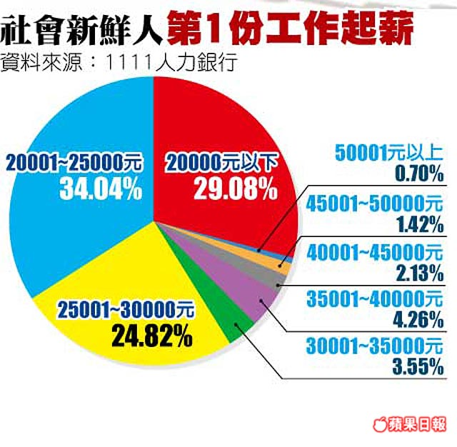

# 「22K」的錯置──談Mr. Jamie「偽議題」一文

本版本為【第二A版】，新增了技術更新和新資訊，2013年1月29日

**1.**

這幾天在《商業週刊》上，讀到了林之晨先生的〈[22K 根本是個偽議題](http://mrjamie.cc/2013/01/15/22k/)〉一文。

它主要的觀點可以囊括成「假如你不想當一碗50元的紅豆冰，那你要做的，不應該是要求政府將基本售價調整到100元，而是應該讓自己成為一碗160元的芒果冰。認識到這一點，加以發揮，你就贏了。因此『22K』的議題性並不存在。」：

紅豆冰就是紅豆冰，無論如何它就不是芒果冰，如果你想要賣 160 元，那就得想辦法變成芒果冰。政府當然可以統一規定全台灣紅豆冰一碗至少都要賣 100 元，但那沒有幫助，因為人們可以非常簡單的忽略你的紅豆冰，走到下一攤去吃芒果冰 — 況且當紅豆冰都要 100 塊，那只會讓芒果冰的 160 看起來特別划算。

[…] 

所以重點根本不是 22K，重點是年輕人，既然你的政府、你的學校已經誤了你，你該用什麼方法，找到願意教你的師父，花 1 萬個小時跟他學習，最後變成炙手可熱，有超強戰力的人才。那時什麼 22K，花 100K 也不一定請得動你。

我想透過本文，來批評這種隨處可見、隨手寫至的過度簡化問題的說法，並揭出其危險與隱含的問題。

**一、對議題的誤解**

**2.**

首先要釐清的是，「要求調漲基本工資」只是一個手段，它的基本態度在於「向雇主要求更好的待遇及福利」。

這是一個社會議題，它的重點在於去反應一種不對等的勞資關係──「要求調漲基本工資」，是屬於「要求合理待遇」的一部分，而不是全部。合理待遇必須要在兩方面來加以考慮，一個是勞工的生產力和能力、一個則是攀升的物價房價等生活門檻。這部份的合理初步看來會帶有某些主觀的性質，關於此處的討論可參考我的〈工會與合法罷工〉一文。

「22K」議題起源於「大專畢業生至企業職場實習方案」所造成的一批無地位的廉價大學實習生的怒吼。後來又泛指台灣的某種廉價勞工問題，如林之晨先生在這篇文章中所理解的那樣。

但林之晨先生對他批為偽議題的「22K」議題，卻有著兩個主要的錯置：

**一、「22K」不只是一個勞工權益與個人的生涯發展問題，他更是一個「新進勞工的整體權益」問題。新進勞工的整體權益，必須透過爭取，而非競爭。**

**二、「22K」不是個人困境，而是社會議題。**

為什麼新進勞工的權益，必須要透過「要求雇主提供更好的待遇及福利」去爭取來，而不是像林之晨先生說的：「讓自己成為更有價值的員工」？

**3 .為什麼必須「爭取」**

我先來舉出所謂「22K」議題（廣義的）所指稱的現象：

台灣如今乃是一個大學生比例超過61%的社會，如我們所見，造成許多雇主將大學（甚至好大學）學歷看成基本門檻或是篩選條件，卻依照「基本工資」或僵固的「一般行情」來制定薪資。

這個現象可粗略地拆解成以下兩個現象，來看看為什麼勞工權益無法透過個人能力提昇與市場協調而自然順利地取得。

**3.1 現象一（此循環造成現象二的困局）：**青年人為了取得「（好）學歷」作為基本門檻，被迫要付出過高成本（四年大學教育、25萬至50萬不等的學費）來訓練自己成為企業並不一定需要的人才（如我們看到的、林之晨先生也點出的）。

雖然即使並不是所有企業都要求「（好）大學學歷」，但當社會普遍瀰漫著這種思維時，青年人不願意甘冒風險而自願接受大學教育，又使得「大學生」的比例依然居高不下，再度回來維繫了這門檻的合理性，而造成了「大學比例─大學學歷作為徵才門檻」的返復循環。

大學教育作為職業先備教育的最大問題，就是在許多企業眼裡，這些新進員工往往不備有實務上的專業：大學生是被當成「大學生」看待，而非「專業」看待。即使有極少數的大學生，被認為具有相當好的專業素養（我不太相信這裡沒有教育資源分配的問題），但是大多數的大學生，作為「社會新進勞工」，基本上還是被看成是「有待訓練」的勞工。

當這是台灣大學生普遍作為「社會新進勞工」的現況與處境時，大學生，大部分沒有實務專業也沒有工作經歷，難以具有向老闆「要求更多權益」的條件。他在有能力談條件以前，便已經因為擔憂失業而簽下契約；台灣的工會又是如此不盛行，使新進勞工就只得接受當初所定下的契約與安排。

因此會變成什麼樣子？

**3.2 現象二（一個賽局：新進勞工們 v.s. 老闆們）：**以上現象，將使由於物價上漲，本來應該要可以賣到60至100元不等的紅豆冰，也因為依賴過去的路徑而被賤賣到剩下50元。如果新鮮人不爽、不接受，也沒辦法，因為其他間公司也是用同樣的估價在等你入籠。這是「22k」議題最關鍵的核心所在，你要說它是一個「偽議題」，你要說「這個現象並沒有發生」──這是我認為林之晨先生「錯置議題」的最主要理由。

我將此現象的僵固性用一個賽局加以展示：

1. 事實是，無論物價如何飛漲，當潛在的勞動力充裕的時候，所有公司都已經用50元䀻到了他們需要的大學生（作為非專業或半專業人才填補公司職缺）。他們即使認為自己領太少、即使前方看不到未來，他們還是願意接受工作，因為他們不敢冒風險去期待下一份遙遙無期的工作，而寧可姑且接受，也因為他們需要工作經驗，也需要一份穩定的薪水。

2. 在其他間公司對這種人力（作為非專業或半專業人才填補公司職缺）成本的估價是50元時，你選擇用100元去聘僱同樣的員工，是不合理的。這等於是讓公司的勞動力成本上升，拱手讓出公司的競爭力。

3. 因此，所有老闆用「較低的估價」去「聘請員工」，是一個賽局的均衡。意思就是：當其他老闆都這樣搞的時候，你不這樣搞是不合理的。

因此，為什麼「22K」議題總包括「要求提高基本工資」這項要求？就是因為想依照台灣社會的新進勞工現況，想去改變這個賽局。

3.3

因此，由於這兩個現象一個是循環的、一個則是均衡的，堅強地說明了，要透過自然協調來改善新進勞工的權益是難以期待的。

在談「『22K』不是個案，而是社會議題」這一點誤解以前，我先用一章談談本文中的一個詭異現象。

**二、詭異的思路**

**4.**

在林之晨先生所理解的「勞動市場模型」中，存在著一個奇怪的經濟學架構：當紅豆冰從一碗50元變成了100元，漲了50元、漲幅達到一倍，但芒果冰最終還是一碗160元。他寫：

政府當然可以統一規定全台灣紅豆冰一碗至少都要賣 100 元，但那沒有幫助，因為人們可以非常簡單的忽略你的紅豆冰，走到下一攤去吃芒果冰 — 況且當紅豆冰都要 100 塊，那只會讓芒果冰的 160 看起來特別划算。

假如紅豆冰一碗100元，使得芒果冰看起來「特別划算」，那麼認為自己是芒果冰的，為什麼不會趁機把自己賣貴一點來獲得他應得的利益呢？而老闆如果想要芒果冰，當他發現紅豆冰變貴的時候，為什麼不開更高的價錢，來確保自己能從比較多的冰品裡做選擇，確保自己買到的確實是芒果冰而不是其他呢？

這種事情會發生嗎？假如會的話，怎麼解釋？

照作者的「冰店比喻」的理路去理解的話，有兩個可疑的地方：

**第一疑點：**這種一個市場內部的各種商品之間毫無關係的、一切資訊都是清楚且公開的情況，就像所有勞工都是已安上價目表、成份表的排列好的物件。但是這種像是「打電動」的情況，完全不是現實的。這個架構的現實性，恐怕是有問題的。

**第二疑點：**好吧，不妨讓我們假定這架構是現實的。但這也就像是麵店裡面只有陽春麵漲價，其他的麵全都沒有漲價一樣。如果是這樣，就也說明了「原先的陽春麵就是賣得太便宜了」──這不反倒成了支持「調漲基本工資」的理由了嗎？那他提出這樣的段落，意義何在？

有人提醒我，第二個疑點中提到的經濟學推論是有問題的：因為「價格」將導致「需求」的減少，使得這個漲價的紅豆冰成了「沒人要購買的」；也有人質疑，就經濟學的構想來說，價格乃是一個經濟指標，反應的是供給和需求面的平衡，公平的意義是不存在的。我有兩點回應：一、「漲價」這回事，在勞工市場的意義上，它並不是由店家單方面決定的，而是「談判」出來的、「交易」出來的。並且，當老闆必須以更高的薪水聘任員工，他自然會去思考如何善用這些人力、如何精簡公司的行政、如何在滿足員工福利的基礎上去達到最大效益。這是22K所爭取的最本質的東西。二、「公平」的意義乃是在社會的檢視下所被提出的「反省」，它本來就不是經濟學的概念。它帶有部分的主觀性質，而且在純經濟學的模型與解釋中都會被刪去。這也是我為何主張「不要把純經濟學詮釋一廂情願地放入隨便的場景，即使他能輕易地解釋事實」，因為它刪去的用語正是人們與社會亟需面對困境和問題所在。我說：「能被解釋的並不是意味著是沒有問題的。」

如果冰的漲價導致了「滯銷」，這麼一來這個「漲價」便成了「過度爭取」，在這樣爭取的同時，公司基本上也會對此表達出嚴重抗議。這個「談不攏」、「讓步」、「協調」甚至「公司改革」，都是談判開始以後才有可能的。在這裡顯示出的待談判的爭議乃是：「假如『22k』是不公平的，那『幾k』才是公平的？」或是說「『22k』根本就是一個最合理的價格了。」這是一個偽議題嗎？最近有一個新成立的網站，叫做「揭露22K」，它的主要構想便是透過「opendata」的構想，來要求社會監督，這些技術公司所給的22k，在社會的檢視下，去反省是否是「不公平」的。

我無法理解這部分的推論和想法，但偏偏又是本文中扮演著重要角色的部分。不詭異嗎？

**三、「競爭」還是「抗爭」？**

**5.**

林之晨先生在這裡犯的一個最不可原諒的誤導，就是建立了把「22K」議題看成「當個人能力不符合老闆需求，個人必須要想辦法來解決」問題的論述。

它的錯誤在於：即使是「不合需求」使得你得領22K而別人可以領33K，也不是說就能期待透過「合乎需求」、「增加競爭力」來解決問題。

有兩個原因：

第一、「勞動市場」本身，就不是一個那麼像是「線上遊戲」的東西。

第二、「22K」議題不是「勞工個人的問題」，而是「社會問題」。

我在這裡便由兩個角度來探討這個錯誤：第一、對於新進勞工整體來說，等值兌換或許是不可能與不現實的；第二、競爭力的提昇只單單圖利了雇主，而且給雇主一個好的壓榨員工的理由。

**6. 等值兌換之不現實性** 首先，競爭力與薪資的關係，在新進勞工的角度來看，並不一定是等值兌換的關係，甚至就台灣現實來說，這個關係相當不切實際。我有三個理由：

一、資訊不完全：前述賽局顯示的是，在決定價格上，充滿著必然存在的風險考量與權力架構的問題：勞工不知道不接受這個薪資以後的整體市場概況以及其他老闆的決定，經常被迫簽下不情願的勞資契約。因為勞工本身不明白自己的價值、也不明白他人的價值，而只在他人對自己的估價之中尋找一個相對最好的選擇。只要開放出來的選擇沒有「更好」，他就永遠只能在有限的資訊和選項中進行選擇，但是這些選項（在潛在勞動力充裕的時候）卻總是在有利雇主的前提下提供出來的：雇主像是釣魚一樣在那裡等著，因此總是能開出他原先就能滿意的條件。

二、當前的架構不利勞工談判：如我先前所說的，勞工的權益必須自己爭取，但是當前的社會架構是完全不利勞工談判的，而「不利談判」也成了勞工權益不會上升的阻力之一。因此，提昇競爭力，就不像是打怪練等。即使你等級變高了、滿足老闆的需求了，也不保證你出社會時的薪資，就一定比別人更好。也就是說，當你花了許多努力，成為了芒果冰以後，你的履歷還是紅豆冰的履歷，你要怎麼突破這個困境？是否還是要乖乖的領一個非常鳥的薪水，然後開始累積所謂的「工作經歷」？

三、老闆正是想要便宜的紅豆冰：有什麼比「便宜好用的大學實習生」更符合只需人力和腦袋可供慢慢調教而不需專業的職缺、更符合老闆的這種需求呢？一個在本文中不斷被忽視的事實是：在前述的勞動市場中，降低自己的薪資，就是一種滿足老闆需求的作法。這種作法有可能增加薪資嗎？在這裡，便有一個「雇主需求優先原則」：當老闆打算拿22K出來買人才時，他要的本來就沒那麼多。否則為什麼會那麼多博士人才要跑去做不需要博士生就能做的工作、領非專業的薪水，甚至找不到工作？

**7. 圖利的只是雇主**

既然提昇個人的競爭力不一定擔保更高的薪水，整體的勞動力提昇更難使社會整體薪資上升。

何況，對於中小企業以及已不需要或已找到創發人才的公司來說，他只需要能夠維繫公司運作的勞工便已足夠了：他需要的是「足夠優秀的人才」，而不是「最優秀但太昂貴的人才」。

因為老闆必須為自己的最大利益進行考量，而對他而言並不存在著太大的調薪動機。唯一的可能動機在於「搶人才」，但如果自己的人才沒有變得更難搶，他為什麼需要發更高的薪水呢？

甚至，這種要勞工「先乖乖練功」的觀念，就也包含在某些公司在升遷制度上的不合理設計中。

當有些公司以「訓練幹部」為名，提出困難而且緩慢的升遷機制時，你也只能認栽，走往這條彼端茫茫的漫漫長路。但是在這條長路中，它總是可以給你一個藉口去接受一個「非專業的」、「低廉」的薪水。他拍拍你的肩說：「你還不是芒果冰，要加油喔。」

事實上，根本的問題可能就是公司管理人才不會用人或需要檢討。所謂「將帥無能，累死三軍」，為什麼不鼓勵透過抗爭來要求公司結構檢討、解決實質存在著的困難，而只是不斷去要求勞工去改變、認命、學習呢？相關討論，請參考我的〈給企業的「新公民」哲學建議〉一文。

我想，從這幾點看來，可以發現，林之晨先生的提議，既無法保證乖乖練功就能有所報酬、也無法保證整體勞工權益能夠獲得提昇，根本上只是要我們設法去討好老闆、要求勞工閉嘴乖乖練功的奴性的說詞。

或者是說，它所帶有的濃厚的「企業精神」──努力鍛鍊自己以讓自己符合社會吧，不必去改變它──對於社會發展幾乎看不出任何幫助，而只是不斷地在拉高競爭的標準和跨越「低階」的門檻。

最要命的是，這種奴性、這種「企業精神」根本上就限制了台灣勞工權益的抬頭，也壓抑了工會理念的發展。

**8 .一個臆測**

甚至，勞工權益的低落與工會理念的缺乏，或許才是台灣經濟難以突破瓶頸的關鍵因素。

如我在〈工會與合法罷工〉所說：

[…]工會擺明要為勞工爭取權益，但是這並不意味著工會就是在損傷公司的利益。怎麼說？我給兩個理由：

一、因為勞動力的最大值，必定是在工人心甘情願進行工作與創造的時候。爭取大多數勞工的合理報酬，其實能夠為公司帶來好處。這就是為何那些成功的大公司，不會吝嗇於給勞工更好的福利，又是為什麼GOOGLE願意花大錢蓋出漂亮、舒適的辦公室。你可以說：勞動力，也是一分錢一分貨，即使勞工素質並未改變。

二、因為公司是有可能安於現狀而不思改進的，只有當勞工願意去爭取更多的權益，才會讓公司有了更強的緊張來進行發展。因為當勞工不再廉價，公司便失去了廉價勞工作為競爭力來源。一個有展望的公司，它將考慮撥用一些員工福利來鼓勵員工進修或是參與會議，也有了更多的動力進行研發與改進品牌。當然，他可能一走了之，但台灣勞工要讓人明瞭，為什麼我們的勞工更值得用，不是因為便宜，而是因為素質。我們已經不可能再次用「代工」創造台灣奇蹟了。

今天網友分享的一篇《衛報》的文章 “_If you think we’re done with neoliberalism, think again_"，也提出了支持的觀點：

_The welfare bill approved by parliament last week will not help to clear the deficit or stimulate employment: it will reduce demand, suppressing economic recovery. The same goes for the capping of public sector pay. “Relearning some old lessons about fairness and participation," the UN says, “is the only way to eventually overcome the crisis and pursue a path of sustainable economic development."_

當然，這如今只是一個洞見，我還沒有一個好的論證來建立這個說法。

結語

**9**

「22K」是一個怎樣的議題？如我們所見，它是複雜而深刻的社會問題：產業結構、台灣中小企業結構、台灣教育結構、產學結構、工會與企業、勞工權益、民意啟蒙、政治與商業、全球化因素等等。

它有其複雜的面相，存在百般糾結的問題、關聯到百轉千迴的因果。

這是我們所在的社會，是我們發展中的公民社會與經濟互動。這是我們「整個社會」的學習過程、「經濟體與社會的發展過程」，不是某些人的「個人困境」。

它不是偽議題，確確實實地就擺在那裡。請正視它的存在。

照片摘自蘋果日報

* * *

編者注：

22K方案其源自於行政院為因應97年全球金融風暴，提出的「振興經濟擴大公共建設投資計畫」。立法院通過「振興經濟擴大公共建設特別條例」第十條第一項規定：「為提升學術研究水準、培育及延攬優異人才、累積文化知識資本，中央教育主管機關得依本條例擬訂擴大公共建設投資計畫之專案計畫辦理。」

因此，教育部規劃了「培育優質人力促進就業計畫」，該計畫共跨6 個部會，包含16 個子方案，其中影響最大也最受各界關注者為「方案1-1 大專畢業生至企業職場實習方案」，該方案是由教育部補助大專畢生赴企業職場實習之特定性就業補助方案，是由各大專院校協助畢業生與企業進行媒合，媒合成功後，實習員可至企業實習一年，實習期間生之薪資（每月22,000 元）及勞健保費用（每月最高4,190 元）由教育部特別預算補助。(資料來源：台灣教育部)

本來預期能夠幫助大專畢業生未來就業，縮短產學落差，舒緩失業狀況。卻造成了政府財政負擔重，企業偷樑換柱，畢業生苦不堪言，正常市場秩序被政府干預破壞。

以下附上參考文章：[http://dorm.nsysu.edu.tw/~b976060001/9805/02_3.html ](http://dorm.nsysu.edu.tw/~b976060001/9805/02_3.html) [http://www.npf.org.tw/post/1/10093 ](http://www.npf.org.tw/post/1/10093) [ http://mhperng.blogspot.tw/2013/01/22k.html](http://mhperng.blogspot.tw/2013/01/22k.html)

歡迎關注北斗兩岸：[https://www.facebook.com/BeiDouLiangAn](https://www.facebook.com/BeiDouLiangAn)（facebook粉絲頁） [http://www.renren.com/601607819 ](http://www.renren.com/601607819)（人人公共主頁）

採編：Vanessa 責編：余澤霖
