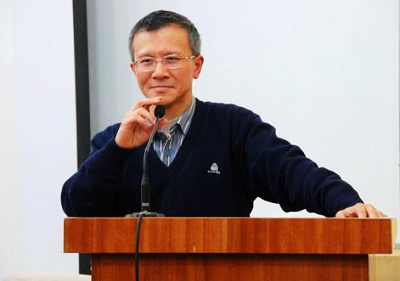

# 张千帆：公民法治常识

“现实的罪恶与历史的罪恶相似，不管他是好是坏，高级的低级的都与肮脏和卑鄙的，都是法律底线下的私利。”

“然而，在阴霾诡异不断翻卷的黑云下，我们还有一个和平和稳定的社会环境。这是国家法治之所幸；法科学生之所幸。我们对面临的困境，需要寻找法律人精神的归属和理想的家园。”

“宪政有利于国，有利于民，而最不利于官。”

“法律的生命一定是在司法真正独立之后伴随而来。”

“现在，更是以后，法律便是自由，或者所有。”

“人们嘴上挂着的法律，其真实含义是财富,但并非每个人都能理财。”

北京大学张千帆老师深刻解读法治常识——权利的时代，该如何严格的服从，自由的批判。

**【时间】 **2013年06月16日14：30-17：00

** **

**【地点】 **706青年空间（五道口华清嘉园15号楼2006室）

** **

**【主讲人**】 张千帆：

北京大学法学院教授，博士生导师。中国法学会宪法学会理事，中国法学会宪法学会副会长。中国人民大学宪政与法治研究中心客座教授。南京大学经济行政法专业博士生导师。

**【主持人】 **赵岩

**【活动流程】 **

1、 主持人介绍

2、 嘉宾分享

3、 互动交流提问

**【主办方】 **706青年空间。

** **

**【入场条件】**** **非706会员10元场地费；706会员 免费

** ** ** **

**【报名方式】 **无需提前报名 ，进门需签到。****

**【活动链接】 **[请点击这里](http://blog.renren.com/share/264964415/15950439990?from=0101010202&ref=hotnewsfeed&sfet=102&fin=4&fid=22752610971&ff_id=264964415&platform=0&expose_time=1371082199)
