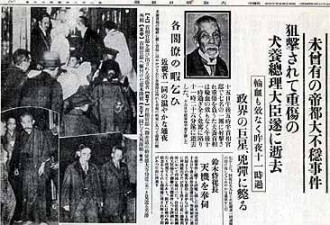

# 张展：天堂与地狱，荣耀与绝望——战前日本社会概况

【**主题**】

**每个时代的人们，都认为自己所处的时代是历史的转折点。******

** **

**第一讲**

天堂与地狱，荣耀与绝望——战前日本社会概况（政治、军事结构、经济水平、国民思想、社会问题等）

**第二讲**

复古的维新，流血的游戏——青年们的国家改造计划（各种社会运动、五一五刺杀事件、陆军相泽刺杀事件、东京二二六叛乱事件等）

**第三讲**

与老虎谋皮，命运的嘲弄——社会精英们的国家改造（各项政策、改革措施，二战时期国家社会的变化，战后改革所接收的遗产）

**第四讲**

小心的博弈，疯狂的赌徒——日本外交的世界战略（日本外交战略的发展，国内原因对其外交的影响，民族主义泛滥后其外交战略的崩盘，几次重大事件中日本外交的走向）

【**时间**】 4月4日,11日，18日，25日 19:00—21：00 （共四次）

【**地点**】北京 海淀区 五道口华清嘉园13号楼1607室

【**主讲人**】 张展（北大历史系博士，研究中日关系史）

【**活动流程**】 由嘉宾主讲分享，开放提问、讨论。

【**主办方**】 706青年空间

**【入场条件】 ** 非706会员10元茶水费&场地费 706会员 免费

** **

**【报名方式】** 发送短信“公开课+8+姓名+学校/公司”到18810666456（李沛祺）

【**活动链接**】[请点击这里](http://page.renren.com/601261629/note/899530503)

（采编：王耀辉，责编：周凌希）
