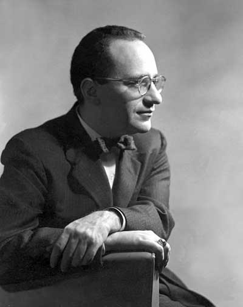

# 无政府资本主义

（罗斯巴德，无政府资本主义的提出者）

什么是最好的政治制度，这是争论不休的议题。自由民主制度终结了历史了吗？

小政府大社会是人类最好的归宿么？当代奥地利学派经济学者的智慧未止步于此。

他们摒弃了任何智识与道德上的妥协，主张最为彻底与激进的自由主义政治哲学——无政府资本主义。

政府的本质是什么？

政府的边界在哪里？

为何说小政府是种妥协？

民主为什么被神话？

什么是真正的自由？

为什么说自由主义合乎逻辑的终点只能是无政府资本主义？

私法社会为何有生命力？政府市场化如何实现？且听米塞斯学社发起人李松详解。

**【主题】** 无政府资本主义 **【第一讲】** 奥地利学派的政治哲学——无政府资本主义 时间： 4月26日（星期五） 晚7：30 **【第二讲】** 民主的神话 时间 ：5月4日（星期六）晚7：30 **【主讲人】** 李松（米塞斯学社发起人，现供职搜狐） **【主持人】** 姜戬（北斗网前总编、米塞斯学社成员，现供职网易） **【主办方】** 706青年空间 **【协办方】** 米塞斯学社、北斗网 **【地点】** 706青年空间 地址：北京市海淀区五道口华清嘉园小区13号楼1607室（地铁五道口站，小区东门进去右拐第一栋） **【费用】** 706会员免费，非706会员10元入场费 **【报名方式】** 发送短信“姓名+学校/单位”至郭斯维先生（Tel:18610690064），即默认报名成功。 **【阅读材料】** 维基百科：[《无政府资本主义》](https://zh.wikipedia.org/wiki/%E7%84%A1%E6%94%BF%E5%BA%9C%E8%B3%87%E6%9C%AC%E4%B8%BB%E7%BE%A9) 李松：[《最小政府的神话》](http://page.renren.com/600981363/note/902195546) 李松：[《无政府！为什么不呢？！》](http://page.renren.com/600981363/note/852752305) 韦尔塔·德索托：[《古典自由主义对无政府资本主义》](http://page.renren.com/600981363/note/854447402) 汉斯-赫尔曼·霍普：[《政府还是私法社会》](http://page.renren.com/600981363/note/901639778) 诺尔曼.巴利：[《无政府资本主义》](http://blog.renren.com/blog/221224861/369991823) **【阅读书目】** 罗斯巴德：《权力与市场》 **【活动链接】 **[请点击这里](http://page.renren.com/601261629/note/902314549)
