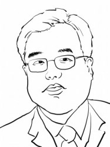

# 刘苏里：学者型书人的学思历程

【**主题**】相信每一个身处北京的爱书人不会在听到万圣书园的大名之时无动于衷，不会不在脑海中勾起一段寻于思的心路历程。作为北京文

化地标的万圣书园多少年来一直是读书人的温馨家园，苏里老师以他多年的阅读与思考，坚持与守望，向每一个迈入万圣的读者传达了一个

质朴却温馨的信念：“通过阅读获得解放”。而万圣的存在本身也在向我们这个日益庸俗化而浮躁的社会树立起一种独立思考的价值，激发着

每一个读者对可能的也是应该的更加美好的祖国想象。

【**时间**】 2013年4月4日 15:00—17：00

【**地点**】北京 海淀区 五道口华清嘉园13号楼1607室

【**主讲人**】 刘苏里

生于1960年，1983年毕业于北京大学国际政治系，1986年毕业于中国政法大学研究生院。1993年10月，创办北京万圣书园。

【**活动流程**】 由嘉宾主讲分享，开放提问、讨论。

【**主办方**】 706青年空间

立人大学

**【入场条件】 ** 非706会员10元茶水费&场地费 706会员 免费

** **

**【报名方式】**发送短信“沙龙+姓名+学校/公司”到18810454928（刘旭）

【**活动链接**】 [请点击这里](http://page.renren.com/601261629/note/899589942)

（采编：王耀辉，责编：周凌希）
