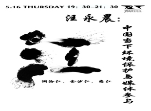
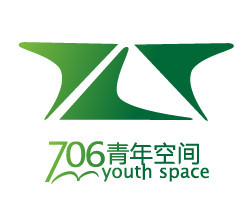

# 当下环境保护与媒体参与

  你了解乐水行公益活动吗？  你还记得潍坊水污染事件吗？  你关注过饮用水的健康么？  你对农夫山泉事件是怎样看待的呢？  你知道我们国家一类饮用水的标准是德国三类饮用水的标准么？  你知道世界遗产名录——三江并流，了解那里的生态状况吗？  你在生活中经常饮用矿泉水吗？那么这些矿泉水是否有益于身体健康呢？ 你知道北京百分之七十的饮用水来自地下，我们是在提前消耗子孙后代赖以生存的宝贵资源么？  最重要的，作为社会的一份子，作为有担当的青年一代，我们在环保领域该如何可以更好的实现公民参与，改善我们的生存环境呢？  相信作过媒体人、NGO发起者、环境问题研究者、环保实践者的汪永晨老师能给你带来丰富的知识和全新的思考。  聆听是参与的第一步！了解、思考、讨论，从我做起，做一个环保的践行者。  关注环境问题，就是关注我们自己。   **【主题】**中国当下环境保护与媒体参与   **【主讲人】**汪永晨（祖籍安徽，毕业于北京大学图书馆系。中央人民广播电台记者、环保组织“绿家园志愿者：“召集人”。）  **【活动流程】** 1主持人介绍主题及嘉宾  2嘉宾对观众提问  3嘉宾分享  4现场互动和提问环节  5活动结束，自由讨论  **【主办方】** 706青年空间     **【地点】**706青年空间（五道口华清嘉园13号楼1607室）  **【费用】**自愿捐款，欢迎围观。  **【报名方式】**发送“姓名+学校/单位+是否为会员+（想要问的问题/报名摄影摄像文字记录）”到薛岳（13810861448）   **【活动链接】** [请点击这里](http://page.renren.com/601261629/note/904065182?ref=minifeed&sfet=2012&fin=2&fid=22394997636&ff_id=601261629&platform=0&expose_time=1368490021&feed=page_blog&tagid=904065182&statID=page_601261629_2&level=1)
