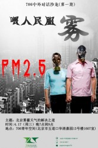

# “喂人民服雾”——环境污染之困

【主题】以PM2.5话题为切入点，让不同国家的朋友们在一起分享经验，分享观点，提出建议，以自由开放的视角探讨环境问题，为中外对话提供一个平台。

【时间】 2013年4月17日 19:00—21：00

【地点】北京 海淀区 五道口华清嘉园13号楼1607室

【主讲人】 五大洲外国友人，港澳台侨胞，大陆同学

【活动流程】

1观看视频

2讨论

3茶歇，随意交流

4讨论

5海报签名，制作本期活动人员通讯录

【**主办方**】 706青年空间

**【入场条件】**** ** 非706会员10元茶水费&场地费 706会员 免费 ****

**【报名方式】**发送短信“中外对话+姓名+学校/公司”到15652609215（王迪）

【**活动链接**】 [请点击这里](http://page.renren.com/601261629/note/901247684?ref=minifeed&sfet=2032&fin=1&fid=22103823343&ff_id=601261629&platform=0&expose_time=1366073673)

（采编：王耀辉，责编：周凌希）
