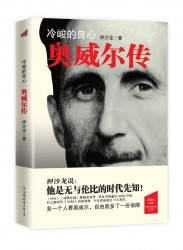

# 押沙龙：叫我们谈谈奥威尔，莫忘1984！

奥威尔（1903-1950）写出了二十世纪最有名的两部政治寓言小说《动物庄园》和《一九八四》。这让他的名字传遍了整个世界。但即便没有这些成就，奥威尔本身依然值得一写。他有过一段愤怒的童年，在缅甸当过警察，在巴黎当过洗碗工，在英国自讨苦吃做流浪汉，还曾在西班牙险些被政治谋杀，他又和极权主义战斗了十几年。奥威尔是一个很奇特的人，在整个文学史上恐怕也是独一无二。他一生辛酸困苦，一生卓尔不群。对他最好的评语就是那句著名的话：“多一个人看奥威尔，自由就多了一份保障。”

押沙龙说：他是无与伦比的时代先知！《1984》《动物庄园》震撼全世界一本书销量过5000万册。村上春树写《1Q84》向他致敬，而今年是他诞生110周年纪念。

**【主题**】叫我们谈谈奥威尔，莫忘1984！

**【时间】 **2013年4月14日 14:00—16：30

**【地点】**北京 海淀区 五道口华清嘉园13号楼1607室

**【主讲人**】 押沙龙

70年代生人，工学硕士，著名网络作家，民间研究学者。著有《出轨的王朝：晋朝历史的民间书写》（鹭江出版社，2007），《写给上班族的世界史》（上下册，中信出版社，2008）等。

**【主持人】 **纪彭

纪彭，历史爱好者，毕业于中国社会科学院近代史系，现供职于《文史参考》杂志社；社交达人，2007年创建新知沙龙，组织文化历史学术沙龙近百场。

**【活动流程】**由嘉宾主讲分享，开放提问、讨论。

**【主办方】**新知沙龙、** **706青年空间、时代华语

** **

**【入场条件】**非706会员10元茶水费&场地费 706会员 免费 ****

**【报名方式】**发送短信“现代文明沙龙+姓名+学校/公司”到15210508345****

**【活动链接】 [请点击这里](http://page.renren.com/601261629/note/900198575)**

（采编：王耀辉，责编：周凌希）
