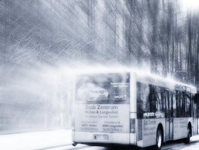

# 雪夜号

（1）

冬夜里一辆公交车在城市里穿行。

车内已经没什么乘客，惨白的白炽灯照着仅有的几个抱着手臂哈凉气的人。窗外飘着小雪，它们随着呼啸而过的迎面风倾斜地落下，最终和寒霜一起凝结在了玻璃的外层。阿芳对着玻璃哈了一口气，用棉衣袖子擦了擦，试图看清窗外的霓虹灯光和街道景色。

她乘坐986路已有半年时间，晚上九点下班，在第六个站上车，直坐到终点，耗时大概一个半小时，间中横跨了大半个市区。天气热的时候车上往往人满为患，人们巴不得早点逃离热岛效应，而如果寒冷如今天，他们又流连忘返，公司暖气免费，谁都想加班。

坐车第一个月时她刚好分手已届半年，那天赶车差了三十秒，司机离站快有五十米，她吃力地背着包往前追赶，否则就只能在CBD过夜了。本来是没什么希望，结果车门神奇地打开了。上车之后她才知道原来是有个男同事帮她说了情，这才破了过站不停的例。由此阿芳就结识了眼前这个人，而后故事就好像任何爱情片一样发展了下去。

冬天来临，他俩照常结伴取暖一起回家，行至半路，天空飘起星星点点的绒毛雪，于是就有了开始的那个情景。阿芳倚着男友坚实的肩膀，虽然觉得温暖，但也不免想起些心事。

屏幕亮了又暗，她不停地“滑动来解锁”，但眼睛并没有盯着手机看，像是纯粹地为了玩。

雪慢慢停了，而986依旧亮着大灯在路上飞驰。

（2）

大伟搂着她，安静地听着歌。

离家数年，毕业之后他就在这家公司做起了文员，随后平平淡淡地加薪，升职。某天夜里回家时，他在车上看到有个女孩子正在上气不接下气地追赶，便好声好气地请司机停下。这一停改变了他随后的人生。在此之前他并不敢奢望爱情之类的东西，自己不过是个蜗居族，干到现在每个月也只不过刚刚有能力存点积蓄，衣食住行都再普通不过。

但是那个女孩还是成为了他的女友。

随后的日子里他习惯每天回家都把零钱丢进储钱罐里，硬币掉在陶瓷上发出叮咚的声音。这提醒了他眼前的未来不再是沉默无声的了。就这么过了几个月，罐子越来越重，某天他掂量了一下，还挺重，于是就傻笑了起来。他从不为钱笑过，穷时也未曾如此。 存钱罐这种东西么，玩玩而已。

冬天了。

大伟下班后都会走上一公里等着她从公司电梯里出来，然后一起搭巴士。

这天下雪，她盯着窗外看，迷蒙一片，泛着街道黄色的灯光，以及车尾灯。耳机里是交通电台的声音，这钟点刚好是情歌时间，还挺好听的。

就这么下去也不错。他想，随后轻轻地把脖子上的围巾围在了身边人身上，她有点睡着了。

也许是天线没掰好，电台里歌手的嗓子总带着沙沙声。后来大伟换了张CD，嗯，好多了。

“986路终点站到了 请下车。”蹩脚的车厢喇叭传出一个女声。又一天结束了。

（3）

到站了，巴士发出最后一声咳嗽，随后慢慢地停止了抖动。司机把生锈的天窗依次打开，好让车厢里的柴油味消散掉。

停车之后阿芳两口子走进一家小饭馆，点了两碗馄饨面当宵夜吃。头上的液晶电视在播放着最新的综艺节目，于是她便饶有兴致地看了起来。男友见好吃的一上桌就马上低头开始狼吞虎咽，很快就见了碗底。阿芳责怪他吃的太快，也不等等她，这才转过身子来慢悠悠地舀汤喝。

好半会吃完结账后，离家还有十分钟路，于是他俩就一边走路一边聊天。内容主要就是关于一天的琐事和种种，时不时有一些小的笑料这样那样的。不过天气实在太冷，说了那么一阵之后还是都闭上了嘴巴停止吸入凉飕飕的空气，终究把手牵到一起静静地前进了。

阿芳把右手伸进男友的大衣侧袋里，有种安然的感觉。

雪地上留下两对脚印，洁白无瑕，就算在夜里，也还是被灯光照得很亮堂。

（4）

大伟有大吃的习惯，什么东西一上桌五分钟之内必然一扫而空。对此身边的人没少说他，你这小子还真是只吃不说事儿啊，哪天老板饭局上让你升个职，职字还没出口呢，你这边都快叫服务员打包了。他总是笑笑就过去了。

今晚也是，上来一碗馄饨面，随手淋点红油，又是几分钟功夫就没了。女友看他这样也有意见，谁叫你吃得那么快？又不陪我聊聊天。

但此刻大伟的心思早就不在吃的什么上面了，他从兜里掏出一把硬币，那是今天买车票留下的零钱，差不多五六个，面值都是一块。数完之后他把硬币摞了起来在手里掂来掂去，清脆的声音在夜里格外响。

女友也差不多吃完了，于是就结了账。走出小店之后，大伟回头看了看那辆业已熄火的公车。它安静地停在站台边，崭新的外壳上还留有融雪时的水滴。

“发什么呆呢，走吧。”身后传来催促。

于是他转回身牵起女友往家走，鞋踩进雪里发出呲呲的声音，而他的右口袋里，刚放进去的硬币随着步伐的起伏叮铃叮铃地响。

（5）

阿芳在2012年生活，她每天都要坐986回家，公车开了16个站。今天下起了雪，她比以往早到了十分钟，原因是上车的人很少，有些站直接就不停了，总耗时大概一小时二十分钟。她对明天的生活充满期待。

大伟在1999年生活，他每天都要坐986回家，公车开了8个站。今天下起了雪，他比以往晚到了二十分钟，原因是道路施工再加上积雪，总耗时大概五十分钟。他对明天的生活充满期待。

 

 

**（采编**：有奖信息公布；**责编**：王卜玄；）
