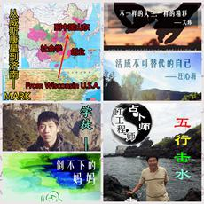

# 蔷薇四月，再进省图寻书香

蔷薇为四月而绽放,在时间里芬芳。Ithink为你而绽放，在省图一路弥香，愿你在“真人图书”里看到世界的另一束光。

看一个在摄影、写作、客栈、酒吧、旅行的世界里浪迹天涯的人，看他怎样成为不可替代的自己。

一个美国人从威斯康星到济南，将带着你从社会学的角度出发，探索你想知道的社会现象。试着想象在艾滋和男同的世界里活着的人是怎样，事实上呢，也许恰似一杯鸡尾酒。只要你愿意走进，多元，包容，尊重也会走进你。

关于占卜，关于宿命，关于阴阳五行，科学与否，等你来判定。

理想主义者，实干细腻的行动派，愿和你分享青年人的支教路程和公益梦想。

在普通的居民楼里，听弱智和自闭症儿童用不清楚的言语轻谓着一声“妈妈”，看他们嬉戏玩耍，会感动，会思考，他们一定有一位不肯放弃的“战”妈妈。

几句凌乱的话，一份真诚的期许，一切尽在4月20日Ithink真人图书馆—省图站。

###【主题】

【Ithink真人图书馆】蔷薇四月，再进省图寻书香

###【时间】

4月20日 
下午2:00-5:00（每轮借阅45分钟）

###【活动嘉宾】

mark，美国人 创业 社会学 culture-shock；真人书书名《从威斯康星到济南》

大玮，男同,艾滋病患者,央视首位出镜,自由职业者,<有始无终>,鸡尾酒疗法；真人书书名《不一样的人生，一样的精彩》

汪心海，较为专业人像景色摄影师， 旅行混子， 丽江客栈二房东， 酒吧老板二流子调酒师， 蚂蜂窝专栏写手， 去哪儿旅行体验师；真人书书名《活成不可替代的自己》

张洪辰，占卜者，IT工程师，创业者；真人书书名《五行击水》

阿辛，支教发起人，行动派，Ithink发起人之一，青年公益，社工专业，人在囧途；真人书书名《社工学徒》

战老师，特殊母亲 智障服务 社工；真人书书名《倒不下的妈妈》 
###【主办方】

Ithink真人图书馆

###【地点】

山东省图书馆四楼南侧外文部（济南市历城区二环东路2912号)

###【费用】

免费

###【报名】

为了保证阅读质量，本活动会控制每本图书每次阅读时面对的读者数量，因而请提前预约。预约方式如下：

1.网上预约，请点击[http://1.ithinkhumanlibrary.sinaapp.com/scy/](http://http://1.ithinkhumanlibrary.sinaapp.com/scy/ "http://1.ithinkhumanlibrary.sinaapp.com/scy/")

2.电话预约，请拨打0531-85590750

3.现场报名

###【活动链接】

[新浪微博@ Ithink真人图书馆](http://http://weibo.com/2792504224/ABG59abWV "新浪微博@ Ithink真人图书馆")

（采编：万晓华；责编：万晓华）