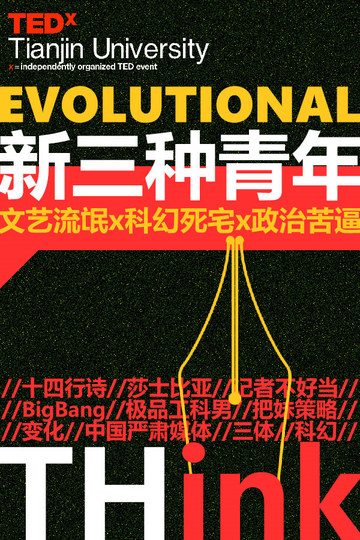

# 12月22日“新三种青年”末日来袭！

 时光并没有飞逝，而在信息化的娱乐时代里，一切变化不断加速。就像现在，已是屌丝、高富帅和白富美的时代了。朋友们，你还记得那曾经火爆的三种青年吗：普通青年，文艺青年，二逼青年！这些青年如今过得可好呢？ 无论时代如何改变，它总是在青年们的身上暗涌着最有力的波涛。青年们身上闪着无限可能的亮光，青年们心中燃烧着炙热猛烈的火焰。所以普通、文艺、二逼这样三个词根本无法准确概括这些千姿百态的青年们。 所以，在这个寒冷的冬日里，**TEDxTJU**邀请了三位“进化版”的新青年：文艺流氓青年，科幻死宅青年，政治苦逼青年，让他们发声，让他们讲述自己锐利的思考，或无厘头的见解，分享他们生活里的欢乐和悲伤，通过他们努力碎片化地呈现当下青年们的另一番模样。  下面简介这三位主讲人： **【文艺流氓青年】**： [**夏超**，](http://rrurl.cn/g0xsq3)天津大学制药硕士在读，写诗、喝酒、读书，偶尔翻译英语诗歌，写点故事讲给朋友们听，曾获北大未名诗歌奖等，曾赴新疆北部支教一年。 十四行诗是什么？莎士比亚为什么写十四行诗？十四行诗中是不是有实用而高端的“把妹”策略呢？这些策略的背后到底是什么呢？ **【科幻死宅青年】**： **[张凯栗](http://rrurl.cn/hk9G46)**，南开大学物理学院伯苓班11级，灵南科幻协会会长，技术宅。 **用他自己的话说就是：“对终极真理的探求是现代自然科学发展的根本动力，搞学术的最高理想。 科幻的一大重要体裁，朝闻道，超时空接触。我就这么被坑上道的。”** **“这就是我们想去寻找的东西，同时也想把这份美感带给那些不怎么熟悉自然科学的人，科幻、科普文、这样的交流是传播科学非常好的方式，这也是现在我在这的原因。”** **一个理科男，除了实验报告吉米多维奇西加加等等喜闻乐见男默女泪的桥段，或许更重要的是一种理性的精神。不信星座血型，我们更爱理性客观有逻辑，原因如下一二三四，实验可行可测可重复，理论可证伪，这不科学……** 科幻是什么？“三体”为什么在中国科幻届这么火？那些死宅的青年们到底怎么想的？我们身边是不是就有BigBang的那些极品工科男？在末日之前听听这位nerd的欢乐槽。 **【政治苦逼青年】**： **[王箐丰](http://rrurl.cn/fM9V3Q)**，中国人民大学国民经济管理系毕业，四川好男人，做饭、读书，努力工作，财新传媒《新周刊》记者，前人大独立参选人，一个理性的批评者和建设者。 **“为什么中国的严肃媒体越来越少，大家都去做Vista看天下、壹读这种软杂志或轻阅读，而过去的严肃媒体的质量也在下降?”** 记者为什么不好当？中国严肃媒体在如何变化？在这个国家该如何发声？ 今年我们经历了不少让我们或唏嘘，或惆怅，或欢乐，或心痛的消息。 有时我们希冀在浮华之下正义与公平出现，有时我们慨叹时间如此之多纷扰。 新闻带给人们什么，媒体带给新闻什么，这一切值得我们思考。   欢迎大家倾听三位青年对这些有趣的问题的见解和想法。愿这三位新青年，或意气风发、或认真苛求、或随性洒脱的态度，能在这年末的寒冷中给大家送来雪一样的纯净、火一样的热度。 **时间：12月22日晚7点** **地点将通过短信形式另行通知**    **【活动报名请戳】：**

### [http://www.sojump.com/jq/2082623.aspx](http://rrurl.cn/9jxxjO)

 【关于**TED**x,关于**TED**x**TJU**】： 有人称**TEDx**为史上规模最大的一次开源运动，似乎很贴切。在中国来讲，从三年前**TEDtoChina** 成立，到始于2010年的由谷歌赞助的**TED****x****University Day**,**TEDx**在中国可谓遍地开花。期间伴随发生的各种青年沙龙论坛的蓬勃兴起，很难说不受其影响。有别于08年前后仅限于一小撮非主流泛政治青年的小规模饭醉，间隔年、义工、读书会等话题成为潮流主题。新一代青年更为普遍的自我发现与组织，也许是一个新的飞跃。  **TED**大会希望传达这样一个的信息，即优秀的思想可以改变人们对这个世界的看法，使人们反思自己的行为。 “瞭望一切，必须从小处着眼，”必须从每一个角度切入，而这一切的联系需要一个纽带，一个关联的平台，而这也正是TED的意义和本质所在。 

**TEDx****TJU**致力于发掘本地群体中能引发兴趣且有意义的事物，以及能对这些事物做很好阐释的人。并把来自全世界新思维、新事物带入天津大学这所工科氛围浓厚、历史悠久的学府。

在这样的过程中，通过双向交流而非传统的单向灌输，激发活动参与者的思辨、创新思维。
