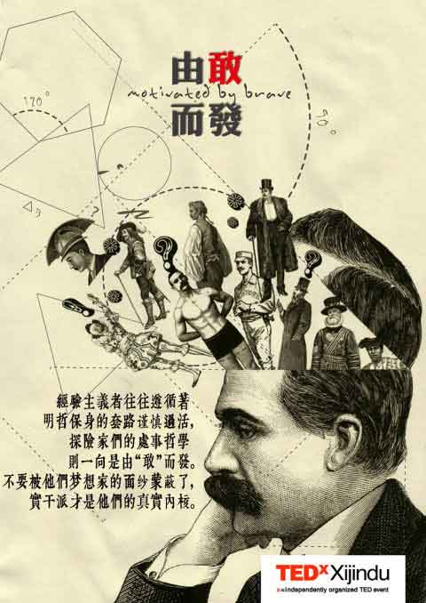

# 第二季：由敢而发

经验主义者往往遵循着明哲保身的套路谨慎过活，探险家们的处事哲学则一向是由敢而发。敢为人先、敢以身受、敢有担当……这些由“敢”而发的词组无不暗合着“躁动分子”们的价值取向。不要被他们梦想家的面纱蒙蔽了，实干派才是他们的真实内核。他们有怎样的奇妙思考？他们有怎样的独特经历？他们又有怎样的珍贵收获？我们这次的主题“由敢而发”试图给出答案。

**【时间】** 2013年4月21日 14：00—17：00 **【地点】** 江苏大学讲堂群110 **【主讲人】** 1、高云海 江苏恒顺集团总经理助理，镇江摄影家协会会员，镇江小山楼国际青年旅舍创始人等。一名八十年代的军人，将十年的青春奉献给了祖国的国防。人到中年，又代表着镇江人民支援边疆。这是一位既荣立过军功，又在商海中取得骄人业绩，一个有很多故事的、内心不老的老男人。 2、曹兴元 中国CIID会员，JSIID江苏省室内设计学会任理事等。他做过知青，当过兵，经历过中越战争，曾是一名国家公务员，镇江消费报创始人。他兴趣广泛，追求完美，是一个对一切充满好奇的人；时而精湛极致、时而粗狂豪放，酷爱空间艺术，立志用现代的手法呈现中国文化，是一个将兴趣作为职业的人。 3、徐 历 中学美术教师 4、艺小潮 镇江城市广播FM90.5音乐DJ，2012 城市春天里生活体验节草地民谣音乐会专场，秋日私语慢生活节草地民谣音乐会专场，长江草莓音乐节草莓生活馆嘉宾，2013年1月4日发表专辑 <FM艺小潮>。 5、董 晶 镇江城市广播FM90.5DJ，陪伴一代人成长的电台节目《花开的声音》主创及主播，长江草莓音乐节草莓生活馆嘉宾 。 **【活动流程】** 13：30—13：45 播放宣传视频，观众签到 13：45—14：00 观众进场完毕，观众候场同时可进行微博互动 14：00—15：30 分享会上半场 15：30—15：45 徐历献歌一首 15：45—16：45 分享会下半场 17：00—17：30 观众提问时间 **【主办方】** TEDxXijindu团队 

TEDxXijindu是由美国TED官方授权的本地化自发组织的活动，致力于镇江本土人文资源的挖掘整合。

**【入场条件】**

免费，不论是不是人大学生都可以。

**【报名方式】**

您只需在只用在和勺见相关的人人日志、人人状态、豆瓣同城、新浪微博中的其实一个里面报名就可以了。

**【活动链接】** 请[点击这里](http://www.douban.com/event/18637203/)
