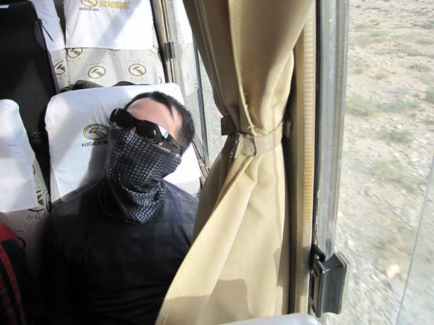
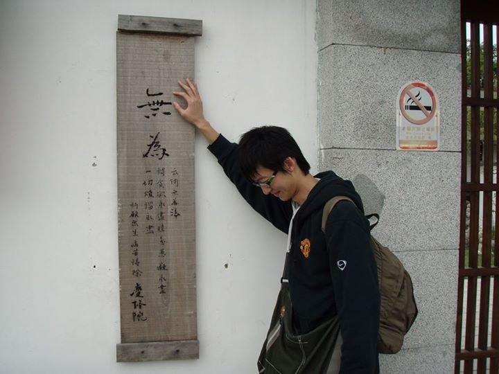
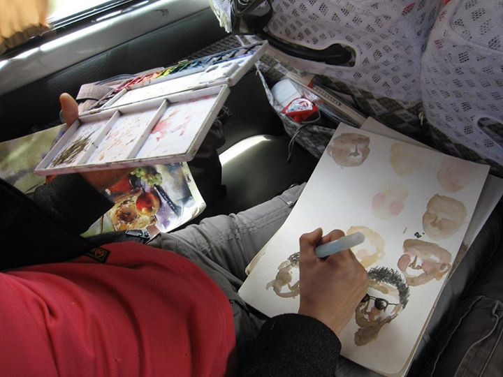

# 仲丘之死，兩個需要的真相

告別仲丘前夕，25萬人來到凱道，除了送行，更為了討公道。人海戰術也果然奏效，短短幾天立法院就修法，凱道上的三大訴求：軍司法共同偵審、承平案件回歸司法、調查歷年軍中冤案，已完成了前兩項。

台灣罕有群眾運動這麼快收效，幕後策劃的39位成員，沒有一絲遲疑，轉身下台，「我們的階段性任務完成了……我們先隱身回自己日常生活和工作崗位上，繼續為這個國家努力下去。」（參考：http://www.ptt.cc/bbs/Militarylife/M.1375793444.A.4B7.html）

有如一場絢燦的煙火，照亮烏黑深沉的夜空──原來，我們對公義還有渴望、對是非還有判斷。

不過，看一看公民1985聯盟的訴求，無論是達陣或未達陣的，都是對司法正義的「向後追討」，沒有對部隊正常文化的「向前建立」。

仲丘之死，是死在一個扭曲的文化底下，而不僅是廢弛的軍審體系；如果只將民氣傾瀉在轉變事後救濟管道，不見得會改善部隊惡整人類的傳統，最多就是降低虐死的機會。

若我們同意未來軍隊尚須存在，就代表以後還有千千萬萬的新兵等待入伍。即使大家揪出洪案兇手、抖出過往冤案，阿兵哥們還是逃不過被惡整，或是無意義勞動的命運。

洪仲丘怎麼冤死，是全民需要的真相；國軍如何變成這樣，是國家需要的真相。

一、是軍人，還是軍械 

以景福門為中心劃出的白色十字，有積了一肚子怨氣的退伍軍人、有未服兵役的年輕學生、有不忍青春生命驟逝的媽媽……還有一大部分是受不了執政黨六年來的「失德」而上街的。

晚會雖未以任何人下台為訴求，仍混雜著「馬英九下台」、「馬英九吃屎」的呼聲。（參考：http://www.libertytimes.com.tw/2013/new/aug/4/today-t1.htm）

其實早在群眾聚集前，三軍統帥就火速摘了國防部長的烏紗帽，以慰祭人神；軍事檢察署飛快起訴了十八位大小官兵，以敬告國人，卻還是壓不住人民的怒氣。

如今，下台的意義早已大幅貶值，近年內閣成員如走馬燈般輪替，彷彿下台成為卸除壓力最容易的方式。

擅長「政治作戰」的國軍，鬥倒楊念祖也就算了，高華柱下台，算負起哪門子的政治責任？如果三軍統帥也下台，又要怎麼整飭軍紀？

其實，軍隊視人命如草芥，是長期以來積累自對人格、人性、尊嚴、正義全面否定而來。打從黃埔建軍，歷經北伐、二次大戰、國共之爭、動員戡亂、全面戒嚴及至民主轉型，軍隊一貫的訓練方法就是把人質變為工具。

而且不管哪個人當國防部長、三軍統帥，都牢牢尊崇這套手段。或許他們也自認，無論自己的權力有多大，不依恃這條鞭子，就指揮不動龐大的軍隊。

在這個垂直的命令控制系統中，如果有哪個人難以適應這種耀武揚威、尊卑有序、絕對服從、震撼管教的整人文化，就代表腦袋還不夠清白。

因此對真實、善良、美好的蔑視，成為部隊維繫的命脈。久而久之，內鬥內行、外鬥外行，國軍要殲滅的對象，不是共軍，而是組織裡的「不聽話者」。

軍中最流行的話就是「不打勤、不打懶，只打不長眼」，也就是說，一致性是一種權力，只要把自己化約為一顆無意識的棋子，就能夠獲得權力的快感。

但說穿了，「不聽話」又像一根細細的別針，最多將大大的國防布戳個小洞，根本動搖不了部隊的結構、國家的戰力。

但它又如莽原中的一撮火苗，威脅到長官的顏面、階級的界線、威權的秩序。於是異議者會遭到不成比例的報復，小則挖洞給你跳，如排擠、怒罵、罰勤、禁假、體能操練等，大則折磨肉體、草菅人命。

這種絕對命令、絕對服從的運作方式，在戰時也就罷了，兩岸已長年承平，失卻訓練目標的結果，敵人變成樹葉，武器變成掃把；敵人就是簿冊表單，武器就是原子筆……各種教育、檢查、動員，全成了無意義的勞動。

隨便問一個當過兵的人做最多的事是什麼，答案一定是「做假資料」！

在這種生活方式下，國軍一年耗費近20%中央政府總預算訓練出來的，不是戰力，只是砲灰。（參考：http://afrc.mnd.gov.tw/mndreport/info19.html）

我相信這一切一切，從軍事體系一路爬上來的歷任國防部長不會不知道。他們不是心安理得的認定這是必要之惡，就是掩耳盜鈴的選擇成本最低的容忍。

就算真的有心，也欠缺發動改革的背後支持，畢竟一個龐大的軍隊結構，不是單靠一個人的權力就能連動的。

從人的理性動機出發，我們很難期待國軍自動自發改革，但同時，我們也沒有權力要求在營軍人有發難的道德勇氣，所以身在外部的我們，只能外應裡合，給予足夠的批判力道跟支持力量，拆毀既有的結構，也提供更好的建軍想像。

其中一個方法是，說故事。

心理學有一個「敘事治療」方法，如果當過兵的人，可以匿名說場故事，揭露親身的、看到的、參與的不公不義事蹟，並確實反映給國防高層，或許能夠療癒曾經受創的心靈、整治爛到骨髓的國軍。

這可能是我們為逝去的生命、在營的官兵、待操的菜鳥，所能付出的最簡單力量。

二、不義的分擔者 

軍旅生活，向來是每個退役軍人談到老也不膩的話題，話匣子一開，每每讓沒服役經驗的人感到不耐。或許相對於退伍後的平凡生活，這段期間遇到的各種違背常理、光怪陸離、受屈被辱、挑戰體能極限之事，是許多人一生中最特殊，也最值得拿出來展示的經驗。

特殊在哪裡？因為軍隊是地球上唯一合法容許暴戾的地方，使得從軍變成陽剛之氣的極致表現。

如果是當官的，無論軍校升上來或考上預官預士的，當你確定日後要背上值星帶，第一件事就是剝奪自己的憐憫心，凡事以訓斥、責難、處罰為控制手段。（參考：http://udn.com/NEWS/READING/X5/8050216.shtml）

當然，就算你沒當過班長、排長，一定也當過學長，免不了要倚老賣老，對新兵頤指氣使一下。

因此走過軍隊一遭的人，可能都遂行過壓迫，只是輕重有別。小則因為沒聽到「學長好」而斥責，大則因為「不聽話」而關其禁閉，至鉅就是虐出人命。

說不定，只是說不定，戒護士最初收到的命令只是教訓教訓這小兵，後來上一階的覺得應該再加碼；洪半死不活後，再上位的，唯恐他退伍後在外爆料，遂下令殺人滅口。於是戒護士成為上級長官的血手套，替他拔除背上芒刺。

如此層層分工，正反映每個當過兵的人，無論自願、非自願，都可能分擔了組織中去人性化的工作。

但我們也都很清楚，一旦脫下軍服，許多印象中凶神惡煞的長官、學長，立刻回復為人類。因此多數人的本性，並不是被抹除，只是隱藏起來。

就是這個關鍵，同樣是「奉命行事」，國軍跟極權國家的軍隊就有很大的分別。國軍的非自願冷血，只是暫時性的，時間一到，可以立刻拾回人性，而且幸好時間尚短，大部分人只會將這段經歷當成屁，或者配合演一場戲，沒人會深深烙印在行為上。

但如果把整個系絡搬到東德，就是另外一回事了。

電影《竊聽風暴》的主角，是東德國安局一位秘密警察，代號HGW XX/7。他奉命24小時監聽一位具反動思想的劇作家。

想不到在這段任務中，他翻著竊來的詩集而沉思、聽到勇士的對話而遲疑、聞及貝多芬的琴音而落淚、聆得男女的交歡而記起慾望……他秘密的，分享著他們的人性生活。

當他查獲劇作家寫了份東德掩蓋自殺率的報導到西德時，快步奔向長官面前，手上捏緊了那份情資……卻沒有打開。

這份損害國家利益的報導隨即被公諸於世，國安局卻因缺乏罪證，拿這位兇手沒轍。

沒幾年，柏林圍牆倒塌，那位對自己安然度過危機不明所以的劇作家，來到已改建為博物館的國安局，查出過往監聽他的HGW XX/7。

寒風中，劇作家隔著車窗望著街上一個落拓身影，愁腸百轉，沒有上前招呼。這位失職的秘密警察，已被貶為政府機關的送信員，斷送一生的青雲路。

某天，送信員途經一家書店，櫥窗裡展示著劇作家的新書。

翻開第一頁，清爽的白紙上，點著幾行俐落的黑字：「這本小說，謹獻給HGW XX/7，致上最深的感激……」

他緩緩闔上書本，至櫃台結帳。店員問道：「要包裝起來送人嗎？」他泛著自信的笑容說：「不，這是給我的。」

電影拍攝時，劇組實地到東德許多機關大樓取景，唯獨監獄博物館館長拒絕出借場地，因為他認為電影完全不符史實，「整個東德歷史，像主角那樣良心發現的秘密警察，對不起，一個都沒有！」 

劇情愈溫情，實際就愈殘酷，身處惟命是從的系統裡，善良從來不是戰勝的那一方。電影太過簡化人性的算計，幾本詩集、幾曲琴樂、幾句對話、幾許淫聲浪語，不太可能促成人格的巨大轉折。

導演解釋，他只是想告訴觀眾：「你是有選擇的！」

然而在現實世界裡，人們為了存活，只會限縮自己的選擇。除了那個最「白目」的洪仲丘。

再把視角拉回國軍，持平而言，全用「惡行」來形容是有點太重了，姑且稱為「不義」吧！

身在軍中，就算沒有參與，只是對不義之舉容忍或袖手旁觀，其實也落入不義的範圍裡。

就以我18歲那年的夢境為例吧，那時候夢到我待在財產管理部門，雖然採購不經我手，但稍加留意一下，就會發現單位常用高於一般行情的價碼購買各種財產、物品。

這當然不是貪汙，只是政府做事向來不會評估成本效益，反正錢不是自己的。正因為錢也不是我的，我自然視若無睹，於是單位年復一年傻傻的花著冤枉錢。

另外，有時看著組織內的人員以極不效率的方式進行一件再簡單不過的業務，總想建議一下稍微改變流程。但後來想一想，算了，人家可能還當你想偷懶呢，於是噤聲到夢醒時分。

再者，軍中有一個相當無聊的「飲水紀錄表」，每回喝水後都要填上飲用量。同時，還有一套制式飲水標準，因此實際上每個人不管喝多少，都會照劇本填寫。誰吃了熊心豹子膽敢少填，或者去質疑紀錄表存在的意義？

所以這張表最大的用途就是，有人中暑身亡時，可以用來證明死者是自己身體因素造成，不是部隊疏於補給。

「高級裝備檢查」則是一個人仰馬翻的活動。其實規則很簡單，時間到了，把大大小小的裝備通通搬出來，讓上級單位一一核對。

曾經有個友人，因為裝檢前少一個彈匣，驚慌失措之際，想起鄰縣營區擔任主官的好友……

所以囉，網路上就有人分享教戰守則：互通有無、無中生有、人間蒸發。

記住，只要掌握這三大原則，帳料相符就贏一半，其他的資料都是可以生出來的，旅主檢、軍團檢、高裝檢都沒啥好怕了。」

還有人說，「裝檢比的是認不認識檢查官，而不是裝備妥善率。」

不是說軍人都在偽造文書，而是太多時候上面只要求漂亮的紀錄，底下的人除了配合演出或冷眼旁觀，別無他法。於是進進出出的官兵，只能眼睜睜看著這套遊戲不斷輪迴。

正由於這種強迫分擔，體制的不義與個人的不義，是相輔相成的；每個人既是受害者，也是加害者。

但惡行之所以會延續，更可能的原因是人們察覺不到自己的不義，遂不知不覺將之複製下去，最顯而易見的概念即為「菜鳥就是該死」。

被呼來喚去的新兵，在媳婦熬成婆後，又習慣以相同的方式對待新兵，以補償曾經的卑賤，於是學長學弟制一代一代被鞏固。 

三、自我覺察的艱難

其實要男生認真看待這段經歷、察覺他者我者的不義、揭露軍隊運作的真相，再有條有理的敘說，並不是件易事。大抵有四個原因：

（一）拙於言辭

認知心理學指出，人類打從娘胎出世，就是用言語認識世界。言語領導思考，也統合了幾個最重要的認知功能，人們想一件事情時，一定是沿著言語的介面進行。（參考：http://psych.stanford.edu/~lera/papers/sci-am-2011.pdf）

特別是，男生的語言能力遜於女生，幾乎是普世的研究結果，也因此可約略推論，男生自我覺察比較慢。

（二）已經放下

可是男生有因為拙於言辭，就不說故事了嗎？

剛好相反，非常的愛說，只是說出來都變成「誰比較操」、「誰比較猛」的較量，「你那個還好啦，想當年我……」像極了一場可以炫耀的豐功偉業。

說到底，這種心態反而助長不義的合理性。

其實一旦退伍，過往所受的屈辱都成過眼雲煙，就像噩夢乍醒，再也沒必要舔舐傷口，於是所有「磨練」都突然成為奇聞趣談一樁。

快速忘卻苦痛固然是好事，卻失去正視這種黑暗的機會。

（三）留得青山在，不怕沒柴燒

每個義務役入伍前都會聽到一句話，「什麼都是假的，只有退伍才是真的」。就是這句話，讓每個人遇到折磨、不義對待時，選擇隱忍及配合。 

這也可以從心理學來解釋，人們遇到「認知失調」，亦即「世界跟你想像的不一樣」時，通常會有三種反應：

1. 改變態度：直接回嗆。

2. 增加認知：其實這也沒什麼不對啦，長官也是為我好。

3. 修正行為：跟著做做樣子也就是了，但幹在心裡。

（參考：http://bbi.com.tw/pcman/Gossiping/1HuwFL-M.html）

第一種是找死，第二種是自我催眠，第三種是強迫自己適應環境，也是最多人選擇的方式。

不過第三種是暫時性的壓抑，因此很多人放假就會到網路靠腰一下。有個同學在部落格大筆揮毫後，沒多久就接到電話，要他立刻刪除。看來國軍的政戰系統比雷達系統還靈敏，但僅限於「內戰」。

從此所有不公不義，那位同學都只留在餐桌上，杯盤狼藉後，隨著菜渣一起掃去。 

而我曾經向某好友問起軍旅生活類似的經歷，他一開始就先說：「不要害到我喔」。一如白色恐怖，軍隊製造了一個非常強烈的印象給官兵──明哲保身。

四）忍一「世」風平浪靜

對志願役來說，除了服從，沒有其他選擇。不過有時候這個服從，是經過理性計算的。

第一，違逆的成本太高，沒事別找自己碴。第二，聽話可以換取記功、嘉獎、得閒、放假、考績、升官、人際關係的利益，何樂而不為？

表面上言聽計從是不得不，實際上，下屬可能早打好如意算盤，想從聽命行事中獲得相當的報償。

不過不管怎樣，「人在屋簷下，不得不低頭」，要求身處體制裡的志願役自我覺察，甚至提出異議，都是強人所難。

四、集體的敘事治療

其實，就算東德當年參與執行或袖手旁觀的人從沒懊悔，後世類似《竊聽風暴》的電影還是不勝枚舉。 

同樣的，美軍在越戰誤判情勢、濫殺平民，軍隊內部還爆發種族衝突、官兵吸毒等事件，國民並未以愛國之心護短，反將之唾棄的體無完膚，有關反戰的電影更不計其數。

台灣的軍教片不少，但描述的多是新兵的蹩脚窘態、天兵的傻不愣登、營站的可口誘人（食物及店員）、長官的紀律嚴明、軍人的剛正志節等，敘事軸線大抵是男生從「幼稚」到「成熟」的轉變：經過嚴格的訓練，這群乳臭未乾的小屁孩終於成為真正的男人。

整體來說，軍教片擺脫愛國教化的抗日題材後，就只剩打打鬧鬧、爆笑詼諧，少了對國軍惡整文化的檢討。

而西方社會都有一股集體動能，從文學、電影、畫作、舞台劇、電視劇等媒介反省、批判、思索國家發展過程中的系統性錯誤。

這跟「轉型正義」有點像，又有點不像。

不像的地方在於，轉型正義是國家民主化後，社會集體對獨裁首腦及幫傭究責。國軍沒有民主轉型的問題，只有任務轉型的問題，因為軍隊本是封閉性組織，相對不受外部政治環境影響，也不見得完全適用民主的決策方式。

但也就是自外於社會，才退化為白堊紀的龐然巨獸。當今戰爭早從肉搏戰變為科技戰，國軍卻仍堅守「頭腦簡單、四肢發達」的訓練方式；加上大環境已從備戰過渡到承平，軍人不在沙場捐軀，總透露著一份弔詭。（參考：http://mhperng.blogspot.tw/2013/08/blog-post_4.html）

與轉型正義相像的地方又在於，對威權政體或國家軍隊的訴究，都不是為了報復，是為了找出更理想的互動方式及組織文化。

因此訴究絕不是用謾罵、清算、鬥爭的方式，並以擊潰為目標，因為悲劇通常不是一個人能一手包辦的，要遂行邪惡的意志，必然要有一窩幫手。

在國軍裡也沒有一個人下令：大家一起來做假資料、大家一起來惡整新兵。一切都是文化制約著行為──只要你成為我們的一份子，就要照著傳統做事。

因此，「人」從來不是問題本身，「什麼」讓人為不義之舉，才是重點。訴究的對象必然是一個現象，及現象的成因。

如果所有當過兵的人，能把現象勾勒出來，就是一個開始。這或許是一種社會性的敘事治療。

敘事治療認為許多問題都是大範圍的環境及結構塑造出來的，比如階級、種族、性別等等，因此診斷一個人，不是去看這個人本身有什麼問題，而是去看這個人背後所經歷的文化脈絡。

也因此，敘事治療不會對當事人做出正負評斷。

心理學的治療大部分都鼓勵情緒宣洩。一位同學當兵時曾被長官拍桌怒罵，聲響大到對面建築物裡的人都聽到。罵完之後，他一個人到頂樓吹風，心裡直冒出「跳下去」、「跳下去」。

不過當時他帶著手機，打給人抱怨抱怨，也就忍下來了。這段經驗他講過很多次，對他來說，肯定是一生難忘。

但到底是什麼事，我還真忘了，反正軍中大小事都能罵，小至牙刷沒正對龍脈穴位，大至表格沒揮灑得清麗脫俗，任長官要翻桌、咆哮、獅子吼、人身攻擊，都隨他高興。

不過這裡所說的敘事治療，當然不只為治療個人，而是試圖透過集體說故事的方式，吐露每個人「被施加」或「施加於人」的不義，藉以拼湊出國軍在搞什麼鬼的圖像。

因此說出來的事，就只是故事，沒有自己的名字、沒有長官的名字、沒有所屬單位，有的只是「現象」。

接著社會大眾在這些故事的基底上，一起定義什麼是超量的操練、過時的課目、累贅的程序、價值趨近於零的業務、無意義的勞動等等，討論出所有不必要的消耗。

而後，大家再一起協商什麼是必須的業務、合理的訓練、不會死人的磨練、能夠服人的管教、留有尊嚴的處罰、處罰的時機及項目及程度、命令的向度及強度及廣度，以及當命令不義時，下屬有什麼手段應對。

而且所有中華民國公民都有參與的資格，不分是否有服役經歷。莒光園地的主播就常常把「全民國防」、「國軍是中華民國的國軍」掛在嘴邊，所以握有領導實權的高階將領並不能獨佔話語權。

但也會有人說，軍事是非常專業的領域，哪能讓人這樣說三道四！有退役將領便質疑，海陸士兵在鋪滿碎石的天堂路爬行，會不會被部屬告凌虐？以後長官又該如何指揮部隊？（參考：http://news.chinatimes.com/focus/11050105/112013080600075.html）

其實透過敘事的過程，社會自有公斷。而且如果我們承認軍人是軍人，不是軍械，那再怎麼專業，都不能凌駕對人性的基本尊重。

充其量，敘事就是一個不知終點的努力，讓外面的時代、文明、人權多多少少滲進去，這一切都未侵害到國防體系的裁量權。如果光公眾討論就會動搖軍心，那國軍未免也太弱了。

在國軍民心殆失，只剩制度、預算支撐的年代，光靠幾位高階將領「勵精圖治」是不管用的。要找回它的正當性，就要向外尋求救贖，讓全民系統性的揭露、系統性的整理、系統性的反應，才能強迫統帥認真對待這個數十年的國家機密：活在集體謊言裡。

(採編：余澤霖)