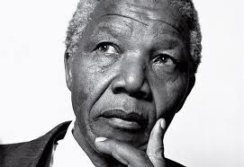
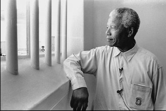
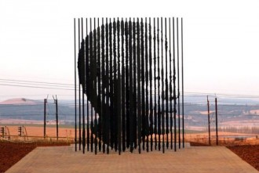

# 我所看见的曼德拉

编者按：

一颗流星用95年时间划过了地球。2013年12月6日，他永远离开了这里。

可以说曼德拉的离去没有什么可遗憾的，他所留下的精神遗产足以成为人类追求的永恒主题，昨日以来全球人们对他进行哀悼、祈福的活动大概也因此而发。与此同时，我们更应该警惕标签化的叙事，要知道，曼德拉留给我们的精神遗产绝非是几个简单的词语就足以概括的。

本文用最基本的史家眼光，力图以平和的视角还原曼德拉的一生沉浮。纪念，应该是由心而发的。

几十年来，大家眼中的他始终一袭西装，一头短发，简洁而刚正；目光深邃如深潭，却倒映着自由与坚毅的群星；即使曾经苦难，笑脸却是他给南非人最多的印象；环顾全球，我们很难再找到一个能和他比肩的在世伟人。当年，他被南非当局关押却受到全球各界的关切；他一生致力于推动黑人与白人的种族平等，却同时赢得了白人致敬，1995年6月约翰内斯堡埃利斯公园体育场，6万多名以白人为主的观众向曼德拉欢呼，歌颂他在橄榄球世界杯上带动和平的卓越贡献；他的生日成为“曼德拉国际日”，以表彰他为和平与自由做出的贡献；而到了暮年，他的病情得到无数人的关注和祈福。而就在昨天他永久闭上眼睛后几个小时内，世界各地都燃起了为他祈福的蜡烛，而上一次出现这种全世界人们不分种族年龄地纪念一个人离世的场景，则要追溯到1948年1月30日“圣雄”甘地的离世了。

他就是曼德拉，一个自由的斗士，全球的英雄。

**“吾辈却非蓬蒿人”**

1918年，曼德拉出生在南非特兰斯凯，他的父亲是姆韦佐酋长。作为酋长，曼德拉父亲不仅要服从泰姆布国王的命令，还要服从当地英国政府的行政长官的领导。但曼德拉父亲常常为维护酋长的传统权力而向英国政府挑战，这种行为直接导致了曼德拉家族酋长地位的终结。而他父亲富有自尊心的叛逆性格和追求公道、百折不挠的正义感因而也通过其自身的行为与家庭环境的耳濡目染中传承给了曼德拉。

9岁时，曼德拉父亲即因肺结核去世，在其父亲生前干预下掌权的摄政王荣欣塔巴提议抚养他，曼德拉的母亲为了曼德拉更好的教育和生活，没有拒绝摄政王的提议。曼德拉由此离开原来的小村庄，来到了王宫，并在王宫相邻的独屋学校里上学。曼德拉在王宫中长大成人，享受着白人给南非带来的教育和有益的价值，但是耳濡目染中南非种族不平等的观念在他内心也由此扎根。16岁时曼德拉离开家，前往恩科波克拉基伯雷寄宿学校学习。1937年，19岁的曼德拉开始在魏斯勒阳学院学习。在这几年的学习生涯中，曼德拉接触到了不同部落、不同肤色的人，见到了不少敢于顶撞白人的黑人教师，对于自己身份认同与民族问题的思考成为曼德拉学习中的重要方面。

21岁的曼德勒被南非著名黑人大学福特哈尔大学录取。曼德拉大一第二学期时，学生们认为大学的伙食难以令人满意，开始向校方抗议，同时要求加强学生委员会的权力。少数学生参加投票，选出了包括曼德拉在内的六位“学生代表委员会”委员。而在校方的野蛮干预下，曼德拉最终却面临要么参加学生代表委员会，要么被强迫退学的选择。

坚持原则的曼德拉离开了福特哈尔大学回到家乡。而后为了逃避摄政王安排的包办婚姻，曼德拉来到约翰内斯堡，在克朗金矿谋得一份保安的工作。然而好景不长，他的身份很快被工头得知，不得不离开了金矿。繁华而庞大的约堡，没有工作的曼德拉难有容身之处。好在有马布托牧师的帮助，曼德拉终于找到了一处可容身的地方。与此同时，他一边在律师事务所工作，一边攻读南非大学的函授学位，并接触了南非共产党关于种族压迫的理念。此后曼德拉又考入威特沃特斯兰德大学攻读法学学士，结识了此后一同战斗多年的战友斯洛沃。

后来曼德拉在法庭受审之时，曾聘请斯洛沃为他辩护。1962年，斯洛沃协助曼德拉组建南非非洲人国民大会的军事组织“民族之矛”，此后离开南非在国外组织和开展反对南非种族隔离制度的斗争；在20世纪90年代非国大和国民党谈判陷入僵局之际，斯洛沃提出“五年分享权力”的构想，大大地推动了谈判进程；1994年南非民主大选后，斯洛沃出任曼德拉政府的建设部长。

**“半生风雨待芳华”******

** **

1944年，26岁的曼德拉参加主张进行非暴力斗争的南非非洲人国民大会（简称非国大）。两年后发生的一系列事件对曼德拉此后的政治发展产生了重大的影响。

1946年，约翰内斯堡矿脉地区7万多非洲矿工进行大罢工，矿工们团结一致，坚持罢工一周，尽管最终罢工被政府镇压，但是却给曼德拉留下来深刻的印象；同年，南非政府通过《亚洲人土地占有权利法》，限制印度人的权利，这引发了印度社团的反对和抵抗，他们的组织和献身精神震撼了曼德拉。

而仅仅在四年之后，支持种族隔离政策的南非国民党获得大选胜利。计划出台法律以系统化、制度化南非的种族隔离政策。曼德拉自此开始投身政治，他领导非国大的反抗运动，开设律师事务所为黑人提供低廉的法律咨询服务。

1953年底，曼德拉组织并且领导了“蔑视不公正法令运动”，由此在黑人群体中赢得了声望。

曼德拉尽其一生所反对的种族隔离政策在南非由来已久，最早可追溯到17世纪荷兰在好望角开辟了南非最早的殖民地开普敦，自此以布尔人为代表的欧洲白人纷纷涌入，他们奉行“白人至上论”，歧视当地的黑人。18世纪末，英国人占据原荷兰殖民地后，继承了荷兰的种族隔离政策，颁布了一系列的种族隔离法令。

1913年《原住民土地法》的颁布意味着南非种族隔离制度的开端。白人自此通过殖民、种族歧视和隔离等方式剥夺了原住民（主要是黑人）的土地，将原住民限制居住在十多个狭小的保留区中，绝大部分土地被划归国有；1948年马兰政府上台后，打着“维护白种人的纯洁性”的旗号，陆续颁布了《人口登记法》、《集团住区法》等法律，将劳工领域中的种族歧视正式化。南非种族隔离制度进一步强化和系统化；1952年颁布了《取消土著通行证及施行统一的土著身份证法》，这项法令规定取消南非非洲人60多种通行证中一些已无必要的通行证，规定了一种统一的证件——一种特殊的查验册，每个土著居民都要随时携带。1959年，“黑人家园计划”出台，其实质就是将占全国人口73%的黑人驱赶到12.7%的土地上居住。

在南非种族隔离制度不断强化的过程中，南非国内黑人反抗斗争日渐高涨。城镇地区群众暴动此伏彼起，黑人群众杀死警察的事件时有发生。在此形势下，泛非主义者大会于1960年3月21日发起了“反通行证法”运动。泛非大会领导人罗伯特·索布克韦身先士卒，不携带通行证，到警察局门前自愿被捕。成千上万的黑人把通行证放在家里，到警察局门前示威。韦雷尼京市周围工业区内的黑人城镇沙佩维尔镇全体动员起来，1万多名群众围住警察局。政府派军队动用催泪弹、飞机都未能驱散人群，反而更加激起群众的愤怒。最后警察向手无寸铁的示威群众开枪，打死69人，打伤180人，造成骇人听闻的沙佩维尔惨案。其他黑人城镇也爆发了类似的群众示威，并接连出现警察枪杀和平示威群众的事件。

在此期间，白人当局宣布实行紧急状态法，在全国范围内进行大搜捕。几千名黑人运动积极分子被捕入狱，其中就包括时任非国大领导人的曼德拉。曼德拉和非国大总书记诺克韦在受审期间兼任被告辩护律师，为其他人提供辩护。而在监狱里，曼德拉成为监狱犯人的领导，他代表犯人就监狱的伙食、待遇和卫生条件多次与监狱当局交涉，有时甚至在法庭上提出抗议。随后，南非政府又颁布《非法组织法令》，于4月8日宣布取缔非国大和泛非大。南非黑人有组织的反抗斗争从此转入地下。

当年42岁的曼德拉在最后的法庭辩论上，他这样为自己辩护：“我已经把我的一生奉献给了非洲人民的斗争，我为反对白人种族统治进行斗争，我也为反对黑人专制而斗争。我怀有一个建立民主和自由社会的美好理想，在这样的社会里，所有人都和睦相处，有着平等的机会。我希望为这一理想而活着，并去实现它。但如果需要的话，我也准备为它献出生命。”这番慷慨激昂的陈述使他暂时远离了牢狱之灾，而他的这一信念终于在40多年后成为现实，也正是他的奋斗和坚定信念改变了南非和世界的未来。

1962年8月，在美国中情局的帮助之下，曼德拉被南非种族隔离政权逮捕入狱，当时政府以“煽动”罪和“非法越境”罪判处曼德拉5年监禁。自此，曼德拉开始了他长达27年的牢狱生涯。27年里，曼德拉辗转比勒陀利亚地方监狱、罗本岛监狱、波尔斯摩尔监狱，在狱中他坚持抗争，也坚持着自己的信念。

** **

**“望门投止思张俭，忍死须臾待杜根。”**

在狱期间，曼德拉在狱友的建议和帮助下，从1975年起开始撰写自己的回忆录。由于罗本岛监狱当局的严格管理，曼德拉必须躲开狱卒的视线，而狭小的5号囚房成为他的秘密书房。开始数周，白天曼德拉和狱友一起去石料厂劳动，吃过晚饭后先睡一觉，然后从晚上1 0点钟开始在墙上撑起的简易书桌上伏案写作。后来由于身体实在是吃不消，只好请病假不去石料厂劳动。监狱当局似乎对此并不介意。因此，曼德拉得以白天睡觉夜间秘密地撰写回忆录。1976年，在狱友的帮助下，手稿被顺利地带出罗本岛，但直到曼德拉就任总统后，书稿才经过整理正式由英国Little Brown and Company出版。此书一经面世便引起轰动，畅销全球，并在1995年由Abacus公司再次出版。此后，其印刷次数达到27次之多。

这本书即为《漫漫自由路》，而此书也成为曼德拉一生追求自由的最好写照。曼德拉在书中写到：“拥有自由并不仅仅意味着摆脱自身的枷锁，而且还意味着以一种尊重和提升他人自由的方式生活。”

27年的牢狱生活丝毫没有消磨曼德拉对自由的渴望，反而使他对自由有了更加深刻的认识。在他著名的“出狱演说”中，曼德拉这样诠释自由：“当我走出囚室迈向通往自由的监狱大门时，我已经清楚，自己若不能把痛苦与怨恨留在身后，那么其实我仍在狱中。” 曼德拉所追求的绝不仅仅是自身肉体的自由，更是全体黑人的自由，也是这个民族和国家的自由。

以勇气面对风雨，用坚持等待自由。在监狱中，曼德拉不仅完成了回忆录的写作，而且坚持锻炼身体，开辟了自己的小菜园，忙得不亦乐乎；他孜孜不倦地学习，获得了伦敦大学的函授法学学位，并且在狱中实行教育计划，几乎将罗本岛转变成曼德拉大学，在最不自由的领地传播自由的理念。虽然身处囹圄，但曼德拉的心早已突破牢笼，风雨中他仍在思考自由，追求自由。

1985年，南非总统博塔在一次议会辩论中公开说，如果曼德拉无条件拒绝以暴力作为政治手段就可以获得自由，当时仍在狱中的曼德拉答复说：“我十分珍视我自己的自由，但我更珍视你们的自由。自从我进了监狱之后，有太多的人牺牲了生命；为了热爱自由，已经有太多的人操守了苦难。我感激他们的遗孀、他们的孤儿、他们的父母和他们的父亲，是这些人为他们承受了痛苦。这些漫长、孤独、荒废的年月里，我不仅仅遭受了痛苦，在热爱生命方面，我一点也不比你们逊色。但是，我不能出卖我与生俱有的权利，我也不想出卖人民与生俱有的享受自由的权利……”

**“烈士暮年，壮心不已”******

** **

1990年2月11日，南非总统德克勒克宣布无条件释放曼德拉，在狱中度过27载春秋的曼德拉终于重获自由。其实早在80年代，狱中的他就已成为全球的焦点。1980年，南非人在纪念沙佩维尔惨案20周年的集会上提出释放曼德拉和其他政治犯的要求；1981年，17000名法国人将签名的请愿书送至巴黎的南非大使馆，要求释放曼德拉；一年后，非洲统一组织呼吁南非政府释放曼德拉；同年，1400位欧洲城市市长联名要求释放曼德拉；此后又有荷兰国会、英国议会议员、荷兰政府、美国众议院、英国50多个英国市镇市长等都呼吁释放曼德拉。最终，离开牢房的曼德拉终也于迎来了属于自己的光辉岁月：

出狱一个月，曼德拉即被非国大执委任命为副主席、代行主席职责；1993年，曼德拉和时任南非总统德克勒克共同获得诺贝尔和平奖，以表彰他们为消除南非种族歧视做出的巨大贡献；同年曼德拉当选时代周刊年度风云人物；1994年，曼德拉在南非首次多种族大选中获胜，担任南非史上首位黑人总统。曼德拉由此用他饱经磨难而从未疲惫的躯体，领导着南非人开创了一个种族平等的全新时代。

_位于南非德班的曼德拉雕塑___

**“老态龙钟疾未平”******

** **

而如今，从不疲惫的斗士还是老了。最近两年，曼德拉多次因病住院。今年6月9日，曼德拉因肺部感染再次住院，此后多次传出曼德拉“病情危急”、“处于植物人状态”的消息。尽管这些传闻一次次被打破，但全球媒体对曼德拉病情的关切却从未中断。南非民众不论男女老少还是黑白皮肤，都自发聚集在比勒陀利亚的医院外，聚集在曼德拉故居门口，聚集在全国各地的教堂里，为他祈祷。

7月18日，在家人的陪伴下，曼德拉在医院度过了他95岁的生日，全球各界人士以各自的方式为他庆生，送上长寿的祝福。世界人民的关心也再一次证明了这位老人的历史地位。他的精神，跨越了国家、民族、肤色、语言的界限，赢得了全人类的尊重和敬仰。

谁也数不清这位95岁的老人获得过多少荣誉，对于90年代成长起来的年轻人来讲，一首广为传唱的歌曲《光辉岁月》却最为他们所熟悉。1990年，BEYOND乐队的主唱黄家驹从巴布亚新几内亚回来后，创作了这首《光辉岁月》，向黑人领袖曼德拉致敬，歌颂其伟大而辉煌的一生。13年之后，这首脍炙人口的歌依旧直抵内心深处，给我们带来思考和遐想：

“钟声响起归家的讯号，在他生命里，彷佛带点唏嘘，黑色肌肤给他的意义，是一生奉献，肤色斗争中，年月把拥有变做失去，疲倦的双眼带着期望……谁的一生不曾经过彷徨的挣扎？而风雨中抱紧自由，自信可改变未来，问谁又能做到？”

这是一个缔造了一个新南非的伟人，他开创了种族平等的新时代，将自由的思想带给每一个南非人；他也是一个平凡的人，有着同我们一样的喜怒哀乐，有和我们一样的成长经历，但正是他对自由的执着追求让他完成了从平凡到伟大的蜕变。我们在这里向这个南非的伟人致敬，也向全世界的英雄，致敬。****

****

**[ 纳尔逊·罗利赫拉赫拉·曼德拉（Nelson Rolihlahla Mandela）](http://zh.wikipedia.org/wiki/%E7%BA%B3%E5%B0%94%E9%80%8A%C2%B7%E6%9B%BC%E5%BE%B7%E6%8B%89)****大事表：******

1918年7月18日出生于南非东开普省特兰斯凯。作为姆韦佐酋长嫡长子的曼德拉。年少时接受了良好的教育，由此进入了福特哈尔大学学习。

大学期间曼德拉因为与校方发生分歧被迫离开大学，来到约翰内斯堡闯荡，过着半工半读的生活。

1944年开始，曼德拉投身政治，为黑人争取自由和权利。42岁时，曾因反种族隔离制度，被南非当局关押27年。在狱中，曼德拉秘密撰写了自己的回忆录《漫漫自由路》，并且在监狱中实施教育计划，传播知识，传播自由的理念。

1990年出狱后，主张不同族群之间的调解与协商，并在推动多元族群民主的过渡期挺身领导南非，于1994年至1999年间任南非总统，是南非首位黑人总统，被尊称为南非国父。

2004年，正是他在申办现场的激情陈述打动了国际足联的24位执委，成功地将大力神杯带到南非。会场上，有媒体这样评价：“国际足联投票给南非不如说是投票给了曼德拉。”6年后，因孙女意外离世而缺席开幕式的曼德拉终于在万众瞩目中出现在了闭幕式的现场，并且成为了全场的焦点。

近两年，曼德拉多次因病入院，曼德拉的病情因而成为全球的焦点。

曼德拉一生获得了超过一百项奖项，其中最显著的便是1993年的诺贝尔和平奖，童年即成为时代周刊年度风云人物。2004年，曼德拉被选为最伟大的南非人。

2013年12月6日（南非时间为5日），曼德拉逝世，享年95岁。

（记者：邓哲远 责编：李卓 ）
