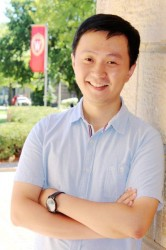
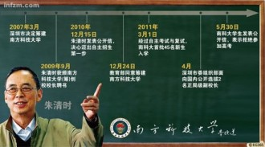
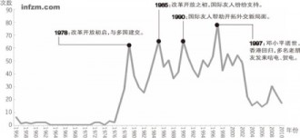

# 方可成：对我而言，新闻理想是存在的

**记者的话：**

“你希望怎样介绍自己？”

“这个问题，我要好好想想。”

这是我向方可成问出的第一个问题。在我看来，这个问题简单、轻松，甚至我都可以帮他拟好一份答案:

方可成，男，1987年7月生于安徽安庆。2010年自北京大学新闻学院毕业，在《南方周末》当了3年记者，现于美国的威斯康星大学麦迪逊分校读政治传播博士。除了每天看书写论文外，还做了一些有意思的的事情，比如写一个叫[“绝版青春”](http://www.fangkc.cn/)的博客，发起了一个叫[“政见”](http://cnpolitics.org/)的网站，主编着一份叫[“一五一十周刊”](http://www.my1510.cn/)的电子杂志，还在微信公众平台上运营着一间虚拟的新闻实验室。

如果说上述答案过于正式的话，我们还可以用“讲故事”的方式来介绍方可成：

不妨从2003年讲起。这一年，中国发生了很多事：SARS肆虐，政府瞒报信息；“孙志刚案”引发了社会对于“收容遣送制度”的讨论，最终促使该制度得以废除；“南都事件”震惊报业，影响深远.....

但这些事情发生时，方可成还是省理科实验班的一名高中生，整日待在教室里做着奥赛试题。他也许不知道下一个十年他将走到很多地方，遇上很多人和事；或许他已经知道了，所以他用自己从数学竞赛省一等奖中获得的保送资格，选择了北大新闻学院。如果非要把这个选择找寻一个支点的话，方可成说：“那是一种夹杂着少年荷尔蒙气息的理想主义冲动。”

后面的故事当然和新闻有关，你可以去读读他的报道，特别是关于南方科技大学的一系列报道；你也可以去看看他的博客，去了解这些报道背后的故事和思考......

但是，方可成没有选择我预想的任何一种回答方式，这有些出乎我的意料。也许他想到了刻在阿波罗神庙门柱上的那句箴言，“认识你自己”。

我一时间不知道该如何接他的话，但在一瞬间理解了他在采访之前说过的话：“采访记者或者曾经当过记者的人是一件很有挑战性的事情，因为记者在采访方面很有经验，他就会有一种‘反采访’的心理，不断地揣摩你这样问的意图。”

他想了很久，以至于他把这个问题的答案留在了最后。

“第一个点是曾经的媒体人、现在的媒体研究者，对媒体的持续参与和观察、思考。

第二个点是对中国社会的持续观察和思考，并且希望能够在社会转型中发挥哪怕是非常非常小的作用。

第三个点我很喜欢说自己是‘曾经是理科生的文科生’。我们现在把‘民主’看得非常重要，但很多时候可能忽略了‘科学’的角色，我希望可以在民主和科学、理性和感性间做到不偏废。”

方可成摄于美国威斯康星大学麦迪逊分校 图片由受访者提供

** ** ** 从记者到研究者：这是一种很自然的转向**

** **

**七星人物**：为什么做出离开《南方周末》、去美国读政治传播博士的决定呢？你如何看待记者到研究者的角色转变？

** **

**方可成**：原因我在文章[《再见，南方周末；你好，博士生活》](http://www.fangkc.cn/2013/08/goodbye-southern-weekly-hello-phd-life/)中已经说得很清楚了。我告别了媒体界，也告别了中国，来到美国来读书，看上去是一个很大的转变，但在我看来，这是很自然的转向。我现在研究和思考的问题仍然是和中国的社会，特别是中国的媒体紧密相关的，所以我觉得没有什么本质上的不同。

当然角度上会有不一样的地方：比如记者的回答会更为迅速和及时，去尽量找各个方面的人来发声；对于学者而言，如果选定了一个研究的主题，他花的时间会更多一些。

这个过程中他们用的具体方法也不一样。记者主要是采访，学者有时候也会用访谈的方式，可能和记者的采访有些相像，但也不完全一样。学者还会更多地用问卷调查、田野考察、实验等各种各样的方法来做，因此学者可能做得更加深入一些。并且，从某种程度上说，学者的研究也可能更严谨些，因为他们有一套非常成熟的研究方法和理论支持。

** **

**七星人物**：从一个参与者到一个研究者，你的研究方向有哪些？

** **

**方可成**：现在刚刚过来，还是在学习理论知识和研究方法，具体的研究课题要到两三年之后才能确定。如果说得更宽泛一些，我在《再见，南方周末；你好，博士生活》一文中提到了很多，比如说媒体与政治的关系，比如说新闻生产中许多有趣的问题等等。当然我也会去观察美国社会、美国媒体，或许会和中国进行一个对比。

** **

**七星人物**：在你的记者生涯中，心中有没有一个好记者的标准？

** **

**方可成**：这和衡量任何职业的标准一样。一方面，它没有统一的标准，你可以从各个角度来衡量，比如说很善于思考，很有批判力；比如所很能拿料，很能突破；再比如说文笔很好。

如果一定要说这些标准之间有什么共性的话，可能和记者这个职业的使命有关——好记者应该是能够有助于公民来理解这个世界。

我自己比较欣赏更有思想的记者，特别是经受过比较系统的思维训练，能够有批判性思考的记者。

另外我也会比较欣赏“理直气不壮”的记者，这五个字是清华大学教授秦晖在《南非的启示》一书提到的。他可能更多的用在对知识分子的期待上，但我觉得也可以用在对记者的期待上：首先是“理直”，你要有清晰的逻辑，要把一件事情理解清楚；“气不壮”是说即使你对一件事情理解得非常清楚，最好也不要太“气壮”——我们要对自己多一些怀疑，不要认为自己掌握的就是宇宙的全部真理，别人说的都不对。“理直气不壮”才可以营造一个非常好的公共讨论的氛围。

** **

**七星人物**：从这些标准来看，你觉得自己做的怎么样？

** **

**方可成**：嗯...如果从这个角度来说勉强可以吧，这样说会不会有些太不谦虚了（笑）。这些标准对我而言更多的是一种要求。一方面是通过一种科学的态度来理解事物，另外一方面还是要多一些怀疑。

** **

**七星人物**：将来你是否还会回到新闻界呢？

** **

**方可成**：如果说再回到哪家媒体做记者的话，应该不太可能吧，因为读了博士的话，基本上就走在学术这条“不归路”上了。

当然，记者的定义也在发生变化，如果用前几年非常火的“公民记者”的概念，我当然可以继续做公民记者，持续对自己见到的事情进行报道和评论。另外，我虽然是做研究，但我肯定会和业界有很多互动和交流，也希望将来可以从学者的角度为新闻业的进步做一些贡献吧。

** ** ** 新闻实验室：自媒体不是一个新概念** ** **

**七星人物**：为什么想到在微信上开设“新闻实验室”呢？

** **

**方可成**：今年以来，微信公众账号非常火。我既然要观察新闻界，当然也包括新媒体界，一个很重要的观察方式就是参与其中；另一方面，如今移动阅读成为一个趋势，我的东西也应该在移动媒体上有所呈现，所以就开了“新闻实验室”这个公众账号，算是做一个尝试。

但“新闻实验室”也不是凭空出现的，它和我在博客上一直在写的东西是联系在一起的。我写博客写了很多年，博客上很大一部分内容都和对新闻界的思考有关。

现在我们处在一个新闻业发生剧烈变革的年代，我希望在实验室里对新的模式、新的案例、新的思维加以引进和介绍，能够在变革中做一些观察，进而有一些贡献吧。

** **

**七星人物**：目前实验室的账号是个人运作还是团队运作？

** **

**方可成**：现在是一个人在做，绝大部分东西都是自己写的，当然也约过2、3篇稿子。从今年3月份到现在，其实更新还是比较少的。

如果有人愿意加入一起合作当然很好，不过这种事情不能强求，还是要看缘分的。如果没有人的话，就这么一个人做下去也未尝不可。

** **

**七星人物**：最近一段时间，不少媒体人或者前媒体人借助新媒体，运作自媒体账号，这是否已经成为一种趋势？

** **

**方可成**：从今年来看，确实有很多这样的案例出现，这的确是一种趋势。在媒体圈中，最早一批开自媒体账号的都是IT媒体人，他们是在报道IT领域的创新，后来其他类型的媒体人也有跟进。

这个现象出现的原因是非常容易理解的。一方面，媒体人离信息是最近的，他每天的工作就是去搜罗各种各样的信息，但是他得到的信息只有一小部分呈现在报道当中，还有相当一部分没有呈现出来，这些信息就成了他们可以运作自媒体的一个资源库；另外一方面，媒体人阅读、写作能力比较强，运作起来也有优势。

** **

**七星人物**：但是一直做下去的人并不多。

** **

**方可成**：这也是一个现实。运作这样一个自媒体账号需要投入很多的精力。个人来做的话，能够长久坚持下来的确不容易。

** **

**七星人物**：打算将实验室做多久？

** **

**方可成**：这要取决于微信的寿命有多长。我一直在做这方面的研究，写写东西也很正常，虽说更新的频率比较低，但还是会一直做下去的。我原本就没有多大的野心，没想过要把它做成很庞大的订阅人数，或者靠它赚钱怎样。作为自己的公众平台，写写自己的思考，积累一些读者的互动，这也是非常有意义的事情。

大家现在都很捧微信公众平台，很捧自媒体形态，但是在我看来“公众平台”“自媒体”并不是什么新鲜的概念。博客已经有十几年了，博客之前还有做个人主页（homepage）的，这些都可以算是“自媒体”。我一直在写博客、微博，如今的微信也是一个自然而然的延伸。

《南科大内忧》插图 图/南方周末

**媒体变革：我们要想想更多可能性**

**七星人物**：你刚刚提到了媒体变革，这个变革的动力是什么？又会是什么趋势呢？

** **

**方可成**：最主要的动力当然是因为技术驱动。新闻业历史上的变革基本上都是技术驱动的，最新的变化跟新媒体的发展有很大的关系。

短期内看来，移动阅读的趋势越来越明显，大家对纸质媒体的消费会下降得很厉害，通过社交媒体获取信息的趋势也是越来越明显，但这些都是短期内大家可以看见的。至于更长的趋势，我想没有一个人可以做出很准确的预言。

** **

**七星人物**：你的实验室中，信息图（编者注：又称为infographic，是指数据、信息或知识的可视化表现形式）、数据新闻这些名词比较新颖，它们是如何出现的？目前在国内的发展如何？

** **

**方可成**：信息图、数据新闻的出现本质上也是技术驱动。目前各行各业都在谈论大数据，新闻业也不例外，大数据驱动会对新闻的呈现产生很大的影响。

但现实情况是信息图仍然受制于很多方面的因素，一个是没有足够的公共数据，中国的数据公开程度是很差的。除此之外，人才的限制也是很明显的。这种新闻模式更需要跨学科的人才，最好能够既懂新闻，又懂数据处理，还懂设计，如果会编程就再好不过了，但是目前这种人才基本上很难找到。这样就导致现在很多门户网站虽然在做信息图，但这些信息图并不是真正的数据新闻，真正的数据新闻是建立在大量的数据基础上的，他们只是把一些信息、现象、条文等做成一个图解。

** **

**七星人物**：除了技术驱动，你观察到的近些年的新闻报道的创新还有哪些呢？

** **

**方可成**：新的东西一直都有，有大有小。比较大的创新可以举徐达内的例子，他在FT中文网上的专栏“[媒体札记](http://www.ftchinese.com/column/007000006)”，已经运作成一个品牌。媒体报道事件，他对媒体报道的事件再做一个综合性描述，这种写作形式就是一种挺成功的创新。

小的创新也一直都有。《南方周末》曾经做过一些新鲜的尝试。比如2010年世界杯时，章鱼保罗非常火，《南方周末》就做了一个章鱼哥的虚拟访谈，假设记者采访章鱼哥，请它谈一谈房价、股市等社会问题。我在《南方周末》的时候也有过一些创新，一个就是[《红“网”——中国共产党官员被规定的纪律化生存》](http://www.infzm.com/content/51596)，通过一个虚拟的人物对共产党的纪律进行了常识性的介绍；再比如说[《谁是“中国人民的老朋友”》](http://www.infzm.com/content/55879)，它就是通过数据检索、统计和专家分析完成的。在写文章的过程中我检索了1949年至2010年的《人民日报》加以统计，并请专家分析数据背后的原因，整个操作其实非常简单。

要想创新，就要防止思维僵化，陷入到一种常规的模式，我们要多想想有没有更多的可能性。当然，这些东西很小，也许算不上创新，但都是一些很有意思的尝试。

** **

****

“中国人民的老朋友”历年出现频次 图来自第1411期《南方周末》《谁是“中国人民的老朋友”》

** **

**媒体与政治：媒体应该提供真正的公共讨论平台** ** **

**七星人物**：在中国，公众对于时政报道的印象普遍是新闻联播式的。作为曾经的时政记者，你是如何看待时政报道的？

** **

**方可成**：这个不能一概而论，媒体的性质不同，时政报道的风格也就不同。党媒和市场化媒体的风格肯定是不一样的。《南方周末》是最早开始进行时政报道的市场化媒体，它算是引领了一个风潮，此后各个市场化媒体也纷纷开始参与其中。

再比如说，《壹读》是主打时政报道的，主编林楚方、执行主编马昌博都曾经在《南方周末》工作过。在我看来，他们可能是中国最好的时政记者之二。他们的时政新闻就做得很好，很有趣味，完全不是新闻联播式的。

** **

**七星人物**：市场化媒体进行时政报道，最初会不会遇到很多难题？你认为市场化媒体进行时政报道的意义是什么？

** **

**方可成**：在一开始，肯定会有一些不理解的声音。《南方周末》在上个世纪末的时候，因为报道冤情、揭黑而深入身心，它一直是以一种为民请愿的形象出现的。本世纪初提出要去做时政报道，有人担心这和《南方周末》一贯的价值观不符，认为和高层接触，和官员打成一片，会脱离了这一形象。但是最后的实践结果证明，这是非常成功、非常符合《南方周末》的价值观的。

为什么这么说？简单地说就是这些时政报道让我们国家关于政治运作方式等方面的信息更加透明化。我们去报道政府如何运作、官员如何思考，这是构建一个民主社会非常重要的方面。因为公民只有了解这些，才有可能更好地去参与政治。

在西方有一个极其重要的概念，叫做informed（知情的，了解情况的） citizen（公民），蛮难翻译成中文的，民众需要了解尽可能多的信息才能够判断和参与。在美国，这种参与是能够负责任地投票；在中国虽然没办法投票选主席，但是可以通过其他方式进行政治参与。所以媒体最主要的作用应该就是这个方面：让民众更加informed。

另外一个方面，媒体也应该提供一个公共平台，供大家做真正的公共讨论，这样的平台或许可以被称之为公共领域（编者注：由德国哲学家、社会学家[哈贝马斯](http://baike.baidu.com/view/132484.htm)提出，意指的是一种介于市民社会中日常生活的私人利益与国家权利领域之间的机构时空）。

** ** ** 新闻理想：对我而言，这个名词是存在的 ** 

**七星人物**：你曾多次说起过2003年“被媒体人的理想主义情怀以及他们的实际行动深深感动”。这一年我们确实见证到了媒体的力量和无奈，如今十年已过，你觉得媒体又有怎样的力量和无奈呢？

** **

**方可成**：跟2003年比较起来，一篇报道影响一个政策的时代已经过去了。从03年到现在，仅仅只有孙志刚这么一个案件真的影响了一个政策的变化，后来再也没有出现过。这一时代的过去，有相当多的原因，既有当时胡温新政的政策环境，也有各种其他因素综合作用的结果。

从某种程度上说，这个时代的过去好像是挺无奈的，媒体的力量没那么大了；但是从另外一个角度说，这未尝不是一件好事。现在更多的呈现出一种多元利益博弈的状态，媒体代表着其中的一种力量。民主社会就应该是一个多元利益博弈的过程。

** **

**七星人物**：你是如何看待新闻理想的？

** **

**方可成**：没有人对新闻理想有过一个非常明确的定义，各种人都可以说他/她有新闻理想，但是每个人对它的解读都不一样。从某种程度上说，新闻职业和其他职业本质上并无不同，但是新闻行业又确实有它的特殊之处，比如它天然的和社会责任联系得更紧密一些。

如果没有新闻理想，当年我一个理科生，就不会去学新闻了。至少对于我而言，“新闻理想”这个名词是存在的。我最初对于媒体的理想啊、责任啊的理解都是非常简单的。经历了三年的记者生涯后，我对媒体的复杂性有了更深的了解，但“理想”“责任”依然高尚而值得追求。

当你对一件事情不太了解的时候，你更容易对它产生理想甚至幻想，如果你能够在了解这么多事情之后，依然对它还有坚持，这个其实更重要。我的前同事、原《南方周末》编委邓科给人签名赠言时，喜欢引用罗曼·罗兰的话：“世界上只有一种英雄主义，便是注视世界的真面目——并且爱世界。”的确，“注视真面目”的爱才是真爱啊！

** **

**七星人物**：除了新闻理想，你有自己的“中国梦”吗？

** **

**方可成**：我在媒体做了这么长时间，也在自己的平台上写了很多东西，以至于面对这个问题时，实在不想说我希望中国变得更加民主、自由、尊重人权等等。这已经是非常自然、无需特意强调的事情了。

如果一定要回答的话，我愿意从更具体更微观的角度说，我希望中国人能够真正按照自己的意愿和理想选择自己的人生道路。

** **

**七星人物**：你认为现在大多数人不能够自由的选择？

** **

**方可成**：按照我们一般的理解，如果一个人很穷或者社会地位、文化程度很低，那么他可能很难按照自己的兴趣选择人生道路，这点没错。但是在目前的中国，即使是一个拥有较多资源、在社会中处于中上游的人，也没有选择的自由。比如北大的学生，全国最精英的高考胜利者，是不是就能够按照自己的兴趣选择人生道路呢？我觉得不是，而且相当多的人都不是。在找工作时，大家还是更多地考虑户口、体制内的身份这些非常现实的东西。其实很多人在选专业的时候就已经不是跟随内心了，否则不可能出现大部分高考状元都去学商科的情况。如果这个社会上最聪明的一群人都受到这种限制，那么对整个社会的创新力都是一种严重的扼杀。

再比如说，官员这个群体可能是比较有权力的人，但是他们也不幸福，也受到各种各样的限制。有些官员非常有责任感，非常希望为国家人民做贡献，但在现行的官场环境下，他们又能做到多少呢？

于是，所有人都会觉得自己是某种程度上的弱势群体，都不敢按照自己内心的想法去生活。这是一个非常大的问题：表面上没有人禁止你做什么，但是无形的限制非常多。因此我觉得，如果每个人都能按照自己想法去生活，去追求自己的兴趣和理想，那会是一件很好的事情。

（采写：万晓华 编辑：伊明 责编：李卓）

**北斗人物·记者节专题：**

[“时代还很粗糙，我想用人物去反映时代” ——对话《南方人物周刊》资深记者林珊珊：](/archives/43844)这个采写过李克强、王岐山的记者并不是我想象中的样子，她安静、温和，讲话看似轻松却处处不失严谨。而她对人物、时代的理解，的确让我们拥有了更多的方式与角度。  [王克勤：一个捍卫人道的专业记者：](/?p=44036)2013年2月27日，王克勤再次“失业”了。这是他第5次“被离开”自己所任职的媒体。这一次，顶了多年“第一揭黑记者”头衔，已经48岁的王克勤选择了“休息一段时间”。  [“我们要学会与自己的内心对话”——专访爱报道创始人王发财：](/archives/42161)“跟内心交流，也就是在与社会交流。与自己对话是为了内心可以更平和，一颗平和的心可以更好的应对这个纷繁的世界。”
