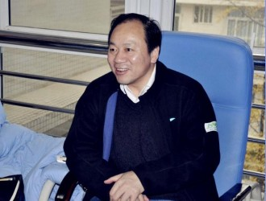
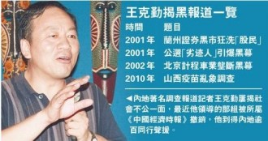

# 王克勤：一个捍卫人道的专业记者

2013年2月27日，王克勤再次“失业”了。这是他第5次“被离开”自己所任职的媒体。这一次，顶了多年“第一揭黑记者”头衔，已经48岁的王克勤选择了“休息一段时间”。其实，休息期间的他与之前状态的不同之处仅仅在于他不再为某家媒体供稿，但他的公益和揭黑调查之路，依旧在继续。

这是王克勤记者生涯的第24个年头，24年间，他一个人就像一支军队，笔下有千军万马，作品屡屡震撼新闻界，2001年，王克勤即以一篇《兰州证券黑市狂洗“股民”》的调查报道，引起震动。《公选“劣迹人”引曝黑幕》《北京出租车业垄断黑幕》《山西疫苗乱象调查》等作品亦联翩登场。因这些报道而最终锒铛入狱的黑恶分子，就多达160多人。

关于王克勤，许多人对这样一幕记忆深刻，在2010年的南方周末“中国梦践行者”的领奖台上，主持人白岩松指着一张透明的玻璃椅和另一张黑色木椅，问王克勤：“你选哪张椅子坐？”王克勤选择透明的那张。他说，“正因为我期望社会透明，所以我要选择揭发不透明。”

媒体人笑蜀这样评价王克勤：当他西装革履地站在北京大学百年讲堂的舞台上领奖时，不会有人想到，很可能在哪个城市的街头跟你擦肩而过的那个一副农民工打扮的匆匆旅人，跟他是同一个人。

记者初见王克勤时，他正在四川大学华西医院为尘肺的农民奔波。面对我们，一身“农民工”打扮的王克勤剽悍热情，侃侃而谈，不时爆发爽朗的笑。而一笑，岁月在他脸上斫下的痕迹便更加清晰。

** **

在华西医院，王克勤接受《常识》记者采访 图/《常识报刊亭》

** ** ** “颠沛流离”的真相挖掘者**

1964年11月，王克勤出生于甘肃永登县的一个小山村。后经过两次高考，最终进入兰州市的一所市属商业学校学习企业管理。由于在学校表现出色，毕业后即进入了兰州市委从事宣传工作。这是个和他现在从事的职业有很大差别的差事，“和自己的性子全然相反”。尽管王克勤态度积极，但还是因为不能适应工作要求而被发配到了一家地处山沟的外贸公司。因为受到上级的刁难，还曾动过“对科长下手”的念头。

因无法忍受这样的生活，血气方刚的王克勤于1989年1月回到甘肃省城兰州，进入《甘肃经济日报》，正式开启了自己二十多年的记者生涯。在今后的岁月中，王克勤骨子里这种的“血性”气质，将逐渐升华成另一种深沉的情感。

让人意想不到的是，这位后来中国最富盛名的调查记者在初进报业的工作却是写宣传稿件。回忆起当年采访省长的经历时，王克勤调侃道：“当时也是感觉无限荣光”。然而，一些似乎是注定为他的性格所设计的命运遭际，终慢慢让他变成现在这个王克勤。

在《甘肃经济日报》做记者的过程中，王克勤经常会遇到一些权益受到侵害的基层上访民众，希望通过媒体曝光，挽回自己的权利。面对这些许多媒体避之不及的群体，出生于山村的王克勤，“对他们有着一种天然的同情”，看着那些与自己父辈一般年长的老农，涕泗横流地跪在他面前哀求时，王克勤感到了“难以承受的重量”，许多年后回忆起来，王克勤说：“当时的感情就是应该为这些人做一些理所应当的事情。”至此之后，王克勤便不再满足于写宣传稿时虚无缥缈的“无限荣光”，而是进行具有纵深性的调查，走上“揭黑之路”。

** ** ** 最不平凡的一年** ****

事情起源于2000年11月，王克勤接到股民们一系列关于兰州证券的控诉。他伪装成商人，频频潜入各大股市，随着不断深入的暗访，兰州证券市场的巨大骗局浮现水面，黑幕被缓缓拉开。2001年1月下旬，王克勤与受自己邀请参与调查的《中国经济时报》记者王宏共同完成报道《兰州证券黑市狂洗股民》。但这一报道并未在《甘肃经济日报》上发表，而是在当年2月3日的《中国经济时报》刊发。

报道一经刊发，甘肃省各个媒体和国内几乎所有门户和新闻类网站都进行了转载，中央电视台的《经济半小时》、《社会经纬》以及《财经报道》等媒体都进行了采访和继续报道。

报道受到时任国务院总理朱镕基的连续重要批示，甘肃省委书记、省长部署展开了全省性的专项打黑斗争，为兰州近万名市民挽回数亿元损失。甚至在全国范围内引发了一场声势浩大的铲除证券黑市的运动。

巨大的影响力带给王克勤的不是荣誉。他收到的第一个“礼物”是2月9号的一个传呼——“我们已知道了你的家庭地址，晚上，我们来接你的老婆孩子”。时隔多年，王克勤回忆当年风传一时的“江湖诏令”，调侃道，“当时有人传黑道的老大用五百万元买我的人头，我一下子成了中国最贵的记者”。收到传呼的那天，王克勤立即向公安部门报案，那一晚，一家人便在4名荷枪实弹的警察保护下度过。

而第二个“礼物”就是被迫从《甘肃经济日报》下岗，原因是王克勤的报道“夸大其词”，“给甘肃抹了黑”，民间也盛传此篇报道“断了省里某位领导的财路”。

他转走《西部发展报》，担任报纸执行总监，但两个月后，报社的资金链条便宣告中断，王克勤再次失了业。这年的8月，王克勤辗转到了《西部商报》，如果换了其他人，多次“惶惶丧家”后，至少不会再不识时务，而王克勤将在这里走一步更险的棋，也将会给自己招来更多的灾难。

在《西部商报》上任之初，他便接到消息，甘肃岷县堡子乡政府以选举方式要求村民必须选出“劣迹人”，并对劣迹人实施罚款和送去劳动改造的处罚。王克勤的“重磅炸弹”在2001年10月4日投入了公共舆论场，这篇以《公选“劣迹人”引曝黑幕》为题的深度调查发表，甘肃堡子乡基层干部搞的“劣迹人”公选活动，横敛钱财、欺压百姓的奇特事件被一一揭露，舆论哗然。

“那时候北京正在召开十五届六中全会，触及到敏感的政治神经，这个报道一下子就炸开了，中纪委遂将报道事件作为重点来抓”。然而最终结果却是，省里专门成立的调查组做出了王克勤收受贿赂操纵报道的指控，让人哭笑不得的是，指控还细节到王克勤收了那家哪户几头猪、几头羊。按照“惯例”，他被《西部商报》扫地出门。

回忆那件事时，王克勤很是感慨。报道触动权贵已不是第一次，而因为自己顽固的坚持真相，颠沛流离于各家报社的遭遇，让这个血性的西北汉子由愤懑、委屈变成了无法承受的绝望。

这一次，王克勤动了自杀的念头。

他到兰州市郊外的一座山上，在山崖边整整坐了一个下午。在面对悬挂当头的死亡之时，王克勤似乎是领悟了什么：“一种宗教性的情结涌入我的心中，我领悟到其他的一切都是靠不住的，只有内心的信仰才能帮助自己重新站起来。”

放下个人的愤懑与委屈，王克勤再一次执拗地做回调查记者，这一次“收留”他的是刊发过兰州股市黑幕的《中国经济时报》。

在这之后，他将凭一己之力把出租车垄断黑幕抬上媒介议程，也将揭露震惊中国的定州血案和山西毒疫苗，同样的，他将再次流离失所。王克勤笑称，“被我‘干掉’的主编都有一堆了。”他对自己因为报道真相而被屡次开除并没有丝毫的顾影自怜。 ** ** ** ** ** 先是人，然后是记者**

在我们这群后生面前，王克勤当然要讲一讲调查性报道的中国发展史，那是和教科书完全不同的一片天空。

在他眼里，中国的调查性报道发展历程始于“亚洲最危险的女人”胡舒立。1998年4月，胡舒立创办了《财经》。“这标志着专业主义揭黑报道在中国落地”，王克勤说。这家杂志后来报道了“基金黑幕”、“庄家吕梁”、“谁在操纵亿安科技”、“谁的鲁能”等一系列重大财经新闻报道，一经发出，便在国内财经界和社会各界引起极大的轰动。

在1999到2003年之间，调查性报道百花齐放。在王克勤眼中，2003年是调查性报道的第一个发展高峰——那一年，有《南方都市报》记者陈峰采访报道的《公民孙志刚之死》，有央视记者冀惠彦冒死在伊拉克战争中抢拍最新镜头，有新华社记者朱玉披露服龙胆泻肝丸导致尿毒症，当然，也有王克勤用半年时间深入采访，披露北京出租车业垄断黑幕，第一次将出租车行业改革提上媒体议程，并且很大程度地影响了后来中国行政管理体制的改革。

转折出现在2004年。是年9月18日，有关主管部门发布了业内称为的“两跨政策”——“不允许跨行业、跨地区报道”，这是对媒体行业调查报道的严重打击，“至此以后，05、06年调查性报道大幅滑坡，07年还有《财经》杂志的《窃国者》的报道，而08年奥运会，09年建国60周年，就几乎没有了。”他无奈道。

王克勤特意强调了孙志刚案的报道，以及他的朋友新华社记者朱玉的报道。在王克勤眼中，这些都是体现人道主义和新闻专业主义的报道，他们追逐热点，更追逐正义。同样的，他也举了一些反面例子，“2004年吉林某报，报道农民工跳楼摔死，它的标题叫《昨夜上演高空飞人》。江苏一家媒体报道农运车从一个骑自行车的人头部碾过，压死了，它的标题叫做《汽车人中头彩：惨死》。这些媒体人，可见他们生命的漠视。”他几乎是非常生气地诉说了这些多年前的反例。

在王克勤看来，自己必须先是一个人，然后是一个公民，最后才是记者。“有人说，克勤兄，你怎么经常做一些不属于记者范畴的事情？我回答说，我作为一个公民，看到那些苦难，我必须为弱者去争取他们的权利。”

数年后，他会因为记者本身的局限性而发起一项全国范围内的拯救尘肺病人的公益项目。而现在等待他的，则是发生在河北定州的一场血案，后来回忆此事，他感慨，“在这片神奇的土地上，没有不能发生的故事。只有你想象不来的，没有不可能的。”

** **

王克勤近年知名报道 图/谷歌图片

** ** ** 新闻管制下的专业主义**

2005年6月11日，是当年的端午节。原本应该吃粽子喝雄黄的定州市绳油村百姓，却遭遇了一场征地血案。“这次定州血案造成6名村民死亡，百余人受伤。一个有组织有预谋的屠杀事件，就发生在端午节这一天。”

王克勤并不是第一个报道此事的记者，6月13日，王克勤在《新京报》上看到了记者刘炳璐的报道，便立即报告给当时《中国经济时报》的总编辑包月阳。包月阳当时就推辞，“老王啊，这个我们报不了，这么大的事情，肯定马上就封杀了。”

“我当时就说，我知道报不出去，但是，有一个原理，我必须得给你讲：记者不仅是当下新闻的传播者，更是历史真相的见证者和记录者。”他举到了写作《古拉格群岛》的索尔仁尼琴和写作《墓碑》的前新华社记者杨继绳的例子，“在当下，我们的报道并不一定能够见报，但是可以作为历史事件的记录者和见证者，这是一个知识分子的责任”。就这样，他说服了包月阳。在将来的某一天，包月阳将为他的担当付出代价——因为同意签发王克勤《山西毒疫苗事件》的报道，他被免去职务。

闻风而来的很多记者并未有效地突破当地政府组织的封锁线，而王克勤却是例外。他和《中国经济时报》的同事乔国栋一起在定州呆了五天五夜，期间，他让同事乔国栋跟着其他媒体的记者一起去采访当地政府，而自己只身一人进入绳油村——各个路口都被封锁，他在路口外面找到一位当地村民，与之一起从羊肠小道铤而走险，由于道路崎岖，几度摔伤。入村后，王克勤的用自己的恳很快取得了村民们的信任，不断往返于各个受害者家庭，采访了大量村民，掌握了包括血腥视频在内的很多第一手资料。

6月18日，采访完毕的王克勤，换上农民的衣服，搞乱头发，把笔记本电脑和相机藏在一个装满麸皮的麻袋里，和另外一个农民开着一辆手扶拖拉机，装扮成到城里卖麸皮的农民。一路经过三个关卡，都有警察四处巡查拦截，他靠着一身农民装扮和抽烟的“云雾缭绕”，掩盖自己的相貌特征以及内心的紧张，终于成功逃脱。回报社后，包月阳为他举行了一次接风，听到他采访的出逃经历，竟然满座人恸哭失声。

对于新闻专业主义，王克勤也有话要说，“是中国的新闻管制逼出了我们记者的专业主义。”在王克勤的《河北“定州村民被袭事件”调查》在《中国经济时报》头版刊发后的第三天，报社一位副总编接到宣传部门的电话，说“你们这个报道是严重的跨地区跨行业违规报道”，这便是上文提到的“918两跨政策”，而当时，“我们的副总编说话也很有艺术，他说：‘我们是《中国经济时报》，如果我们到美国去报到那个可以叫跨地区报道。我们是综合的时政类经济类报道，土地问题既是时政类问题也是财经类问题，所以不存在跨地区的问题，也不存在跨行业的问题’——驳回去了！”

几天后，总编辑包月阳又接到了来自宣传主管部门的电话，这一回杀气腾腾，怒不可遏，“你们这篇报道，严重的事实不真实，我们将通报全国批评！你们压根没采访定州市委，通篇写了采访定州市委的很多文字，定州和河北那边已经告到中宣部了。”包月阳只一句话，“我们的报道没有问题。”而电话说，“你们必须做深刻检讨”，包月阳又只一句话：“我们会写情况说明”。

撂了电话，总编包月阳打给王克勤，“你们到底有没有采访定州市委？你们没采访的话那就完蛋了。”王克勤道，“我们俩合作多少年了，我的做派你又不是不知道，未经我的查证与核实的东西，我绝不写在我的报道里。”

王克勤对我们讲到这里，微微得意，“同学们，给你们讲，这里就是我的报道成功出炉的玄机所在。我给我的记者助手说了，到了现场，别拿着你的‘破本本’‘破片片’，就是记者证和名片都别带。他说：‘老王，那咋采访？’我说：‘这样大的事情，记者媒体很多，大家问的问题不外乎就那些，你扛着头，扛着眼睛，扛着耳朵，跟着混，有什么拿不下的’？”

“这些年，各级政府都成立了突发事件应急小组，就是专门负责宣传和媒体接待的，统一发布，统一口径。CCTV、《南方周末》等媒体只要找当地到宣传部，就被统一请进去，统一喝茶。宣传部部长和副部长来了以后呢，第一个动作就是统一地握手——第二个动作就是交换名片。轮到我的同事的时候呢，我的同事就说，名片用完了；对方又问，你是哪儿的，我同事就说，我们一起来的。”

彼时包月阳终于舒一口气，王克勤也对此报道写了一个书面说明给中宣部，最后他写道，“如果河北方面和定州市委方面还不能确认，请派定州市委宣传部部长和副部长亲赴北京，前来确认，本报资料室留存此次报道的全程录音，欢迎河北和定州的同志们来本报共同欣赏。”

这件事情的解决是，定州绳油村血案最终真相大白，包括市委书记和风在内的27名被告分别被判处死刑、无期徒刑和长达数年的有期徒刑。

时至今日，王克勤依然能清楚地回忆起离开绳油村时，那位真农民握着他这个假农民的手，含泪拜托他的心酸场景，“作为一个人，我看到别人痛苦，我会跟着痛苦，记者就是要捍卫人道。”而同时让他引以为豪的是，在严苛的新闻管制下，他依然能凭借严谨的作风，真实到每一个细节的文字，把人道主义的关怀建立在专业主义的新闻真实之上。

在此之后，我们会看到邢台艾滋病调查、山西疫苗乱象调查、河北大学飙车案调查（“我爸是李刚”一案）、钱云会之死调查……王克勤的每一篇报道都一颗导弹，定位精准，威力十足。 ** ** ** ** ** 让无力者前行**

王克勤关心尘肺病人始于2009年河南农民张海超“开胸验肺”的悲惨经历。他唤起了王克勤一段记忆。当年自己在《甘肃经济日报》工作时，曾采访过一位副矿长老黄，这位咳嗽得上气不接下气的副矿长几年后就被尘肺病活活地憋死。

他开始关注尘肺病，派出记者去甘肃古浪采访那里一百多位患尘肺病的农民，报道产生连锁反应，许多媒体竞相关注。随后王克勤又与网友一起推动对尘肺病人的救援行动。

2011年6月15日，“大爱清尘寻救尘肺病农民兄弟大行动”公益项目正式启动，然而遗憾的是，在与中华社会救助基金会联合举办的第一次募捐活动却遭遇了尴尬的冷遇，三笔捐款中，还有两笔是来自参与活动的志愿者。其实在王克勤推动“大爱清尘”项目之前就有朋友奉劝过他，说这不是记者的本分，记者只是呈现真相，问题的解决则不在其考虑范围之内。更严重的是，政府方面怀疑王克勤推动的这个救助行动有反华势力渗透，相关领导对其进行严厉的谈话，并多次召开党代会进行批评，媒体方面也是对他“骂声不断”。

“都是人！都是一样的生命，对于农民工兄弟的生死我们不能视而不见！”王克勤当然理解做好记者本分工作的意义，但是他同时也认为，我们面对的这个社会在一些方面是不负责任的，他要拉一把那些在生命线上垂死挣扎的人。

好在2011年，民间公益受到前所未有的关注，并且通过微博，“大爱清尘”有了起色。它开始成为被人们所熟知的公益项目之一。

运用新媒介自我推广是建立在扎实的救援工作之上的。“大爱清尘”成都区一位助理告诉记者，“面对全国至少600万的尘肺农民工群体，‘大爱清尘’的工作自然是杯水车薪。但是，它努力做到对每一个接受‘大爱清尘’帮助的尘肺患者尽心尽责，而不是追求救助数量上的辉煌。除了坚持项目本身的规范和原则，也会根据尘肺患者本身的实际情况作出相应的调整，例如为因病致贫的尘肺患者子女寻找助学资源、为需要在家吸氧的尘肺患者购买制氧机、为特别困难的家庭发起‘微公益’，募集指定数目的善款帮助他们渡过难关。”

总算有所收获。2012年，越来越多的人加入到“大爱清尘”中来，多位“大爱清尘”志愿者接受记者采访时，被问起其中原由，都表示是被王克勤的个人魅力所吸引而来，但更多的是则因为对“大爱清尘”所宣扬的理念的认同和对项目的信任。

一位曾经的成都区“大爱清尘”项目助理说：“作为发展如此迅速的公益项目，‘大爱清尘’自然需要面对各种各样层出不穷的问题与挑战，但我们还是有理由相信，只要怀着爱与正义、理解与信任，‘大爱清尘’便可以在问题面前做出正确的选择而不是迷失方向。”

** **

由王克勤联合中华社会救助基金会共同发起的

[“大爱清尘·寻救尘肺病农民兄弟大行动” ](http://www.daaiqingchen.org/)

** **

而王克勤，于2013年2月27日被迫离开了《经济观察报》。对于这次离职，外人不得其由，有新浪认证的报社记者“冯军槐溪先生”于微博中写道——

“著名调查记者王克勤昨日离职经济观察报。2011年9月刘坚（经济观察报总编辑）三顾茅庐请王克勤组建调查部，推出了诸多有影响力的报道；后因《北京暴雨失踪者》一文惹恼相关部门，经观差点被封门，2012年10月8日调查部终遭解散，记者尽数离开。手下无兵的王克勤本想2013年亲自操刀，结果腊月25，人力总监约谈他劝离。”

太阳恒常地照耀着大地之上，但这并不意味着这个世界就不再有黑暗的地方，人类自己投下的阴影，那些生活在其中的受难者需要人心的大爱来温暖，王克勤不再供职于媒体，却仍然在记录和参与着这个剧烈摇动的大时代。

本文原刊于北斗网合作媒体[《常识》](http://www.renren.com/322077116/profile)第八期****

** **

（感谢胡璇艺在本文采编中的帮助）

（采写： [《常识》](http://www.renren.com/322077116/profile)记者： 邹思聪、朱玉 责编：李卓）

** ** ** ** ** ** ** ** ** 北斗人物·记者节专题：**

[“时代还很粗糙，我想用人物去反映时代” ——对话《南方人物周刊》资深记者林珊珊：](/archives/43844)这个采写过李克强、王岐山的记者并不是我想象中的样子，她安静、温和，讲话看似轻松却处处不失严谨。而她对人物、时代的理解，的确让我们拥有了更多的方式与角度。  [方可成：对我而言，新闻理想是存在的：](/archives/43911)“我的前同事、原《南方周末》编委邓科给人签名赠言时，喜欢引用罗曼·罗兰的话：“世界上只有一种英雄主义，便是注视世界的真面目——并且爱世界。”的确，“注视真面目”的爱才是真爱啊！”  [“我们要学会与自己的内心对话”——专访爱报道创始人王发财：](/archives/42161)“跟内心交流，也就是在与社会交流。与自己对话是为了内心可以更平和，一颗平和的心可以更好的应对这个纷繁的世界。”
