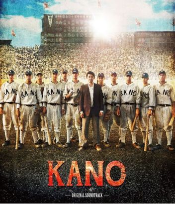
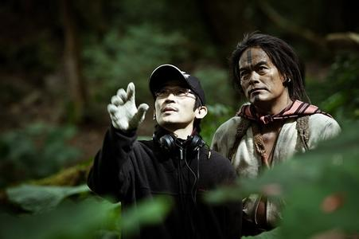
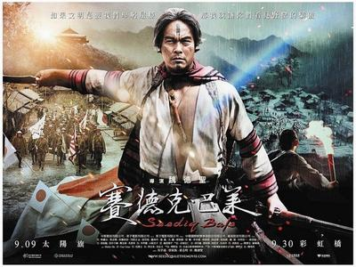

# 超越框架而和解？----《KANO》影评

《KANO》上映至今毫不意外地掀起了一陣討論熱潮，津津熱道其熱血劇情者有之，聲色俱厲攻訐其史觀者有之，抱持溫情為其辯護者有之，被曹佑寧的青春肉體/永瀨正敏的大叔魅力迷倒者亦有之。這樣的風潮大概也印證了，魏德聖出品的電影在臺灣已成不可忽視的文化商品與現象，而臺灣史上的日本殖民時期則是當代臺灣人種種想像寄託之所在，因而也成了兵家必爭之地。

《KANO》所講述的故事，在相當程度上是很能引起我共鳴的。我自己打過幾年壘球，也看了幾年棒球，片中描述的練習的艱辛、比賽勝負、隊友之情......在我的球員生涯裡面或多或少都曾經歷過。於是我在觀賞《KANO》的時候，我很快就把自己帶入了電影所營造的情境之中，幾乎每個段落我都能在其中找到一些自己經驗的影子：兩位前輩未能完成最後一場比賽的悔恨之情、首度戰勝對手的欣喜、對於勝利的渴望、奮戰不懈卻功敗垂成的失落......不誇張地說，有幾個段落確實成功地刺激了我的淚腺。

於是就以運動競賽為主題的電影來說，《KANO》無疑是非常成功的一個例子。這部電影完全符合少年漫畫式的「友情、努力、勝利」定律，從頭到尾除了熱血還是熱血。這部作品裡有著睿智堅毅的嚴父師長、同樣熱血的勁敵、性格各異有時還帶點喜感的戰友，整部電影的主線劇情乾淨無雜質得活脫是老派少年冒險漫畫的作風，甚至連用以點綴劇情的少年少女清純而無果的愛戀，也都在在凸顯這是個多麼純粹的故事。我相信在近期之內，臺灣大概很難再拍出更「好看」的棒球電影了。

（題外話，若還要拍以棒球為主題的電影，何不以某黑金戰士為藍本拍個假球淪亡錄之類的大片呢？就寫一個充滿熱情理想的棒球少年抱著滿腔熱血一路過關斬將踏入棒壇，出國比賽為國爭光聲譽正隆卻不幸迷失自我逐漸沈淪毀譽參半，最終誤入歧途身敗名裂遭到棒壇放逐後驀然回首獨自喟嘆的深具人文關懷與社會批判教育意義的故事吧。臺灣影壇太缺這類社會寫實冷硬路線的大片了。）

但話又說回來，《KANO》感動我的地方其實就是它對於棒球這項運動競賽的描寫刻劃，以及圍繞著這項運動展開的種種人際關係與情感流動。我對於本片的感動，實際上毋寧是一種私密的情感，是一種對於青春記憶的召喚與同理。但顯然本片的監製魏德聖、導演馬志翔想做的並不只是對於這種情感的共鳴與召喚。若要提到這部電影的本意，那就不得不去思考該片對於重構1930年代臺灣社會歷史的嘗試吧。

本片所建構的1930年代臺灣很明顯地是循著殖民現代性的脈絡開展的。片中出現了許多殖民地臺灣踏入近代社會的符號，大者如嘉南大圳工程，小處如嘉義市區的現代化街景和噴水池圓環、收音機等，並且呈現了片中角色是如何接受這些事物的到來。這可以說是貫穿全片的一股主要脈絡，鋪墊了嘉農棒球隊得以在這個時代成型的背景。事實上，棒球這項運動在帝國域內的風行、甲子園作為中學棒球的最高殿堂、乃至於嘉農這所學校的成立，無一不和帝國在其領域內推動的現代化進程相關。於是除了嘉農，在片中也（儘管一閃即逝）出現了來自（同樣作為殖民地的）朝鮮、滿洲的球隊。這些元素都暗示了《KANO》這個故事特殊的時空脈絡。

於是《KANO》不得不面對外人對於其歷史立場的批評。「媚日」的質疑自本片展開宣傳工作以來就揮之不去，片中對於八田與一的形象塑造更是讓一些人深感不快。為什麼要在這部棒球電影當中放進嘉南大圳、八田與一這類的元素呢？魏德聖是這樣說的：

嘉南大圳的開通，一個很大的目的是，台灣南部『水的問題』解決了，稻田面積增加好幾倍，稻田跟這支棒球隊有什麼關係？因為這支棒球隊是嘉義農林學校的球隊，他們是要在土地上面實習，種稻、種樹、甚至要在土地上打球奔跑，所有東西都跟土地結合在一起。農業跟工業產生連結，農業又跟運動產生連結，為什麼而打……

簡而言之，魏德聖是試著爲嘉農這支球隊尋找一股與土地、現實生活的聯結：嘉農的學生接受著現代化的農業技術教育，而他們所學得的技術以及他們的棒球，對於豐富、澆灌這塊土地都有其意義。於是嘉南大圳這一重大農業水利工程所澆灌出的金黃色的田野，便成為了這一「意義」的具體形象。這同時也解釋了片中主角們對於八田與一的仰慕之情：作為農業學校的學生，對於這種攸關國計民生的大型工程大概都會有著關注與期望吧？

但老實說，我並不那麼欣賞《KANO》對八田與一其人以及嘉南大圳工程的敘述。片中的八田以一種威嚴而慈祥的家父長形象出現，接受著青年學子的擁戴。他高坐在鐵牛車上的形象在在透露出某種權力階序的存在，暗示了被殖民者透過殖民者的「恩惠」走向現代的脈絡。嘉南大圳和八田只是本片的旁線劇情之一，一定程度的去脈絡大概是無可避免的，但在我看來，這樣的去脈絡敘述和歷史想像卻也是有危險性的。

然而，我想還是要回到棒球的主題，才能釐清魏德聖、馬志翔在本片中是怎麼認識、建構這段歷史的吧。若回顧魏德聖自《海角七號》、《賽德克·巴萊》以降的創作歷程，不難發現他對日本殖民歷史的長期關注。他在這些作品中直面地處理了臺日人民在歷史與現實中曖昧糾結的關係，同時對於這些人物的選擇抱以溫情的同理之意。魏德聖不止一次對外表示，他希望能在他的電影裡讓時人與歷史達成「和解」，我認為「和解」一詞正是理解魏德聖的創作理路不可或缺的關鍵字：

我一直不會去想甚麼英雄跟小人物的問題，沒那麼強烈的思考，我只是覺得在一個歷史的架構裡面，能不能去詮釋一個和諧、和解的結果。不管是《海角七號》也好，不管是《賽德克?巴萊》也好，甚至以後的電影也好，我都希望可以去講出一個和解的過程。台灣人活的太辛苦了，常常在仇恨跟遺憾裡面找不到一個平衡點，在愛跟恨之間找不到一個平衡點。

魏德聖所謂的「和解」，或許可以解釋為一種相互的理解，並且透過理解去化解個人之間乃至於族群之間糾纏的情結和矛盾。於是在《海角七號》，他透過遲來的情書完成了臺日的和解，也讓阿嘉、友子與他們身邊的眾人能夠完成和解；在《賽德克·巴萊》，則透過血祭祖靈的儀式以及對於歷史脈絡樸質誠懇的鋪陳，完成賽德克族各部之間、賽德克人與日本人間的和解。魏德聖電影中的人本主義關懷以及思想縱深，便是在這種「和解」的意圖與實踐上建立起來的。在這方面，或可引用近來廣為流傳的曾柏文〈KANO：熱血野球外的歷史扣問〉一文對魏德聖電影的觀察加以說明：

關鍵人物的心理側寫、對歷史真相與記憶複雜性的提醒，與對主要角色溫情的倫理凝視，使得魏德聖的歷史電影富有濃郁的人本色彩，迥然不同於那些在國家民族大義下拍攝的，旨在召喚認同、提昇同仇敵愾的愛國歷史電影。

於是《KANO》片中的角色塑造也同樣承繼了魏德聖的風格。片中近藤教練與嘉農的球員們秉持著樸素誠摯的精神爲同一目標而奮鬥，而學校的師長們、嘉義的鄉親們甚至「對手」嘉中的同學們也多是以肯定的心態支持著這支球隊。於是除了球隊本身是超越族群隔閡的存在，魏德聖、馬志翔也建構了以這支球隊為中心的情感紐帶，讓這支球隊聯繫了跨越族群的「臺灣住民」（原住民、漢人、在臺日人）們。片中不分族群的鄉親們群聚在收音機前爲嘉農隊打氣、歡呼、落淚，而嘉農這支棒球隊之於臺灣的特殊意義便在這個過程中完成了。

《KANO》也將其企圖心延伸到更廣闊的範圍。在片中，魏德聖、馬志翔設計了一個日本記者的角色，以見證嘉農這支球隊如何超越族群的藩籬。這位記者原本對於嘉農的原、漢球員嗤之以鼻，隨著嘉農隊一路過關斬將，逐漸萌生出對他們的敬意，最後爲他們「那不同人種卻為同樣目標奮戰的英姿」感動落淚。此外，也安排了作為對手的錠者博美，從另一個側面對嘉農的精神與成績表達敬意。至此，《KANO》似乎完成了一個完整的圖像，設想由棒球運動超越各種藩籬而達成和解的可能。在一次訪談中，記者詢問馬志翔「電影裡有沒有種族歧視」，馬是這樣回答的：

怎麼可能沒有種族歧視？我們當然知道有種族歧視這件事。日本人對待當時的台灣人是二等公民，更何況對原住民是三等公民。在電影裡，我的確有試著加入一些族群問題在裡面，那是沒有辦法迴避，但那個族群問題是因為不了解彼此......

歧視的源頭是因為不了解。人對自己不熟悉的事物會產生恐懼，一恐懼就會抗拒；而通常人表達抗拒最快的方式就是言語，再來就是行為。

以嘉農來說，這群孩子到很多地方都被歧視，不只是原住民，連當時內地的日本人也會歧視外島的日本人......

簡而言之，馬志翔確實意識到了歷史上的殖民時期存在著種種的藩籬與不平等。不過他的態度是傾向相信人與人之間相互理解、良善共存的可能，並且提示讀者《KANO》的故事是在試著探討某種超越現實環境、框架而存在的價值。若用曾柏文的話來說，就是本片嘗試建構一種以人本為出發點的主體性：

看魏導的電影，我相信他心中的「台灣主體性」，絕不是任何國家機器（包括皇民化運動或國民黨的愛國教育）或文化菁英能由上而下灌輸出來的。那種主體性，是以草根的、人本的、分歧、參差的多元認同為根，透過無數衝突、斡旋、對話、理解的「社會過程」，逐漸形塑的「公共主體」。這種主體認同「不可能」整齊劃一，但能包容歧異。

這樣的見解是相當值得深思的。在《KANO》片中，近藤教練這個角色的刻畫或許正提示了這種多元認同的可能性。近藤在日本本國原來是風雲人物，卻因為種種原因而失意地自我流放到殖民地臺灣。這道脈絡相當需要注意，殖民地原本就是許多本國人士尋找發展機會的地方，於是當時來到臺灣的日本人，有不少其實在本國並不得意，甚至還有為數甚眾的底層民眾，是為了求溫飽渡海而來，最後在臺灣落地生根。《KANO》的近藤教練透過其生命實踐超越了族群的藩籬，然而終究，賦予他這個機會實踐其生命的，實際上仍是帝國對外擴張的結果；他與嘉農的球員們的關聯，依然是建立在殖民地帝國所架構的教育體系之下。於是在這裡值得深思的問題在於，我們應該如何理解歷史上個人的種種作為，以及這些個人在歷史脈絡下的位置呢？究竟個人的善意、奮鬥、精神，是否真能超越現實框架的限制而存在呢？進一步言之，人本主義式的歷史認識與歷史脈絡、框架的互動關係，能夠有著多少可能性呢？

本文無意去深究《KANO》一片中所架構的1930年代臺灣圖像真實與否。事實上，若從蘇正生等嘉農球員的回憶來看，這種超越族群隔閡的實踐很可能是真切存在於這些原、漢球員的生命歷程中的。但我要指出的是，即使歷史上的嘉農隊可能確實是超越族群隔閡的實踐，終究我們後人還是必須正視殖民這個機制的存在。而且必須注意的是，機制、框架的存在與影響，不見得會體現在歷史當事人的經驗、記憶當中，但這並不代表它不存在。儘管電影裡的日本記者「感動落淚」地肯認了嘉農跨越不同族群而萌生的力量，但是這種感動顯然並不意味著殖民機制下的不平等的解消。《KANO》所揭示的那種三族共和的局面，即使提供了我們重新認識臺灣史的可能性，但其本身並不是那麼無瑕崇高不可批評。就以嘉南大圳來說，即使臺灣人民對於八田與一其人的貢獻與人格是肯定、感念的，也並不意味著對於這項工程（以及成就這項工程的殖民體系）的全面肯定。我願對《KANO》對於「和解」的嘗試與努力表示敬意，但是我也認為，這部電影選取的視角對於歷史的確是欠缺批判的。而這種批判的缺席，也連帶使其所架構的「和解」失去了更深厚豐富的可能，這毋寧是一件非常可惜的事。

在我看來，真正的和解，除了訴諸於相互理解、建立紐帶，也在於對於歷史的批判。《賽德克·巴萊》的傑出，也正是在其直面歷史陰影的勇氣與格局。這絕不意味著我們應該走回愛國主義史學的老路，訴諸排他的國族主義情緒來認識、建構歷史，批鬥非我族類的人們。但是，終究我們要承認，許多時候歷史的傷痛與隔閡是無法單靠同理來消弭的。歷史的真相常常並不那麼溫情，而只有不畏懼受傷的人，才能有堅強的人格。同樣的，只有不畏懼傷害的人群，才能建立起堅強健康的國家、社會。

原文地址: https://www.facebook.com/notes/yuhan-huang/kano%E8%B6%85%E8%B6%8A%E6%A1%86%E6%9E%B6%E8%80%8C%E5%92%8C%E8%A7%A3/10152327494406057

(采编：刘鑫杰、余泽霖;责编：王冬阳)
