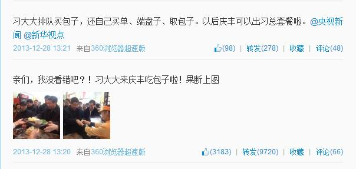
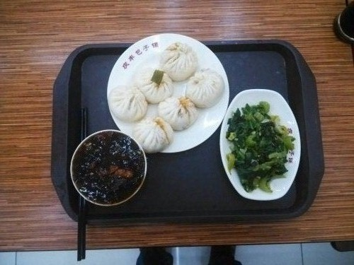
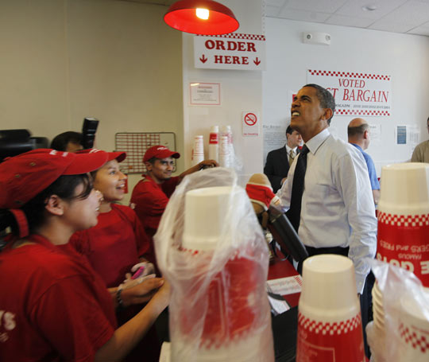
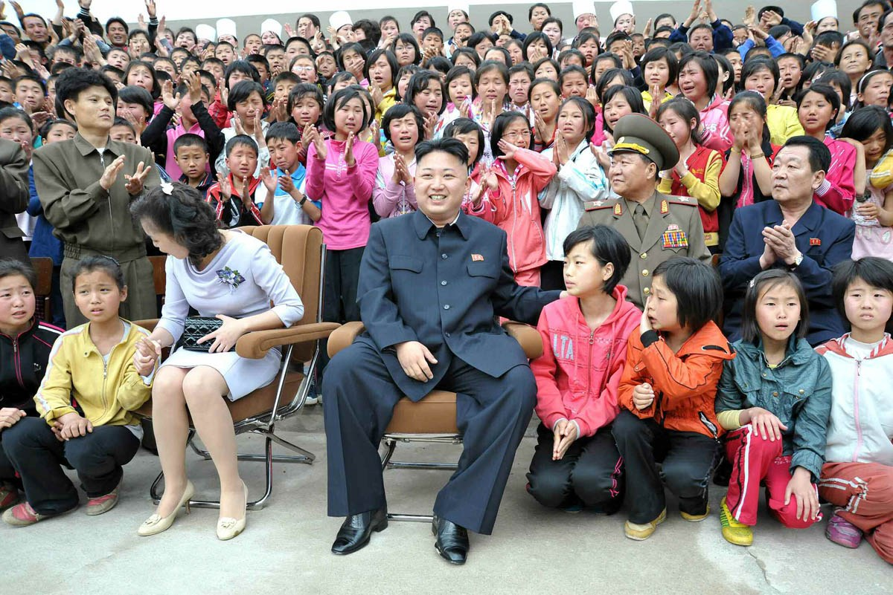
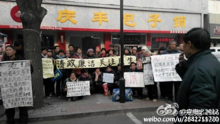

# 用包子温暖你

政治人物对亲民举动的选择正是符合祛魅化的时代潮流的体现。然而，就像路透社北京12月28日的电文“虽然这样的互动在西方国家比较平常，但对中国的高级领导人来说非常少见”所揭示的道理。

2013年12月28号，一位昵称为“四海微传播”的新浪微博用户将习近平在庆丰包子铺用餐的消息发布在个人微博上，引发广大媒体关注，一时成为舆论焦点。他在微博中写道：“亲们，我没看错吧？！习大大来庆丰吃包子啦！果断上图”，并配发了习近平端盘子、买单的照片。一分钟后，他发了第二条微博：“习大大排队买包子，还自己买单，端盘子、取包子，以后庆丰可以出习总套餐了！@央视新闻@新华视点”。发出1分钟后即被新华社旗下的官方微博“新华视点”转发。15分钟后，人民日报的官方微博也迅速跟进。截至28日22时，仅人民日报相关微博已被转发4万次。

 

随着网络和报刊等各路媒体的传播，在全国各地的办公室、菜市场、公共浴池、食堂、麻将桌上，我们几乎同时听到了这样一个事实：当天中午，国家主席习近平来到北京一家包子铺，排队点了6个猪肉大葱馅包子、一碗炒肝、一份芥菜，共21元，自己结账，吃完走人。

 

相应的“线下活动”也跟着风生水起。顾客纷纷订座习总吃饭的饭桌，有人表示：“就坐这个位置，给自己沾沾喜气”；有的顾客直接向服务员要“主席套餐”；还有个广州顾客一下子买了120只包子匆忙去赶飞机，说是带回去都尝尝鲜。

买包子的故事逐渐发酵，凤凰网的消息在当晚十二点前有5万多人访问，1500多条留言。主流媒体和社交网络上的反应大体一致：给习近平点赞。手动还是自动的我们不管，“四海微传播”的身份无需追究，有无事前通知包子铺，庆丰包子铺的企业背景怎样，对于网络营销有什么启发？何必管那么多。总书记包子吃得香，我们闻闻味儿也心里快活。喜闻乐见正是传媒、政治活动的内在逻辑之一，它隐隐地解释了市场的作用，也可以说，这四个字代表的是一种时代精神。

我们一次次消费着大众传媒对于领导人“亲民”举动的相关报道，然后一次次交口传颂。即便这其中必然会夹杂进由对各种心思和情愫的报道所营造出的社会整体进步的幻觉，但作为受众，作为由媒体营造的这个世界中的一份子，我们无疑会由衷地感到喜庆。我们沉醉在对这类“不温不火”的新闻的消化中，好像在忙碌了一周每天都是累成狗的状态后终于得空泡了回温泉，终于可以念叨一句“这才是幸福生活啊，这就是和谐社会啊”。这回的包子就是温泉，在铺天盖地的负面新闻灌输后，感到好像自己也有了某种来之不易、无比珍贵的机会，可以去面对面的接触在我们祖辈的生活领域中和他们留传下来的经验世界里面始终不下神坛的一种威严正坐的存在，甚至还有诸如“炒肝怎么这么稠啊？”这样的真实互动，一时间你放佛置身博物馆奇妙夜，放佛杜莎夫人蜡像馆里的蜡人儿在对你挤眉弄眼。

 

民族国家的兴起和成熟的一个具体表现是政治活动逐渐趋于专业化，祛魅化的同时也必然伴随着由分工带来的职能分离。在这样一个过程中，政府机构作为科层制（bureaucracy）的典型代表，成为维持和监管国民经济和社会发展并提供公共服务的专门化组织，其运行过程会遵照追求行政效率的理性模式。身为政府首脑，这些奇妙的造物主捏造一般的蜡人儿频繁地出入世界各大报刊的头版头条，他们拥有场域中绝对的话语权，由此制定着游戏规则，塑造并统治了离政治生活越来越远的大众。他们忙着参加各国首脑峰会，忙着签署条约，忙着改革法案的签定和实施，忙着发动或避免战争，在各种利益集团之间周旋、协调。

而这些亲民行为和经济政治事物关系甚远，对政绩本身无丝毫的影响。但在现实中，近几年来我们不断地与这些新闻相遇：奥巴马唐人街买快餐、与梅德韦杰夫的汉堡工作餐，卡梅伦、骆家辉、拜登等人在路边摊、小吃店的抛头露面，朴槿惠在菜市场，英拉试吃大米……我们不禁发现这些作为统治者的政客形象越来越趋于一致：温和、亲民，仿佛那个身处层层安全保卫的办公室中的老大哥消失了，连同他们签署的引发环境问题、冲突甚至战争的条约协议，极权与权贵们近乎残酷的利益纷争一时间消失了。

 

与此同时，媒体对诸如他们“乘飞机坐经济舱、自己背包、拿优惠券买咖啡”的行为也越来越津津乐道，我们不禁要问：他们为什么要这么做？这些愈发一致的形象背后是否有着某种相通的动机解释？

在这里我们尝试对这种趋同性的行为所遵循的制度性的逻辑进行初步分析。首先，我认为这些政治人物的亲民行为是基于理性选择的结果。按照功能主义的理论视角来看，在人类活动和需求更加多元化的全球语境下，政治人物面临着多元价值的认知和选择，在国内的政坛和各国关系的竞争角逐中如何体现出自身的价值和优势就成为了关键问题。政治活动的参与有其一套复杂的流程和特殊的行动逻辑，不同于经济活动其投入与产出的效益之间的关系，它对个人私利的实现不那么明显和直接，因而更加难以把握，要考虑到统治者与被统治者、管理者与被管理者之间的互动等多种因素。即便这种亲民行为不会对政绩带来多么大或多么直接的作用，但这种行动势必会影响到对其政绩的评价，因为评价者是一群有情感尤其是好恶感的大众。亚里士多德说“人是社会性的动物”，每个人都会与社会以及组成社会的其他人发生联系。政治的基本特征之一是团体性，政治活动可以看作不同团体之间在权力场域中的博弈过程，而政治人物的行动是要嵌入在这种关系网络和结构中的，受到包括“权贵”和“民众”、“竞争者”和“合作者”等多种群体的影响和制约。现在的政治越发考量民意的重要性，领导人日常生活细节被民间舆论力量自行传播并评论，这既是被普遍认可的官员同民众的应有联系和互动方式，也对选举的竞争优势和任期乃至整个政治生涯的延长大有裨益。因而同政府遵循的理性行动逻辑保持一致，这些领导人的亲民做法也是理性选择的结果。

当我第一眼看到这则新闻并转发的时候写了这么五个字的评语：与世界接轨。所以可以说，这种反应背后的解释逻辑是一种全球化的网络视角。随着政治民主化、信息化和现代化的发展，各国政要相互间的官方交往更加公开频繁，互动也更加直接。我们可以做一个简单的设想：当奥巴马在某次峰会上跟习总书记聊起来，说起哪条街道的热狗份儿足量大肠香，下次你来我带你去吃，有了这次十三亿人的见证，习总书记可以呵呵一笑，“你来北京我带你去吃庆丰的包子，葱肉馅的特别正，只是炒肝有点稠，不过可以调嘛。”既然奥巴马跟梅德韦杰夫能一起在快餐店吃工作餐，我们的习总书记何不也来回“人间烟火”接接地气。

在中国经济转型时期，商界曾经出现过一种普遍的现象：有些人代表规模很小的公司，甚至是一个人的皮包公司，但是他们总为自己冠以“总经理”的职务。很多人觉得很滑稽，但这种现象是符合了事物的逻辑的。试想你作为公司代表在和另外一个公司代表打交道时，对方说他们公司没有正式制度、没有总经理一职，你有何感想？这些经营者是通过这些广为接受的组织形式和职位来适应制度环境以取得合法性的。

非要说庆丰包子有什么象征意义的话，我更愿意将其视为一种隐性的身份标识。同以前总经理的名片所发挥的效用类似，这些领导人的行为要同他们的角色定位保持一致。民主政治要求建立一种理想型的领导人物，这种角色包含了文化制度、观念制度所形成的社会期待，受各种制度环境的约束和作用。在这我们引入合法性机制的概念，该概念是新制度主义理论最重要的机制，也是社会学理论中的核心概念之一。与关系网络视角的嵌入性机制的解释逻辑保持一致，合法性机制强调组织或个人的行为必须建立在社会承认的基础之上，行为必须为更为广泛的社会群体接受。

合法性（Legitimacy）是德国社会学家马克斯•韦伯首先提出的概念。我们知道，任何一个组织、一个群体、一个社团、一个村落或部落的内部都有一个权威。韦伯关心的问题是这一权威是怎样产生的。一种观点认为权威是强迫性的，当一个国王、部落首领或其他群体领袖有军队、有统治工具的时候，他可以强迫大家接受他的指令或意愿，所谓“成王败寇”。但是韦伯认为在统治者和被统治者、领导者与被领导者之间并不单单是一个“强迫”的关系，这中间还存在着我们所说的合法性或公义性的机制。由此他提出了三种合法性机制：第一种是个人或领袖的魅力，即人们因为领袖的个人魅力而追随其后；第二种是传统，即人们接受领袖的权威是因为传统使然。例如，过去农村家族中长老者有着权威地位，这常常是建筑在传统基础上的；第三种是建筑在法律理性之上的，是对理性制度（例如政治制度、法律制度）之上的权威的认同和承认。以美国总统选举为例，对于选举的结果，共和党和民主党两派总有人不满，因为选举结果总有一党派上台而另一派在野。但选举结束后，大家都承认选举结果，承认并服从新的权威。

制度学派使用的合法性的概念主要是强调在社会认可的基础上建立的权威关系，声誉是社会承认逻辑的产物，如果行为、产品或制度是在理性自然的基础上得到承认，它们的合法性就越强，它们就越容易得到社会的承认，就越可能得到更好的声誉，自然也就前面所讲的第一种个人魅力。

合法性机制对政治人物行为的具体影响可以从两个层次来讨论。第一个是强意义上的，政治人物塑造个人形象所采用的方式是制度塑造的，其本身没有自主选择性。玛丽•道格拉斯在《制度是怎样思维的》一书中使用人类学和功能主义的视角做过经典阐述：“制度化的社区塑造了人们的好奇心，安排了公众的记忆，大胆地在不确定之上设置了确定性。制度在划分它的边界同时影响所有低层次的思维方式，因此，人们通过社区的归属来寻找自己的身份，加以分类。”正是在这个意义上，政治制度通过其所制约的政治人物的思维方式和行为来进行思维。第二个是弱意义上的，制度通过影响资源分配或激励方式来影响人的行为，鼓励人们采取社会上认可的做法。这种影响不同于强意义上的决定性，而是概率意义上。政治人物的亲民行为既有强意义所讲的制度强迫性，也是这些行动主体基于社会规范机制的模仿。他们采取这些做法是因为更符合自己的利益，提高在政治圈内的生存能力。这个意义上的作用机制强调的主要是一种观念上的演变，是一种对制度的模仿和学习。政治人物的角色越相似，其资源交换也越容易。

在我看来，政治人物对亲民举动的选择正是符合祛魅化的时代潮流的体现。然而，就像路透社北京12月28日的电文“虽然这样的互动在西方国家比较平常，但对中国的高级领导人来说非常少见”所揭示的道理，我们应该考虑到在中国文化传统中“官本位”、“国家社会不分”和由个人主体意识淡薄带来的“公民社会不发育”等综合因素的影响下，合法性机制在中西方话语体系中的存在固有差异。根据对我身边情况的观察来看，我们其实并不在乎在对这则新闻的传播中对当事人使用何种称呼，习近平、习大大、习总书记、习主席。这种对身份的模糊化一方面反应了我国政治制度的特点，另一方面，也提醒我们要关注这样一个问题：个人行为在什么情况下在多大程度上可以代表政府，可以代表政党。

众所周知，中西方政治制度和文化背景有很多差异，因而领导人与政府关系的强弱也天然地不同。在此不作具体的分析比较。我们还是回归到当今中国的特殊语境来看，主席套餐被抢购一空纯属意料之内的结果，简单来讲，这是一次由对传统文化中统治者的权力崇拜和所谓的“名人效应”引发的从众行为。同时，我们不难发现，在某种程度上，它显然被赋予了更多超越娱乐色彩的内涵和愿景。包子事件在直接提升了习总书记作为一个普通人、一个领导人的形象之外，在2013这一所谓的改革之年年末的背景下的含义无疑要多得多。比如呼唤官员该有的民本思想。希望通过制度化安排，使官员深刻体会权力的分量，民意的重量，比如在“子率以正，孰敢不正”习李风格下的党风建设以及带来的对官本位文化的动摇。

就在去庆丰包子铺的两天前，习近平在纪念毛泽东诞辰120周年座谈会上的讲话中有这么一句，“人民是我们党的工作的最高裁决者和最终评判者。如果自诩高明、脱离了人民，或者凌驾于人民之上，就必将被人民所抛弃。任何政党都是如此，这是历史发展的铁律，古今中外概莫能外。”偏爱奇文的《环球时报》大概已经淡忘了一年多以前关于骆家辉大使的社评《希望骆家辉好好做“驻华大使”》，我还是忍不住地想引用一下其在评论文章《习大大21元套餐，百姓为何这么喜欢》中的煽情说法：“风起于青萍之末。一件小事，却可能预示中国社会对党风、政风看法和印象的转折，成为时代的一个封面。我们真心期待这个转折发生，总书记和全体党员干部为之共同奋斗。真如是，则国以之为幸，人民以之为福。”

谁不期待改变呢？尤其是在这个充满了倒置和沮丧的时代，期待改革已经成为我们的共同情愫。但同时我们也该认识到，只六个包子是不会有如此大的力量的。美国政治风险咨询公司欧亚集团关于2014年全球十大风险的报告中将中国改革的不确定性列为第三位，很多人都在强调利益集团对改革的巨大阻力，如果真如孙立平所说“既得利益集团或权贵集团对改革的威胁，是在改革启动之后”，那么其中关键性的跨越就集中在将反腐败打开的缺口转变为对权贵恶政的系统清理。如果不能通过这种转变从根源上实现真正制度的变革，重造改革的动力，那么对社会和民众财富的大肆掠夺和维稳、强拆、纵容贪腐的问题就不可能解决，社会进步也就无从谈起。所以包子终归是件小事，我们这些看客看得心里欢喜之余也不要太当回事了，媒体的争相报道和网民的相互传颂是现代话语世界的一贯作风，我们更加关注的应该是民意在其中的交织、冲突。随着领导人一次次走下神坛，我们一次次通过民意的集中展示来思考权力的关系，想象改革的蛛丝马迹，我们同时也希望这个过程是渐进的、线性发展的，而非一时一地的光景。

习近平吃包子这一亲民举动无论是出于被动（强意义上）还是主动（弱意义上），它都代表了这届政府回应民众对改革的希望的主流姿态。今年党建的主线是群众路线教育实践活动，它的成果最终要由党和政府工作作风的大范围改变来兑现，也只有这样，这种姿态才具有实质意义。
还是要提及一个细节：习总书记是先看厨房再去排的队，取餐时又关切食品原料安全问题，服务员用手机给习主席看原料照片，最后又与百姓交流食品安全问题。比起真实的行动，态度本身永远显得模糊不清。因此，我认为对改革抱有期待的一种理想方式是这种希望可以变得像期待餐饮业饮食卫生问题的提升那样真实、可知。复旦大学社会学系的徐珂老师说过“行动不再是手段，而是目的本身，这就是一种幸福”。如果包子事件中民众和媒体在共同的话语建构营造起来的幸福感能真正转化成惠及民众的具体举措，能从对官车封路、公务员收礼等真正维护社会公平正义的具体规定、措施做起，这才能成为真正的幸福，这种成果才能在若干年之后真正影响人们回忆庆丰包子铺这一幕时的感受。

总之，通过2013年年末这则喜闻乐见的新闻，我们对国家领导人的感知渠道不再囿于躺倒的油墨文字，一时间似乎也超越了新华网和人民网组织的秀场感强烈的隔空对话。我们看到了这里面被寄予众望的进步，公众自然免不了欢欣鼓舞。其实这背后的情感是复杂的，有制度方面的因素，也有文化的。其实我在这也只是口说无凭罢了，我也只是说说而已。但总之，转发次数的激情上涨、全国各地井喷般的民意都改不了一个事实：我们只不过是在消费和解构着“习近平”这个俨然政治标签的话语符号，同时在道德正义感的胁迫下建构起对改革、对未来的美好构想。

不过，作为热衷于讨论普世价值的普罗大众，我们希望看到的永远都是拍手称快而非弹冠相庆。尤其在这个寒冬，如此香的包子更显地弥足珍贵。这就够了，不是吗？
这真得够了吗？

后记：
正值期末，写得拖沓而仓促，待快完稿又在从网见到这样一幅照片：

 

先是惊讶，然后笑了，笑着笑着又有点想哭。

在媒体失语、缺乏群体事件的冬月，尤其是习总把包子吃得舆论一片香的背景下，这种新闻本身没什么价值，没有消费市场你的注意力经济从何谈起？大冷天的，举着牌子手多冷啊，还是等开春了再活动吧，那时候身子暖和喊得声音也大。

但愿改革成功，但愿社会进步。

(采编：谭翔云；责编：张山骁)