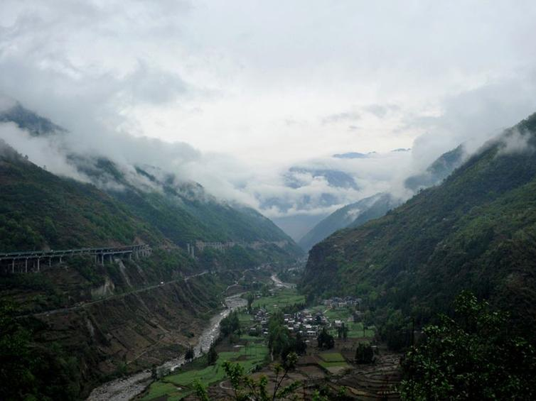
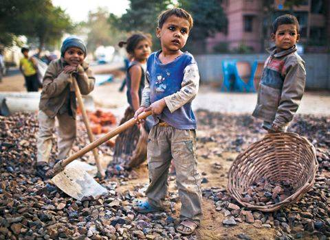
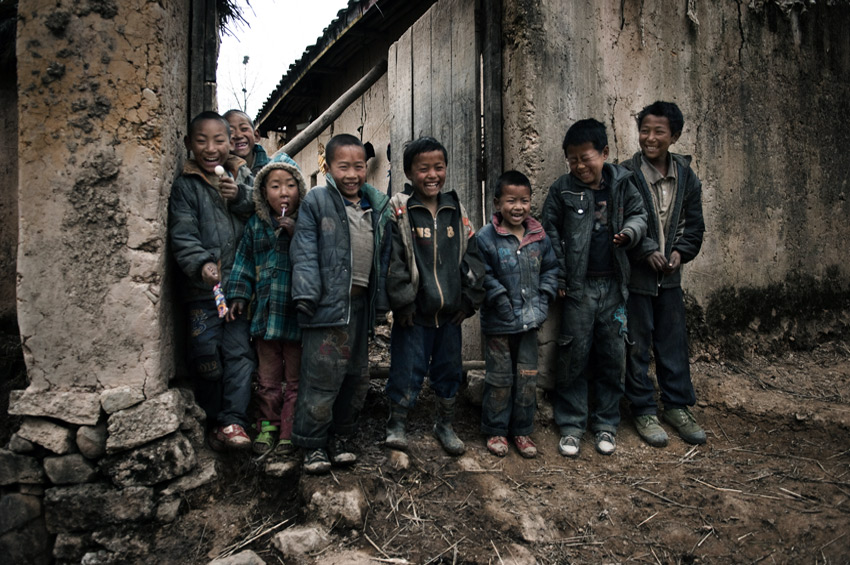

# 受救童工考上大学或失业童工沦为妓女

###***打工至少能吃饱饭，为什么不让出去？***

这些处于长期贫困的人们发现在当地无论如何奋斗都很难消除贫困，他们的劳动力要素不具备价值，不能有效地转化成收入和财富，当他们突然发现自己的劳动力可以在遥远的城市换取实在财富时，自然趋之若鹜。

三十岁的甲巴古子于昨夜死去，今天他家支的所有成员挤在了他的平房里，为他送行。他们平静地注视着这位不久前刚离开人世的艾滋病人，在这个村落，人们对艾滋病人没有太多的歧视。
甲巴古子染病的原因是与其他吸毒者共用针头。
这样的故事在这片名为凉山州的土地上并不罕见。凉山州位于四川省南部，三面与云南接壤，在它六万多平方公里的辖区内几乎都是山地，这居住着约470万人，其中彝族占一半以上。而让大凉山声名在外的，不仅是这里的贫穷和落后，更因为这里毒品的泛滥与艾滋病的蔓延。
甲巴古子死了，他的儿子却不能为他送终，本应上初中的孩子在外打工补贴家用而一时无法返家。甲巴古子的孩子是童工，在这里，这样的故事也不罕见。

今年1月11日下午，凉山彝族自治州布拖县警方出动大批警力，在路上拦截了35名正欲外出打工的孩子。这些被拦截的十几岁少年为此十分沮丧，准备接孩子回家的家长们脸上也露出了不满和不屑：“出去打工至少能吃饱饭，为什么不让出去？”
而刚刚被广东省劳动部门遣送回凉山的童工吉曲阿牛也同样怨气满腹，这位彝族女孩抱怨道：“我都16岁了，为什么也要把我送回家？我太倒霉了，正好被抓到。还有许多年龄比我还小的人，藏起来了怎么不说？”
吉曲阿牛和她的一群小伙伴是去年12月8日到达广东东莞打工的。吉曲阿牛是昭觉县城北乡人，在这之前，她已经在深圳有过3年的打工经历，在一同外出打工的小伙伴们中，应该属于“老工人”了。孩子们并不知道小小年龄外出打工违法，他们中年龄最小的只有11岁，最大的也才16岁。
“我们不懂有没有加班费、过节费之类的，中间人给多少就拿多少。”吉曲阿牛说。
尽管外出打工的日子很艰苦、要求很苛刻，但吉曲阿牛却说“回家住几天就要再找地方去打工”，因为外面打工的日子再艰苦，也总比在家里受穷受苦要好得多，“有能吃饱饭的地方也就满足了，何况还能给家里带来收入”。

###***立意良善的运动最后反倒伤害原欲保护的对象***

农民往往被认为是没文化没素质的代表群体，所谓农民的智慧也常被看成短视的权宜之计。让自己的孩子放弃宝贵的受教育机会，为了一点“蝇头小利”便把他们送出去当童工简直是典型的农民落后思维。
事实上，这种的想法恐怕过于想当然了。农民们的文化水平虽然低，但他们的决策也并非总是愚蠢的。
我国今年的教育经费仅占国民生产总值的4.28%，凉州这种穷乡僻壤能分到的教育资源可想而知。对于凉州的农民家庭来说，在孩子身上的教育投资并不一定能获得相对大的收益。
很可能当一个家庭勉强供孩子高中毕业后，发现孩子的职业前景反倒不如几年前就已经出去打工的同龄熟练工，再算上这些年的教育投资和童工收入，一进一出是一笔巨款了。
当然有鱼跃龙门考上大学从此跳出乡村的人，但考虑当地教育情况看来，这样的孩子实在是不多，对于大多数家庭来说，送孩子去打工未尝不是一个理性的选择。
然而，这样的考量是监护人意志的体现，剥夺并不具备完全行为能力的儿童的受教育权怎么看都是件残忍的事情。政府作为“帮助”少年儿童的力量强制性地阻止和遣返童工也正是为了保护少年儿童的受教育权。
但这样的好心不一定促成好的结果：

@晁迁.Fearful : *世行首席经济学家巴苏：据联合国儿童基金会1995年所做研究,90年代反童工人士疾呼全球联合抵制出自儿童之手的手织地毯后，许多尼泊尔地毯制造商闻讯将童工解雇,结果有5~7000名女孩沦为妓女。立意良善的运动最后反倒伤害原欲保护的对象.*

@马特: *因为总有些人特别缺钱，所以必然会为了获得金钱而愿意伤害自己，你阻止他以较小伤害的方式获取金钱，他就不得不以较大伤害的方式获取金钱。*

正如上文中16岁的彝族姑娘吉曲阿牛，被强制遣返的童工们非但不感激政府的“好意”，反而满腔怨气甚至愤恨不平，他们认为政府的强制措施阻止了他们吃饱饭。
这些处于长期贫困的人们发现在当地无论如何奋斗都很难消除贫困，他们的劳动力要素不具备价值，不能有效地转化成收入和财富，当他们突然发现自己的劳动力可以在遥远的城市换取实在财富时，自然趋之若鹜。
受限于当地的教育资源，上学读书的结果很可能并不好于外出打工，如果阻绝了他们出卖劳动力的途径，很可能导致他们又投身制毒贩毒行业之中。这样的结果恐怕是所有人都不愿看到的。 

@陈阵阵 : *对于发展水平低的国家，雇佣童工的血汗工厂比牺牲女孩肉体的发展方式高尚的多，前者不仅提供工作机会也是培训劳动力的途径，很多欧洲国家都是这么来的，这是规律，干涉只能好心办坏事，也或者根本就没安好心。*

@吴如加: *反童工这事最典型，其他诸如最低工资法，其实都是一个意思，穷人要是明白道理的话，最恨的就该是这帮人。所谓剥削与被剥削是贻害千年的说法。*

童工问题并不是新问题，有人爱标榜自己没有立场，只问对错，然而实际上没有立场也就没有对错。在这件事上，右派想的是自由市场，左派看的是社会福利，由此也衍生出一套解决方案，而这两套解决方案由立场而生，之间有明显的区别。我们并不能不问立场的判断谁对谁错。

@刘枭：*【关于童工与血汗工厂】信奉自由市场的，往往冷嘲热讽，“你看，傻X了吧”，而忽视了市场的良性发展需要法治、人权这些支撑。信奉福利社会的，只能干看着爱莫能助，劳工保护是被严厉打压的对象。这个问题吵了这么多年，已经成为互黑、人身攻击的题材，还是少搅和为妙。*

@刘枭：*可能有自诩自由主义者的人不服，认为市场不需要法治、人权？哦，那就等着底层革命吧。*

无论网上讨论如何热火朝天，在可以预见的将来，生活在贫穷的大凉山，目睹着艾滋病与毒瘾肆虐的少年儿童们仍然要面对着这样的问题：打工还是读书？而更多时候，他们染毒的监护人会代他们进行选择。

(编辑：张山骁；责编：陈澜鑫)