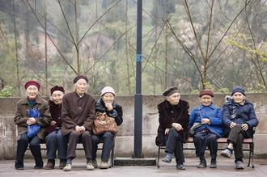
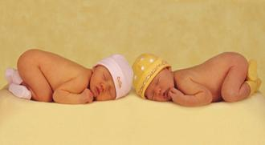

# 从“超生扒房”到“单独二胎”

导读：11月15日《中共中央关于全面深化改革若干重大问题的决定》提出启动实施一方是独生子女的夫妇可生育两个孩子的政策。30年计划生育，为何今日不得不开放“单独二胎”？又为何迟迟今日才开放？

**一、生产人类自己的计划**

_“我看人类对自己最不会管理，对于工厂的生产，生产布匹，生产桌椅板凳，生产钢铁，他都有计划，对于生产人类自己就是没有计划，就是无政府主义。人类要控制自己，做到有计划地增长，有时候使他能够增加一点，有时候停顿一下。提议设一个委员会，节育委员会。”_

——1957年毛泽东在最高国务会议上的讲话

相比于建国前的动荡不安，经过八年较为稳定的发展，1957年全国总人口从建国时的5.42亿跃至了6.47亿，出生率上升到34‰。

随后，《人民日报》刊登了马寅初在第一届全国人民代表大会第四次会议上发言，首先提议在中华人民共和国进行人口控制。但当时人口控制并未真正实行，中国家庭生育未受政府影响。这篇文章称为《新人口论》，与此相照应的是英国经济学家马尔萨斯于1798年提出的人口论。后者认为人口会呈几何级数增长，而粮食呈代数基数增长，为了避免饥荒、战争、瘟疫，人类必须积极节育。这一理论在当时被认为不符合马克思主义的劳动价值论和再生产理论，因而广遭批判。这样，马寅初也成为了批判对象，被迫辞去了北京大学校长职务。

1971年，伴随着“四五”计划，“一个不少，两个正好，三个多了”的口号开始传开。文革中，面对着8亿人口高值和政治瘫痪造成的双重压力，国务院成立了华国锋牵头的“计划生育领导小组”。到1980年，来自党中央的一封公开信成为计划生育史上的里程碑，“一对夫妇只生育一个孩子”的标语迅速在大街小巷展开。

此后，人口出生率得以控制，从1991年的19.7‰逐降至2012年的12.1‰。2000年开始，年净增人口低于1000万。妇女生育率从1949-1969的平均5.8，直降到2011年的1.04。

**二、未富先老的棘手**

_“人口‘老化’的现象在本世纪不会出现，因为目前全国人口约有一半在二十一岁以下，六十五岁以上的老年人不到百分之五。老化现象最快也得在四十年以后才会出现。我们完全可以提前采取措施，防止这种现象发生。”_

_——1980年《关于控制人口增长问题致全体共产党员、共青团员的公开信》_

在9.25公开信后，计划生育蓬勃展开，1980，至今33年，“老化现象”已然出现，人口结构发生了巨大变化。

按照联合国标准，60岁以上老年人口达到总人口的10%，或65岁以上达到7％，一个国家或地区就成为老龄化社会，按此标准，中国在2000年就已进入了 “老化”，远比公开信中所估计的四十年来得快。

2012年时，65岁以上老人的比例攀升到了9.4%，这意味着每11个人中就有一个65岁以上的老人。与此对应的是邻国日本。1990年的日本进入长达十几年的经济增长凝滞期时，65岁以上的比例就达11.9%，然而日本在达到美国人均收入1/5水平时，这个比例只有5%，我们的严峻在于我们的富远落在了老之后，未富即先老，更多的问题随此而来。****

**1****、人口红利的消失趋向**

人口红利是指人口结构变化期间，当一个国家的劳动年龄人口占较大比重，社会抚养负担轻，相对富余的劳动力资源支撑经济增长的人口现象。

这个理论由哈佛大学教授大卫·布鲁姆提出，他认为，人口红利在亚洲四小龙腾飞与1990年代凯尔特之虎的经济发展中起了重要作用。

中国过去三十年的经济高速发展，很多人认为人口红利对“中国奇迹”的推动功不可没，首先体现在生产领域，丰富的劳动力资源和成本的廉价使中国成为世界最大加工厂；其次，由于劳动力人口年龄较轻，储蓄率较高，当储蓄转化为投资，经济加速增长；而此时人口老龄化未到较高水平，社会保障支出负担轻，财富得以迅速积累。

然而2004年起，珠三角、长三角地区开始频频出现“劳工荒”，春节前后各大报纸处处可见“劳工告急”，根据新华社报道，这种“劳工荒”逐渐向全国弥漫，并且不再仅仅是年末岁初的季节性偶然现象。

这背后显示的其中一个危机就是人口红利趋向消失。

2012年中国劳动年龄人口数量首次出现下降，比上年减少了345万，中国社科院蔡昉认为人口红利消失的拐点已然出现，将对经济产生显著影响。

一方面，劳动力下降，过去廉价适龄劳动力的优势将加速丧失，粗放式经济增长难以为继，经济发展动力将因劳动力的下降而减弱，过去三十年因享“人口红利”的经济黄金时代正渐行渐远。另一方面，人口抚养比（需供养的老少年人口之和与劳动年龄人口数量之比）增大，社会抚养负担变大，成为越来越重的阻力。而对后一点，我们还远远未准备周全。

** ****2****、养老保险的捉襟见肘**

关于养老的口号从80年代到现在可谓戏剧变化，从1985年的“只生一个好，政府来养老”，到1995年的“只生一个好，政府帮养老”，再到2005年的“养老不能靠政府”，2012年口号则成了“推迟退休好，自己来养老”。

2013年11月6日《中国社会保障发展指数报告2012》发布后，翌日各大媒体纷纷报道“全国基本养老保险基金结余只够用1.5年，但最低省份的结余仅够使用半年。”民众顿时义愤填膺，焦虑万分，但这里存在一点误读，有不少人错理解成1.5年后将无养老保险基金可用来养老。

这里有必要先解释一下我国现行的基本养老保险制度：自93年改革以来，我国采取了社会统筹和个人账户结合的模式，参保单位和个人分别缴纳工资总额的20%和8%，前者计入社会统筹基金，后者存入个人账户，加上政府补贴，三者构成基本养老保险基金。

实际上原报告中称“全国基本养老金结余系数为1.5”（当年基金的累计结存余额与当年基金支出的比例），这就好比方我11月收入2500元，支出1000，结余1500，并不意味着我只能捱到1月中旬，因为每个月我还会有收入进账。

但问题在于这部分结余其实大多靠财政补贴支撑，剔除“补缴”“预缴”等非正常缴费收入后，结余几乎为零。2012年入不敷出省份达14个，有的地方甚至不得不从银行贷款来支付社保。

报告中也指出，到2011年底，养老金个人账户为2.5万亿，但实有资金只有2703亿元，空账竟高达2.2万亿。按道理，个人账户中的资金是个人积累基金，相当于本人每年往自己储蓄罐里存的钱，那么谁动了个人的钱？

养老保险制度改革前，92年之前工作的职工，在工龄期限内，社会统筹账户和个人账户都无需交付，退休后直接领取养老金，这个缺口由后工作的人和地方财政补贴填上，但到1998年养老金统筹基金入不敷出，个人账户的钱被挪用发放离退休人员养老金，空账20年来越做越大。

随着人口老龄化日趋严重，支出部分只会越来越大，经济增长进入减速阶段，财政增长趋缓，来自财政部分的补贴无疑压力越来越大；而个人账户，据全国社保基金理事会理事长戴相龙表示，空账若要做实，可能会需要五万亿左右的资金。

**三、千呼万唤始出来的“二胎”**

2011年7月广东试点“单独二胎”引发了一番是否放开二胎的争论。“二胎”的开放可谓一直犹抱琵琶半遮面，2013年11月15日，“单独二胎”实行终于千呼万唤始出来。

既然前文已赘述诸多人口结构带来的危机，那么“二胎”为何迟迟不开放？

除了广知的对人口突增的担虑，其实顾虑更在弦外。

80年计划生育开展后，次年，国家计划生育委员会随即成立。几十年来，从国家的计生委到乡镇计生站，其系统极为庞大，官方数据表明，截止2005年底，国家、省、地、县、乡五级计生机构总数逾8万，总工作人员逾50万，其中10万余人属编制内公务员。

他们其中一项重要的任务，就是收取“社会抚养费”，这个暧昧的名字在刚实行计划生育的80年代初期时还叫“超生罚款”，94年更名为“计划外生育费”，2002年使用了更为雅致的“社会抚养费”，定义为补偿政府的社会事业公共投入的经费。

征收标准则因地因人制宜，由各地自己规定。实际上征收单位自由裁量权极大。

如北京，违反规定生育第二个子女的，按照本市人均年收入（城镇农村分别算）的3-10倍征收，生育第三个及以上的按上述的6-20倍征收。而陕西对第二个子女的征收，除了人均可支配收入的3-6倍，本人收入超过当地平均收入的，超出部分另收取1-2倍。田亮就曾因“二胎”被征收过200万。

据估计，全国每年社会抚养费征收逾200亿元。

然而大笔资金并未缴入国库，它们按比例又被返还给了下级计生单位，有些乡镇返还多达90%的比例。本应纳入地方财政预算的资金遭挪用，成为一些地方政府的重要收入来源。如根据21世纪网报道，江西省某镇2010年该项收入占了其实际可用财力的20%。一些地方将抚养费收缴情况直接与财政拨款挂钩。2012年，全国人口计生委事务支出高达812.85亿元。

庞大的既得利益集团也就成为了一直以来“单独二胎”放开的最大阻力。

结语：

_“到三十年以后，目前特别紧张的人口增长问题就可以缓和，也就可以采取不同的人口政策了。”——9.25公开信（1980年）_

（采编：任丹妮；责编：张山骁；）
