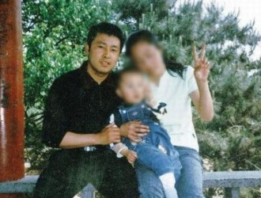

# 乾隆不曾死去——浅谈夏俊峰案

1793年，英国使者马嘎尔尼带着火枪和火炮来到中国，1840年鸦片战争爆发，中国军队依旧以刀矛鸟铳作为主要作战武器；2009年，摊贩夏俊峰在与城管的冲突中失手将两人刺死，2013年被执行死刑，3年过去了，南乐郊路继续被上百名小贩占据，“夏俊峰案是一个‘极个别的个案’，不会因此而上升到要改变城管管理模式。” (东南网（福州）, 2012)想起东伦敦市集里经营5年之久的华人拉面小摊，佩雷菲特的确一语成戳：“乾隆不曾死去。”

### 夏俊峰案争论不断，但改革是共识

这个案子的大部分细节都存在争议，法院对证人证词的采纳也不能完全令公众信服。

《纽约时报》中文网报道，“2009年5月，夏俊峰和妻子在辽宁省省会沈阳的大街上卖烤肉，然后遇到了多达10名城管。这些人抢过夫妇俩的煤气罐，将串肉扦子扔到地上，夏俊峰表示反抗，城管便开始殴打他。据称，双方到了附近的一个城管办公室，然后夏俊峰再次遭到殴打。据夏俊峰的律师描述，到这时他才从口袋里掏出一把水果刀，刺向三名城管”。 (杰安迪, 2013)

而最高人民法院答记者问时称：“复核期间，经对上述证人证言进行核实，其中4人未找到或不愿作证，证人丁某某称自己和老伴没有看到争执的情形，交给律师的书面证言是旁人代写的；证人贾某某称看到双方没有殴打，只是推推搡搡，互相撕扯。执法人员曹阳、祖明辉称他们是夺下液化气罐，但没有殴打夏俊峰。” (最高人民法院网站, 2013)最终最高法院认定没有充分证据证明被害人殴打了被告人夏俊峰，不具备正当防卫的前提条件。

那么判定故意杀人罪的条件是否具备呢？滕彪指出：“要判定故意杀人罪，必须证明犯罪行为经过预先的谋划。”中国政法大学教授仝宗锦认为“薄谷开来蓄谋投毒故意杀人既然可活，夏俊峰被打之后失手杀人理不应死”。 (杰安迪, 2013)

### 孰对孰错，都是痛

毋论舆论偏向哪一方，毋论司法判决是否公正，更毋论律师辩护的成败与否，2009年5月16日这一天，三个家庭永远地破碎了。

被刺死的两名城管名叫申凯和张旭东。张旭东的妻子纪晶事发后立即搬离住处，“在原来的住处，一睁眼就是回忆，无法生活下去。” (人民网, 2013)他们的女儿比夏健强大一岁，纪晶眼下只想着把孩子培养好。她在沈河区绿化部门工作，一人承担起抚育孩子和照顾公公婆婆的重担。

相比于努力过上平静生活的纪晶一家，申凯的父亲申向党成为两个家庭的发言者。今年63岁的他原本是电焊工，曾因经济犯罪入狱，2007年出狱后以看守大门和捡破烂为生。儿子的去世，对于他来说是“八月十五月儿圆，我的月亮缺半边”。 (人民网, 2013)同纪晶相同的是，他不能理解网上舆论大潮，尤其视夏俊峰为英雄的说法。令他稍感安慰的是，“沈阳当地给予他们家庭90万元的补偿，同时表示将在夏案了结后，兑现给申凯的烈士待遇。” (张国栋, 2013)

2013年9月的判决，不仅告知夏俊峰的死刑，还要求夏家赔偿约65.9万给原告，这对本就贫寒的夏家无异于雪上加霜。为此，非盈利性出版机构“二楼”和艺人伊能静等纷纷以出版夏健强的画册、日历的方式资助他们。

但是给孩子造成的伤害却是难免的，这不仅仅体现在他关于父亲的画作中，“去年强强被同学打成轻微脑震荡，妈妈问他为什么不还手，强强哭着说：‘我还手，他说我爸是杀人犯怎么办？我把他打死怎么办？他打我一下我不还手，打我两下我不还手，他打完我第三下，就不打我了。’” (许荻晔, 2013)第一本画册的发布会上，他犟犟地如何也不肯上台。我们很难深挖这个小画家的心灵深处究竟为夏俊峰留下了怎样的印记，他对父亲的做法又有怎样的评判，唯一肯定的是，这段回忆不像他手旁的颜料盒一样斑斓。

### 英国城管与华人小贩

相比于中国网络经常爆出的小贩与城管的激烈冲突，英国的街头安宁得多，哪怕是争议也显得那么鸡毛蒜皮。根据杜伦大学的调查，大不列颠地区“街头贸易者”对地方政府执法人员的表现较为认可。 “即使街头商贩和执法人员之间存在着争执，大多会通过调解的方式进行。即使调解无效，也会诉诸司法，鲜有商贩与执法人员发生直接肢体冲突的事件发生。” (张雪, 2013)

李林夫妻在东伦敦市集里经营有一家小拉面摊，5年下来生意红火。英国每个市集都有不同的具体规定，一般市集都规定了餐饮铺的数量，个别的市集对于每一家摊铺的餐饮种类还有不能重复的要求。经过充分的准备，一个多月的等待之后，李林夫妻拿到了市集的营业执照，政府考虑到新手商家不能马上熟练经营，为他们设立了“试营业期”，刚开始只允许每周营业三天，生意好了才可以改为全周经营。执法部门并不经常出现，安全检查是不定期的，“但是一年之中也就抽查个一两次。他们的态度很好，发现问题也是以提醒为主。”如果出现违规摊铺的情况，一般管理人员也不会一次就取缔，他们会先指出问题并提醒改善，然后再来检查是否有所改进。

这对华人夫妇认为英国政府挺人性化的，“我觉得他们都是为我们做生意的人考虑，希望我们能把生意做得安全而红火。” (石雯祺, 2013)

“人性化”，也许这正是中国政府管理中最为缺失的部分。城管执法粗暴，推拉拖拽不仅在微博曝光中，即使白天在街市上走一走也并不鲜见，调解的文明基础在现实中是不存在的；司法公信力不足，又难以通过双方信服的方式作出统一的评判。

最终，夏俊峰被强行拉到执法大队，一旦受辱拔刀而起，法院一纸判决刀下无情，网民骂声不绝于耳。

三年过去，三个家庭的眼泪深深扎进中国的城管管理历史中，留下悲情的一页。执行死刑前，童话大王郑渊洁曾在网上恳请最高人民法院依法不核准夏俊峰死刑立即执行，“以使该案经得起法律、历史和人民的检验，并最大程度化解社会矛盾……表明我们的态度：城管制度必须改革。” 只想问，英国的华人尚可在政府管理下安全红火地经营街头摊铺，不知南乐郊路的小贩和城管们何时可以过上有序安宁的生活？

### 引用

《纽约时报》北京分社. (2013年9月27日). 夏俊峰是否必须要死？. 检索来源: 纽约时报中文网: http://cn.nytimes.com/china/20130927/cc27xiajunfeng/

东南网（福州）. (2012年9月3日). 夏俊峰案死刑复核一年仍无果. 检索来源: 网易新闻: http://news.163.com/12/0903/09/8AFGI9IE0001124J.html?f=jsearch

杰安迪. (2013年9月26日). 小贩夏俊峰被处死，引发公众愤怒. 检索来源: 纽约时报中文网: http://cn.nytimes.com/china/20130926/c26vendor/

人民网. (2013年9月28日). 被刺死城管家属：夏俊峰死了 我的恨不再有意义. 检索来源: 搜狐新闻: http://news.sohu.com/20130928/n387391121.shtml

石雯祺. (2013年8月23日). 在伦敦经营拉面铺的中国人. 检索来源: 华闻周刊: http://news.thechineseweekly.com/article/12234

许荻晔. (2013年9月26日). 《夏健强的画》：世界需要的不是怨恨，是爱心. 检索来源: 搜狐新闻: http://book.sohu.com/20130926/n387256967.shtml

张国栋. (2013年9月28日). 沈阳被杀城管申凯父亲：仍会向夏俊峰家索赔. 检索来源: 腾讯新闻: http://news.qq.com/a/20130928/000988.htm

张雪. (2013年8月23日). 英国如何管理街头商贩？——规则之争大于“管贩”之争. 检索来源: 华闻周刊: http://news.thechineseweekly.com/article/12237

最高人民法院网站. (2013年9月30日). 最高人民法院刑一庭负责人就夏俊峰故意杀人案相关问题答记者问. 检索来源: 最高人民法院网站: http://www.court.gov.cn/xwzx/tt/201309/t20130930_188598.htm

（编辑：吕晴川；责编：张山骁）
