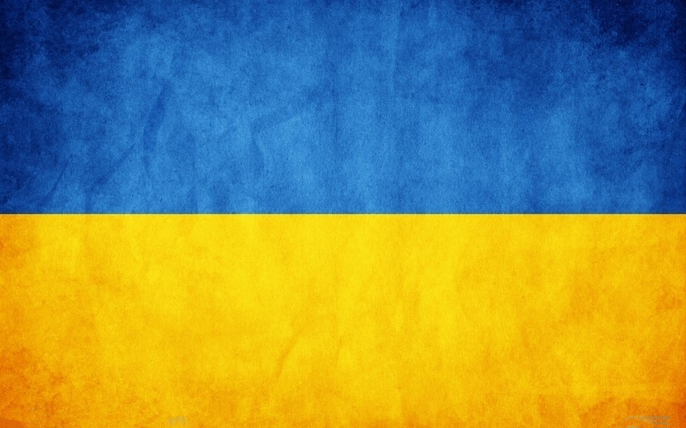
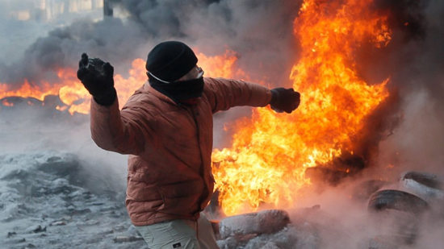

# 乌克兰：反对是否合法

###导语：

最近乌克兰很热闹，不过这个国家确实很容易就热闹起来。本期文章说一说这乌克兰乱局里的合法性问题。

最近乌克兰很热闹，不过这个国家确实很容易就热闹起来。年轻一代挺欧，中老年人亲俄；西部挺欧，中部亲俄，乌克兰的地缘政治居然可以分明到对一国之喜好都有特定人群，真是令人诧异。所以乌克兰就让人特别操心，这两派要是开始针尖对麦芒，那这国家不就要分裂了吗？就目前的形式来看，可能性是极大的。对于风云变幻的乌局势，有很多评论和思考，说法就不凑这个热闹去扯什么季莫申科，哪国支持哪派了，我们就还是说法吧，说一说这乌克兰乱局里的合法性。

###谈法律，不合时宜

学法律的经常会觉得自己学的法律在某些时候是没用的，比如说二战的时候你各国的法律咋就没起作用呢？大法官们只能在世界都安静了之后，才开始坐在审判庭里，对着下面的战犯宣读冗长的判决书。再让我们去想想几个世纪前风云变幻的各国形势，单单就法国来说自法国大革命之后又爆发了数次全国范围内的革命。**青年们走上街头寻求民主独立自由，走不动不想走的小市民们也会使劲探出头去瞧风景，在这轰轰烈烈、热血沸腾的时候，却没有谁去挡在这些反对派面前说，你们不合法！这不合时宜。**

在革命年代讲法律，就如同夫妻吵架要给老婆说理，那女人哪里听得进你絮絮叨叨地说有理没理。一旦有心智愚钝的人做出这样的傻事，就会被一群热血群众黑的很惨。比如说大家所熟知的梁漱溟老先生，五四时期学生们火烧赵家楼之后，他在报上发了一篇文章，大意是说要把这些闹事的学生交给法庭，让司法去处理他们犯下的罪行。即使爱国急公也不能横行无阻。这番言论当年可让民众和学生们一顿炮轰，一个声名远扬的公知咋可以去做五毛党呢？真是斯文不在，雅风不存。你看看，这还让我们怎么敢说合法不合法的问题，不过呢，笔者窃以为我们都活到二十一世纪了，民主和法治在全球的传播与认同程度已经远远不可与一百年前或者几百年前相比了，泱泱的社会主义核心价值观我们每个人都认同才对。即使打着爱国为公的旗号，乌克兰反对派也不能就天不怕地不怕的视法律为儿戏。说到了法，我们就先来说一下这乌克兰有些奇怪的法。

###乌克兰宪法

乌克兰宪法是用乌克兰语写的。不要笑，这里就牵扯到乌克兰的官方语言是乌克兰语而非俄语，然而在近来局势极为动荡的克里米亚，政府的业务工作却主要是使用俄语，比起其他地区,企图扩大教育和政府事务对乌克兰语的使用的努力一直不太成功。国家文化的割裂就此也可见一斑。我一直单纯的以为会找到合适的中文版，结果找了半天还是只有乌克兰语版本的宪法，小编也找不到合适的翻译软件翻译出来。于是只能去伟大的CNKI里找找看，还真找到了，感兴趣的读者可以自行去中国知网数据库里搜索，《外国法译评》（现《环球法律评论》）1997年第一期。

在说乌克兰96年宪法之前我们先谈一谈该国2004年宪法修正案，以帮助大家更好地理解乌克兰到底在用什么政治制度。2004年12月8日，乌议会通过宪法修正案，规定自2006年1月1日起乌政体由总统议会制过渡为议会总统制。根据这项宪法修正案，议员获得组建政府的权力，议员的任期从4年延长至5年；总理由议员从总统提名候选人中选举产生；议会根据总统提名任命国防部长、外交部长和安全局局长；政府其他成员由总理提名候选人。总统权力被削弱，议会权力得到实质性扩大。

与之作对比的是亚努科维奇政府所坚持的96宪法，96宪法与04宪法修正案的特征相反，通读96宪法就会发现议会所拥有的权力完全无法与总统之权力平衡。乌宪法八十五条所规定的乌克兰议会最高拉达的职权有这样让人震惊的几条：对乌克兰总统任命乌克兰总理表示同意；在本宪法规定的情况下任命或选举职务，解除职务，对任免职务表示同意等。**你会发现这宪法简直让最高拉达失去了所有现代民主国家议会所具有的正常职能，我们经常嘲讽我国的人大代表开会就是举手同意，但去乌克兰当议员比在中国还可笑，因为你的权力就是举手同意。**怪不得反政府组织要求恢复2004年宪法修正案，在这96宪法的治下，议会可不就是个摆设，总统可不就是没有笼子的老虎吗？这可太吓人了。

在乌克兰1996年宪法的规定下，**乌克兰成为了一个总统议会制（半总统制）国家。但乌克兰的半总统制又和其他国家的半总统制有很大不同，与法国做对比的话，乌克兰议会没有组阁权只有倒阁权和同意权，这是很奇葩的体制。为什么呢，因为如果乌克兰议会对这届政府内阁不满，就只能去行使倒阁权让他们下台，除此之外就别无他法了。**就因为这一体制，加之独立之初的乌克兰政党实力薄弱，即使议会由主要党派组成也无法对总统施加有力的影响，这样就迫使乌克兰议会创纪录地在1991年至2004年间经常行使倒阁权，更换了11位乌克兰总理。这都可以去申请吉尼斯纪录了。

###反政府，是否合法

这是一个很困难的问题。

**反政府是否合法？对此，卢梭有一段经典的论述：在国家之中，并没有任何根本法是不能予以废除的，即使是社会公约也不例外。因为如果全体公民集合起来一致同意破坏这个公约的话，那么我们就不能怀疑这个公约之被破坏乃是非常合法的。这意思也就是说既然政府都是从民众的权力中产生的，那么以自然法的观点来看，如果我们对民选的政府有所不满就可以去反抗它，甚至如果我们所有人都对其不满亦可推翻它。每个公民都保有反对政府的权利，集合在一起的民众当然拥有与政府对抗的底气和理由。但我们需要注意的是：这种合法权利，如若不合理的使用，亦会造成非法的结局。**

怎么是不合理的使用我们的权利呢？一个很简单的例子是，政府把你们村的地强行征用不给钱，你们就去买了几吨TNT炸药把政府大楼炸了，即使你的动因再充分，这样暴力的行为还是会很容易地判断为非法。

**对于反政府行为是否得当，并不能简单地从现行法律里进行辨别。**如果硬要把反对派的行为框入乌克兰现行法律的范围内，那么他们既不能在公共场合搭帐篷也不能以任何方式辱骂政府官员，这都会触犯《反示威法》，甚至辱骂官员都会被处以刑事处罚。各国各地对于反政府行为中不同种类行为的合法性认定是不同的，在乌克兰非法的事情到了美国就是再正常不过的事情。**如果我们囿于某地某时的法律，坚持恶法亦法，这不仅不是遵守法律崇尚法治的表现，反而是对于政府的不合自然法之立法推波助澜，使该国之法治蒙受更大的损失。一个简单的道理是：有些权利是当局法律赋予的，但有些权利是作为公民的每个人自出生便具有的，譬如这里所谈到的反政府的权利。**

**反对派拥有反政府的权利毋庸置疑，但是并不因此就能认为反对派的任何行为都是合法的。**这里有两个原则可以延伸之后来适用和判断其合法性：一是国际法中“用尽当地救济”原则，二是行政法中的比例原则。“用尽当地救济”原则是指：国家只能在受害的本国国民已经利用所在国一切可以利用的救济方法而仍然不能获得合理补偿的情况下才能对该国政府提出赔偿要求。这个原则的核心在于获得国家之间对话和赔偿的前提是用尽了当地可以提供的所有的救济方式。而“比例原则”是指行政主体实施行政行为应兼顾行政目标的实现和保护相对人的权益，如果行政目标的实现可能对相对人的权益造成不利影响，则这种不利影响应被限制在尽可能小的范围和限度之内，二者有适当的比例。

这两个原则在判定反政府行为得当与否时是有先后顺序的，即先要考察反对派的行为是否穷尽了一切可以维护自己合法权益的救济手段，比如通过媒体表达自己的意见，和当地的议员进行交流等，当穷尽一切方式仍不能达到效果时，再运用比例原则分析他们行为方式与政府给他们造成的利益损害是否大致相当，有没有过分超过政府对其损害的程度。

不能再这么抽象的继续说下去了，我们还是回到乌克兰吧，小编对于判定反对派反抗行为是否合法是这么认为的。首先来说，亚努科维奇政府暂停与欧盟签订联系国协定，这确实影响了乌克兰西部人民的利益。乌克兰爆发大规模的抗议活动，这种抗议活动虽然违法了乌克兰议会颁布的《反示威法》，但是我们从更广阔的自然法视角来看，这种反政府的权利是天然存在且合理的，而且其行为并没有严重的超出其政府对其利益损害造成的限度，我们当然可以认为他们是基本合法的。

乌克兰的局势依然动乱，国内热闹不休之外，周围大国的参与和搅局也让未来形势并不明朗。反对派是否可以走到权力中心，我们不知道，但是这样鲜活的反政府案例对于很多国家来说确实具有启示意义，即使我们缺少勇气走上街头，但也起码可以保持一颗敢于思考和反驳的头脑。反对要比赞美在大多数时候更有意义，在两会上如果代表们能多些反对、少点赞美，那么我们也不后悔给他们人民的定语称谓。

（责编：戴正阳 于轶婷）