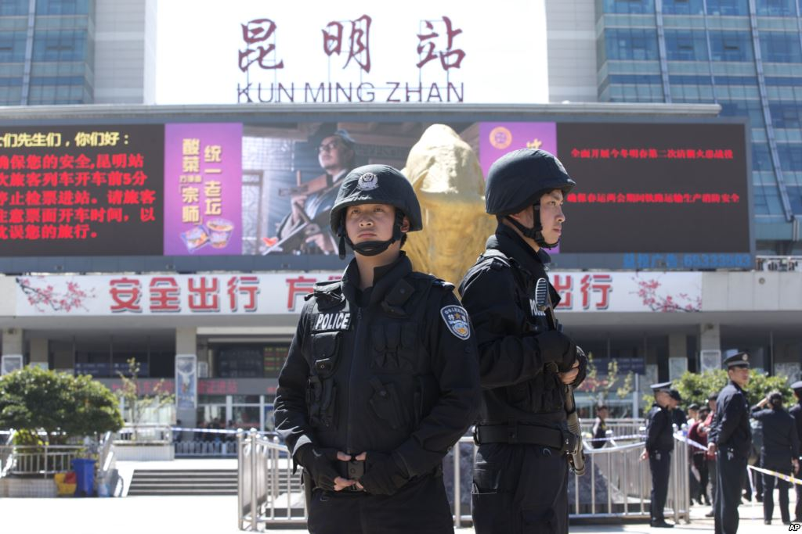

# 昆明恐怖袭击后的一点思考

昆明恐怖袭击事件已经过去快一周了，如同之前所有的同类事件一样，在网上的讨论声越来越少了，或者对于一些别有用心的声音来说，这种讨论越少越好。讨论之余，我们也应该去仔细想想我们在此次讨论中所关注的点是不是经得起推敲。

在事件发生之后，网上的声音大致出现了两派，一派认为应该严惩恐怖分子，另一派认为应该探究事件的根源问题，虽然这两者根本不冲突，然而却能争执起来最后演变成人身攻击和相互的羞辱，这恐怕也是互联网时代必不可少的景象，或者也可以说这种斗鸡一样的性格恰恰就是我们实际生活中的“互联网思维”。

“严惩恐怖分子”恐怕是被提及最多的，包括网上一些人要求死刑，有的要求连带恐怖分子的家属，还有要求对被捕的女性暴徒实施带有性虐待的刑罚等等。两百多年前，意大利法学家贝卡里亚写过一本薄薄的小册子叫做《论犯罪与刑罚》，这本书后来成为了法学专业学生必读的入门书籍，在这本小册子里面第一次系统地提及了后世刑罚设置的一些基本原则，如不可使用酷刑、不可法外行刑，不可滥用死刑（原著说的是不可死刑）等等。然而恰恰是这两百多年前的思想，在我们今天依然没有深入人心，或者说很多人依然停留在原始的“同态复仇”和“以暴制暴”阶段。

我们的法学思维普及是不是出了问题？这个问题要从两方面来论述，一方面我们在与生活密切相关的法律思维普及上成果明显，比如婚姻法、继承法等实际应用的内容普通老百姓都能理解，甚至可以在同一个平台上参与讨论；但是刑法上的思维普及性就很差了，以至于还出现了上文有些民众要求对恐怖分子家属连坐和性虐女犯等。

恐怖分子有没有人权？这是每次都会被拿出来讨论的问题，如果我们从广义的人权来看，恐怖分子肯定有人权，但肯定不会享受全部的人权。首先我们称他们为恐怖分子而不是罪犯，那我们就假定这个概念本身就是在司法审判之前，因为审判以后就是按照罪犯的待遇对待，而罪犯的人权是有法律保护的（我们姑且相信一定程度上的确受到了保护）。对于恐怖分子来说，所谓提及人权的阶段就是被公安机关逮捕之后审判之前的阶段，比如审讯等等。

而这个问题最根本的一点在于：基本人权是不可以剥夺的，因为这个权利是直接附加在人身上的，是以法律的方式予以确认而不是赋予的。所以无论是谁，基本的人权都必然受到保护，比如不可被刑讯逼供和虐待，家人不可被牵连，不可被法律之外行刑等等。但人身权以外的其他权利肯定是会按照法律规定予以剥夺的，比如不可通讯，限制自由、剥夺财产和政治权利等等。

当然事实上我们都知道所有的权利都是法律赋予的，但为什么我们拟定一部分权利是所谓“天赋”的，法律只能进行确认的呢？那是因为如果是法律赋予的，那么法律也可以收回，法律今天可以收回他的，明天就可以收回你我的，这次收回是合理的，下次可能就是不合理的，把存在一定自由裁量的事项限制在基本人权之外，每个人才有安全的保障，法律尤其是刑法不是我们可以滥用的工具，而是社会的最后一道防线。

这样的分析会引出我们进一步的思考，就是为什么民众会认为已有的法律不足以惩治恐怖分子，所以要格外强调“严惩”呢？在作者看来，这也许是我们的法治进程走在了民众思维的前面，在也许多数人还停留在所谓的乱世用重刑的思维的时候，我们的法律已经开始考虑到了对于人权的保护和法律对于社会的预防作用。刑罚本身的严惩能不能代替社会层面的预防呢？答案是不能，当然不是遇到什么暴力事件就杀一批人就能把问题解决的，如果是这样历次肃反运动早就会塑造出坚不可摧的革命队伍，而不是总有人叛变了。

法律应该不应该走在民众思维的前面，这是个很严肃的问题，但我个人的角度来看，当然应该这样。如果不由专业的人士靠理性和对发展趋势的判断来引导这个社会，难道还由不专业的普通民众用情绪和鸡粪来引导吗？

(编辑：戴正阳 于轶婷) 