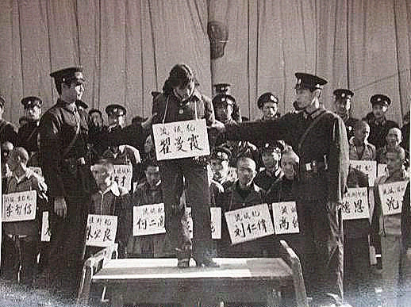
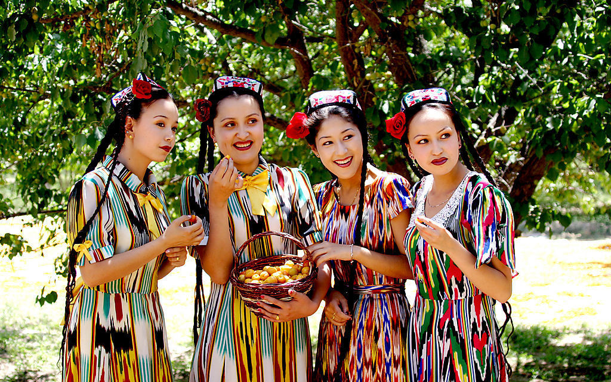

# 两少一宽：它到底是什么？

“两少一宽”已然成为互联网中民族对立正当化的一个宣泄口。
    
无论是街头巷尾“豪爽”的切糕贩，还是昆明暴恐事件中丧心病狂的歹徒，只要犯罪分子与“少数民族”一起出现，网络舆论就会很快掀起一阵阵民族对立的言论，乃至于“灭族灭种”。在这样的氛围中，任何试图追求理性的声音最终都会面临关于“两少一宽”的质问：“两少一宽是特权 ”、“两少一宽是怀柔政策”、“两少一宽纵容了犯罪分子”......因为“两少一宽”，有一些非理性的憎恶似乎就变得合情合理了，甚至连正当诉求都找到了。

**本文首先要解决的问题是：到底，什么是“两少一宽”？**
    
**所谓“两少一宽”，即“对少数民族的犯罪分子要坚持‘少捕少杀’，在处理上一般要从宽”。**这一政策是在中共中央1984年第5号文件中首次提出的。
    
但如果不了解这项政策的性质和背景，这段频频出现的对两少一宽的解释，远远不能帮助你了解什么是“两少一宽”。
    
如果不考虑1984年政策发布时的时代背景，而将今天的少数民族犯罪现状硬套入“两少一宽”，必然会将“两少一宽”视作对不稳定少数民族族群的一种“怀柔政策”，尤其针对非少数民族聚居区域的都市中生存的少数民族族群。然而必须指出的是，1984非少数民族聚居区域的大街小巷还没有出现“切糕党”，“维族小偷”的恶名也绝没有今天这么响亮，少数民族在都市中生活的数量比之今天少的太多。1984年“两少一宽”政策发布时所考虑到的现实状况，与今天差距甚远。
    
那么1984年的情况是怎样的呢？

严打。1983年开始的严打与“两少一宽”这一刑事政策有着深刻的关联，这是今天我们在讨论“两少一宽”时往往忽略掉的。

1983年，中共中央政治局发布《关于严厉打击刑事犯罪活动的决定》，这份文件一开始就表明了其决策背景是为了扭转“社会治安的不正常状况”，因而“决定以三年为期，组织一次、两次、三次战役，按照‘从重从快，一网打尽’的精神，对刑事犯罪分子予以坚决打击”。这份文件发布仅一周，全国人大常委会就颁布了《关于严惩严重危害社会治安的犯罪分子的决定》和《关于迅速审判严重危害社会治安的犯罪分子的程序的决定》，前者主言定罪，规定“可以在刑法规定的最高刑以上处刑，直至判处死刑”；后者主言程序，上诉期限由《刑事诉讼法》规定的10天缩短为3天。回头看，以现代法治的眼光来看待“严打”，其中的种种作法是颇为惊人的：1979年《刑法》和《刑事诉讼法》相继通过，1980年元旦这两部法律同时开始实施，而时间仅仅过去三年，“严打”就将这两部法律的重要规定彻底打破，并且定刑可超过法定最高刑这样的规定实在让人瞠目结舌。

1983年底1984年初，“严打”第一战役结束，部署开展第二战役。仅在第一战中就逮捕了杀人、放火、抢劫、强奸、流氓等罪犯102.7万人，竟然有2.4万人被判处了死刑。长期分管政法工作的彭真评价“第一仗”时说，“很短时间，搞了这么大的一场斗争，很不容易，有点缺点也是难免的”。但紧接着他就立马开始强调“第二仗要搞细，抓的对象要搞准，质量要提高”，明确提出了严打要“防止扩大化”（参见彭真《论新中国的政法工作》P350）。“严打”的扩大化可能就会不考虑少数民族的实际和特点，违反宏观上的民族政策，从而激化民族问题，因此在此时就民族区域内的严打提出“防止扩大化”的要求便顺理成章。中共中央文件中“在藏族地区执法要特别慎重”也可以印证这样的考虑。
    
但决策作出的理由绝不仅仅是防止严打的扩大化。1980年元旦，79刑法开始实施，此前我国从未正式实施过一部成文刑法典，少数民族地区的法制现代化进程可以说连步子都没怎么迈过。在这些地区要彻底实行一部现代成文刑法，与本地的风俗文化之间的矛盾，不可谓不激烈。
    
有一篇名为《对少数民族中的犯罪分子必须实行‘两少一宽’政策》的论文时常在网络上被当作“神文”挂出，然而仔细阅读后就会发现在这篇发布在一九九一年第一期《青海民族学院学报（社会科学版）》的文章中，详尽地列举了一系列的案例，这些代表性很强的案例都很好地反映出了少数民族地区风俗习惯、心理特征与现代法制意识的巨大差异。这其中最能反映本土意识与现代法制差异的领域莫过于两性关系、婚姻关系。例如《古兰经》中写到“你们可以择取你们爱悦的女人，各娶二妻、三妻、四妻”，80年代回族聚居区域就仍然存在娶“二奶奶”的现象，在藏区也存在着一妻多夫的风俗。这些传统风俗一时是极难扭转的，如果严格按照《刑法》处理，无疑应当以重婚罪定罪，但这样的做法将会引起民族地区人民的强烈反感。
    
在1983年“严打”中，一名汉族王姓女子因与10多名男子发生性关系而以流氓罪被判处死刑，然而与此同时一些少数民族一男与多女、一女与多男发生两性关系并不罕见，土族人除夫妻外往往还找“奈阔日”（情人），并以此为荣，如果按照“严打”时期将的处理方式，此类行为将会被装入流氓罪这一口袋罪处理。然而考虑到少数民族地区的“和谐安定”，这样极为严厉的处理方式也没有完全在少数民族地区实施。
      
即使是强奸罪、杀人罪这样的暴力犯罪，在当时的少数民族区域也有其特殊情况。例如强奸罪如果重判，被害人不仅得不到同情，还有可能被指责“把人家害下了”；故意伤害、杀人案件在藏区还常实行赔“命价”“血价”私下处理，只要赔了“命价”“血价”，被害人亲属以及其他群众就要求不要捕办。
    
一方面是“严打”之下顾虑“重典”会引起民族地区的不稳定，另一方面则是一个个少数民族地区版的“秋菊打官司”。**现代法制在1984年成为了一道尴尬的门槛，“严打”一脚踩在门槛上，又怕把少数民族地区的门槛踩破了，而严格依循现代法制又迈不过本土社会风俗的鸿沟。因此“两少一宽”政策，是当时条件下民族区域司法悄悄换上的一根软棒，“严打”的扩大化和地区风俗传统都让决策者生怕把少数民族地区真的给“打疼了”。**

在了解了政策的制定背景之后，政策实施的实际情况又是另一个问题。如果在全国人大及其常委会颁布的法律或司法解释中查找“两少一宽”，你最终会发现：在严格意义上的法律规范体系中，“两少一宽”根本就不存在，司法解释也对此讳莫如深。
    
**那么，“两少一宽”到底是以何种性质存在于司法体制中的？**
    
**有一个词叫做：刑事政策。**
    
在法律领域内，“政策”这个词听上去有点刺耳，但实际上，刑事政策是各国司法实践和学术研究中均给予承认和重视的，刑事政策学也是刑法学者研究的重要领域。一般认为，刑事政策是指“对已然犯罪的宏观与微观或是战略与战术反应”，刑事政策不处理罪与非罪的问题，因为“罪刑法定”是现代法治的重要根基，根据同样的理由，刑事政策也不硬性调整定刑问题，但在司法工作中依然有广阔的操作空间交给司法工作人员“自由裁量”，例如在法定刑范围内的具体定刑问题。刑事政策在这些领域，就能够给司法工作人员提供指导。
    
我国宏观上最重要的刑事政策是“宽严相济”，而“两少一宽”以中共中央文件为载体，可以视为民族问题上的具体刑事政策。
    
可是，这项刑事政策制定之初所针对的问题现如今已经不存在了啊？“严打”早已结束，而少数民族区域经过几十年的发展，其社会风俗与现代法制的矛盾也随之缓和。为什么“两少一宽”不知不觉地安然度过了整整30年的时间？
    
说是一以贯之也好，说是政策惯性也罢，从建国之初起，在司法上“宽待”少数民族的政策就一直延续着。例如国务院1958年6月发布的《关于处理走私案件十项原则》中规定涉及少数民族成员走私违法案犯罪的“从宽处理”，1959年3月西藏上层反动集团叛乱时中共西藏工委制定《关于捕、关、管、训政策界限的几项暂行规定》中也确认了“少杀”，1961年中央提出西藏无论在内部或社会上必须贯彻少捕、少杀、管制也要少的方针。
    
但这一切当然不能合理解释“两少一宽”在今天仍然存在的正当性，过去主要针对少数民族聚居区域的政策，如今正在非少数民族聚居区发挥着作用。生活在落后地区、思想上较为传统和封闭的少数民族居民适用“两少一宽”，都市中更熟悉都市生存方式、更熟悉司法运作的少数民族居民同样在适用“两少一宽”。同样是“少数民族的犯罪分子”，在生存现状和意识上发生巨大的变化，但适用的还是1984的那个“两少一宽”。
    
这其中一个重要的原因是：“两少一宽”从未得到过清楚的阐释！
    
**“两少一宽”到底是一项民族区域的刑事政策呢，还是一项针对所有拥有“少数民族”身份犯罪分子的整体性刑事政策，是否一个在城市生长并且民族特征非常不明显的犯罪分子也应当适用“两少一宽”？**这项刑事政策的适用范围从未在官方文本上得到清楚的厘清，在这个问题上进行了较多研究的贵州民族学院吴大华教授在2004年发表的《论“两少一宽”的少数民族犯罪刑事政策》中就该政策的适用范围汇集了学者们提出的五种观点。其中最狭窄者为“双重限制说”，即只适用于少数民族聚居地区文化程度很低、法律知识匮乏的少数民族公民，最宽泛者为两个对象法，即“主要适用于少数民族聚居地区，但并不排除对杂居、散居的少数民族公民犯罪的适用”。实际上，所有的可能都被提出来了。**

**“两少一宽”中，“少捕少杀”如何理解？“一般要从宽”如何理解？“从宽”和“少”能否突破《刑法》的限制？（刑事政策突破法律规范在我国司法实践中并不罕见，“严打”中所实施的各项措施就是典型的例子）这些问题你都找不到官方的文本依据，而只能获得一堆学说。

“两少一宽”在阐释上的缺乏给今天造成的问题远比1984年多——“杂居、散居”的少数民族公民更多了、少数民族公民的法律知识水平更加多样了。因而，作为一项刑事政策，1984年的“两少一宽”比今天更加明确、其政策的理性目的也更好解释（但更好解释并不意味着其本身是完全合理、正当的）。换句话说，这样一个严重缺乏阐释的政策在现如今更加复杂的情况下运行，很难说它还处在决策者的理性控制之中。
    
甚至有一种观点会认为：“两少一宽”已经被废除了。理由是2010年2月1日中央宣传部、中央统战部、国家民委三部门联合发布了《关于进一步开展民族团结进步创建活动的意见》，其中写道：“处理影响民族团结的问题，要高举维护社会稳定、维护社会主义法制、维护人民群众根本利益、维护祖国统一、维护民族团结的旗帜。要严格区分和正确把握不同性质的矛盾，坚持具体问题具体分析，是什么问题就按什么问题处理，不能把与民族关系无关的问题归入民族问题。坚持法律面前人人平等。凡属违法犯罪的，不论涉及哪个民族，都要坚决依法处理。”首先，1984年的那份文件由中共中央发布，在政策效力上理应高于这三部门所发布的文件；其次，中央宣传部、中央统战部、国家民委中的任何一个都没有资格去废除一项“刑事政策”。
    
**当然，这项政策在多大程度上正在被执行着，就多在大程度上存在着。但“在多大程度上正在被执行”是本文难以回答的问题。**
    
2008年长沙中院审判的“以艾克拜尔·艾买提为首，特大操纵未成年人犯罪的黑社会性质组织案”在罪行上不可谓不重大，然而其主犯也只被判处无期徒刑。这样的量刑称得上“反常”，它很有可能就是一次“两少一宽”适用的结果。但在笔者所查阅的武汉大学刑法学博士生艾尔肯.沙木沙克所撰写的博士论文《宽严相济刑事政策下的少数民族犯罪控制研究》中，提出了有些地区根本不重视适用“两少一宽”的现状，而他所列举的地区是——新疆，这一点也许是1984年政策的决策者所没有料想到的。论文中提出作者“在新疆乌鲁木齐、喀什、和田、塔城等地向部分公安司法人员和律师调查发现，新疆地区大多数司法人员对‘两少一宽’刑事政策一无所知。”
    
**如果本文要给出一个确定的结论的话，那只能是：“两少一宽”在一定程度上存在着，虽然它的内涵从来没有被阐释清楚过。它不是一项特权，即使这项政策面向所有的少数民族公民适用，也不能称之为“特权”，因为它的“从宽”只是对于犯罪分子的“从宽”，对于每一个守法的少数民族公民来说不能称之为“优惠”。而将这项政策在今天的适用称之为“怀柔”也实在是高估了决策者对这项政策的操控程度，笔者认为将其与“维稳”相联系才更为合适。**
    
“两少一宽”应当被废除吗？首先需要解决的是厘清“两少一宽”是什么，不同形态的“两少一宽”对社会稳定、民族团结、犯罪控制的意义是不同的，本文在这里并不大声呼吁“两少一宽”应当被废除，本文要向决策者发问的是：“两少一宽”到底是什么？写到这里我才忽然发现文章一开始所提出的那个疑问，本文到现在也无法解决。
    
**说到底，“两少一宽”是能够作为一项刑事政策而存在的，但其内涵必须是清晰而非含混的、其作用必须是经过论证而非搁置的、其形式也应当在一定程度上转化为法律法规。（实际上，《刑法》第九十条所规定的民族自治地方可以制定刑法变通或者补充的制度，就能够在一定程度上将“两少一宽”的具体适用以法律形式固定下来。**
    
当然，如果一项政策在运作中脱离了决策者的理性控制，而在激发极端言论上却是最好的一把“枪”，那么，直接废除倒也算“死得其所”了。

(编辑：何盼盼)