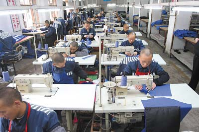

# 第一百零七期：如果进了监狱，我们可以做什么 

我想进监狱。
不要认为我是一个潜在的犯罪分子或者精神不正常的人，也千万别把人家想成SM女王。想进监狱瞧瞧只是因为太多的人把阴森的监狱形容地太过美好，或者在里面过得太过美好。陈独秀在狱中享有两个大书柜，饶有趣味地进行文学研究，而且还公然和老婆在狱中做爱。而最近逝世的南非国父曼德拉也曾在狱中开辟了一块菜地，种下了九百多株植物。惊险有趣，体会压迫与反压迫的监狱生活也是个不错的选择。但是，监狱毕竟不是风景区，在里面往往想干的很多能干的却很少。如果，我是说如果我们某天进了监狱，我们可以做什么？

**我想做爱！**

不要笑！这是多正常的生理需求，暂且不说国情，我们先从生理需求分析。每个成年男性当然都有性交的需要，如果正常的话，每周1~2次还是必须的吧。因为监狱里关押的都是有期徒刑以上的罪犯，那这些人如果在几年、十几年甚至无期的刑期中都没法做爱的话，这对成年男性和女性都应该是极大的折磨吧。那我们进了监狱，还能不能做爱呢？大家都记得《越狱》里苏克雷和她女友在监狱里做爱缠绵的片段，这当时就对我产生了极大的冲击，原来还是可以做爱的，原来还是可以做爱的。但转念一想，这是资本主义的私营监狱，在我国社会主义监狱制度下还可以做爱吗？
这个问题比较难找答案，我国新修改的《监狱法》中肯定没有明确规定，咨询了几位经常和监狱机关打交道的老师得出一个基本现实的答案我国监狱中是不允许在监狱之中发生性关系的，但是也有一些监狱会有所谓的“鸳鸯楼”等“特优会见室”，据相关媒体报道这种“特优会见室”是为管理等级为A级的犯人，且家人持有合法的身份证、结婚证，经犯人本人申请，获批准后，其家属可持结婚证及当地派出所证明住进监狱“特优会见室”，享受夫妻同居权，时间从晚7时至次日早晨7时。
但是“特优会见室”是否具有普遍代表意义，笔者并不能下这个结论，全国有多少监狱允许这种“特优会见”我们也未从得知。我们能看到的关于“特优会见室”的报道集中于对于南京市监狱的特优会见和北京女子监狱的“同居会见”。（参考新浪网转载的报道http://news.sina.com.cn/s/2002-04-28/1848561943.html ）而我们在寻找资料的时候，也看到了不少网站挂出的《罪犯通信、会见、特优会见、与亲属共餐的有关规定》，其中在第四条有如下规定：
符合下列条件之一的，可批准与配偶或直系亲属特优会见： (1)被评为改造积极分子，且分级处遇在一级宽管的； (2)进入二级宽管半年以上，计分考核连续三个月末被扣改造分的； (3)在改造或生产中有悔改或立功表现且进入普管级一年以上的；(4)因改造需要经监狱批准的。符合特优会见条件，经罪犯及其亲属申请，每月可安排一次，会见时间可延长至24小时，特殊情况经批准可延长至48小时。罪犯与配偶一方患有传染性疾病的，或《结婚证》等证明材料不全，或有其他不能特优会见的情形，监狱应拒绝安排特优会见。（参见南方网http://www.southcn.com/law/fzzt/zgjyfzzk/xgflfg/200303070735.htm ）
但是该规定的真实性和有效性让笔者怀疑，就在此《罪犯通信、会见、特优会见、与亲属共餐的有关规定》的第三条还明确说明家属会见时间每月可安排一次，会见时间不能超过一个小时，“特优会见”时间是整整一天甚至还可以延长为两天，让罪犯和家人如此长时间接触实在让笔者为监狱管理的安全担忧。笔者继续查找载有该规定的网站时发现除了一些法律服务类网站如《找法网》和一些律所网站外，江苏省人民政府网站上也刊登了这一规定，
（http://www.jiangsu.gov.cn/gzcy/zxft/bjzl/jxjswd/200711/t20071126_183833.htm ）而且出乎意料的是在江苏监狱网网站上有关于“我省监狱对罪犯与亲属特优会见有哪些规定？”的回答，其中对特优会见的规定和前文所述的规定基本一致，但是该网站上的回答却又指出了此规定是根据省《罪犯会见通讯管理暂行规定》作出的，笔者在北大法宝网站上进行了检索并未发现江苏省有此规定。而且更有趣的是在江苏人民政府网站上公布的江苏省省监狱管理局副局长刘保民和网民在2010年6月的网上交流实录中，刘副局长并未提及特优会见的事情而且在一位网民提问想和在监狱的夫妻共餐时，刘局长都给出了这样的答复“按照我省监狱有关规定，目前罪犯家属不可以与罪犯亲情会餐，但每月罪犯家属都可以在监狱规定的会见日到监狱会见罪犯”。如果连和监犯会餐都做不到的话，长达一天至两天的特殊会见现存的可能性更加降低。
（http://218.94.123.41/jszxft/html/4028819b27ef8a860128f18771080518/zxzb.htm ）
笔者絮絮叨叨地说了这么一大堆，总结起来中国监狱夫妻要求过性生活的现状是这样的：在2002年或者更早一些的时候在江苏或者北京等一些地区存在特优会见，即夫妻可以在狱所内过性生活，但是到了之后可能因为社会舆论压力和与现行法律相悖的原因，特优会见从此淡出人们的视线，目前在大多数监狱要求夫妻在监狱内过性生活的想法依然是不太现实的。当时学界和实务界对特优会见的反对意见大多是认为监狱里的罪犯在被法律剥夺了人身自由权之后，包括在人身自由权内的婚姻家庭权利的夫妻同居权也被剥夺了，监狱开放特优会见便是与法不符，言不正名并不顺的事情。

但笔者认为罪犯被剥夺了人身自由权的同时并不当然地失去了婚内同居权，同居权作为婚姻家庭权利的一部分应该是和人身自由权相分离和独立的。如果相反的话，该如何解释监犯可以在狱中结婚这一常见做法呢？婚内同居权之所以监犯长期不能行使，并不是由于法律规定的禁止而是缘于罪犯被限制人身自由后的客观不能，客观不能行使的同居权利由于法律没有禁止所以依然存在，这也成为部分监狱设置特优会见的法理基础。而从更深层来讨论的话，性是马斯洛基本生理需要之一，如同呼吸、水、食物、睡眠一样重要，如果囚犯可以在监狱内自由地呼吸空气，那么他们的性权利也应该得到充分的保障和尊重。
虽然国内监狱对如特优会见和同居会见的管理很苛刻，但是我们还是要相信如同我不能不喝水一样，做爱是人最正常的生理需要。很多年前陈独秀先生就对狱卒喊道：我犯罪了，我的性欲没有犯罪。人最正常的生理机能和表现如果都被人为制定的法律而禁止了，这也未免有点说不过去，如果你想在监狱内做爱的话就去找狱警吧。他们怎么处理呢，我也不知道，这确实会给他们造成管理上的诸多困扰，他们怎么处理就看司法部门如何权衡了。反正我说我要做爱起码还是没有人会禁止你的，呐，人家就是想做爱嘛。

 **我要学习。**
 
修改后的《监狱法》自第六十二条至六十六条对罪犯在监狱里的学习进行了规定，具体来说，如果我们进了监狱可以进行下列教育选择：
思想教育。主要是法制、道德、形势、政策、前途等内容。可以参考思修毛概那四教材，但是大多数监狱的思政教育是与初高中政治教育内容相当的。
扫盲教育、初等教育和初级中等教育
职业技术教育。这项教育监狱开展的很多，因为不仅可以增强罪犯职业技能，也可以让罪犯更有技术的劳动，然后监狱创收。
自学。监狱基本都设置了图书馆，许多还有专门用于罪犯学习的教室等场所，这些都会对罪犯开放的，即使身陷囹圄想要学习还是很多办法的。
根据国务院监狱法实施和监狱工作的报告，2008年以来，全国监狱系统共完成对125万名罪犯的扫盲和义务教育工作，作为对比的数据是我国目前在押犯为164万人，而这其中取得职业技术证书的罪犯达到参训总数的77.3%。看来，在监狱进行学习不仅是可以的事情而且貌似还有点强制普遍推动你学习的味道。当然好学者可以不满足于义务教育阶段，你可以自学也可以参加高考、研究生考试甚至申请读博，这一切都有可能。据媒体报道2003年北京市某监狱在押犯杨某，在高墙内通过博士论文答辩，据称当时武汉大学还专门派五名教授为其在监狱内进行博士论文答辩会。根据目前我国监狱管理的情况，罪犯集体学习的时间。为每周一整天，自学的时间自不在此列。说不定，坐监几年出来后也能像陈独秀先生一样发表各种学术著作了，曼德拉、昂山素季这样领导人在监狱里也应该是没有放弃学习的。

 **还要劳动啊……**
 
古装剧看多了你以为坐监就是让你蹲在狱舍里仰望天花板，思考人生吗？很显然你想得太简单了，在我国社会主义阳光下，什么最光荣？当然是劳动最光荣，你说你都已经进局子了就不再想光荣了？那也不行，我国宪法规定了劳动既是公民的权利也是公民的义务，如同我们要向国家纳税一样，劳动作为公民为国家创造价值、推动社会机器运转的重要活动那是必须要做的。在监狱里做什么劳动呢？
在监狱里的劳动主要有两种：维护性劳动和生产性劳动。维护性劳动就是维持监狱正常运转的一些工作，譬如扫厕所、扫地等清洁维护工作。维护性劳动总的来说并不是特别多，就那么一亩三分地也实在用不了多少人去做，大多数犯人还是会从事到生产性劳动，比如劳务加工（纺织缝纫、塑料加工等行业）、农业、建材、机械制造、电力和煤炭等，当然各地的情况不一样，监狱企业的行业性质也不一样。你可能在监狱里面纳了十年鞋底也可能在坑底挖了十年煤。

你在监狱里的劳动基本和在高墙外的劳动没什么区别，劳动也会得到一些报酬，只不过这个报酬和外面的工资还是有点不同的。监犯的劳动报酬在很多地方都是由出勤补贴、岗位补贴和绩效补贴三部分组成，全国的平均水平差不多从50元左右至三四百元。而罪犯的劳动报酬也并不是直接全部发给本人，基本都是按照比例一部分存入其个人消费账户，供其在监狱内的小卖部购买日用品等，其余部分会在罪犯刑满释放时予以发放。

一颗红心两手准备。高墙内外的风景各有千秋，你可以在自己的小隔间里码字挣钱，也可以去局子里和小伙伴们一起晨起跑操。人生际遇很奇妙，今天还在这上北斗网，明天说不定就要开始劳动学习，想着怎么做爱了。这都是说不定的事情。

(编辑：于轶婷 陈澜鑫)