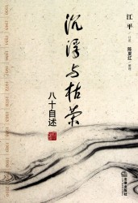
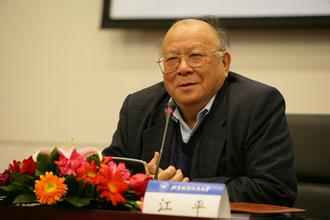

# 信是明年春自来——《沉浮与枯荣》书评

作为新浪中国好书榜2010年度“十大好书”之一，这本《浮沉与枯荣》还是叫人有些失望，与同获此荣誉的其他作品相比似乎略逊一筹。在时间跨度和性质分类上与它最相似的《巨流河》，以一位耄耋老人对家国之痛的诉说让人掩卷三叹。刘瑜的《送你一颗子弹》和熊培云的《重新发现社会》则呈现了青年知识分子对社会现实的生动描述和理性思考。

而这本由江平口述，陈夏红整理，汇集了两代法律人思想与智慧的“口述法史”，就个人的阅读体验来说，只能说平平无奇。最主要的问题在于写作者干涩的语言和缺乏技巧的叙事上，硬是把本来可以呈现出的波澜壮阔写得淡而无味。

不过，书是别人写的，阅读体验和思考却是自己的。洋洋洒洒的法学泰斗整整八十载的人生记录，读完总还是有些话要说。

### 伟哉江公

江平，原名江伟琏。伟是按照江家“永怀为业”四字正好排到的伟字辈。江平乃公认的法学界“大佬”。 中国政法大学终身教授，曾任七届全国人大常委会委员、法律委员会副主任，中国法学会副会长；现任最高人民法院特邀咨询员、国际仲裁委员会仲裁员、北京仲裁委员会主任等职务。去年底，他和贺卫方一起受到马英九的接见。而江平对自己的定位，更多的不是一个法学家，而是法学教育家。

江平前半生的命运可以说是起伏跌宕，燕京大学新闻系，留学苏联，“右派”帽子，离婚，失去一条腿。这些关键词串起一条从踌躇满志到跌坠谷底的人生轨迹。而现在，说到江平，我会想起他的三句话：“只向真理低头”，“我所能做的就是呐喊”还有“我的中国梦就是法治天下”。

这三句话一句比一句铿锵有力，掷地有声。说得矫情一点，如果说这本书读完对江公没有“肃然起敬”，那是因为一直以来都存着敬仰之情。也因此这本书对我来说显得没有太多“意外”，最多也就是满足了对江公个人经历的一点好奇。

书的前三卷，“似水流年”、“廿载逆境”、“我的教与学”是江平的个人成长经历，类似于自传，也涉及到“反右”，“文革”等历史事件。江老作为这些事件的亲历者，他的讲述更像是对60年代中国历史的回眸。野夫说，在个人记忆中青春时代都是最好的时代。人们怀念某个年代也总是因为它与自己最好的岁月重合。60年代，江平处于三十来岁的年纪，对男人来说确实也是黄金时代，可是因为特殊的政治环境却给他个人带来重重灾祸。而江平在80岁时回顾这段历史，除了对自身的观照以外，更有历史层面的反思。毕竟，时间让很多东西都慢慢褪去，但会留下值得记住的东西。

而后两卷“大立法时代”与“为法治呐喊”则更多脱开了个人，以人大代表和公共知识分子的身份，从更宏观的视野审视改革开放以来的法制建设和法治现状，包括对律师群体，对市场经济的观察，可以看做1949年以后一部局部的中国法制史。

### “从无到有”和“从有到优”

书中关于江平先生作为七届全国人大常委会委员，参与众多立法工作的经历是最有价值的部分。普通人对“立法”一般都没什么概念，像我这种连区人大代表的名字都叫不出来的更是如此。全国人大嘛，除了每年开会时通过媒体看看代表们穿了什么衣服，系了什么皮带，拎了什么包之外还比较有趣之外，其他实在太遥远了。对于《物权法》通过，《刑事诉讼法》修改这些重大的立法修法事件，鲜少有人能有机会从一个真正参与者的角度去观察。

说起来2000年生效的《立法法》对我国各个位阶的法律制定，修改和废止都做了程序性规范。法条固然枯燥复杂，但程序本身并不构成立法的阻碍。立法的难处不在于这些程序，也不在于“从无到有”的创造，而在于如何实现“从有到优”，比较合理地平衡各方利益。

换言之，学者们凭借自己的专业知识，借鉴外国现有的立法，拟出法律草案倒不是最困难的。难的是在一遍遍的讨论和修改中妥协可以妥协的，坚持必须坚持的。而“优”的标准正是达到利益的平衡，或者即便仍不平衡，至少也得比之过去有明显的改进。

要证明这一点，也许在历史上最具代表的例子就是二百多年前的费城制宪会议。来自当时美国13个州的代表为了制定联邦宪法，钻进一个屋子开会开了将近4个月，有的议题甚至表决了70多次。有人会说，费城制宪难道不是一个“从无到有”的过程吗？可事实上，那让美国公民引以为傲的实施了二百多年的宪法，并不是生生地由代表们“头脑风暴”出来的。在此之前，各州有自己的宪法，州与州之间还有个《邦联条例》，并不是一片空白。但是大小州之间仍然冲突激烈，局势混乱。问题在于无论是各州的宪法还是《邦联条例》都没办法协调这片土地上的各方利益。法律是有的，但是却不优。

### “人和”是不够的

我们都知道，在法学界，学术大牛们可能会在一个问题上持截然相反的观点，会争论和试图互相说服。这个思辨和碰撞的过程正是法学，甚至是所有学术的魅力所在。它鼓励独立思考，自由表达。可是读书人到了庙堂之上，左右立法结果的肯定不会是这种纯粹基于学术的讨论了。不难想见，知识分子相对理想化的立法蓝图和现实之间肯定有不少出入。

书中有关于《新闻法》几次胎死腹中的故事。这段艰难的立法过程让我更深地体会到，有些知识分子真的不乏智慧和热情，可是成就一件事情远远不是“人和”就够了。一个人要施展拳脚是要受到客观环境的限制的。

我们站在今天的角度看中国的法律，总觉得各个部门法都是错漏百出。现行法律不仅远远落后于学者们的研究，而且对于现实的反馈不够及时有效。就像微博上有人吐槽，有些国家雾霾，留下一些立法，而有些国家雾霾，只留下一些段子。

所以，法学家们也总是嫌弃立法的进度还不够快，质量还不够高，但也许当你有机会深入体验立法工作的时候，就会发觉这种埋怨难免有点“看人挑担不吃力”的嫌疑。早岁那知世事艰，顿时觉得自己到底是naïve。

这当然不是在为现状做什么辩护。知识分子也好，普通民众也好，都能或多或少感受到立法的不到位。人们自然也有权利批评这种种缺失。但立法的本质是协调各种力量之间的博弈，为了尽可能实现公正合理的利益分配格局而做出妥协。这是不会变的，这也是极其困难的。

所以正视法学家在其中做出的努力是必要的。

信是明年春自来，这是江平的一本诗词集的名字。用它做这篇文章的题目，但愿那个春天不会太远。

(编辑：马特)
