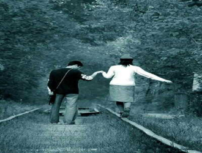

# 勿增实体

王超在大学读了四年心理学，第四年写了一篇论文，试图论证爱情这种东西并不存在。论文的标题是《论作为人类情感的爱情的虚伪性》。王超把“爱情”二字描述为一种文学的虚构。因为爱情作为一个词，并没有直接对应的现实存在，当我们谈论爱情的时候，我们总是在谈论一堆情感的复合，而这堆复合的情感在不同人不同关系当中，其组成成分均不相同，说明爱情根本没有一个标准的定义。或者根本就不需要定义，人们只是为了方便或者欺骗，才创造了这么一个暧昧的词汇。在这里王超引用了传说中的奥卡姆剃刀，“如无必要，勿增实体”。在他看来爱情就是一个应该被剔除的实体。

王超写作这篇论文并不是为了开玩笑。他把这篇论文作为毕业论文上交了，并顺利进入了答辩环节。在答辩会上，心理学院全院师生都亲耳听见王超为了通俗的说明自己观点，不惜拿评委席上的院长和院长夫人举例。他说众所周知院长和院长夫人的婚姻至少有几十年了，几十年的老夫老妻，怎么可能没有爱情呢？我记得当时院长和院长夫人还微笑点头，全然没有考虑这只是一次欲抑先扬。

没有就是没有。王超说。

接下来是王超的论述。依王超的观点，院长和院长夫人持续几十年的所谓“爱情”，只是许多因素综合的结果，这些因素包括法定的婚姻关系、一致的家庭利益以及相投的趣味与共同的追求（两人同为心理学教授）。当然最主要的，还是几十年夫妻生活所形成的习惯。在没有大的分歧或矛盾的情况下，一个屋檐下这几十年，换成任何人都会习惯对方的存在，进而产生依赖的心理，因此显得情深意重、难舍难分。这就是“爱情”的错觉。

王超说，有这几十年，就算把院长夫人换成别的女人，院长也会产生同样的错觉。

最后王超的论文当然没有通过。碍于院长的情面，全体评委一致投了反对票，包括王超的导师。即便如此导师也依然没能消除院长因为王超而对他产生的怨气，截止目前都没能评上正教授。而王超本人，却因为答辩会上这一席精彩演讲，闻名全校。他索性把论文发到了网上。一篇字数过万的充满学术术语的硕士毕业论文，在一夜之间蹿红本校的论坛。

为了毕业证和学位证，王超迫不得已修改了论文，去掉了爱情不存在论的关键章节，只保留了前面解构爱情的部分，题目改为《论作为人类情感的爱情的成分》，听起来就像化学系的分析报告。这个残本的论文得到了通过，原因不是院长宽宏大量，而是学院不想让他拖累毕业率。毕业以后王超在外头工作了一年，当过心理咨询师，写过情感专栏，最后又回本校考了一个研究生。这次他研究的是哲学，具体方向是马克思主义。

我和王超是因为同一个寝室而认识的。本科毕业后我也考上了研究生，当然专业不是马克思主义，而是党史。整个党史专业就只有我一名学生，而研究生寝室都是二人间，偏偏历史系其他学生刚好凑成了偶数。当时王超是研二，因为性情古怪，没有人愿意和他同住，导致他单独占据一个二人间，而且只交一个人的住宿费。所以我就被分配到了王超的寝室，提升了学校资源的利用效率。搬进新寝室的当天，我就见到了只穿内裤就盘腿坐在椅子上读维特根斯坦的王超，月光从窗口射入，照见一地的垃圾。当时王超抬头瞄了我一眼，对视的瞬间，我想我们彼此都觉得对方是个傻逼。

没有想到，我和王超后来会成为至交。后来我们初次相遇的事情又反复被他提及，用来证明不光爱情是虚构的，友情也是。王超说我们之所以会成为朋友，纯粹只是因为我偶然的被分配到了这间寝室，和他生活了两年闲扯了两年。所以我们的友情只是偶然与习惯的复合体。他说如果我菊爆了你或者你菊爆了我，那么我们的友情就多了性的成分。总之友情根本是不存在的，当初考上党史专业的换成别人，他也会与之寝室结义，成为朋友。当然这一点我并不赞同。

因为当初报考党史专业的就我一个。

毕业第一年王超开了一家心理诊所，并因此邂逅了夏娃。

这是王超诊所里第一个真正意义上的病人。当时诊所已经开张了一个多月。一个多月里，诊所人迹罕至，王超每天在逼仄的出租屋里，看日出日落，斗转星移，无聊透顶。为了改善状况，王超还推出了免费咨询服务，目的是吸引眼球。结果只吸引了一批小区大妈，每天聚集在王超的小客厅里开家长里短交流会。因为这个义举，王超还得到了居委会的表扬，并被授予一面“三八红旗手”之类的锦旗。

在一个静穆的夜晚，王超刚吃完作为晚餐的泡面，正准备把塑料碗叠到门口如山的垃圾上。开门的瞬间他看见了一个姑娘，在公寓门口踟蹰不前。蕴黄的路灯把她的轮廓照得通透。

夏娃当然不是姑娘的真名，只不过王超死活不肯告诉我姑娘的姓名，他说这是客户信息必须保密。他还拒绝描述这位姑娘的容貌、身材、衣着，理由是外貌特征也在保密范围之内。所以我只好想像一个五官混沌轮廓模糊而且赤身裸体的姑娘，端坐在王超对面的沙发上，身子前倾，目光如谜。这让我联想到伊甸园里的夏娃。如果她是夏娃，那么王超只能是撒旦。众所周知撒旦是魔鬼，但王超一点都没有魔鬼的样子。这当然不是说他更像天使。王超身材臃肿长相猥琐，年纪轻轻已有秃顶的迹象，外表更接近中世纪教会的神父。

夏娃第一句话就问王超，真的是免费咨询吗？

王超点点头，心里和胃里一齐泛起不快。

夏娃对王超说，自己是因为自己读过王超在校园论坛里发布的论文，觉得王超的文章汪洋恣肆，有理有据，实在妙极。这些话对王超特别受用。王超当即哈哈大笑，立刻就忘了免费这回事了。

夏娃告诉王超，自己有一个男朋友，是大学的同学，已经相处快三年。为了方便，我把这位小男友称为亚当。三年前，亚当与夏娃萍水相逢。正所谓世间所有的相逢都是久旱逢甘露，两人一见钟情相见恨晚。夏娃深爱着这位亚当，说和他在一起的时候，总会幻想未来的家庭，白头偕老，儿孙绕膝。听到这里王超特别担心，不是因为计划生育基本国策，而是看起来这位姑娘幸福感满盈，不像有什么需要咨询的。他赶紧问她，那你究竟为何而来？

夏娃说，但他们没法在一起。

夏娃并没有细述他们没法在一起的原因。对此我和王超都展开了丰富的联想，我觉得这个亚当可能是个出身豪门的亚当，富家子弟，土豪阶级，而夏娃则出身贫寒，门不当户不对。没有物质的爱情都像中年男人膀胱里的尿，一出头就分叉了。但王超则认为他们没法在一起，应该有更深层的原因，比如他们俩可能是亲兄妹。近亲结婚有违国法。作为遵纪守法的好公民，她只好忍痛割爱。但毕竟割不断，理还乱，只好到这里求助王超。

王超深知这位姑娘来到这里只是为了借助他的爱情不存在论，逼迫自己死心。这是他理论联系实际用实践检验真理的好机会，因此王超摩拳擦掌，运用起自己的理论，帮她解构她的爱情。他说你和他相处了三年，说明什么？说明你已经习惯了他，甚至对他产生了依赖心理。你们俩一见钟情，则说明他让你冲动了，简而言之就是勾起了你的性欲。你想成家生孩子，说明你对他已经有了未来的憧憬。这些和爱情都没有半点关系。总而言之，你和他的“爱情”只是由依赖、性欲和憧憬愁拼凑而成的一种假象。

夏娃沉默了半晌，显然对王超爱情不存在论不大认同。

此刻的夏娃坐在王超面前的沙发上，交叉着双腿，半睁着惺忪的眼睛，瞳孔里升起一片浓雾。她说爱情不可能不存在。她觉得她对男孩除了依赖、性欲、憧憬，还有一些别的什么。正是这些别的什么，让她对男孩始终割舍不下。

王超心想完了煮熟的鸭子飞了。

没想到夏娃竟然成为了王超诊所的常客。唯一的常客。起初一周预约一次，后来也不预约了，每隔几天就飘然而至，从不给钱，但偶尔会给王超带来外卖以及零食，保证王超的下顿。两人熟络以后，夏娃就渐渐的放开了。她和王超讲了许多事情，她和男友的生活，日常生活，性生活，还附带了不少细节，比如工具的尺寸，高潮的时间，偏好的体位，等等。当然这些王超一律以保密为由拒绝相告。他只说她比较喜欢被压在胯下的不能自拔的感觉，她在高潮的瞬间会感到丝丝晕眩，男友的家伙就像攻城槌。听得我浮想联翩。

当时王超已经开始在报刊上撰写情感专栏，在唯物主义的报纸上宣传唯物主义的爱情观。我担心他这样会不会破坏他人关系影响社会稳定，但王超说他只是给那些情感上遭遇不幸的人提供思想武器，帮助他们破除对于爱情的幻想。他把这些人称之为情感上的无产者。无产者在这场革命中失去的只是锁链，得到的却是整个世界。但失去锁链的无产者们又不停的追问导师什么才是真正的爱情？王超说没有什么真正的爱情。爱情的不存在不是相对的不存在，而是绝对的。然后无产者们就哗然了。爱情怎么可能不存在？

爱情自古以来就是人类情感不可分割的一部分啊！

一天，夏娃对王超说，她梦见自己去做了结扎手术。

这是王超头一回应对解梦的问题。他急得抓耳挠腮，借口上厕所，乘机溜入卧室翻书。《周公解梦》告诉他梦见大便意味着财运，但显然没有预见到结扎手术这种东西。《梦的解析》里有几百个关于恋母的案例，但没有一个可以套用在眼前的姑娘身上。最后王超怏怏的回到座位上，说梦都是相反的。

你梦见结扎，说明你渴望生育，渴望性交。

可能最近会犯桃花哦！

然后他们俩就开始做爱。

这一点的逻辑跨度和事实跨度之大，让人触目惊心。王超说她就像一个梦游者，恍恍惚惚而又猝不及防的解开了第一颗纽扣。衣服像伊甸园里树叶顺滑的飘走了，赤条条的姑娘走向王超，抬腿跪上王超左右的沙发，再往王超的膝盖上一坐。而王超的衣服，用他自己的话说，就好像蝉蛹，崩开了。

于是我开始怀疑这一切的真实性。天上不会掉馅饼，更不会掉一个赤裸的姑娘，还掉在王超的诊所里，凭白无故的奉献自己的肉身。王超认为这是姑娘对他另一种形式的报偿，他的意思是他在她的肉体上收取咨询费，虽然当时的王超缺的主要是钱，而不是性交。即便如此吃亏的也绝非王超。在这具柔软的躯体上，王超头一次品尝了敦伦之乐，顺带破解了二十多年的童男之身，为此姑娘则不得不承受一头种猪的压力，双腿在肥肉上缠绕，脸颊艳红仿佛窒息。

王超说他和她的性交总体和谐。我哈哈一笑不置可否。

交欢的间隙里，王超除了仰面朝天思考人生以外，还不忘继续他的说教。他盯着夏娃的长发，说世界上本没有爱情这种东西。世界上只有自然属性的性爱，以及社会属性的婚姻。爱情的出现只是为了弥合从性爱到婚姻在逻辑上的鸿沟，否则人类没有理由接受法定的性关系。王超还说婚姻本身是反性爱的。性爱源自本我，婚姻代表超我，性爱与婚姻的长期斗争下诞生了自我——爱情。王超就这样喋喋不休而又絮絮叨叨，而姑娘始终一语不发，背对王超的修长身躯宛如山峦静谧。

性爱不等于爱情，就算我肏你一身一世，我也不会爱上你的。

夏娃伸手把一缕刘海撩到了耳后。

王超和夏娃做爱的时间通常是晚上，在此之前王超会在书房里写作，而夏娃则在厨房里煮饭、烧菜。没有抽油烟机，烟雾在公寓狭小的空间里弥漫，王超咳嗽又流泪，觉得一切如梦似幻。此时的王超已经结束了义务咨询，生活依然入不敷出，晚饭指望夏娃，早饭和午饭则指望昨晚的剩饭。饭罢王超或者和夏娃上床，或者洗碗，依夏娃的兴致而定。如今夏娃不再提起自己那位没法在一起的亚当，王超也就默认他不存在。事实上他的确怀疑亚当并不存在，亚当可能只是夏娃的幻想，因此夏娃可能患有妄想症，乃至精神分裂。想到自己正在和一个精神病患者做爱，王超就不免早泄。

所以王超不得不把夏娃想像成一个暗恋他的姑娘，虚构一个男友只是为了接近自己，为了追逐爱情的幻觉。这种假设自恋得我都不好意思听。其间王超还继续在报纸上写专栏赚外快，但他不再宣扬自己的爱情不存在论。

王超依旧否认爱情的存在。爱情至始至终都只是人类的幻觉。但他发现，人类不可能没有幻觉，幻觉是人类存在的意义，幻觉构成了人类生活本身。即便老马（指马克思）这么理智的人，在把现实社会剖解得体无完肤之后，都必须设置幻觉为自己寻找出路。说这些的时候王超仿佛一个哲人，背负着上达苏格拉底的沉思，眼神里透露无限的悲悯。王超说人类社会有三大幻觉，一个是爱情，另外两个是自由和乌托邦。

情感专栏作家王超不再以摧毁世人的爱情理想为乐。他觉得爱情虽然是幻觉，但毕竟没什么害处，而且在一定历史时期里还是必要的。于是他告诉读者们，爱情是存在的，真正的爱情只有遇到对的人才会出现。

那什么时候才能遇到对的人呢？读者们问。

就在真爱出现的时候呀！

王超始终没有弄清楚夏娃的来意，或者他其实并不想弄清楚。对他而言夏娃就好像一个梦，他不应该探究梦的逻辑，否则梦就会崩溃，夏娃就会离去，他就会一觉醒来回归单身汉的孤苦伶仃，这一点王超绝不允许。他坐在沙发上，头脑里洋溢着怡人的饭气，夏娃在厨房里刷碗，展示在门缝里的是被灯光晕染了的侧面，身上仅有的男式衬衫底下双腿剔透玲珑。王超又迎来了一次慵懒的勃起。

你老睡在我这里，别人没意见吗？

什么没意见？

你爸妈没意见吗？

夏娃勾起嘴角，不答。王超也没再追问，静躺在沙发里，等待她无声的脚步，黑暗里温凉如玉的双手，包裹在滚烫的枪管上。子弹在战栗中飞去。如果故事里出现了手枪，那它就非射不可。王超一边说，一边手淫。我问他，是不是爱过她。

王超说不。然后又重复了一遍爱情不存在的说教。他说他和她有性，有习惯，有共同的记忆，也许还有共同的未来，但并不意味着他俩会有爱情。他不会为一系列物质或利益的关系蒙上一层罗曼蒂克的外皮。我问王超，难道她就没有表露类似的意愿吗？

王超说有。不过比较委婉。那是同居了很久，以致于时间都开始模糊的一个晚上，云雨之后躺在床上的夏娃突然翻过身，一只胳膊搂住王超的肚囊，轻声问王超，你娶我好吗？

眼看这场意淫已经爆表，我却依然不忍戳穿。

你答应了？

当然没有！

你为什么不答应？

我们之间没有爱情啊！

没有爱情又怎样。

没有爱情我娶她干嘛？

但你不是说，婚姻和爱情无关吗？

是无关——但我总得有个娶她的理由吧？

你还要什么理由？！

事实上王超也没有拒绝她。他只不过就这么突如其来的，鼓起肚皮，打了一个长长的呼噜。夏娃抽回胳膊，身子翻回去，再没有表示什么。

第二天她就消失了。

什么叫消失了？

就是消失了。

这就是王超的叙述。王超说她所做的一切，或许只是为了向他证明爱情是存在的。而他的任务则是打消她的念头。但我怀疑夏娃询问娶她可好的时候，本来就期待王超的拒绝，正如王超在装睡的时候，还以为夏娃会一直留在他身边，一觉醒来伸手就能碰见。但在我证实这些猜测之前，王超已经毕业，收拾包袱离开学校，一去不返。打扫王超满床的残余物时，我还有些睹物思人的感怀，完全没有想到原来这货一直都在瞎编。

王超本科确实在我们学校就读，专业也确实是心理学。毕业后他确实开了一家心理诊所，和她的女友一起，在小公寓里安居了三年。第三年的年底王超关掉了诊所，重回母校报读了一个研究生，专业也的确是马克思主义哲学。那一年的年初，王超刚刚和他已经怀有身孕的女友结婚，几个月后新婚妻子就死掉了。就在王超阴魂不散的这间寝室里，我第一次看见这位素未蒙面的姑娘的照片，新婚燕尔的礼堂中，一袭白色婚纱托起脸上的盈盈笑意，决然想像不出这张俊脸此刻已经焚化成灰。

那一年王超把一团灰烬的妻子装进了盒子，从此枕边只剩下漫无边际的回忆。痛苦朝他丢出了肥皂。王超不愿折腰。他急中生智，发明了爱情不存在论。因为爱情是一切痛苦思念悲伤悔恨的根源，如果爱情本不存在，这些负面情绪就失去了意义。解构爱情并不困难，而接受这种解构却需要坚硬的理性，以摆脱纠缠不清的肉体。

那一年之后，王超盘腿在床铺上讲述一个全新的故事。故事里的亚当不是亚当，夏娃不是夏娃，王超也不是王超自己，只有故事依然是故事本身。再之后的今天，我坐在王超当时所坐的地方，重复了他曾经的叙述。时间在呼吸里倒淌，乳白色的记忆淹没了视野，空气中泛起防腐剂的味道。我告诉面前为我带来真相的陌生男人。对，我认识王超。对，他在这个房间里居住了三年。

但我真的不是王超。

(采编：朱燚；责编：王卜玄)

[【不惊奇】家族](/archives/43583)——就在即将能享受荣华富贵之时，我的祖父却反复梦见同一个场景：在大雪落满的祖地沙村，一种色泽鲜艳的大花铺就乡野，招展着它们魅惑的腰肢。

[【不惊奇】一个女人的意外死亡](/archives/43566)——这绝对不是你认识的人，你印象中他们的声音都有各自的特色，却万不是没有生命的。不得不说，那一端的声音机械生硬，让你意识不到生命特征的存在。

[【不惊奇】宣武门](/archives/43554)——辛亥年九月十六，几个鬼影匆匆闪进铁轨旁的门廊。几声尖利的枪响划破夜空，窗外依旧微风习习，天高月朗。
