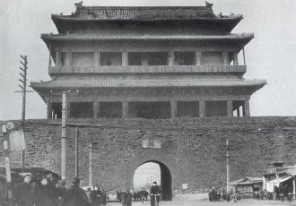

# 宣武门

_ _辛亥年九月十六，几个鬼影匆匆闪进铁轨旁的门廊。几声尖利的枪响划破夜空，窗外依旧微风习习，天高月朗。

民间五月的清是两种颜色的交欢：灰色的砖石堆砌出城门雄浑的躯干，繁密的树荫撑开凉意，延伸到远处，被尘土飞扬的路面卷起的热浪激起黄澄澄的涟漪。狗子爹放下手里裂了柄的锤子，靠着树墩子，用一把破蒲扇给狗子驱赶着苍蝇。狗子揉了揉憋红的胸口，那是碎了一上午大石才呈现的漂亮颜色，结实、厚重，青筋纵横。这当儿，狗子牛饮着隔壁摊儿的茶根，攒弄着手心里一把铜板和两块鹰洋。

“爹，你也喝点。”狗子干裂的嘴角露出粉红时想起了身边的老父。这一把老骨头托了早年田间劳作的福，抡起锤子来还使得上七分力气。他抹抹碗口那一圈黑唇印子，把那汪见底的茶递给老父。这硬气功生生撑了几个时辰，从日头东升的开张，到晌午各挑子的牛杂爆肚香冲了鼻梁，约莫算来不过薄薄几个子儿，还好碰上了大宅子里唱曲的角儿，抖抖袖子，撇俩银钱。可怜戏子终究可怜这杂耍的苦命佃户，糍粑心肠，兴许想着闺阁里只露些许眉目的小相。

爹把碗底清了个干净，收起担子，扛起锤头，爷俩不紧不慢起了身，朝城门口的羊肉挑子踱着。鹰洋在手，街边的好馆子到底是去不得的，跑堂的怕伺候叫花子一般的脚夫与艺人砸了门面，失了体面。伙计有什么体面，接过老爷们扔来的子儿，说话也硬气。早年路过东来顺，那伙计直溜溜地盯着狗子腰间的布袋子，咽了口痰，还要把脖子仰高，瞟瞟附近有没有老爷。

可惜老爷可不会总吃这涮肉坊，所幸狗子的布袋里只是一把炒谷子。

嚼着满嘴的烧羊肉夹火烧，狗子远远瞅见那几个卖艺时叫好赏钱的伶人拐进了巷子口高墙的偏门里，身后还跟着两个病仄仄的武生。那副瘦模样活像一条丧家犬，背上的令旗成了累赘，歪在肩头，老狗变了花蛾子。

“爹。”狗子吞下一口羊肉。“你瞅瞅那几个披甲的兵，这膀子，就是泥捏的……”

“少说两句。”爹摆了摆手。“你倒是铁塔一般的人。前两年走了拳匪，今个儿又出了乱党。咱家老实人，要不是爹卖了地赎身，哪来这一把老骨头……唉，想想，爹老来得子，四十那年你还没灶台高，今年……”狗子爹拧起眉毛，狗子收了眼，低头抓起下一块饼。“嘿，那可不是兵。”

“是啥？”

“甭管是啥。你也有十六了吧？倒不如……”说着，他努努嘴，指指远处宅子的偏门。“听轿夫们扯什么南方现在遭了兵，儿啊，你这身精壮骨肉恐怕迟早充了炮灰，倒不如换个活计，进府征个唱大戏的武生如何？”

“爹，说啥哩，武生是个啥，当个武生就能不当兵？”

“下九流的营生，官爷们不收的。咱没了田地，整日混迹在京城市井里，却也入不得流、进不了祖坟了，可是儿啊，好男不当兵……”

狗子一身腱子肉套上了戏服霎时少了几股胸口碎大石的愣劲，多了几分威武与老成。爹年轻时在村口跟野戏班子做过票友，一副破锣嗓子唱起老生来也有那么些韵味。爷俩的一唱一和在深宅大院前凝聚了大批看客，门房和护院们看到兴起也跟着吆喝起来，多半是从未见过这身板匀实的肉，比起往日那些软绵绵的花枪们，着实是虎虎生风。不久，这二人的干耍就从宅口进了大院。开场的三个抬腿，奠定一出《挑滑车》的威武悲怆，让几个送水的丫鬟也出神摔了茶盘。

狗子的汗花了油彩，渗进眼角。朦胧的视线中，他瞧见端坐在堂前的那个蓝顶子分明是爹的模样，宽额方脸，好似白了脸的关云长。狗子抬起枪，顺势抹了一把汗，那大员看看爹，捋捋胡子，哈哈一乐。

“好！”

老爷不像自己想象中的样子，可能是因为爹的缘故吧。狗子默默地想。老爷乍看完全是爹的慈眉善目，而印堂深处多了威武。村人多夸爹的英气，可面前的官老爷显然有种不可抗拒的精神头，化成只大手把自己的魂魄紧紧攥住。

“好，好，好！”蓝顶子走下台阶，定在了咫尺远的地方。

“你这长靠武生工架倒是稳重，干净、利索，至于这老生……哈哈哈！”

狗子爹抬起头，瞄着面前的大脸，咧开了嘴，却又收了回去。

“练了几年？”

“回老爷，小儿是宣武门口杂耍卖艺的，不曾学过。”

“卖艺？好好好，真是屠龙馀技到雕虫，卖艺文成事事工。宣武？文治武安，江山永固！不错不错！打赏！”

至于狗子与爹如何蹑手蹑脚地接过那袋赏钱，又如何蹑手蹑脚把它花了去，狗子实在记不得了。老爷如同活菩萨，添置全套披挂鬤口，每每大戏，好吃好喝，自然要耍个淋漓畅快。 

狗子一骨碌仰在床上，迷迷糊糊，狗子看到爹套上了新马褂，戴着青皮小帽，嘿嘿冲他一笑，步入了晨曦的雾气里。大雾尽头是朱红的墙壁，是褪了黄土色的大街小巷。自己健硕的手脚爬上恢弘的塔楼，群山环抱，天宇下的屋檐张开燕似得翼角，瓮城的炮声隆隆，城门下的人群熙熙攘攘……

狗子翻了翻身，看看爹。爹一如从前模样，卸了油彩，睡得香甜。爹卖了薄田，用这把身子骨东奔西走把自己拉扯大，实在不易。狗子一向敦厚不开窍，不知怎么，竟成了孝子，眼角突突冒出一行泪。爹，钱给你攒下，以后咱过好日子。狗子这样想，又昏昏沉沉打起了呼噜。

“老爷，吴绶卿他……”

“这……还有谁知道？”

“都传开了，要是已经彻查下来，估计明儿个宫里就来人了。老爷，这……”

狗子至今还能回忆起那日爹的样子。爹的额头裂开一道刀刻般的纹路，把眼眶压低了许多。他摊开手，一把将狗子揽过，坐在自己膝头。

“爹，沉，别……”

爹把手指放在唇边，轻轻嘘了一声，示意狗子闭嘴，然后从腰里掏出一个崭新的绸布包，抖开一看，竟是几个沉甸甸的元宝。狗子哪里见过这东西，怔了怔，揉揉眼睛。

“这黄铜包干吗包清漆？真是亮堂。”狗子用指尖小心捅捅金锭，打趣道。

“我儿大了，抱不动了。”爹干笑两声。“刚才管家唤我去见老爷，说要排一出大戏，你说咱唱不唱？”

“唱啊，爹，何必问我？”狗子傻傻地咳嗽了几下，扎了个马步，又把腿踢过头顶。

“好儿子，这包黄铜是全府给咱的份子，你帮爹收着，以后拿去……能换银子。”

“爹，甭说赏钱，老爷待咱不薄，冲这个，咱也要演好不是？”狗子又杵了杵那包锭子，锭子生硬冰冷，却没有丝毫铜的腥味。“爹，话说……几块黄铜，就能换银子？”

“儿啊，老爷说了，卖艺的，唱戏的，都是下九流的玩意，狗肉上不了席。儿，老爷让你拿了这钱去谋个别的去处，光宗耀祖……”狗子爹似乎没听见狗子的话，自顾自嘟囔着，突然，他睁开布满血丝的眼睛，瞪着狗子，未几，目光又恢复了慈祥与柔和。

“儿啊！与爹爹对一遍戏词！”

“爹，哪一出？我扮个谁？”

“新戏，要不了几天，宣武门开唱，就叫《宣武门》！这戏太偏太难，爹独角，你莫听。”

“爹，宣武门…爹，去菜市口？唱死人？”

“胡说！老爷说了，文德既昭，武节是宣。三农之隙，曜威中原！爹这是扮岳鹏举，斩荆披棘，文治武安！”

“爹，我怎么听不懂？再说，好男不当兵。”

“糊涂！好男不当兵，当就当忠义死节大英雄！我儿，跟我对戏词，我教你识过字，不懂什么意思不要紧，只要照着白纸上念出来。你读一句我跟一句。”

“好。爹。上谕：查包衣护军参领……大逆不道，欺君罔上，误国荼民，勾结乱臣贼子，北洋第六镇统制吴禄贞，里应外合……”

“上谕：查包衣护军参领……大逆不道，欺君罔上，误国荼民，勾结乱臣贼子，北洋第六镇统制吴禄贞，里应外合……”一排黄盔黄甲的侍卫像石墙一般堵在大宅门口，太监尖声宣读着手里的黄绢子。头戴暖帽蓝顶的狗子爹使劲挥动着手腕处的的马蹄袖，金银丝织成的纹路在手背汇合。他撩起孔雀补子下漆黑的褂子，粉底皂靴一个趔趄险些摔倒。他显然穿不惯这厚重的华服，尽管如此，狗子爹还是像极了老爷，稳稳跪下，双手朝天，接过黄绢。几滴汗从眼角划过，沿鼻梁两侧砸进九月的寒风里。

狗子当然看不到这出，他早已按照爹的话，换了满满一布袋银子。这么多大洋压在背上，足以让他气喘吁吁。他置办了一身新马褂，戴着青皮小帽，穿梭在城门下熙熙攘攘的人群之间。他乏了，走进一间茶馆子，把脖子仰高，再使劲向茶馆的青石地砖上啐了口痰。一个跑堂的伙计应声赶来，呲开大嘴一笑，露出满口黄牙。

年迈的狗子缓缓踱下车，在小狗子的搀扶下看着黑黢黢的城门。隔着碎石堆与铲车，他推开儿子的手，眺望门楼远方的大街。

“这儿马上要修地铁，烂城垛子碍事，估计过几天就可以全部拆除了。”小狗子笑了笑，掸了掸朱红领章下偶然沾染的尘土。狗子一阵咳嗽，司机急忙下车，敬了个礼，和小狗子一起把狗子扶上车。狗子仄歪在座椅上，打起了鼾。脑袋上的帽子斜向一旁的脸颊，中间那颗硕大的红星遮住了狗子的一只眼，就像一只瞎眼的老狗。

“听说抓了个三品大员，说是勾结革命党……”

“嘘，他妈的，你脑瓜子不想要了？什么革命党。乱党！”

狗子啃着茶盘里的点心，有一搭无一搭地听着。戏台上的武生扭了个腰，猛一踢腿，狗子按捺不住地站起身，扎起架势，摆弄起拳脚。伙计愣了愣神，急忙叫好，手里的茶碗跌落下来，摔个粉碎。

宣武门震耳欲聋的午炮响了，狗子招呼跑堂的上一壶好茶。他知道，爹快回来了。

（采编：朱燚；责编：王卜玄）

[【不惊奇】家族](/archives/43583)——就在即将能享受荣华富贵之时，我的祖父却反复梦见同一个场景：在大雪落满的祖地沙村，一种色泽鲜艳的大花铺就乡野，招展着它们魅惑的腰肢。

[【不惊奇】勿增实体](/archives/43601)——在这里王超引用了传说中的奥卡姆剃刀，“如无必要，勿增实体”。在他看来爱情就是一个应该被剔除的实体。

[【不惊奇】一个女人的意外死亡](/archives/43566)——这绝对不是你认识的人，你印象中他们的声音都有各自的特色，却万不是没有生命的。不得不说，那一端的声音机械生硬，让你意识不到生命特征的存在。
