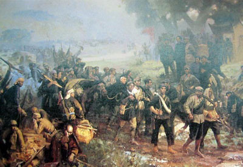
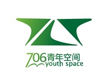

# 马勇老师谈二十世纪革命

#“马勇老师谈二十世纪革命”

革命是一个结束，革命又是一个开始。审视二十世纪中国这场“漫长的革命”，会发现它具有复杂的历史性格，它始终无法用几个历史概念就能够完全洞穿或笼罩，隐含在其内的极为复杂的历史信息和政治能量造成的余波至今荡漾。就二十世纪中国革命的阅读、研究与记忆而言，仍旧有太多历史真相有待澄清，有太多意识形态式的观点有待辨析，更有太多被扭曲的历史记忆有待矫正。

本期就二十世纪的革命历史，706青年空间与东方历史评论合作，邀请社科院近代史所马勇老师，与大家谈二十世纪中国的革命叙事，介绍学界的新看法和马勇老师的研究心得。“革命”的历史给我们什么启示，又对当下我们所处的世界有什么影响。对于这些问题，马勇老师和东方历史评论方瞾将带给大家一个全新的视角，分析历史，解读未来。

###【主题】
【东方历史评论沙龙】 马勇老师谈二十世纪革命

###【时间】
3月15日 下午2:00

###【活动嘉宾】
马勇，社科院近代史所研究员，著有《梁漱溟评传》、《近代中国文化诸问题》、《1894-1915：梦想与困惑》、《超越革命与改良》、《从戊戌维新到义和团（中国近代通史第四卷）》、《1898年中国故事》、《1900年尴尬记忆》、《儒学兴衰史》、《汉代春秋学研究》等。

方瞾，东方历史评论执行主编。

###【活动主持】
张展，历史学博士生。

###【主办方】
东方历史评论&706青年空间

###【地点】
北京706青年空间 （五道口华清嘉园15号楼2006室)

###【费用】
会员免费，非会员15元

###【报名】
关注706微信平台：“706青年空间”，选择列表第一个。
在平台回复“姓名+性别+职业+联系方式+回答问题：在20世纪以来的改革者中，你最欣赏或印象深刻的是哪一位？为什么？”  
活动限制人数为25人，以收到“活动参与码”回复为准。

###【活动链接】
http://page.renren.com/601261629/channel-noteshow-923433405

（采编：万晓华；责编：万晓华）