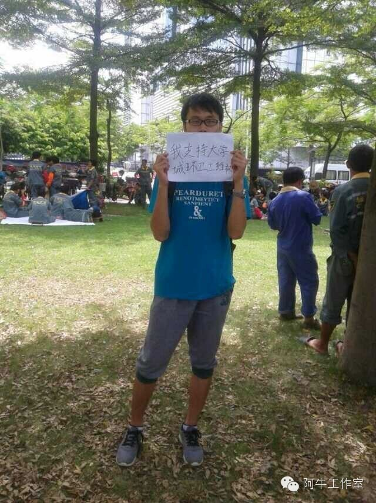

# 中大辩论其一：我们为何应该声援环卫工人？

*编者按*：

*8月21日广州大学城200多名环卫工人集体罢工抗议。起因是物业公司变更，环卫工人们今后去向没有得到确认，缺少无固定期限劳动合同的他们在原物业公司拿不到经济补偿。今后若跟随新物业公司九年的工龄可能清零，若跟随原物业公司可能被安排到其他地区，而他们希望继续留在大学城从事环卫工作。*

*这些工人从2004年大学城规划建设以来便就地就业从事环卫行业。2005年，他们的劳动关系从市桥环卫处转到“广州广电物业管理有限公司”，该物业公司与今年4月竞标失利后未跟合同到期的工人续合同，也没有跟已签订两三次固定期限劳动合同的工人签订无固定期限劳动合同。在之前的合同中，没有具体工作地点和起止日期，公司甚至要求工人在空白合同上签字。相关部门对此事互相推诿未作出积极回应。*

*8月21日亦是中山大学开学之日。“日晒雨淋九年合同终止，不承认工龄，请政府帮帮我们！”的横幅不仅引起学生们的注意，也激发了一场中大校内对此事的辩论。有学生积极加入环卫工的抗议队伍，与工人们一起坐在烈日下并参与报道、传播。也有学生对此持观望态度，表示不参与签字。*

*在小编看来，这不仅是围绕环卫工人权益的争辩，更是关于大学生是否应该参与公共事务、如何参与公共事务、什么是权益、如何维权的讨论。北斗网将推送中大辩论的数篇文章，与广大读者共同关注讨论广州大学城环卫工抗议一事。*

***您可将想法、短评、社论发至北斗各平台或邮箱contribution@ibeidou.net ，我们将有选择得整理发布读者反馈。***

八月二十一日，在大学城工作十年的环卫工人在 GOGO新天地集体集会抗议广电物业公司的工作安置问题。这一天是中山大学的开学日，近万名新生以及更多的学生目睹了工人们的维权，然而除了个别同学和校媒的报道之外，环卫工人的诉求没有在学生中间激起任何波澜。其后，热心同学起草联名信呼吁大学生支持环卫工人维护自身权益，两天内征集到 200多个学生的签名中只有大概一半来自广州高校，在大学城就读的学生所占比例更小。这样的结果恐怕 远不足以令人满意，仅仅中山大学大学城校区就有超过一万名学生，但为何哪怕简单的签名也只有区区不足一百人响应？难道这些为我们日日夜夜服务的环卫工人真的无法激起大学生心中一丝的同情心甚至好奇心吗？我不相信，我不相信大多数的大学生是所谓的“ 精致的利己主义者 ”。

目前还鲜为人知的是，这两百多位环卫工人中的大多都是小谷围原来的村民。2003年，因为市政府决定在小谷围建设大学城，于是以公共用地的名义征收了岛上 13个村落中 9个的土地和宅基地，政府仅给出 2—5万 不等的征地补偿，此外许诺可以实现村民的在地就业。五万元的征地补偿到底算得了什么所有人心里都明白，征地拆迁问题也已经是老生常谈，这里也不用多说。总之，原本大多虽然不算富裕但尚能保留尊严的村民变成了收入与社会地位均为最底层的环卫工人，更糟糕的是，从农民变成工人意味着他们在市场和社会上更为弱 势，因为他们不得不依赖于资本来维持最基本的生活。那么到底是谁导致了这些村民的赤贫化？是的，当然不完全是因为学生群体，但是数万名学生挤占了村民原本的生活和劳动空间，他们因为我们的到来而变成了更加无助的环卫工人，难道我们不应该为此感到歉疚并帮助他们改善生活状况吗？

事实上工人们已经用行动向学生发出了自己邀请的呼声，他们之所以选择在开学日、在校园附近停工，是因为他们认为大学生应该有社会担当、学生作为其服务的享受者也不应该对他们的处境漠不关心。我 们作为环卫工人服务的享受者，不曾直接为他们的服务买单，但这不意味着我们不应该为其服务做任何补偿。市容清洁工作原本属于公共服务的领域，虽然现在环卫局把这一服务外包，但并不改变其公共属性。那么，既然是公共服务，每一个个体都有权利和义务监督服务的施行。很明显，在伴随大学城成长的十年里，环卫工人 出色的完成了他们的本职工作。但是物业公司和相关部门的所作所为在服务过程中是合法合理的呢？很显然不是，广电物业在过去十年里不但逃避与工人签订无固定期限合同，甚至要求在空白合同上签字按手印。正是由于学生和其他公众长期忽视环卫工人的存在，未能积极监督物业公司的违法行为导致了工人们的合法权益长期遭到侵害，使得他们如今甚至陷入了进退两难的境地。这种监督的缺失带来的伤害，作为置身其中的社会个体，我们难道没有责任和义务去承担吗？

退一步来讲，环卫工人无论风吹雨打每天都要工作十个多小时，为大学城营造了一个干净舒适的学习生活环境，没有环卫工人的大学城是不可想象的，于情于理我们都应该感谢他们的付出。我们也确实常常空泛的说感谢劳动者，但是言语总是不够的，工人们需要的不是无关痛痒的歌颂而是关键时刻真正有用的帮助。从25日工人们正式罢工以来，很多同学已经表示受不了小山一样的垃圾堆了。请不要埋怨环卫工人们，他们任劳任怨的为我们服务了十年，如果不是出于情非得已的理由也绝不会罢工，不要忘了，大学城不只是学生的家园，更是这些村民们的家园。我们早一日帮助工人们争取到合理的诉求，我们身边的环境就能早一日恢复如初。

此外，人们对于大学生的期待绝不是做一个“精致的利己主义者”，大多数学生在最初也绝不是想做这样的人，我们曾经认为自己应该为这个社会做些什么，我们曾经相信自己可以改变不合理的现状。可是后来我们变得漠不关心，觉得那只是年少轻狂，甚至会觉得那是滑稽的幻想。可是，如果连我们这些接受着高等教育而且拥有大量空闲时间的个体都不去尝试改变，那么我们还能指望其他什么人呢？我常常想起韩国工人领袖全泰壹自杀前所说的话，“可惜我死前没有认识一个 大学生朋友”，处于社会底层的人们由于受教育水平不高，了解的知识和信息远远少于大学生，如果没有学生的协助他们很难保护自身的合法权益。全泰壹的死去给韩国的大学生造成剧烈的冲击，前车可鉴，我想所有人都不希望因为这样悲剧的发生才开始行动，我们不需要殉道者就可以改变，小行动就会有大不同。今天大学城的环卫工人们像全泰壹一样期待学生的帮助，难道我们真的要让这样朴素的期待落空吗？那些所谓的书生意气不是幻想，改变也总是有可能发生。如果每一个学生都不再漠视环卫工人的行动，那么他们不合理待遇的改善也就指日可待。

愿在未来的某一天，当我们回首大学时光，能够庆幸正是这些哪怕微小的行动保卫着我们的正义感，让我们远离麻木，让我们未曾变成令自己深恶痛绝的人。我们以中山大学学生的名义郑重向中大的同学们以及大学生其他学校的学生发出呼吁：大学城的环卫工们与我们是共同体，关注弱势群体的合法权益是我们作为当代大学生应有的责任和担当，请大家关注本次维权事件，让正义的光芒成为大学城一道永恒的荣光，拒绝做冷漠的路人，拒绝让自己成为读书的机器和“精致的利己主义者”！

——来自关注大学城环卫工维权事件的中大学生们

***本篇文章为阿牛工作室（微信号：aniu_93）于8月26日发布的联名号召，原题为《中大学生：我们为何应该声援环卫工人？》。***

（采编：余泽霖  责编：叶璐蓓）
