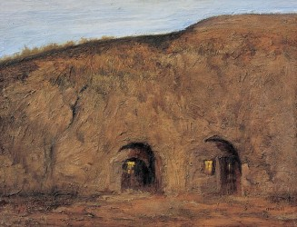
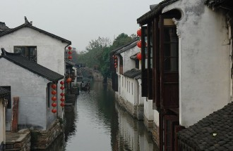

# 伪浪漫主义

09年我去陕北榆林佳县调研的时候第一次看到了窑洞，很是激动。

我对窑洞一直抱有一种来自小学课文上的幻想，一种浪漫主义的幻想——冬暖夏凉。

可真正走进窑洞后，我的幻想立马破灭了——窑洞里狭小昏暗，主人家穷徒四壁，完全没有一点浪漫气息可言。

在窑洞外的一小块平地上，女主人哄着尚在襁褓中的小男孩，男主人则在喂家里的两只山羊，他说：“什么‘冬暖夏凉’，现在能盖得起砖瓦房的话，谁还会住窑洞？”

那次调研的很多事我都忘了，记住的只有窑洞里的狭小昏暗和小男孩那双明亮的大眼睛。

前几天陪母亲去苏州又遇到了相似的情景，沿河上行的过程中，看到了所谓的“小桥流水人家”，但远没有古典诗歌中的那种意境，有的是窗外晾晒的内裤胸罩，还有直排入河的生活污水。导游说，以前这里都是有钱人家住的，现在只有五保户才住这里。

时移世易，“小桥流水人家”在诗人写诗的那个时代可能真的充满了诗情画意，可到现在只有在游人走马观花的短暂驻足中才能略略品味出一点残败的美感，而生活其中的人们品味到的只有不可语人的贫穷。

我同样见识过所谓的“古道西风瘦马”，也同样毫无意境可言，因为太穷了，人都吃不饱，能不瘦吗？

所以我觉得一切表里不一的浪漫主义都是虚伪的，而一切虚伪的浪漫主义都习惯拿别人的贫穷来装点自己的风景。

回北京的车上看到一位编剧的微博，是一张小村庄的照片，文字配的是“一样的真静，一样的真美。山东淄博的一个小村庄。”我评论：“虚伪的浪漫主义。”他回复：“怎么虚伪了，我在那里去了三十多个村庄。”我说：“三十多个村庄走马观花吧？我就是当地人，完全不知道你说的真美何在，真穷倒是真的。”

以前读过魏剑美的一篇文章，叫做《浪漫主义的新闻眼》，说的是1995年的农历正月，他和同事在湖南永州最偏远的一个山区采访，回来的路上，他看见冰天雪地里有人在吆牛耕田，而且还是个老人家。通过交谈，他了解到，老人的儿子进城有事，家里再无其他男劳力，而当地的水利条件非常恶劣，为了抓季节，所以不得不冒着严寒亲自下田。

但他回去，写出来的报道却是《人勤春早，年老志高》，而报道的主题则是激昂的、欢快的、富有感染力的，结尾是这样的：“空旷的田野中，老人的吆喝声显得那么粗犷，那么豪迈！”

自己现在也经到基层调研，采访报道之余，最大的感受是：诗情画意的表象之下往往是“哀民生之多艰”。

看过明代冯梦龙的《笑史·半日闲》，曰：“贵人游僧舍，酒酣，诵唐人诗云：因过竹园逢僧话，又得浮生半日闲。僧闻而笑之。贵人问僧何笑，僧日：尊官得半日闲，老僧却忙了三日。

（采编：刘大宁；责编：王卜玄）

[【伪实】拳王](/archives/42606)——但我知道路径延绵无尽头 恐怕我难以再回返 也许多少年后在某一个地方 我将轻声叹息把往事回顾

[【伪实】日记一则](/archives/42673)——这不是恐怖故事。这大概是诗。
